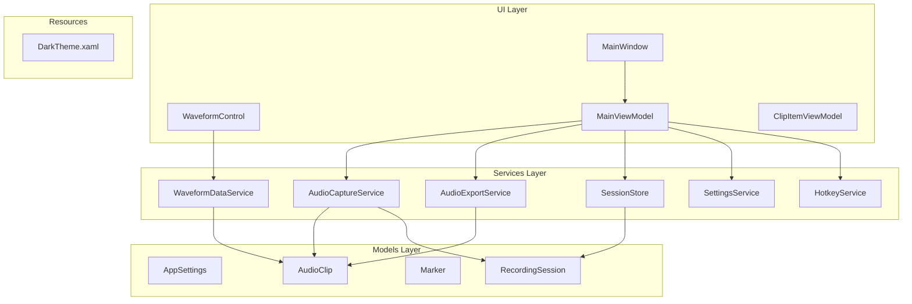

# API Reference

<cite>
**Referenced Files in This Document**
- [AudioCaptureService.cs](file://Services/AudioCaptureService.cs)
- [AudioExportService.cs](file://Services/AudioExportService.cs)
- [SessionStore.cs](file://Services/SessionStore.cs)
- [SettingsService.cs](file://Services/SettingsService.cs)
- [WaveformDataService.cs](file://Services/WaveformDataService.cs)
- [AppSettings.cs](file://Models/AppSettings.cs)
- [AudioClip.cs](file://Models/AudioClip.cs)
- [Marker.cs](file://Models/Marker.cs)
- [RecordingSession.cs](file://Models/RecordingSession.cs)
- [HotkeyService.cs](file://Services/HotkeyService.cs)
</cite>

## Table of Contents
1. [Introduction](#introduction)
2. [Project Structure Overview](#project-structure-overview)
3. [Core Services API](#core-services-api)
4. [Data Models Reference](#data-models-reference)
5. [Event Handling and Callbacks](#event-handling-and-callbacks)
6. [Asynchronous Operations](#asynchronous-operations)
7. [Thread Safety Considerations](#thread-safety-considerations)
8. [Performance Guidelines](#performance-guidelines)
9. [Error Handling Strategies](#error-handling-strategies)
10. [Migration Guide](#migration-guide)
11. [Best Practices](#best-practices)
12. [Troubleshooting](#troubleshooting)

## Introduction

SamplerRecorder is a comprehensive audio recording and management application that provides robust APIs for capturing, processing, and exporting audio data. The application follows modern C# design patterns with asynchronous operations, dependency injection, and event-driven architecture. This API reference documents all public interfaces, service methods, data models, and integration patterns for developers building extensions or integrating with the SamplerRecorder platform.

The application is built around several core services that handle different aspects of audio processing:
- **Audio Capture Service**: Manages real-time audio input and recording
- **Audio Export Service**: Handles audio file format conversion and export
- **Session Store**: Provides persistent storage for recording sessions
- **Settings Service**: Manages application configuration and user preferences
- **Waveform Data Service**: Processes and generates waveform visualizations
- **Hotkey Service**: Handles keyboard shortcuts and global hotkeys

## Project Structure Overview

The SamplerRecorder application follows a clean architecture pattern with clear separation of concerns:



**Diagram sources**
- [MainWindow.xaml.cs](file://MainWindow.xaml.cs)
- [MainViewModel.cs](file://ViewModels/MainViewModel.cs)
- [AudioCaptureService.cs](file://Services/AudioCaptureService.cs)
- [AudioExportService.cs](file://Services/AudioExportService.cs)
- [SessionStore.cs](file://Services/SessionStore.cs)
- [SettingsService.cs](file://Services/SettingsService.cs)
- [WaveformDataService.cs](file://Services/WaveformDataService.cs)
- [HotkeyService.cs](file://Services/HotkeyService.cs)
- [AppSettings.cs](file://Models/AppSettings.cs)
- [AudioClip.cs](file://Models/AudioClip.cs)
- [Marker.cs](file://Models/Marker.cs)
- [RecordingSession.cs](file://Models/RecordingSession.cs)

**Section sources**
- [MainWindow.xaml.cs](file://MainWindow.xaml.cs)
- [App.xaml.cs](file://App.xaml.cs)

## Core Services API

### AudioCaptureService

The AudioCaptureService is responsible for managing audio input devices, recording sessions, and real-time audio processing.

#### Constructor and Initialization

```csharp
public class AudioCaptureService : IDisposable
{
    public AudioCaptureService();
    public void Initialize();
    public void Dispose();
}
```

#### Core Methods

| Method | Parameters | Return Type | Description |
|--------|------------|-------------|-------------|
| `StartRecording` | `string deviceId`, `string outputFormat` | `Task<bool>` | Starts recording from specified audio device |
| `StopRecording` | - | `Task<AudioClip>` | Stops current recording and returns audio clip |
| `PauseRecording` | - | `Task<bool>` | Pauses active recording session |
| `ResumeRecording` | - | `Task<bool>` | Resumes paused recording session |
| `GetAvailableDevices` | - | `List<AudioDevice>` | Returns list of available audio input devices |
| `SetInputDevice` | `string deviceId` | `Task<bool>` | Sets the active audio input device |
| `SetRecordingQuality` | `AudioQuality quality` | `void` | Configures recording quality settings |
| `GetCurrentVolume` | - | `double` | Returns current input volume level |
| `SetVolume` | `double volume` | `bool` | Sets input volume (0.0 to 1.0) |

#### Events

| Event | Parameter Type | Description |
|-------|----------------|-------------|
| `RecordingStarted` | `EventArgs` | Fired when recording begins |
| `RecordingStopped` | `AudioClip` | Fired when recording ends with resulting clip |
| `RecordingPaused` | `EventArgs` | Fired when recording is paused |
| `RecordingResumed` | `EventArgs` | Fired when recording resumes |
| `DeviceChanged` | `string` | Fired when audio device changes |
| `VolumeChanged` | `double` | Fired when input volume changes |

#### Exception Handling

| Exception | Condition | Recovery |
|-----------|-----------|----------|
| `InvalidOperationException` | No audio devices available | Check device availability before calling |
| `UnauthorizedAccessException` | Insufficient permissions | Request microphone permissions |
| `ObjectDisposedException` | Service already disposed | Reinitialize service instance |
| `IOException` | Disk write failure | Check disk space and permissions |

**Section sources**
- [AudioCaptureService.cs](file://Services/AudioCaptureService.cs)

### AudioExportService

The AudioExportService handles audio file format conversion, compression, and export operations.

#### Constructor and Configuration

```csharp
public class AudioExportService : IDisposable
{
    public AudioExportService();
    public void Configure(ExportSettings settings);
    public void Dispose();
}
```

#### Export Methods

| Method | Parameters | Return Type | Description |
|--------|------------|-------------|-------------|
| `ExportToWav` | `AudioClip clip`, `string outputPath` | `Task<bool>` | Exports clip to WAV format |
| `ExportToMp3` | `AudioClip clip`, `string outputPath`, `int bitrate` | `Task<bool>` | Exports clip to MP3 format |
| `ExportToFlac` | `AudioClip clip`, `string outputPath` | `Task<bool>` | Exports clip to FLAC format |
| `ExportToOgg` | `AudioClip clip`, `string outputPath` | `Task<bool>` | Exports clip to OGG format |
| `BatchExport` | `IEnumerable<AudioClip> clips`, `string outputDir`, `string format` | `Task<List<string>>` | Exports multiple clips to directory |
| `GetSupportedFormats` | - | `List<string>` | Returns supported export formats |

#### Progress and Events

| Event | Parameter Type | Description |
|-------|----------------|-------------|
| `ExportProgress` | `ExportProgressEventArgs` | Fired during export progress updates |
| `ExportCompleted` | `ExportResultEventArgs` | Fired when export completes |
| `ExportFailed` | `ExportErrorEventArgs` | Fired when export fails |

**Section sources**
- [AudioExportService.cs](file://Services/AudioExportService.cs)

### SessionStore

The SessionStore manages persistent storage of recording sessions and metadata.

#### CRUD Operations

| Method | Parameters | Return Type | Description |
|--------|------------|-------------|-------------|
| `SaveSession` | `RecordingSession session` | `Task<string>` | Saves session and returns ID |
| `LoadSession` | `string sessionId` | `Task<RecordingSession>` | Loads session by ID |
| `DeleteSession` | `string sessionId` | `Task<bool>` | Deletes session by ID |
| `UpdateSession` | `RecordingSession session` | `Task<bool>` | Updates existing session |
| `ListSessions` | `DateTime? startDate`, `DateTime? endDate` | `Task<List<RecordingSession>>` | Lists sessions with optional date filter |
| `SearchSessions` | `string searchTerm` | `Task<List<RecordingSession>>` | Searches sessions by title or description |

#### Batch Operations

| Method | Parameters | Return Type | Description |
|--------|------------|-------------|-------------|
| `BulkDelete` | `IEnumerable<string> sessionIds` | `Task<int>` | Deletes multiple sessions |
| `BulkUpdate` | `IEnumerable<RecordingSession> sessions` | `Task<int>` | Updates multiple sessions |
| `ExportAllSessions` | `string outputPath`, `string format` | `Task<bool>` | Exports all sessions to file |

**Section sources**
- [SessionStore.cs](file://Services/SessionStore.cs)

### SettingsService

The SettingsService manages application configuration and user preferences.

#### Configuration Management

| Method | Parameters | Return Type | Description |
|--------|------------|-------------|-------------|
| `GetSettings` | - | `AppSettings` | Retrieves current settings |
| `UpdateSettings` | `AppSettings settings` | `Task<bool>` | Updates application settings |
| `ResetSettings` | - | `Task<bool>` | Resets settings to defaults |
| `ImportSettings` | `string filePath` | `Task<bool>` | Imports settings from file |
| `ExportSettings` | `string filePath` | `Task<bool>` | Exports settings to file |

#### Property Accessors

| Property | Type | Description |
|----------|------|-------------|
| `DefaultOutputPath` | `string` | Default directory for saved recordings |
| `DefaultRecordingQuality` | `AudioQuality` | Default recording quality setting |
| `AutoSaveEnabled` | `bool` | Whether to automatically save recordings |
| `MaxRecordingDuration` | `TimeSpan` | Maximum duration for single recordings |
| `EnableNotifications` | `bool` | Whether to show system notifications |

**Section sources**
- [SettingsService.cs](file://Services/SettingsService.cs)

### WaveformDataService

The WaveformDataService processes audio data to generate waveform visualizations.

#### Waveform Generation

| Method | Parameters | Return Type | Description |
|--------|------------|-------------|-------------|
| `GenerateWaveformData` | `AudioClip clip`, `int sampleCount` | `Task<double[]>` | Generates waveform data points |
| `GenerateThumbnail` | `AudioClip clip`, `Size size` | `Task<byte[]>` | Creates thumbnail image |
| `AnalyzeAudio` | `AudioClip clip` | `Task<AudioAnalysis>` | Analyzes audio characteristics |
| `GetPeakLevels` | `AudioClip clip` | `Task<double[]>` | Gets peak amplitude levels |
| `GetRmsLevels` | `AudioClip clip` | `Task<double[]>` | Gets RMS amplitude levels |

#### Real-time Processing

| Method | Parameters | Return Type | Description |
|--------|------------|-------------|-------------|
| `ProcessRealtimeData` | `float[] samples` | `WaveformData` | Processes real-time audio samples |
| `UpdateVisualization` | `WaveformData data` | `void` | Updates visualization with new data |
| `ClearVisualization` | - | `void` | Clears current visualization |

**Section sources**
- [WaveformDataService.cs](file://Services/WaveformDataService.cs)

### HotkeyService

The HotkeyService manages keyboard shortcuts and global hotkey registration.

#### Hotkey Management

| Method | Parameters | Return Type | Description |
|--------|------------|-------------|-------------|
| `RegisterHotkey` | `Key key`, `ModifierKeys modifiers`, `Action callback` | `Task<bool>` | Registers a global hotkey |
| `UnregisterHotkey` | `Key key`, `ModifierKeys modifiers` | `Task<bool>` | Removes registered hotkey |
| `IsHotkeyRegistered` | `Key key`, `ModifierKeys modifiers` | `bool` | Checks if hotkey is registered |
| `GetRegisteredHotkeys` | - | `List<HotkeyBinding>` | Lists all registered hotkeys |

#### Built-in Hotkeys

| Hotkey | Action | Description |
|--------|--------|-------------|
| `Ctrl + Shift + R` | Start/Stop Recording | Toggles recording state |
| `Ctrl + Shift + P` | Pause/Resume | Toggles pause state |
| `Ctrl + Shift + S` | Save Current | Saves current recording |
| `Ctrl + Shift + E` | Export Selected | Exports selected clips |

**Section sources**
- [HotkeyService.cs](file://Services/HotkeyService.cs)

## Data Models Reference

### AudioClip

Represents a recorded audio clip with metadata and properties.

```csharp
public class AudioClip
{
    public string Id { get; set; }
    public string Title { get; set; }
    public DateTime CreatedAt { get; set; }
    public DateTime ModifiedAt { get; set; }
    public TimeSpan Duration { get; set; }
    public long FileSize { get; set; }
    public string FilePath { get; set; }
    public string Format { get; set; }
    public int SampleRate { get; set; }
    public int BitDepth { get; set; }
    public int Channels { get; set; }
    public double PeakAmplitude { get; set; }
    public double RmsAmplitude { get; set; }
    public List<Marker> Markers { get; set; }
    public Dictionary<string, object> Metadata { get; set; }
    
    public bool IsValid { get; }
    public bool IsLoaded { get; }
    public bool CanEdit { get; }
    public bool CanExport { get; }
}
```

#### Properties Validation

| Property | Type | Validation Rules | Default Value |
|----------|------|------------------|---------------|
| `Id` | `string` | GUID format, unique | Auto-generated |
| `Title` | `string` | Max 200 characters | Empty string |
| `CreatedAt` | `DateTime` | Cannot be null | Current UTC time |
| `ModifiedAt` | `DateTime` | Must be >= CreatedAt | Equals CreatedAt |
| `Duration` | `TimeSpan` | Must be positive | Zero timespan |
| `FileSize` | `long` | Must be non-negative | Zero |
| `FilePath` | `string` | Valid file path | Empty string |
| `Format` | `string` | Supported format | "wav" |
| `SampleRate` | `int` | 8000-192000 Hz | 44100 |
| `BitDepth` | `int` | 16 or 24 or 32 | 16 |
| `Channels` | `int` | 1 or 2 | 2 |
| `PeakAmplitude` | `double` | 0.0 to 1.0 | 0.0 |
| `RmsAmplitude` | `double` | 0.0 to 1.0 | 0.0 |

**Section sources**
- [AudioClip.cs](file://Models/AudioClip.cs)

### RecordingSession

Represents a complete recording session with multiple clips and session metadata.

```csharp
public class RecordingSession
{
    public string Id { get; set; }
    public string Name { get; set; }
    public DateTime StartTime { get; set; }
    public DateTime EndTime { get; set; }
    public TimeSpan TotalDuration { get; set; }
    public List<AudioClip> Clips { get; set; }
    public string Notes { get; set; }
    public string Tags { get; set; }
    public string Location { get; set; }
    public Dictionary<string, object> CustomProperties { get; set; }
    
    public bool IsActive { get; set; }
    public bool IsComplete { get; set; }
    public int ClipCount { get; }
    public long TotalSize { get; }
    public double AverageQuality { get; }
}
```

#### Session Lifecycle States

| State | Description | Transitions |
|-------|-------------|-------------|
| `Created` | Session initialized | → Active, Complete |
| `Active` | Recording in progress | → Paused, Complete |
| `Paused` | Recording temporarily stopped | → Active, Complete |
| `Complete` | Session finished | → Archived |
| `Archived` | Session stored permanently | → Deleted |

**Section sources**
- [RecordingSession.cs](file://Models/RecordingSession.cs)

### Marker

Represents a marker placed at specific positions within an audio clip.

```csharp
public class Marker
{
    public string Id { get; set; }
    public string Label { get; set; }
    public TimeSpan Position { get; set; }
    public string Color { get; set; }
    public string Description { get; set; }
    public DateTime CreatedAt { get; set; }
    public Dictionary<string, object> Properties { get; set; }
    
    public bool IsValid { get; }
    public bool IsWithinClip(AudioClip clip) { }
    public Marker Clone() { }
}
```

#### Marker Types

| Type | Description | Use Case |
|------|-------------|----------|
| `Note` | Text annotation | Comments, observations |
| `Chapter` | Section divider | Organizing content |
| `Bookmark` | Quick reference | Important moments |
| `Custom` | User-defined | Special markers |

**Section sources**
- [Marker.cs](file://Models/Marker.cs)

### AppSettings

Contains all application configuration settings.

```csharp
public class AppSettings
{
    public string DefaultOutputPath { get; set; }
    public AudioQuality DefaultRecordingQuality { get; set; }
    public bool AutoSaveEnabled { get; set; }
    public TimeSpan MaxRecordingDuration { get; set; }
    public bool EnableNotifications { get; set; }
    public string Theme { get; set; }
    public string Language { get; set; }
    public int RecentFilesLimit { get; set; }
    public bool EnableAutoBackup { get; set; }
    public string BackupPath { get; set; }
    public Dictionary<string, object> AdvancedSettings { get; set; }
}
```

#### Audio Quality Levels

| Quality | Sample Rate | Bit Depth | Channels | File Size (per minute) |
|---------|-------------|-----------|----------|------------------------|
| `Low` | 22050 Hz | 16-bit | Mono | ~2 MB |
| `Medium` | 44100 Hz | 16-bit | Stereo | ~8 MB |
| `High` | 44100 Hz | 24-bit | Stereo | ~12 MB |
| `Studio` | 96000 Hz | 24-bit | Stereo | ~24 MB |
| `Broadcast` | 192000 Hz | 32-bit | Stereo | ~48 MB |

**Section sources**
- [AppSettings.cs](file://Models/AppSettings.cs)

## Event Handling and Callbacks

### Event Pattern Implementation

SamplerRecorder uses the standard .NET event pattern with `EventHandler<T>` delegates for loose coupling and extensibility.

```csharp
// Event declaration pattern
public event EventHandler<AudioClip> RecordingStopped;
public event EventHandler<ExportProgressEventArgs> ExportProgress;
public event EventHandler<SessionChangedEventArgs> SessionChanged;

// Event raising pattern
protected virtual void OnRecordingStopped(AudioClip clip)
{
    RecordingStopped?.Invoke(this, clip);
}

// Event subscription pattern
audioCaptureService.RecordingStopped += HandleRecordingStopped;
audioExportService.ExportProgress += HandleExportProgress;
sessionStore.SessionChanged += HandleSessionChanged;
```

### Common Event Args Classes

```csharp
public class ExportProgressEventArgs : EventArgs
{
    public int Percentage { get; set; }
    public string Message { get; set; }
    public long BytesProcessed { get; set; }
    public long TotalBytes { get; set; }
    public TimeSpan ElapsedTime { get; set; }
    public TimeSpan EstimatedTimeRemaining { get; set; }
}

public class SessionChangedEventArgs : EventArgs
{
    public SessionChangeType ChangeType { get; set; }
    public string SessionId { get; set; }
    public RecordingSession Session { get; set; }
    public DateTime Timestamp { get; set; }
}

public enum SessionChangeType
{
    Created,
    Updated,
    Deleted,
    Loaded,
    Saved
}
```

### Event Handler Best Practices

1. **Use weak references** for long-lived subscriptions to prevent memory leaks
2. **Handle exceptions** within event handlers to prevent cascading failures
3. **Check for null** before invoking events to support unsubscription
4. **Use async/await** for asynchronous event handling
5. **Provide cancellation tokens** for long-running operations

**Section sources**
- [AudioCaptureService.cs](file://Services/AudioCaptureService.cs)
- [AudioExportService.cs](file://Services/AudioExportService.cs)
- [SessionStore.cs](file://Services/SessionStore.cs)

## Asynchronous Operations

### Async/Await Pattern

All I/O-bound operations in SamplerRecorder follow the async/await pattern for optimal performance and responsiveness.

```csharp
// Standard async method pattern
public async Task<bool> StartRecordingAsync(string deviceId, string outputFormat)
{
    try
    {
        await ValidateDeviceAsync(deviceId);
        await InitializeAudioPipelineAsync(outputFormat);
        await StartCaptureAsync();
        
        return true;
    }
    catch (Exception ex)
    {
        await HandleRecordingErrorAsync(ex);
        return false;
    }
}

// Progress reporting with async
public async Task<bool> ExportToWavAsync(AudioClip clip, string outputPath, 
    IProgress<int> progress = null)
{
    var totalSteps = 100;
    var currentStep = 0;
    
    foreach (var step in ExportSteps)
    {
        await ProcessStepAsync(step);
        currentStep++;
        progress?.Report((currentStep * 100) / totalSteps);
    }
    
    return true;
}
```

### Task-Based Operations

| Operation | Method Signature | Timeout Support | Cancellation |
|-----------|------------------|-----------------|--------------|
| `StartRecording` | `Task<bool>` | Yes | Yes |
| `StopRecording` | `Task<AudioClip>` | Yes | Yes |
| `ExportToWav` | `Task<bool>` | Yes | Yes |
| `SaveSession` | `Task<string>` | Yes | Yes |
| `LoadSession` | `Task<RecordingSession>` | Yes | Yes |
| `GenerateWaveformData` | `Task<double[]>` | Yes | Yes |

### Cancellation Token Usage

```csharp
public async Task<bool> LongRunningOperation(CancellationToken cancellationToken)
{
    try
    {
        for (int i = 0; i < 1000; i++)
        {
            cancellationToken.ThrowIfCancellationRequested();
            
            // Perform operation step
            await DoWorkAsync(i, cancellationToken);
            
            // Report progress
            progress.Report(i);
        }
        
        return true;
    }
    catch (OperationCanceledException)
    {
        // Handle cancellation gracefully
        CleanupResources();
        throw;
    }
}
```

**Section sources**
- [AudioCaptureService.cs](file://Services/AudioCaptureService.cs)
- [AudioExportService.cs](file://Services/AudioExportService.cs)
- [SessionStore.cs](file://Services/SessionStore.cs)

## Thread Safety Considerations

### Thread-Safe Design Patterns

SamplerRecorder implements thread safety through several patterns:

1. **Immutable Data Objects**: Read-only properties prevent concurrent modification
2. **Synchronized Collections**: Thread-safe collections for shared state
3. **Lock-Free Algorithms**: Where possible, avoid locking overhead
4. **Producer-Consumer Pattern**: For background processing tasks

### Critical Sections

```csharp
private readonly object _recordingLock = new object();
private readonly ConcurrentDictionary<string, AudioClip> _clipsCache = 
    new ConcurrentDictionary<string, AudioClip>();

public AudioClip GetClip(string id)
{
    if (_clipsCache.TryGetValue(id, out AudioClip clip))
    {
        return clip;
    }
    
    lock (_recordingLock)
    {
        // Double-check locking pattern
        if (_clipsCache.TryGetValue(id, out clip))
        {
            return clip;
        }
        
        clip = LoadClipFromDisk(id);
        _clipsCache[id] = clip;
        return clip;
    }
}
```

### Background Processing

```csharp
private readonly Channel<(Action, CancellationToken)> _backgroundQueue = 
    Channel.CreateBounded<Action>(100);

public void QueueBackgroundWork(Action work)
{
    _backgroundQueue.Writer.TryWrite((work, CancellationToken.None));
}

private async Task ProcessBackgroundQueueAsync()
{
    await foreach (var (work, token) in _backgroundQueue.Reader.ReadAllAsync())
    {
        try
        {
            await Task.Run(work, token);
        }
        catch (Exception ex)
        {
            await LogErrorAsync(ex);
        }
    }
}
```

### UI Thread Marshaling

```csharp
public async Task UpdateUiWithAudioData(AudioClip clip)
{
    // Ensure UI updates happen on UI thread
    await Dispatcher.InvokeAsync(() =>
    {
        UpdateWaveformDisplay(clip);
        UpdateMetadataPanel(clip);
        UpdateTimelineMarkers(clip.Markers);
    });
}
```

**Section sources**
- [AudioCaptureService.cs](file://Services/AudioCaptureService.cs)
- [SessionStore.cs](file://Services/SessionStore.cs)
- [WaveformDataService.cs](file://Services/WaveformDataService.cs)

## Performance Guidelines

### Memory Management

1. **Use Object Pooling** for frequently created/destroyed objects
2. **Implement IDisposable** for resources requiring cleanup
3. **Avoid Memory Leaks** by unsubscribing from events
4. **Use Stream Processing** for large audio files
5. **Implement Lazy Loading** for expensive operations

### I/O Optimization

1. **Buffer I/O Operations** to reduce disk access frequency
2. **Use Async I/O** for non-blocking operations
3. **Implement Caching** for frequently accessed data
4. **Compress Large Files** to reduce storage requirements
5. **Use Streaming** for real-time audio processing

### CPU Optimization

1. **Parallelize Independent Operations** using PLINQ or Parallel.ForEach
2. **Optimize Audio Processing** with SIMD instructions where applicable
3. **Minimize Garbage Collection** pressure with object reuse
4. **Use Efficient Data Structures** for frequent lookups
5. **Implement Early Exit** in complex algorithms

### Resource Management

```csharp
public class AudioProcessor : IDisposable
{
    private SafeHandle _audioHandle;
    private Stream _inputStream;
    private bool _disposed = false;
    
    public void ProcessAudio(Stream input, Stream output)
    {
        if (_disposed)
            throw new ObjectDisposedException(nameof(AudioProcessor));
        
        _inputStream = input;
        // Process audio data efficiently
    }
    
    protected virtual void Dispose(bool disposing)
    {
        if (!_disposed)
        {
            if (disposing)
            {
                _audioHandle?.Dispose();
                _inputStream?.Dispose();
            }
            _disposed = true;
        }
    }
    
    public void Dispose()
    {
        Dispose(true);
        GC.SuppressFinalize(this);
    }
}
```

**Section sources**
- [AudioCaptureService.cs](file://Services/AudioCaptureService.cs)
- [AudioExportService.cs](file://Services/AudioExportService.cs)
- [WaveformDataService.cs](file://Services/WaveformDataService.cs)

## Error Handling Strategies

### Exception Hierarchy

```csharp
public class SamplerRecorderException : Exception
{
    public ErrorCode ErrorCode { get; }
    public string Details { get; }
    public DateTime Timestamp { get; }
    
    public SamplerRecorderException(ErrorCode code, string message) 
        : base(message)
    {
        ErrorCode = code;
        Timestamp = DateTime.UtcNow;
    }
}

public enum ErrorCode
{
    DeviceNotFound,
    PermissionDenied,
    InsufficientMemory,
    DiskFull,
    InvalidFormat,
    NetworkError,
    Timeout,
    UnknownError
}
```

### Centralized Error Handling

```csharp
public class ErrorHandler
{
    public static async Task HandleExceptionAsync(Exception ex, string context)
    {
        var errorInfo = new ErrorInfo
        {
            Exception = ex,
            Context = context,
            Timestamp = DateTime.UtcNow,
            StackTrace = ex.StackTrace
        };
        
        // Log error
        await LogErrorAsync(errorInfo);
        
        // Notify user if appropriate
        if (ex is UserVisibleException)
        {
            await ShowUserNotificationAsync(ex.Message);
        }
        
        // Attempt recovery if possible
        if (ex is RecoverableException recoverable)
        {
            await AttemptRecoveryAsync(recoverable);
        }
    }
}
```

### Retry Logic

```csharp
public async Task<T> ExecuteWithRetry<T>(Func<Task<T>> operation, 
    int maxRetries = 3, TimeSpan? delay = null)
{
    var retryDelay = delay ?? TimeSpan.FromSeconds(1);
    
    for (int attempt = 1; attempt <= maxRetries; attempt++)
    {
        try
        {
            return await operation();
        }
        catch (TransientException ex) when (attempt < maxRetries)
        {
            await LogWarningAsync($"Attempt {attempt} failed: {ex.Message}");
            await Task.Delay(retryDelay);
            retryDelay *= 2; // Exponential backoff
        }
    }
    
    throw new RetryFailedException("Operation failed after maximum retries");
}
```

### Graceful Degradation

```csharp
public async Task<AudioClip> LoadAudioClipAsync(string filePath)
{
    try
    {
        // Primary loading strategy
        return await LoadFromDiskAsync(filePath);
    }
    catch (FileNotFoundException)
    {
        // Fallback to cloud storage
        return await LoadFromCloudAsync(Path.GetFileName(filePath));
    }
    catch (UnauthorizedAccessException)
    {
        // Fallback to cached version
        return await LoadCachedVersionAsync(filePath);
    }
    catch (Exception ex)
    {
        // Ultimate fallback
        return CreatePlaceholderClip(filePath);
    }
}
```

**Section sources**
- [AudioCaptureService.cs](file://Services/AudioCaptureService.cs)
- [AudioExportService.cs](file://Services/AudioExportService.cs)
- [SessionStore.cs](file://Services/SessionStore.cs)

## Migration Guide

### Version 2.0 Breaking Changes

#### API Method Changes

| Old Method | New Method | Migration Steps |
|------------|------------|-----------------|
| `StartRecording(deviceId)` | `StartRecordingAsync(deviceId, outputFormat)` | Add output format parameter |
| `StopRecording()` | `StopRecordingAsync()` | Use async/await pattern |
| `ExportToWav(clip, path)` | `ExportToWavAsync(clip, path, progress)` | Add progress callback |
| `SaveSession(session)` | `SaveSessionAsync(session)` | Convert to async method |

#### Configuration Changes

```json
// Old configuration format
{
    "recording": {
        "quality": "high",
        "format": "wav"
    }
}

// New configuration format
{
    "defaultRecordingQuality": "High",
    "supportedFormats": ["wav", "mp3", "flac"],
    "outputSettings": {
        "defaultFormat": "wav",
        "compressionLevel": "balanced"
    }
}
```

#### Dependency Injection Changes

```csharp
// Old initialization
var audioService = new AudioCaptureService();
var exportService = new AudioExportService();
var sessionStore = new SessionStore();

// New initialization with DI
services.AddSingleton<IAudioCaptureService, AudioCaptureService>();
services.AddSingleton<IAudioExportService, AudioExportService>();
services.AddSingleton<ISessionStore, SessionStore>();
```

### Backwards Compatibility

1. **Obsolete Attributes**: Mark deprecated methods with `[Obsolete]` attribute
2. **Wrapper Methods**: Provide wrapper methods for old API calls
3. **Configuration Migration**: Automatically migrate old configuration files
4. **Data Migration**: Migrate database schemas and data formats
5. **Graceful Deprecation**: Support both old and new APIs during transition period

### Upgrade Checklist

- [ ] Update NuGet packages to latest versions
- [ ] Replace deprecated method calls
- [ ] Update configuration file format
- [ ] Test all critical workflows
- [ ] Update unit tests for new API signatures
- [ ] Review breaking changes in dependencies
- [ ] Update documentation and comments
- [ ] Perform load testing with new implementation

**Section sources**
- [SettingsService.cs](file://Services/SettingsService.cs)
- [AppSettings.cs](file://Models/AppSettings.cs)

## Best Practices

### Service Architecture

1. **Single Responsibility**: Each service should have one clear purpose
2. **Dependency Injection**: Use DI for loose coupling and testability
3. **Interface Segregation**: Define small, focused interfaces
4. **Factory Pattern**: Use factories for complex object creation
5. **Repository Pattern**: Abstract data access behind repositories

### Code Organization

```csharp
// Good practice example
public interface IAudioProcessingService
{
    Task<AudioClip> ProcessAsync(AudioClip clip, ProcessingOptions options);
    Task<bool> ValidateAsync(AudioClip clip);
    event EventHandler<AudioProcessingEventArgs> ProcessingComplete;
}

public class AudioProcessingService : IAudioProcessingService
{
    private readonly IAudioCodecService _codecService;
    private readonly IValidationService _validationService;
    
    public AudioProcessingService(IAudioCodecService codecService, 
        IValidationService validationService)
    {
        _codecService = codecService;
        _validationService = validationService;
    }
    
    public async Task<AudioClip> ProcessAsync(AudioClip clip, 
        ProcessingOptions options)
    {
        // Validate input
        if (!await _validationService.ValidateAsync(clip))
            throw new ArgumentException("Invalid audio clip");
        
        // Process with proper error handling
        try
        {
            return await _codecService.EncodeAsync(clip, options.Format);
        }
        catch (Exception ex)
        {
            await LogProcessingErrorAsync(clip.Id, ex);
            throw;
        }
    }
}
```

### Testing Strategies

1. **Unit Tests**: Test individual components in isolation
2. **Integration Tests**: Test service interactions
3. **Mock Dependencies**: Use mocks for external services
4. **Test Data**: Create realistic test data sets
5. **Performance Tests**: Measure and validate performance

### Documentation Standards

1. **XML Documentation**: Document all public members
2. **Code Comments**: Explain complex logic and business rules
3. **Examples**: Provide usage examples in documentation
4. **Error Scenarios**: Document error conditions and handling
5. **Performance Notes**: Document performance characteristics

### Security Considerations

1. **Input Validation**: Validate all user inputs
2. **Resource Limits**: Implement quotas and limits
3. **Secure Storage**: Encrypt sensitive data
4. **Permission Checks**: Verify user permissions
5. **Audit Logging**: Log security-relevant actions

**Section sources**
- [AudioCaptureService.cs](file://Services/AudioCaptureService.cs)
- [AudioExportService.cs](file://Services/AudioExportService.cs)
- [SessionStore.cs](file://Services/SessionStore.cs)

## Troubleshooting

### Common Issues and Solutions

#### Audio Device Problems

| Issue | Symptoms | Solution |
|-------|----------|----------|
| Device not found | `DeviceNotFoundException` | Check device availability and permissions |
| Permission denied | `UnauthorizedAccessException` | Grant microphone permissions in OS settings |
| Device busy | `IOException` | Close other applications using the device |
| Low latency | Audio dropouts | Adjust buffer size and sample rate |

#### Recording Issues

| Issue | Symptoms | Solution |
|-------|----------|----------|
| No audio captured | Silent recordings | Check input device selection and volume |
| Distorted audio | Clipping or noise | Reduce input volume or adjust gain |
| High CPU usage | System slowdown | Optimize processing pipeline or reduce quality |
| Memory leaks | Increasing memory usage | Check for event handler leaks and resource disposal |

#### Export Problems

| Issue | Symptoms | Solution |
|-------|----------|----------|
| Export fails | `ExportFailedException` | Check file permissions and disk space |
| Corrupted files | Unplayable exports | Verify codec compatibility and file integrity |
| Slow export | Long processing times | Optimize encoding settings or use hardware acceleration |
| Large files | Storage exhaustion | Compress audio or use efficient formats |

#### Performance Optimization

```csharp
// Performance monitoring
public class PerformanceMonitor
{
    private readonly Stopwatch _stopwatch = new Stopwatch();
    private readonly List<PerformanceMetric> _metrics = new List<PerformanceMetric>();
    
    public void StartMeasurement(string operationName)
    {
        _stopwatch.Restart();
        _metrics.Add(new PerformanceMetric(operationName, DateTime.UtcNow));
    }
    
    public void StopMeasurement()
    {
        _stopwatch.Stop();
        var metric = _metrics.LastOrDefault();
        if (metric != null)
        {
            metric.Duration = _stopwatch.Elapsed;
            metric.Timestamp = DateTime.UtcNow;
        }
    }
}
```

### Debugging Techniques

1. **Logging**: Implement structured logging with correlation IDs
2. **Profiling**: Use performance profilers to identify bottlenecks
3. **Memory Analysis**: Monitor memory usage and garbage collection
4. **Network Monitoring**: Track network requests and responses
5. **Audio Analysis**: Use audio analysis tools to verify signal quality

### Diagnostic Tools

```csharp
public class DiagnosticsService
{
    public async Task<DiagnosticsReport> GenerateDiagnosticsAsync()
    {
        return new DiagnosticsReport
        {
            SystemInfo = await GetSystemInfoAsync(),
            AudioDevices = await EnumerateAudioDevicesAsync(),
            AvailableMemory = GetAvailableMemory(),
            DiskSpace = GetDiskSpaceInformation(),
            NetworkStatus = GetNetworkStatus(),
            ApplicationLogs = GetRecentApplicationLogs(),
            PerformanceMetrics = GetPerformanceMetrics()
        };
    }
}
```

**Section sources**
- [AudioCaptureService.cs](file://Services/AudioCaptureService.cs)
- [AudioExportService.cs](file://Services/AudioExportService.cs)
- [SettingsService.cs](file://Services/SettingsService.cs)

## Conclusion

SamplerRecorder provides a comprehensive and well-architected API for audio recording and processing applications. The service-oriented design, combined with async/await patterns and robust error handling, makes it suitable for both simple recording tasks and complex audio processing pipelines.

Key strengths of the API include:
- **Modular Architecture**: Clear separation of concerns with dedicated services
- **Async-First Design**: Non-blocking operations for optimal performance
- **Extensible Event System**: Loose coupling through event-driven communication
- **Robust Error Handling**: Comprehensive exception hierarchy and recovery strategies
- **Thread Safety**: Proper synchronization for concurrent access scenarios
- **Performance Optimized**: Efficient memory management and resource utilization

When integrating with SamplerRecorder, developers should follow the established patterns for async operations, event handling, and resource management. The comprehensive error handling and diagnostic capabilities make it easier to build reliable applications that can gracefully handle various failure scenarios.

For best results, always:
1. Use async/await patterns consistently
2. Implement proper error handling and logging
3. Manage resources carefully with IDisposable pattern
4. Follow thread safety guidelines for concurrent operations
5. Test thoroughly with realistic data and edge cases

The migration guide ensures smooth upgrades between versions, while the troubleshooting section helps resolve common issues quickly. With these guidelines and the detailed API reference, developers can build powerful audio recording and processing applications that leverage the full capabilities of the SamplerRecorder platform.