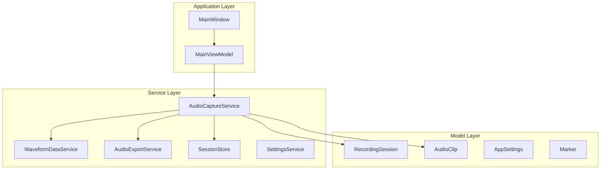
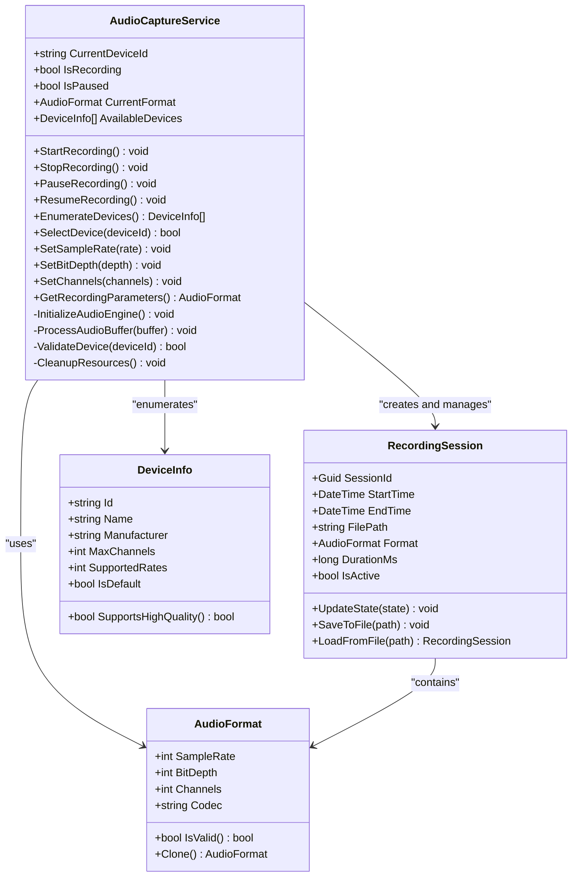
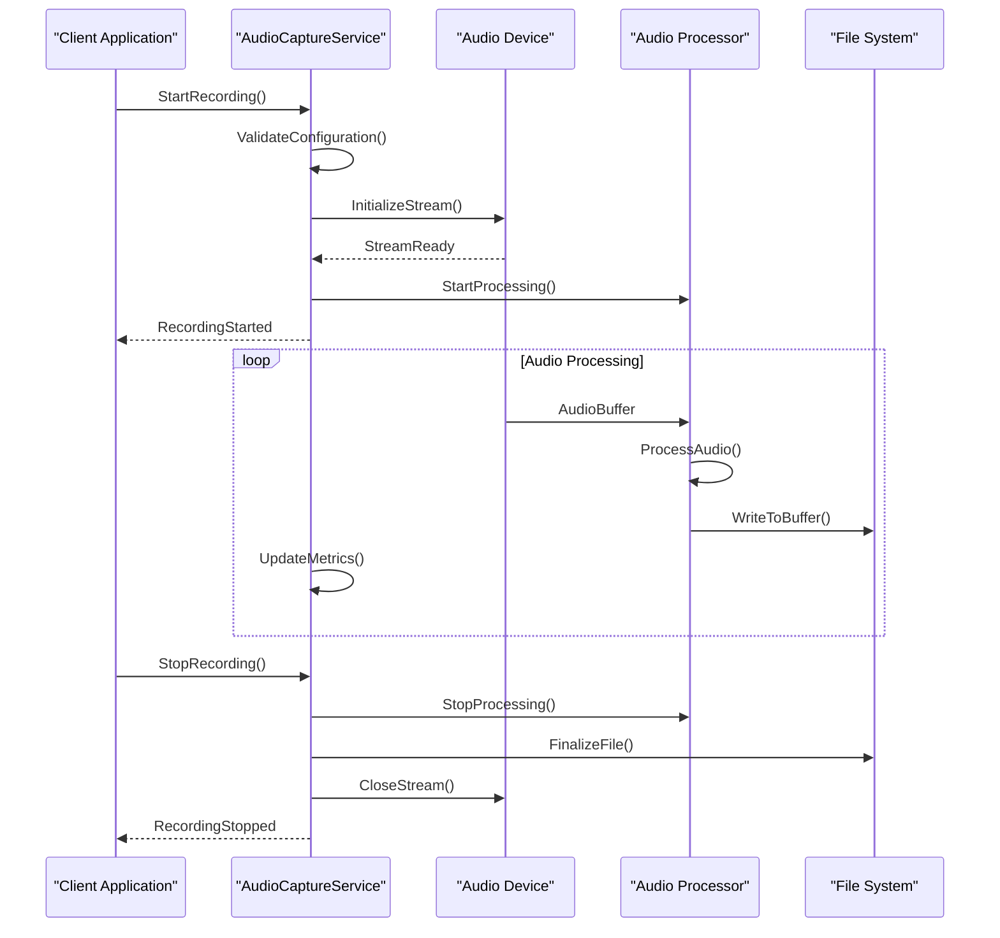
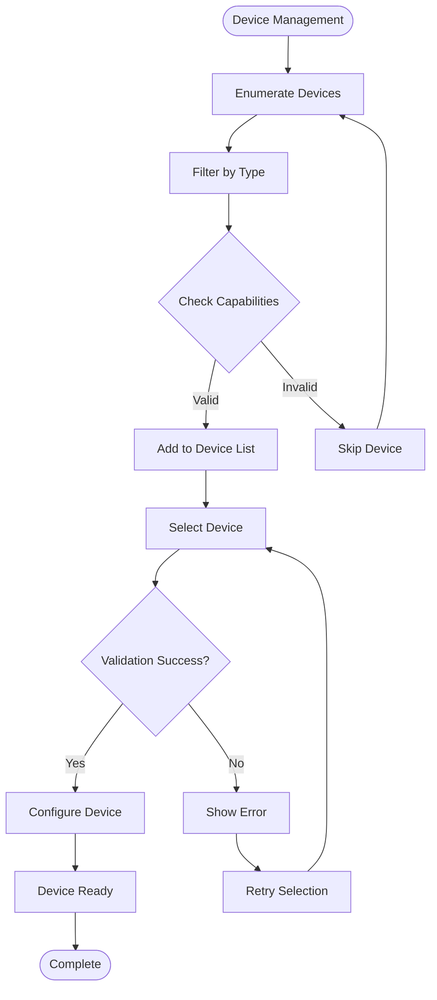
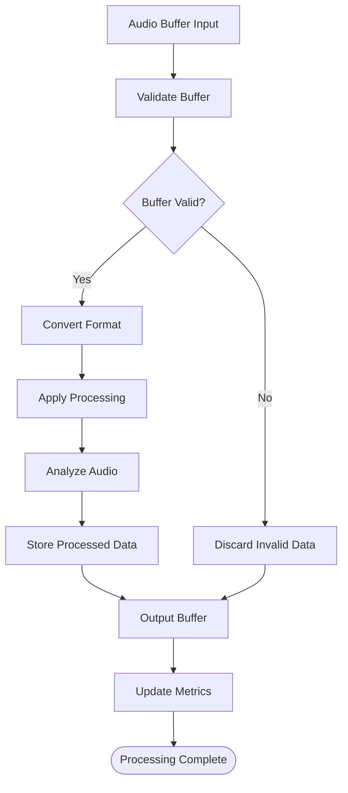
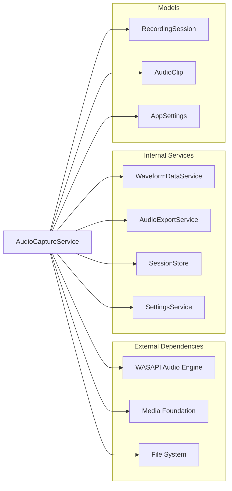

# Audio Capture Service

<cite>
**Referenced Files in This Document**
- [AudioCaptureService.cs](file://Services/AudioCaptureService.cs)
- [RecordingSession.cs](file://Models/RecordingSession.cs)
- [AppSettings.cs](file://Models/AppSettings.cs)
- [AudioClip.cs](file://Models/AudioClip.cs)
- [WaveformDataService.cs](file://Services/WaveformDataService.cs)
- [AudioExportService.cs](file://Services/AudioExportService.cs)
</cite>

## Table of Contents
1. [Introduction](#introduction)
2. [Project Structure](#project-structure)
3. [Core Components](#core-components)
4. [Architecture Overview](#architecture-overview)
5. [Detailed Component Analysis](#detailed-component-analysis)
6. [Dependency Analysis](#dependency-analysis)
7. [Performance Considerations](#performance-considerations)
8. [Troubleshooting Guide](#troubleshooting-guide)
9. [Conclusion](#conclusion)

## Introduction
The AudioCaptureService is a core component responsible for managing audio recording operations, device management, and real-time audio processing within the SamplerRecorder application. It provides a comprehensive API for capturing audio from various input devices, handling different audio formats, and managing recording sessions with full control over recording parameters and lifecycle.

## Project Structure
The AudioCaptureService is part of a well-organized .NET application that follows MVVM architecture patterns. The service layer contains business logic for audio processing, while models define data structures and services handle specific functionality like waveform generation and audio export.

**Diagram sources**
- [AudioCaptureService.cs](file://Services/AudioCaptureService.cs)
- [RecordingSession.cs](file://Models/RecordingSession.cs)
- [AppSettings.cs](file://Models/AppSettings.cs)

## Core Components

### AudioCaptureService Class
The AudioCaptureService serves as the primary interface for all audio recording operations. It manages the complete lifecycle of audio capture, from device initialization to recording termination and resource cleanup.

#### Key Responsibilities
- Device enumeration and selection
- Audio stream management
- Real-time audio processing
- Recording session control
- Error handling and recovery
- Resource management and cleanup

#### Public API Methods

##### Recording Control Methods
- **StartRecording()**: Initiates audio recording with current settings
- **StopRecording()**: Terminates active recording session
- **PauseRecording()**: Temporarily pauses audio capture
- **ResumeRecording()**: Resumes paused recording session

##### Device Management Methods
- **EnumerateDevices()**: Lists all available audio input devices
- **SelectDevice(deviceId)**: Configures the active recording device
- **GetDeviceCapabilities(deviceId)**: Retrieves device-specific capabilities

##### Configuration Methods
- **SetSampleRate(rate)**: Configures audio sample rate (Hz)
- **SetBitDepth(depth)**: Sets audio bit depth (16, 24, 32-bit)
- **SetChannels(channels)**: Configures mono/stereo/multi-channel
- **GetRecordingParameters()**: Returns current audio configuration

##### Event Handling Methods
- **OnAudioDataReceived**: Event fired when audio data is processed
- **OnRecordingStateChanged**: Event for recording state changes
- **OnErrorOccurred**: Event for error notifications

**Section sources**
- [AudioCaptureService.cs](file://Services/AudioCaptureService.cs)

## Architecture Overview

The AudioCaptureService follows a layered architecture pattern with clear separation of concerns:

**Diagram sources**
- [AudioCaptureService.cs](file://Services/AudioCaptureService.cs)
- [RecordingSession.cs](file://Models/RecordingSession.cs)
- [AppSettings.cs](file://Models/AppSettings.cs)

## Detailed Component Analysis

### Audio Capture Workflow

The audio capture process follows a structured workflow with proper error handling and state management:

**Diagram sources**
- [AudioCaptureService.cs](file://Services/AudioCaptureService.cs)
- [RecordingSession.cs](file://Models/RecordingSession.cs)

### Device Enumeration and Selection

The service provides comprehensive device management capabilities:

**Diagram sources**
- [AudioCaptureService.cs](file://Services/AudioCaptureService.cs)

### Real-time Audio Processing

Real-time audio processing involves buffer management, format conversion, and quality assurance:

**Diagram sources**
- [AudioCaptureService.cs](file://Services/AudioCaptureService.cs)

## Dependency Analysis

The AudioCaptureService has several key dependencies that work together to provide comprehensive audio capture functionality:

**Diagram sources**
- [AudioCaptureService.cs](file://Services/AudioCaptureService.cs)
- [WaveformDataService.cs](file://Services/WaveformDataService.cs)
- [AudioExportService.cs](file://Services/AudioExportService.cs)

**Section sources**
- [AudioCaptureService.cs](file://Services/AudioCaptureService.cs)
- [WaveformDataService.cs](file://Services/WaveformDataService.cs)
- [AudioExportService.cs](file://Services/AudioExportService.cs)

## Performance Considerations

### Memory Management
- Implement efficient buffer pooling to minimize garbage collection pressure
- Use streaming approaches for large audio files to avoid memory overflow
- Dispose of unmanaged resources promptly through proper cleanup patterns

### Threading Model
- Utilize background threads for audio processing to maintain UI responsiveness
- Implement thread-safe operations for concurrent access scenarios
- Use appropriate synchronization primitives for shared resources

### Optimization Strategies
- Cache device information to reduce enumeration overhead
- Implement lazy loading for expensive operations
- Use efficient data structures for audio buffer management
- Optimize format conversions with hardware acceleration when available

## Troubleshooting Guide

### Common Issues and Solutions

#### Device Not Found Errors
- Verify device availability and permissions
- Check system audio settings and default device configuration
- Ensure proper driver installation and updates

#### Audio Quality Issues
- Validate sample rate compatibility with device capabilities
- Check for buffer underruns or overruns
- Monitor CPU usage during high-quality recordings

#### Memory Leaks
- Ensure proper disposal of audio streams and buffers
- Verify event handler unsubscription
- Monitor memory usage patterns during extended recordings

#### Thread Safety Issues
- Implement proper locking mechanisms for shared resources
- Use thread-safe collections for cross-thread communication
- Validate concurrent access patterns in testing

### Error Recovery Strategies
- Implement automatic retry mechanisms for transient failures
- Provide fallback options when primary devices are unavailable
- Gracefully handle partial recording failures with data recovery

## Conclusion

The AudioCaptureService provides a robust and comprehensive solution for audio recording needs within the SamplerRecorder application. Its modular design, extensive device support, and efficient processing pipeline make it suitable for both simple recording tasks and complex audio processing workflows. The service's emphasis on thread safety, resource management, and error handling ensures reliable operation in production environments.

Key strengths include:
- Comprehensive device enumeration and management
- Flexible audio format support
- Efficient real-time processing capabilities
- Robust error handling and recovery mechanisms
- Clean separation of concerns through well-defined interfaces

Future enhancements could include additional audio format support, advanced audio effects processing, and improved performance monitoring capabilities.