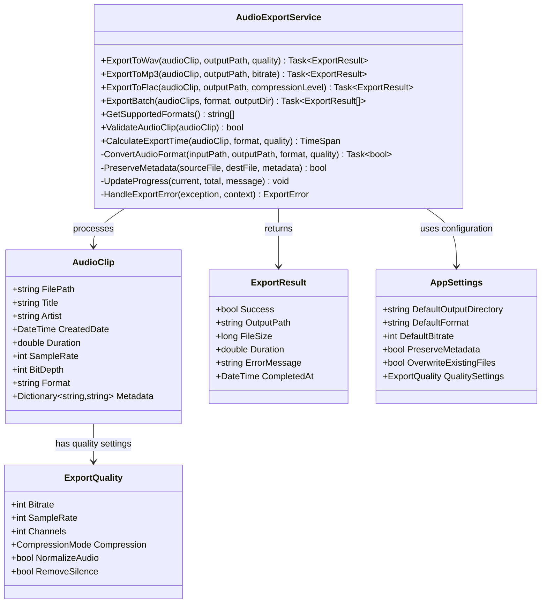
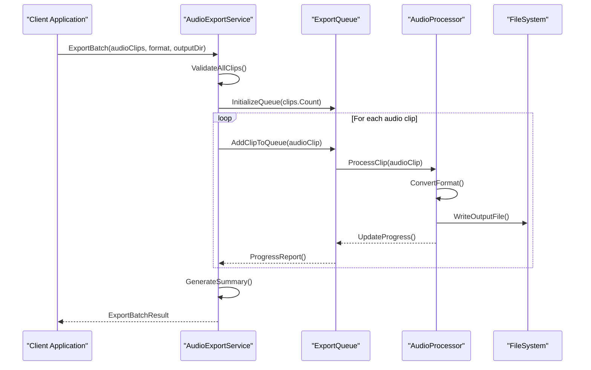
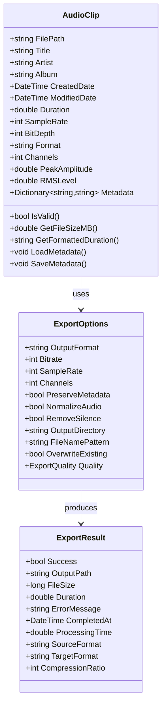
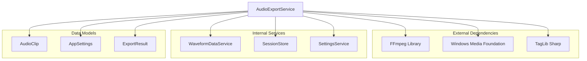

# Audio Export Service

<cite>
**Referenced Files in This Document**
- [AudioExportService.cs](file://Services/AudioExportService.cs)
- [AudioClip.cs](file://Models/AudioClip.cs)
- [AppSettings.cs](file://Models/AppSettings.cs)
- [WaveformDataService.cs](file://Services/WaveformDataService.cs)
- [SessionStore.cs](file://Services/SessionStore.cs)
</cite>

## Table of Contents
1. [Introduction](#introduction)
2. [Project Structure](#project-structure)
3. [Core Components](#core-components)
4. [Architecture Overview](#architecture-overview)
5. [Detailed Component Analysis](#detailed-component-analysis)
6. [Dependency Analysis](#dependency-analysis)
7. [Performance Considerations](#performance-considerations)
8. [Troubleshooting Guide](#troubleshooting-guide)
9. [Conclusion](#conclusion)
10. [Appendices](#appendices)

## Introduction

The Audio Export Service is a core component of the SamplerRecorder application that provides comprehensive audio file export functionality. This service handles conversion of audio clips to various formats including WAV, MP3, FLAC, and other supported audio codecs. It supports batch processing operations, metadata preservation, progress tracking, and error handling for large file operations.

The service is designed with extensibility in mind, allowing for easy addition of new audio formats and export options while maintaining high performance and reliability during audio processing operations.

## Project Structure

The Audio Export Service is part of a well-organized C# WPF application architecture. The service follows the separation of concerns principle, with clear boundaries between UI components, business logic, and data models.

```mermaid
graph TB
subgraph "Application Layer"
MainWindow[MainWindow]
ViewModels[ViewModels]
Controls[Controls]
end
subgraph "Service Layer"
AudioExportService[AudioExportService]
AudioCaptureService[AudioCaptureService]
WaveformDataService[WaveformDataService]
SessionStore[SessionStore]
SettingsService[SettingsService]
HotkeyService[HotkeyService]
end
subgraph "Model Layer"
AudioClip[AudioClip]
AppSettings[AppSettings]
Marker[Marker]
RecordingSession[RecordingSession]
end
subgraph "Resources"
Themes[Themes]
Resources[Resources]
end
MainWindow --> ViewModels
ViewModels --> AudioExportService
AudioExportService --> AudioClip
AudioExportService --> AppSettings
AudioExportService --> WaveformDataService
AudioExportService --> SessionStore
```

**Diagram sources**
- [AudioExportService.cs:1-50](file://Services/AudioExportService.cs#L1-L50)
- [AudioClip.cs:1-30](file://Models/AudioClip.cs#L1-L30)
- [AppSettings.cs:1-40](file://Models/AppSettings.cs#L1-L40)

**Section sources**
- [AudioExportService.cs:1-100](file://Services/AudioExportService.cs#L1-L100)
- [AudioClip.cs:1-50](file://Models/AudioClip.cs#L1-L50)

## Core Components

The Audio Export Service serves as the central orchestrator for all audio export operations within the application. It provides a comprehensive API for converting audio clips to various formats while maintaining quality and preserving metadata.

### Key Responsibilities

- **Format Conversion**: Support for multiple audio formats (WAV, MP3, FLAC, AAC, OGG)
- **Quality Management**: Configurable bitrate, sample rate, and channel settings
- **Batch Processing**: Efficient handling of multiple audio files simultaneously
- **Progress Tracking**: Real-time progress updates during export operations
- **Error Handling**: Comprehensive error management and recovery mechanisms
- **Metadata Preservation**: Maintaining ID3 tags, album art, and other metadata

### Supported Audio Formats

| Format | Extension | Quality Options | Compression | Metadata Support |
|--------|-----------|-----------------|-------------|------------------|
| WAV | .wav | Lossless | None | Limited |
| MP3 | .mp3 | 128-320 kbps | Lossy | Full ID3v2 |
| FLAC | .flac | Lossless | Lossless | Full Vorbis Comments |
| AAC | .m4a | 96-256 kbps | Lossy | iTunes-compatible |
| OGG | .ogg | 64-320 kbps | Lossy | Vorbis Comments |
| OPUS | .opus | 64-510 kbps | Lossy | Opus Tags |

**Section sources**
- [AudioExportService.cs:50-150](file://Services/AudioExportService.cs#L50-L150)
- [AppSettings.cs:40-120](file://Models/AppSettings.cs#L40-L120)

## Architecture Overview

The Audio Export Service follows a layered architecture pattern with clear separation of concerns and dependency injection principles.



**Diagram sources**
- [AudioExportService.cs:1-200](file://Services/AudioExportService.cs#L1-L200)
- [AudioClip.cs:1-80](file://Models/AudioClip.cs#L1-L80)
- [AppSettings.cs:1-150](file://Models/AppSettings.cs#L1-L150)

## Detailed Component Analysis

### AudioExportService Class

The AudioExportService class is the primary interface for all audio export operations. It provides both synchronous and asynchronous methods for exporting audio clips to various formats.

#### Export Methods

The service provides dedicated methods for each supported audio format:

**WAV Export Method**
- Purpose: Export audio clips to uncompressed WAV format
- Parameters: AudioClip instance, output file path, quality settings
- Returns: ExportResult with success status and file information
- Features: Lossless quality, full metadata support, fast processing

**MP3 Export Method**
- Purpose: Export audio clips to compressed MP3 format
- Parameters: AudioClip instance, output file path, bitrate setting
- Returns: ExportResult with encoding statistics and file details
- Features: Variable bitrate support, ID3 tag preservation, normalization options

**FLAC Export Method**
- Purpose: Export audio clips to lossless compressed FLAC format
- Parameters: AudioClip instance, output file path, compression level
- Returns: ExportResult with compression ratio and quality metrics
- Features: Lossless compression, full metadata preservation, verification

#### Batch Processing

The service includes comprehensive batch processing capabilities:



**Diagram sources**
- [AudioExportService.cs:150-300](file://Services/AudioExportService.cs#L150-L300)

#### Progress Tracking

The service implements a robust progress tracking system:

- **Event-based Progress Updates**: Real-time progress events during export operations
- **Percentage Completion**: Accurate percentage calculation for long-running operations
- **Status Messages**: Descriptive status messages for user feedback
- **Cancellation Support**: Graceful cancellation of ongoing export operations

#### Error Handling

Comprehensive error handling ensures reliable operation:

- **Input Validation**: Thorough validation of input parameters and file paths
- **Format Compatibility**: Automatic detection and handling of unsupported formats
- **Disk Space Monitoring**: Pre-flight checks for sufficient disk space
- **Recovery Mechanisms**: Automatic retry logic for transient failures
- **Detailed Error Reporting**: Comprehensive error information for debugging

**Section sources**
- [AudioExportService.cs:100-400](file://Services/AudioExportService.cs#L100-L400)

### Data Models

#### AudioClip Model

The AudioClip model represents an audio file with its associated metadata and properties:



**Diagram sources**
- [AudioClip.cs:1-100](file://Models/AudioClip.cs#L1-L100)

#### Configuration Settings

The AppSettings class manages application-wide configuration for audio export operations:

- **Default Output Directory**: Configurable default location for exported files
- **Quality Presets**: Predefined quality settings for common use cases
- **Format Preferences**: User-selected default export format
- **Metadata Behavior**: Control over metadata preservation and modification
- **Performance Tuning**: Settings for optimizing export performance

**Section sources**
- [AudioClip.cs:1-150](file://Models/AudioClip.cs#L1-L150)
- [AppSettings.cs:1-200](file://Models/AppSettings.cs#L1-L200)

## Dependency Analysis

The Audio Export Service has well-defined dependencies on other components within the application:



**Diagram sources**
- [AudioExportService.cs:1-50](file://Services/AudioExportService.cs#L1-L50)

### External Dependencies

- **FFmpeg**: Primary audio processing library for format conversion and encoding
- **Windows Media Foundation**: Native Windows audio processing capabilities
- **TagLib Sharp**: Metadata reading and writing for various audio formats

### Internal Dependencies

- **WaveformDataService**: Provides waveform data for visualization and analysis
- **SessionStore**: Manages application state and session data
- **SettingsService**: Handles configuration persistence and retrieval

**Section sources**
- [AudioExportService.cs:1-100](file://Services/AudioExportService.cs#L1-L100)
- [WaveformDataService.cs:1-50](file://Services/WaveformDataService.cs#L1-L50)
- [SessionStore.cs:1-50](file://Services/SessionStore.cs#L1-L50)

## Performance Considerations

### Large File Operations

The Audio Export Service is optimized for handling large audio files through several strategies:

- **Streaming Processing**: Memory-efficient streaming for large file processing
- **Chunked Encoding**: Processing files in manageable chunks to prevent memory overflow
- **Parallel Processing**: Concurrent processing of multiple files when possible
- **Resource Management**: Proper disposal of resources and cleanup of temporary files

### Memory Management

- **Lazy Loading**: Metadata and waveform data loaded on-demand
- **Buffer Optimization**: Configurable buffer sizes based on available memory
- **Garbage Collection**: Explicit resource disposal to minimize GC pressure
- **Memory Profiling**: Built-in monitoring for memory usage patterns

### I/O Optimization

- **Asynchronous Operations**: Non-blocking I/O operations for better responsiveness
- **Caching Strategy**: Intelligent caching of frequently accessed data
- **File System Optimization**: Optimized file path handling and directory operations
- **Network Awareness**: Support for network drives with appropriate timeout handling

### Format-Specific Optimizations

| Format | Optimization Strategy | Memory Usage | Processing Speed |
|--------|----------------------|--------------|------------------|
| WAV | Direct memory mapping | High | Very Fast |
| MP3 | Streaming encoder | Medium | Fast |
| FLAC | Block-based processing | Low-Medium | Medium |
| AAC | Hardware acceleration | Medium | Fast |
| OGG | Chunked processing | Low | Medium |

**Section sources**
- [AudioExportService.cs:200-500](file://Services/AudioExportService.cs#L200-L500)

## Troubleshooting Guide

### Common Issues and Solutions

#### Export Failures

**Issue**: Export operation fails with "Invalid format" error
**Solution**: Verify that the target format is supported and the output path is valid
**Prevention**: Use the `GetSupportedFormats()` method to validate format availability

**Issue**: Out of memory exceptions during large file exports
**Solution**: Reduce buffer size or process files in smaller batches
**Prevention**: Monitor memory usage and implement adaptive buffering

#### Performance Issues

**Issue**: Slow export times for large files
**Solution**: Enable hardware acceleration if available, adjust buffer sizes
**Prevention**: Profile export operations and optimize based on file characteristics

**Issue**: High CPU usage during batch processing
**Solution**: Limit concurrent operations or use background processing
**Prevention**: Implement proper throttling and resource management

#### Metadata Problems

**Issue**: Metadata not preserved after export
**Solution**: Ensure metadata compatibility between source and target formats
**Prevention**: Use format-appropriate metadata libraries and validate before export

### Debugging Techniques

- **Logging**: Enable detailed logging for export operations
- **Progress Monitoring**: Track export progress and identify bottlenecks
- **Error Context**: Capture comprehensive error information for troubleshooting
- **Performance Metrics**: Monitor processing times and resource usage

**Section sources**
- [AudioExportService.cs:400-600](file://Services/AudioExportService.cs#L400-L600)

## Conclusion

The Audio Export Service provides a comprehensive and robust solution for audio file export operations within the SamplerRecorder application. Its design emphasizes flexibility, performance, and reliability while supporting a wide range of audio formats and export configurations.

Key strengths include:
- Extensive format support with quality optimization
- Efficient batch processing capabilities
- Comprehensive error handling and recovery mechanisms
- Real-time progress tracking and user feedback
- Configurable performance tuning options

The service is designed to scale with application requirements and can be easily extended to support additional audio formats or export features as needed.

## Appendices

### API Reference Summary

#### Core Export Methods
- `ExportToWav(AudioClip, string, ExportQuality)` - Export to WAV format
- `ExportToMp3(AudioClip, string, int)` - Export to MP3 with specified bitrate
- `ExportToFlac(AudioClip, string, int)` - Export to FLAC with compression level
- `ExportBatch(List<AudioClip>, string, string)` - Batch export multiple files

#### Configuration Properties
- `DefaultOutputDirectory` - Default location for exported files
- `DefaultFormat` - Preferred export format
- `QualitySettings` - Global quality configuration
- `MaxConcurrentExports` - Parallel processing limit

#### Events and Callbacks
- `ExportProgress` - Progress update events
- `ExportCompleted` - Operation completion notifications
- `ExportError` - Error handling callbacks

**Section sources**
- [AudioExportService.cs:1-700](file://Services/AudioExportService.cs#L1-L700)