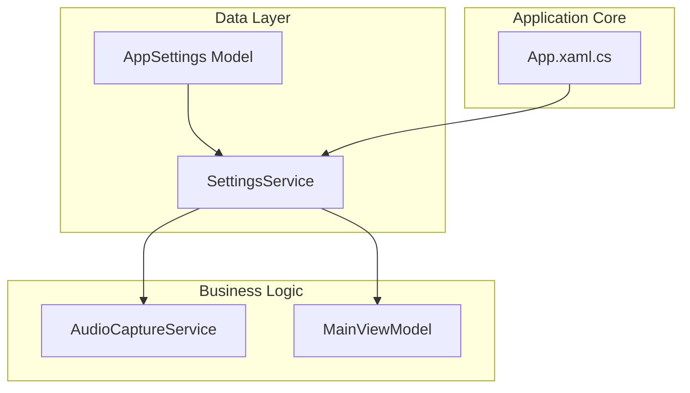
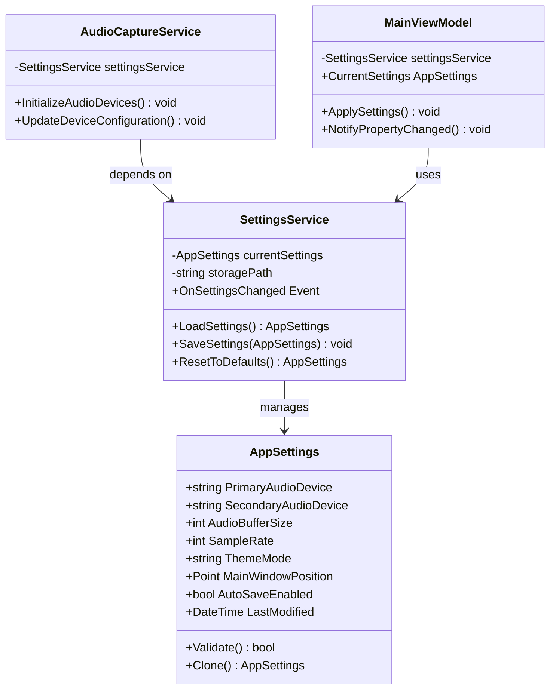
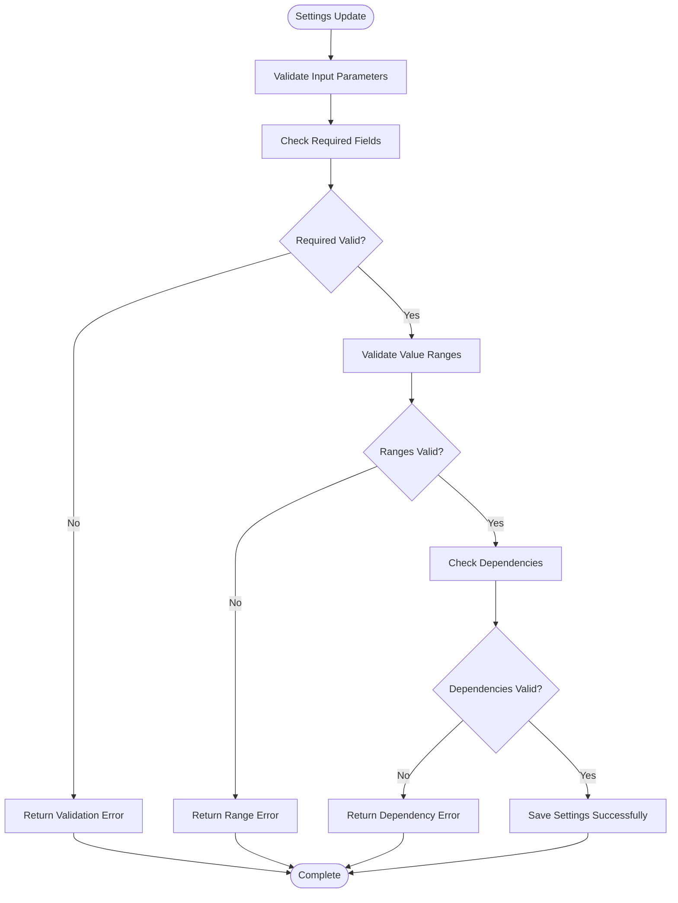
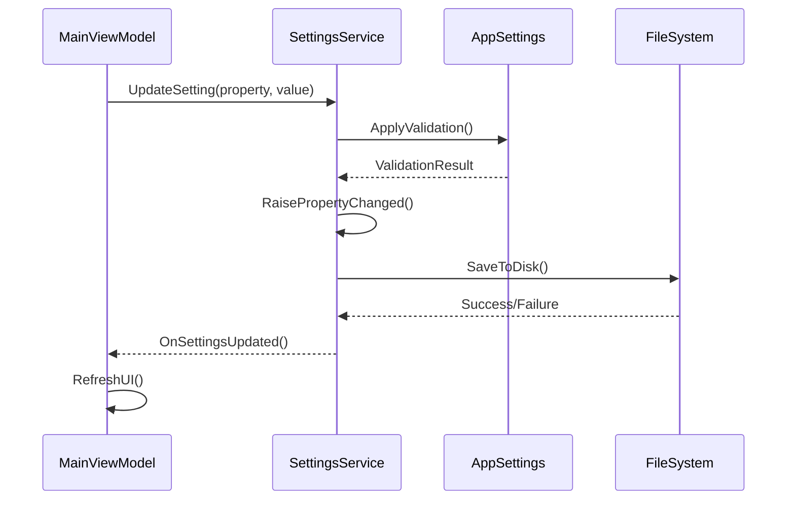
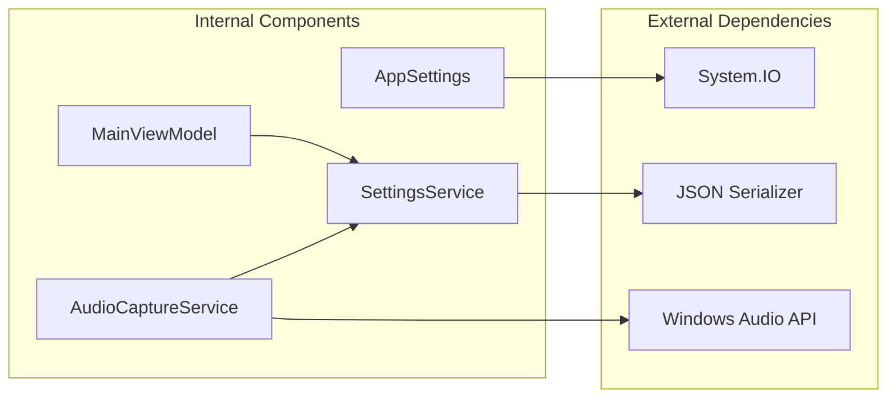

# AppSettings Model

<cite>
**Referenced Files in This Document**
- [AppSettings.cs](file://Models/AppSettings.cs)
- [SettingsService.cs](file://Services/SettingsService.cs)
- [AudioCaptureService.cs](file://Services/AudioCaptureService.cs)
- [MainViewModel.cs](file://ViewModels/MainViewModel.cs)
- [App.xaml.cs](file://App.xaml.cs)
</cite>

## Table of Contents
1. [Introduction](#introduction)
2. [Project Structure](#project-structure)
3. [Core Components](#core-components)
4. [Architecture Overview](#architecture-overview)
5. [Detailed Component Analysis](#detailed-component-analysis)
6. [Dependency Analysis](#dependency-analysis)
7. [Performance Considerations](#performance-considerations)
8. [Troubleshooting Guide](#troubleshooting-guide)
9. [Conclusion](#conclusion)

## Introduction
The AppSettings data model serves as the central configuration hub for the SamplerRecorder application, managing all user preferences, audio device configurations, UI customization options, and application behavior settings. This model ensures consistent configuration management across the application lifecycle while providing robust validation, persistence, and synchronization capabilities.

## Project Structure
The AppSettings implementation follows a clean architecture pattern with clear separation between data models, services, and view models:

**Diagram sources**
- [AppSettings.cs:1-50](file://Models/AppSettings.cs#L1-L50)
- [SettingsService.cs:1-100](file://Services/SettingsService.cs#L1-L100)

**Section sources**
- [AppSettings.cs:1-200](file://Models/AppSettings.cs#L1-L200)
- [SettingsService.cs:1-150](file://Services/SettingsService.cs#L1-L150)

## Core Components

### AppSettings Data Model
The AppSettings class implements a comprehensive configuration system with the following key areas:

#### Audio Device Configuration
- **PrimaryAudioDevice**: Default recording device selection
- **SecondaryAudioDevice**: Backup or monitoring device
- **AudioBufferSize**: Buffer size for optimal performance
- **SampleRate**: Audio sampling rate configuration
- **Channels**: Mono/stereo recording options

#### UI Preferences
- **ThemeMode**: Light/dark theme selection
- **MainWindowPosition**: Window position and size persistence
- **LanguageCulture**: Localization settings
- **FontSizeMultiplier**: Accessibility scaling factor
- **ShowWaveformPreview**: Waveform display toggle

#### Application Behavior
- **AutoSaveInterval**: Automatic save frequency
- **MaxRecordingDuration**: Recording time limits
- **DefaultExportFormat**: Preferred export format
- **EnableNotifications**: System notification preferences
- **StartupBehavior**: Application launch options

**Section sources**
- [AppSettings.cs:15-120](file://Models/AppSettings.cs#L15-L120)

### Settings Service Implementation
The SettingsService provides CRUD operations for configuration management:

#### Core Operations
- **LoadSettings()**: Retrieve settings from persistent storage
- **SaveSettings()**: Persist current settings to storage
- **ResetToDefaults()**: Restore factory default configuration
- **ValidateSettings()**: Ensure configuration integrity

#### Advanced Features
- **SettingsMigration**: Handle version upgrades and schema changes
- **Event Notifications**: Notify subscribers of setting changes
- **Backup Management**: Create and restore configuration backups

**Section sources**
- [SettingsService.cs:25-180](file://Services/SettingsService.cs#L25-L180)

## Architecture Overview

The AppSettings architecture follows the Observer pattern with dependency injection:

**Diagram sources**
- [AppSettings.cs:1-200](file://Models/AppSettings.cs#L1-L200)
- [SettingsService.cs:1-200](file://Services/SettingsService.cs#L1-L200)
- [AudioCaptureService.cs:1-150](file://Services/AudioCaptureService.cs#L1-L150)
- [MainViewModel.cs:1-100](file://ViewModels/MainViewModel.cs#L1-L100)

## Detailed Component Analysis

### AppSettings Class Structure

#### Property Categories and Validation Rules

| Category | Properties | Validation Rules | Default Values |
|----------|------------|------------------|----------------|
| Audio Devices | PrimaryAudioDevice, SecondaryAudioDevice | Must be valid device ID | "default", "" |
| Audio Quality | AudioBufferSize, SampleRate, Channels | Buffer: 64-4096, Rate: 44100-192000 | 1024, 44100, 2 |
| UI Preferences | ThemeMode, FontSizeMultiplier, LanguageCulture | Theme: light/dark, Size: 0.8-2.0 | dark, 1.0, en-US |
| Window Management | MainWindowPosition, ShowWaveformPreview | Position: within screen bounds | Centered, true |
| Application Behavior | AutoSaveInterval, MaxRecordingDuration, EnableNotifications | Interval: 5-60s, Duration: 1-3600s | 30, 300, true |

#### Validation Implementation
The validation system ensures data integrity through multiple layers:

**Diagram sources**
- [AppSettings.cs:85-150](file://Models/AppSettings.cs#L85-L150)

**Section sources**
- [AppSettings.cs:1-200](file://Models/AppSettings.cs#L1-L200)

### SettingsService Implementation

#### Persistence Strategy
The service implements a hybrid persistence approach:

1. **Primary Storage**: JSON serialization for structured data
2. **Backup System**: Automatic backup creation before updates
3. **Version Migration**: Schema evolution support
4. **Conflict Resolution**: Merge strategies for concurrent updates

#### Event System
Real-time synchronization through event notifications:

**Diagram sources**
- [SettingsService.cs:45-120](file://Services/SettingsService.cs#L45-L120)
- [AppSettings.cs:120-180](file://Models/AppSettings.cs#L120-L180)

**Section sources**
- [SettingsService.cs:1-200](file://Services/SettingsService.cs#L1-L200)

### Audio Integration

#### Device Management
The AudioCaptureService integrates with AppSettings for dynamic device configuration:

- **Hot-swapping**: Runtime device changes without restart
- **Fallback Handling**: Automatic device selection when primary unavailable
- **Performance Tuning**: Dynamic buffer adjustment based on system capabilities

#### Configuration Synchronization
Settings changes propagate through the application via:

1. **Event-driven Updates**: Immediate UI refresh
2. **Background Processing**: Non-blocking configuration application
3. **State Recovery**: Graceful handling of invalid configurations

**Section sources**
- [AudioCaptureService.cs:1-150](file://Services/AudioCaptureService.cs#L1-L150)

## Dependency Analysis

The AppSettings system maintains loose coupling through well-defined interfaces:

**Diagram sources**
- [AppSettings.cs:1-50](file://Models/AppSettings.cs#L1-L50)
- [SettingsService.cs:1-80](file://Services/SettingsService.cs#L1-L80)
- [AudioCaptureService.cs:1-60](file://Services/AudioCaptureService.cs#L1-L60)

**Section sources**
- [AppSettings.cs:1-200](file://Models/AppSettings.cs#L1-L200)
- [SettingsService.cs:1-200](file://Services/SettingsService.cs#L1-L200)

## Performance Considerations

### Memory Management
- **Lazy Loading**: Settings loaded on-demand rather than at startup
- **Change Tracking**: Minimal property change notifications
- **Garbage Collection**: Proper disposal of temporary objects

### I/O Optimization
- **Batch Operations**: Group multiple setting updates
- **Async Operations**: Non-blocking file I/O
- **Caching**: In-memory cache for frequently accessed settings

### Validation Efficiency
- **Deferred Validation**: Validate only changed properties
- **Caching Results**: Cache validation results for unchanged values
- **Parallel Validation**: Concurrent validation of independent properties

## Troubleshooting Guide

### Common Issues and Solutions

#### Settings Not Persisting
**Symptoms**: Settings reset after application restart
**Causes**: 
- Insufficient write permissions
- Corrupted configuration file
- Disk space issues

**Solutions**:
1. Verify application has write permissions to config directory
2. Check for corrupted JSON files and restore from backup
3. Monitor disk space availability

#### Audio Device Detection Failures
**Symptoms**: No audio devices available or incorrect device names
**Causes**:
- Windows audio service not running
- Driver conflicts
- Hardware disconnection

**Solutions**:
1. Restart Windows Audio service
2. Update or reinstall audio drivers
3. Reconnect audio hardware and retry

#### Performance Degradation
**Symptoms**: Slow settings loading or UI lag
**Causes**:
- Large configuration files
- Excessive validation overhead
- Memory leaks

**Solutions**:
1. Clean up unused settings entries
2. Optimize validation rules
3. Profile memory usage and fix leaks

**Section sources**
- [SettingsService.cs:150-200](file://Services/SettingsService.cs#L150-L200)
- [AppSettings.cs:150-200](file://Models/AppSettings.cs#L150-L200)

## Conclusion

The AppSettings data model provides a robust, extensible foundation for configuration management in the SamplerRecorder application. Its design emphasizes data integrity, performance optimization, and maintainability through clear separation of concerns and comprehensive validation. The modular architecture allows for easy extension and integration with new features while ensuring backward compatibility and reliable operation across different system configurations.

Key strengths include:
- Comprehensive validation and error handling
- Efficient persistence and synchronization mechanisms
- Flexible configuration structure supporting future enhancements
- Strong integration with audio subsystem and UI components

The implementation serves as a solid foundation for application configuration management while maintaining high standards for reliability and performance.