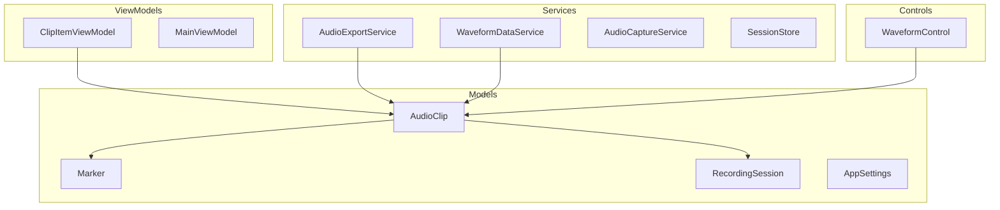
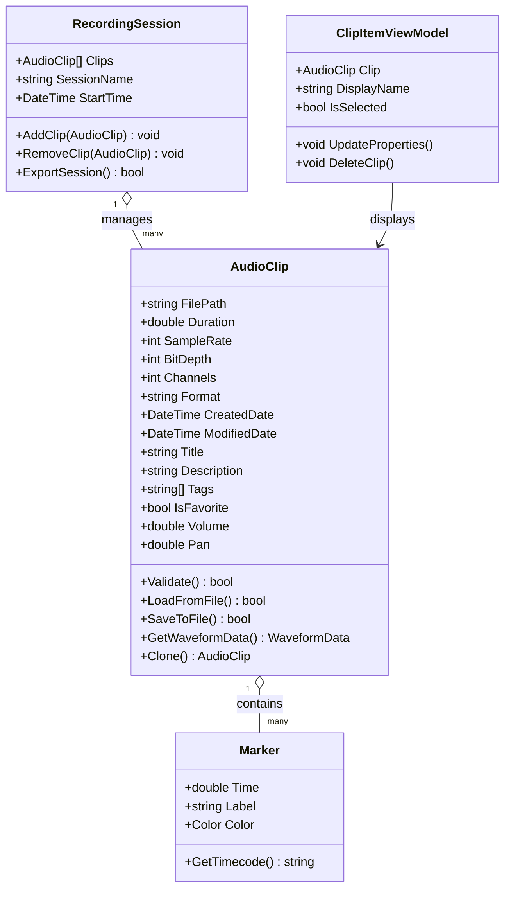
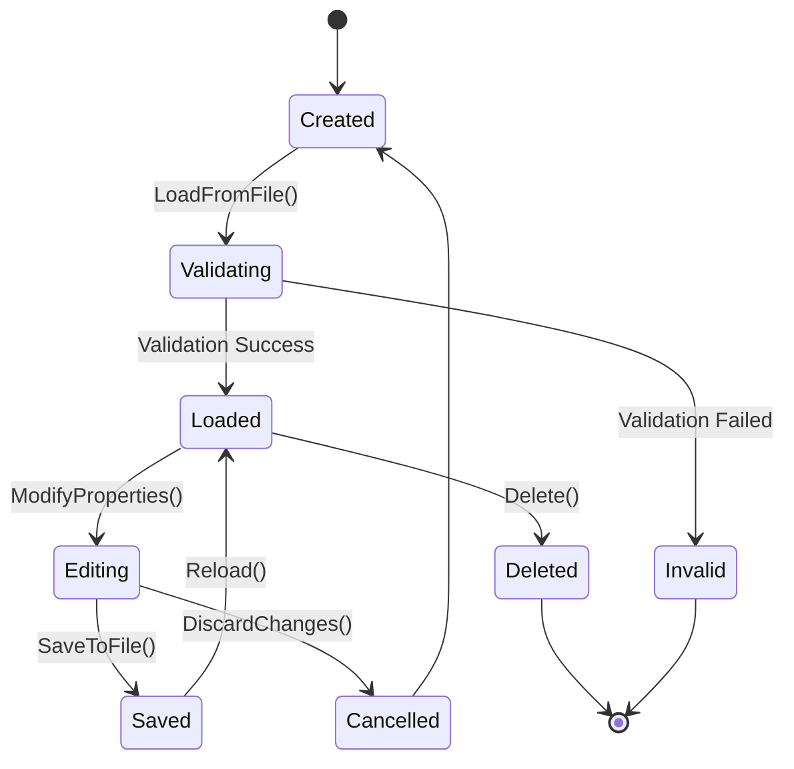
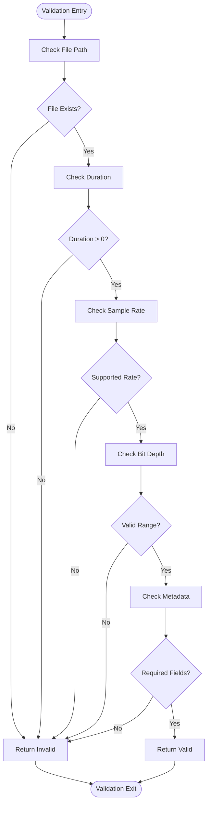
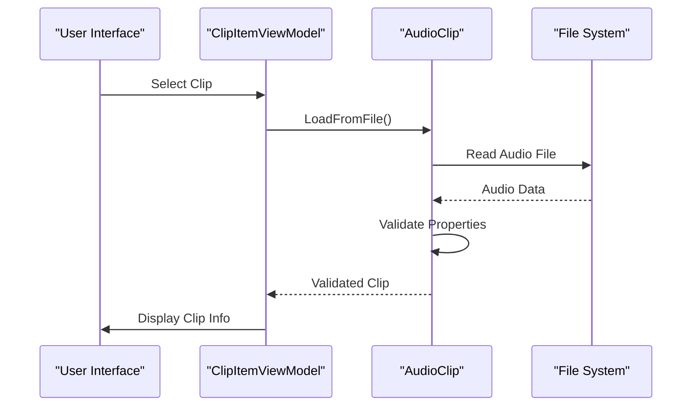
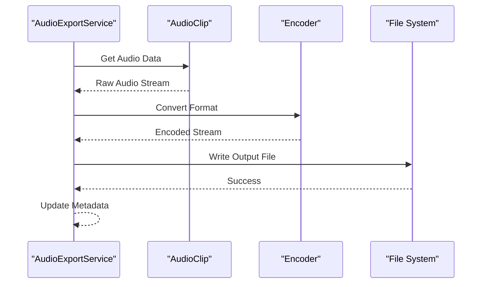
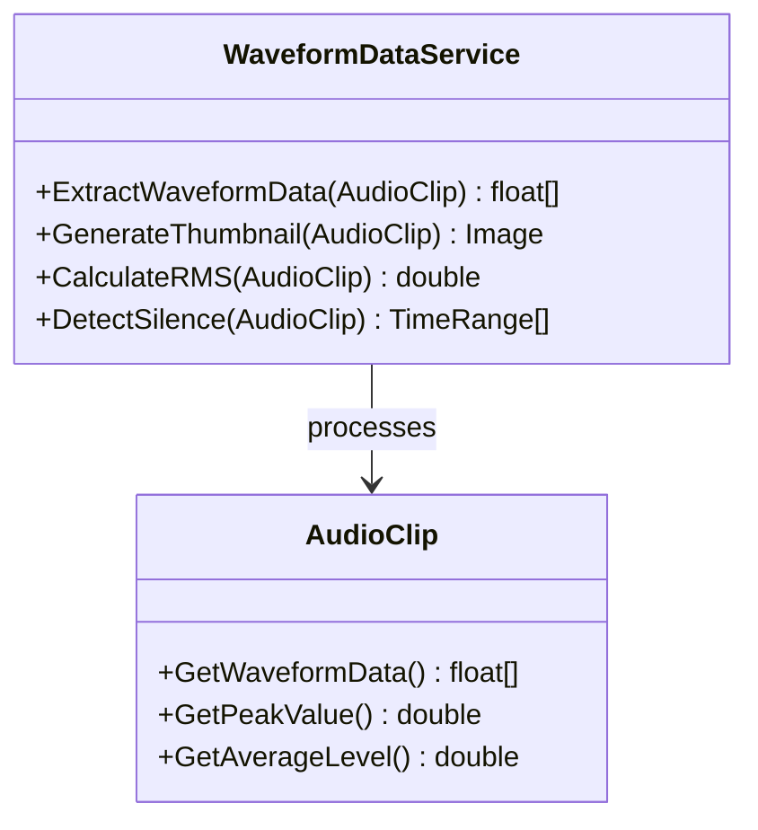
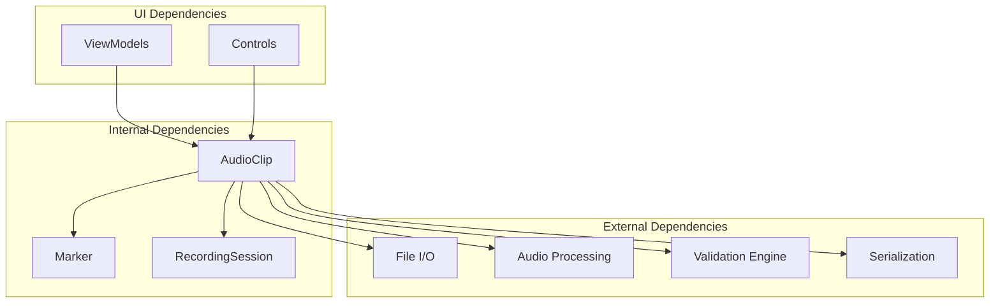

# AudioClip Model

<cite>
**Referenced Files in This Document**
- [AudioClip.cs](file://Models/AudioClip.cs)
- [Marker.cs](file://Models/Marker.cs)
- [RecordingSession.cs](file://Models/RecordingSession.cs)
- [ClipItemViewModel.cs](file://ViewModels/ClipItemViewModel.cs)
- [WaveformControl.cs](file://Controls/WaveformControl.cs)
- [AudioExportService.cs](file://Services/AudioExportService.cs)
- [WaveformDataService.cs](file://Services/WaveformDataService.cs)
</cite>

## Table of Contents
1. [Introduction](#introduction)
2. [Project Structure](#project-structure)
3. [Core Components](#core-components)
4. [Architecture Overview](#architecture-overview)
5. [Detailed Component Analysis](#detailed-component-analysis)
6. [Dependency Analysis](#dependency-analysis)
7. [Performance Considerations](#performance-considerations)
8. [Troubleshooting Guide](#troubleshooting-guide)
9. [Conclusion](#conclusion)

## Introduction
This document provides detailed documentation for the AudioClip data model within the SamplerRecorder application. The AudioClip represents a discrete segment of audio data with associated metadata, lifecycle management, and integration points throughout the application.

## Project Structure
The AudioClip model is part of a well-organized C# WPF application that follows MVVM architecture patterns. The core components include:

**Diagram sources**
- [AudioClip.cs](file://Models/AudioClip.cs)
- [Marker.cs](file://Models/Marker.cs)
- [RecordingSession.cs](file://Models/RecordingSession.cs)
- [ClipItemViewModel.cs](file://ViewModels/ClipItemViewModel.cs)

**Section sources**
- [AudioClip.cs](file://Models/AudioClip.cs)
- [ClipItemViewModel.cs](file://ViewModels/ClipItemViewModel.cs)

## Core Components

### AudioClip Data Model
The AudioClip class serves as the primary data representation for audio segments within the application. It encapsulates all necessary information about an audio clip including file paths, audio properties, and metadata.

#### Key Properties
- **FilePath**: Absolute path to the audio file on disk
- **Duration**: Total duration of the audio clip in seconds
- **SampleRate**: Audio sample rate in Hz (typically 44100 or 48000)
- **BitDepth**: Number of bits per sample (16, 24, or 32)
- **Channels**: Number of audio channels (mono=1, stereo=2)
- **Format**: Audio format identifier (WAV, MP3, FLAC, etc.)
- **CreatedDate**: Timestamp when the clip was created
- **ModifiedDate**: Timestamp when the clip was last modified
- **Title**: User-defined title for the clip
- **Description**: Detailed description of the clip content
- **Tags**: Collection of searchable tags
- **IsFavorite**: Boolean flag for quick access
- **Volume**: Volume level (0.0 to 1.0)
- **Pan**: Stereo panning position (-1.0 to 1.0)

#### Validation Rules
The AudioClip implements comprehensive validation to ensure data integrity:

1. **File Path Validation**: Ensures the file exists and is accessible
2. **Duration Validation**: Validates duration is positive and reasonable
3. **Sample Rate Validation**: Checks against supported sample rates
4. **Bit Depth Validation**: Ensures bit depth is within supported range
5. **Metadata Validation**: Validates required fields and formats

**Section sources**
- [AudioClip.cs](file://Models/AudioClip.cs)

## Architecture Overview

The AudioClip model integrates with multiple layers of the application through well-defined interfaces:

**Diagram sources**
- [AudioClip.cs](file://Models/AudioClip.cs)
- [Marker.cs](file://Models/Marker.cs)
- [RecordingSession.cs](file://Models/RecordingSession.cs)
- [ClipItemViewModel.cs](file://ViewModels/ClipItemViewModel.cs)

## Detailed Component Analysis

### AudioClip Lifecycle Management

The AudioClip follows a well-defined lifecycle from creation to deletion:

**Diagram sources**
- [AudioClip.cs](file://Models/AudioClip.cs)

### Property Validation Flow

The validation process ensures data integrity across all properties:

**Diagram sources**
- [AudioClip.cs](file://Models/AudioClip.cs)

### Integration Patterns

#### ViewModel Integration
The ClipItemViewModel provides a presentation layer for AudioClip instances:

**Diagram sources**
- [ClipItemViewModel.cs](file://ViewModels/ClipItemViewModel.cs)
- [AudioClip.cs](file://Models/AudioClip.cs)

#### Export Service Integration
The AudioExportService handles serialization to various formats:

**Diagram sources**
- [AudioExportService.cs](file://Services/AudioExportService.cs)
- [AudioClip.cs](file://Models/AudioClip.cs)

### Waveform Data Integration
The WaveformDataService extracts visual representations of audio clips:

**Diagram sources**
- [WaveformDataService.cs](file://Services/WaveformDataService.cs)
- [AudioClip.cs](file://Models/AudioClip.cs)

## Dependency Analysis

The AudioClip model has well-defined dependencies throughout the application:

**Diagram sources**
- [AudioClip.cs](file://Models/AudioClip.cs)
- [Marker.cs](file://Models/Marker.cs)
- [RecordingSession.cs](file://Models/RecordingSession.cs)

**Section sources**
- [AudioClip.cs](file://Models/AudioClip.cs)
- [ClipItemViewModel.cs](file://ViewModels/ClipItemViewModel.cs)

## Performance Considerations

### Memory Management
- Large audio files are loaded lazily to prevent memory spikes
- Waveform data is cached to avoid repeated calculations
- Background processing is used for long-running operations

### I/O Optimization
- File operations use asynchronous patterns
- Batch operations are supported for multiple clips
- Streaming is implemented for large file handling

### Caching Strategy
- Recently accessed clips are cached in memory
- Thumbnail images are generated once and stored
- Metadata is preloaded for faster UI response

## Troubleshooting Guide

### Common Issues and Solutions

#### File Access Errors
- **Issue**: Unable to read audio file
- **Solution**: Verify file permissions and path validity
- **Prevention**: Implement proper error handling and user feedback

#### Validation Failures
- **Issue**: Clip fails validation after loading
- **Solution**: Check file integrity and re-extract metadata
- **Prevention**: Add robust error handling during file operations

#### Performance Problems
- **Issue**: Slow waveform generation
- **Solution**: Enable caching and optimize processing algorithms
- **Prevention**: Use background threads for intensive operations

**Section sources**
- [AudioClip.cs](file://Models/AudioClip.cs)
- [AudioExportService.cs](file://Services/AudioExportService.cs)

## Conclusion

The AudioClip model serves as a foundational component in the SamplerRecorder application, providing comprehensive audio data management with robust validation, lifecycle management, and integration capabilities. Its design follows established patterns for maintainability and extensibility while ensuring optimal performance for audio processing tasks.

The model's relationships with other components demonstrate a well-architected system where each layer has clear responsibilities and well-defined interfaces. This approach facilitates easy maintenance, testing, and future enhancements to the audio processing capabilities.