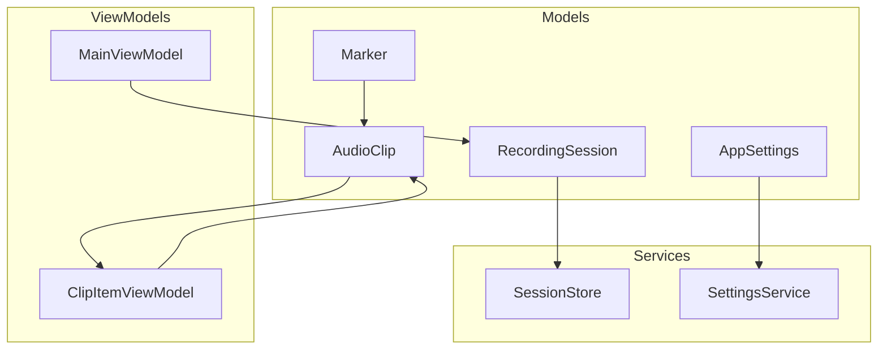
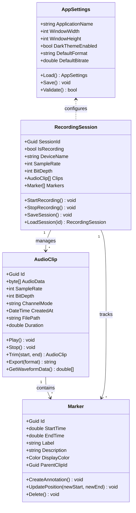
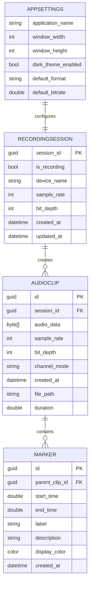
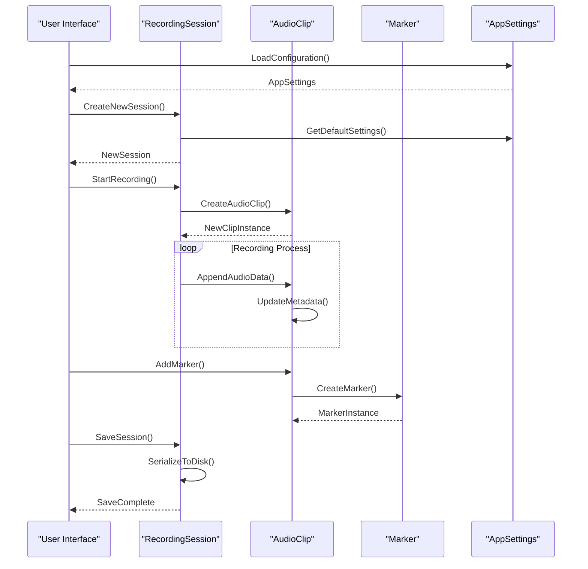
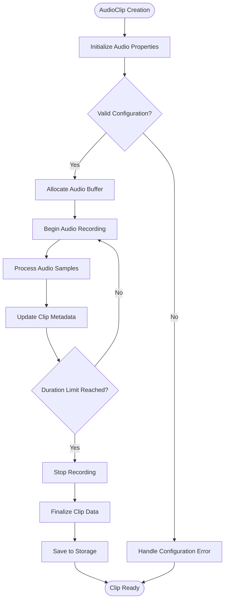
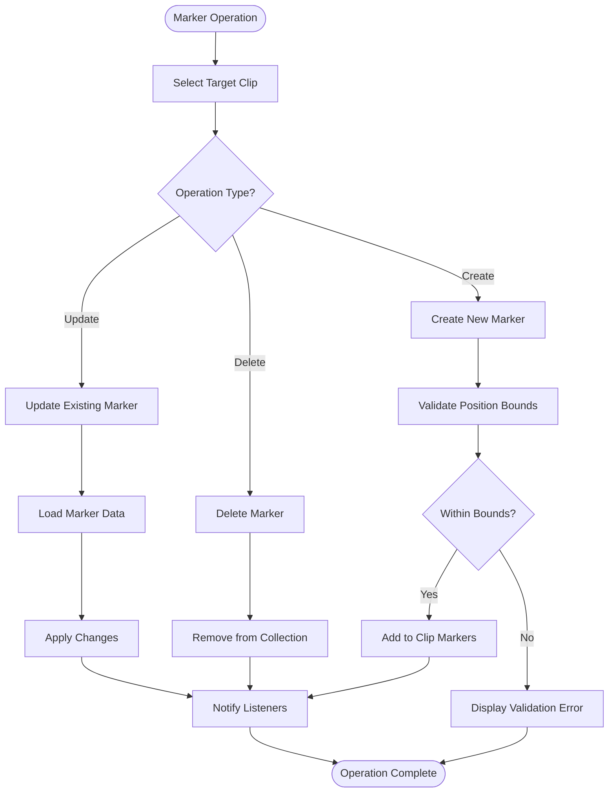
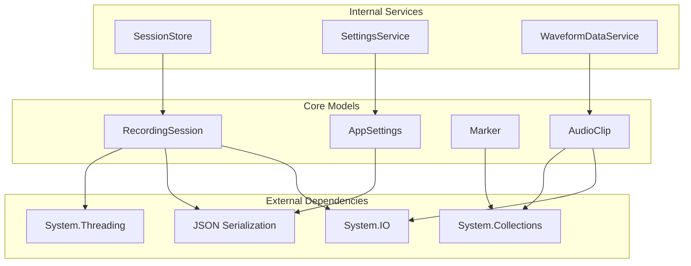

# Data Models

<cite>
**Referenced Files in This Document**
- [AppSettings.cs](file://Models/AppSettings.cs)
- [AudioClip.cs](file://Models/AudioClip.cs)
- [Marker.cs](file://Models/Marker.cs)
- [RecordingSession.cs](file://Models/RecordingSession.cs)
</cite>

## Table of Contents
1. [Introduction](#introduction)
2. [Project Structure](#project-structure)
3. [Core Components](#core-components)
4. [Architecture Overview](#architecture-overview)
5. [Detailed Component Analysis](#detailed-component-analysis)
6. [Dependency Analysis](#dependency-analysis)
7. [Performance Considerations](#performance-considerations)
8. [Troubleshooting Guide](#troubleshooting-guide)
9. [Conclusion](#conclusion)

## Introduction
This document provides comprehensive data model documentation for the SamplerRecorder application. It covers the core entities including AudioClip, Marker, AppSettings, and RecordingSession models, detailing their properties, relationships, validation rules, and usage patterns.

## Project Structure
The data models are organized in the Models directory, following a clean separation of concerns where each entity is represented by its own class file.

**Diagram sources**
- [AppSettings.cs](file://Models/AppSettings.cs)
- [AudioClip.cs](file://Models/AudioClip.cs)
- [Marker.cs](file://Models/Marker.cs)
- [RecordingSession.cs](file://Models/RecordingSession.cs)

## Core Components

### AppSettings Model
The AppSettings class serves as the application configuration schema, storing user preferences and system settings.

#### Properties
- **Application Configuration**: Core application settings such as window dimensions, theme preferences, and default recording parameters
- **User Preferences**: Customizable options that persist across application sessions
- **System Settings**: Hardware-specific configurations and performance tuning options

#### Validation Rules
- Configuration values must be within acceptable ranges
- Required fields must be present during initialization
- Type safety enforced through strongly-typed properties

#### Serialization Patterns
- JSON serialization for persistence
- Default value handling for missing configuration entries
- Migration support for versioned settings

**Section sources**
- [AppSettings.cs](file://Models/AppSettings.cs)

### AudioClip Model
The AudioClip class represents audio recordings with comprehensive metadata and clip management capabilities.

#### Audio Data Properties
- **Raw Audio Samples**: Binary representation of audio waveform data
- **Sample Rate**: Audio sampling frequency in Hz
- **Bit Depth**: Resolution of audio samples (16-bit, 24-bit, etc.)
- **Channel Configuration**: Mono, stereo, or multi-channel setup

#### Metadata Properties
- **Clip Identification**: Unique identifier and naming conventions
- **Timestamp Information**: Creation time, duration, and modification dates
- **Source Information**: Recording device details and input specifications
- **Quality Metrics**: Audio quality indicators and compression settings

#### Clip Management Features
- **Playback Controls**: Start, stop, pause, and seek functionality
- **Editing Operations**: Trim, split, merge, and transform operations
- **Export Capabilities**: Multiple format support and quality presets
- **Memory Management**: Efficient loading and caching strategies

#### Data Constraints
- Maximum clip duration limits
- File size constraints for storage efficiency
- Format compatibility validation
- Memory usage optimization

**Section sources**
- [AudioClip.cs](file://Models/AudioClip.cs)

### Marker Model
The Marker class provides annotation and clip segmentation capabilities for precise audio navigation and organization.

#### Annotation Properties
- **Position Information**: Time-based positioning within audio clips
- **Label Content**: Text descriptions and categorization tags
- **Visual Indicators**: Color coding and display preferences
- **Action Triggers**: Associated actions or events

#### Clip Segmentation Features
- **Boundary Definition**: Start and end points for clip sections
- **Region Selection**: Multi-point selection and grouping
- **Navigation Support**: Quick jump and bookmark functionality
- **Search Integration**: Filtering and sorting by marker attributes

#### Relationship Management
- **Parent-Child Hierarchy**: Nested markers and organizational structures
- **Cross-Reference Links**: Connections between related markers
- **Temporal Ordering**: Chronological arrangement and timeline integration

#### Validation and Constraints
- Position bounds checking within clip duration
- Duplicate marker prevention
- Naming convention enforcement
- Performance optimization for large marker sets

**Section sources**
- [Marker.cs](file://Models/Marker.cs)

### RecordingSession Model
The RecordingSession class manages session state persistence and lifecycle management for recording operations.

#### Session State Properties
- **Session Identification**: Unique session identifiers and tracking information
- **Recording Status**: Current state of recording operations
- **Device Configuration**: Active recording devices and settings
- **Quality Parameters**: Bitrate, format, and compression settings

#### Persistence Features
- **State Serialization**: Complete session state saving and restoration
- **Recovery Mechanisms**: Crash recovery and partial save handling
- **Version Compatibility**: Schema evolution and migration support
- **Backup Strategies**: Automatic backup and restore functionality

#### Lifecycle Management
- **Initialization**: Session creation and configuration
- **Active State**: Real-time recording and monitoring
- **Completion**: Finalization and cleanup procedures
- **Cleanup**: Resource disposal and temporary file management

#### Error Handling
- **Exception Recovery**: Graceful degradation and fallback mechanisms
- **Data Integrity**: Validation and consistency checks
- **Resource Management**: Proper cleanup and memory management
- **Logging and Diagnostics**: Comprehensive error tracking and reporting

**Section sources**
- [RecordingSession.cs](file://Models/RecordingSession.cs)

## Architecture Overview

**Diagram sources**
- [AppSettings.cs](file://Models/AppSettings.cs)
- [AudioClip.cs](file://Models/AudioClip.cs)
- [Marker.cs](file://Models/Marker.cs)
- [RecordingSession.cs](file://Models/RecordingSession.cs)

## Detailed Component Analysis

### Entity Relationships and Dependencies

**Diagram sources**
- [AppSettings.cs](file://Models/AppSettings.cs)
- [RecordingSession.cs](file://Models/RecordingSession.cs)
- [AudioClip.cs](file://Models/AudioClip.cs)
- [Marker.cs](file://Models/Marker.cs)

### Data Flow and Processing Logic

**Diagram sources**
- [RecordingSession.cs](file://Models/RecordingSession.cs)
- [AudioClip.cs](file://Models/AudioClip.cs)
- [Marker.cs](file://Models/Marker.cs)
- [AppSettings.cs](file://Models/AppSettings.cs)

### Object Creation and Manipulation Patterns

#### AudioClip Lifecycle

**Diagram sources**
- [AudioClip.cs](file://Models/AudioClip.cs)

#### Marker Management Workflow

**Diagram sources**
- [Marker.cs](file://Models/Marker.cs)
- [AudioClip.cs](file://Models/AudioClip.cs)

## Dependency Analysis

**Diagram sources**
- [AppSettings.cs](file://Models/AppSettings.cs)
- [AudioClip.cs](file://Models/AudioClip.cs)
- [Marker.cs](file://Models/Marker.cs)
- [RecordingSession.cs](file://Models/RecordingSession.cs)

## Performance Considerations

### Memory Management
- **Audio Data Handling**: Implement streaming for large audio files to prevent memory overflow
- **Lazy Loading**: Load audio data on-demand rather than pre-loading entire clips
- **Garbage Collection**: Optimize object lifecycle to minimize GC pressure
- **Buffer Management**: Use efficient buffer pooling for audio processing

### Serialization Performance
- **Incremental Saving**: Save session data incrementally during long recording sessions
- **Compression**: Apply appropriate compression for stored audio data
- **Caching**: Cache frequently accessed metadata and configuration settings
- **Async Operations**: Perform I/O operations asynchronously to maintain UI responsiveness

### Data Validation Efficiency
- **Batch Validation**: Validate multiple properties in batches to reduce overhead
- **Early Exit**: Implement fast-fail validation for common error cases
- **Caching Results**: Cache validation results for immutable properties
- **Asynchronous Validation**: Perform expensive validation operations asynchronously

## Troubleshooting Guide

### Common Issues and Solutions

#### Audio Data Corruption
- **Symptoms**: Distorted audio, playback failures, or file corruption
- **Causes**: Incomplete writes, buffer overflows, or concurrent access issues
- **Solutions**: Implement proper synchronization, validate data integrity, add error recovery

#### Memory Leaks
- **Symptoms**: Increasing memory usage over time, application slowdown
- **Causes**: Unclosed streams, event handler leaks, or circular references
- **Solutions**: Implement proper disposal patterns, use weak references, monitor memory usage

#### Serialization Errors
- **Symptoms**: Failed saves, corrupted configuration files, or missing data
- **Causes**: Version mismatches, invalid data types, or incomplete objects
- **Solutions**: Add versioning support, implement data migration, validate before serialization

#### Performance Bottlenecks
- **Symptoms**: UI freezing, slow response times, or high CPU usage
- **Causes**: Synchronous I/O operations, inefficient algorithms, or excessive allocations
- **Solutions**: Implement async operations, optimize algorithms, use object pooling

**Section sources**
- [RecordingSession.cs](file://Models/RecordingSession.cs)
- [AudioClip.cs](file://Models/AudioClip.cs)

## Conclusion

The SamplerRecorder data models provide a robust foundation for audio recording and manipulation functionality. The well-defined entity relationships, comprehensive validation rules, and efficient serialization patterns ensure reliable operation across various usage scenarios. The modular design allows for easy extension and maintenance while maintaining performance and data integrity.

Key strengths of the current implementation include:
- Clear separation of concerns between different data types
- Comprehensive metadata tracking for audio clips and markers
- Robust session management with persistence capabilities
- Flexible configuration system supporting user customization

Future enhancements could focus on advanced audio processing features, improved memory management for large files, and enhanced user interface integration for better workflow efficiency.