# Marker Model

<cite>
**Referenced Files in This Document**
- [Marker.cs](file://Models/Marker.cs)
- [AudioClip.cs](file://Models/AudioClip.cs)
- [WaveformControl.cs](file://Controls/WaveformControl.cs)
- [WaveformDataService.cs](file://Services/WaveformDataService.cs)
- [ClipItemViewModel.cs](file://ViewModels/ClipItemViewModel.cs)
- [MainViewModel.cs](file://ViewModels/MainViewModel.cs)
</cite>

## Table of Contents
1. [Introduction](#introduction)
2. [Project Structure](#project-structure)
3. [Core Components](#core-components)
4. [Architecture Overview](#architecture-overview)
5. [Detailed Component Analysis](#detailed-component-analysis)
6. [Dependency Analysis](#dependency-analysis)
7. [Performance Considerations](#performance-considerations)
8. [Troubleshooting Guide](#troubleshooting-guide)
9. [Conclusion](#conclusion)

## Introduction
This document explains the Marker data model and its role within the application. It covers marker properties (position, label, color, type), creation/editing/deletion operations, adding markers to clips, navigation by markers, exporting marker data, validation rules, and integration with waveform visualization. The goal is to provide both a conceptual overview and code-level guidance for developers integrating or extending marker functionality.

## Project Structure
The Marker model resides under Models and interacts with audio clip entities, waveform controls, view models, and services that handle waveform data and export.

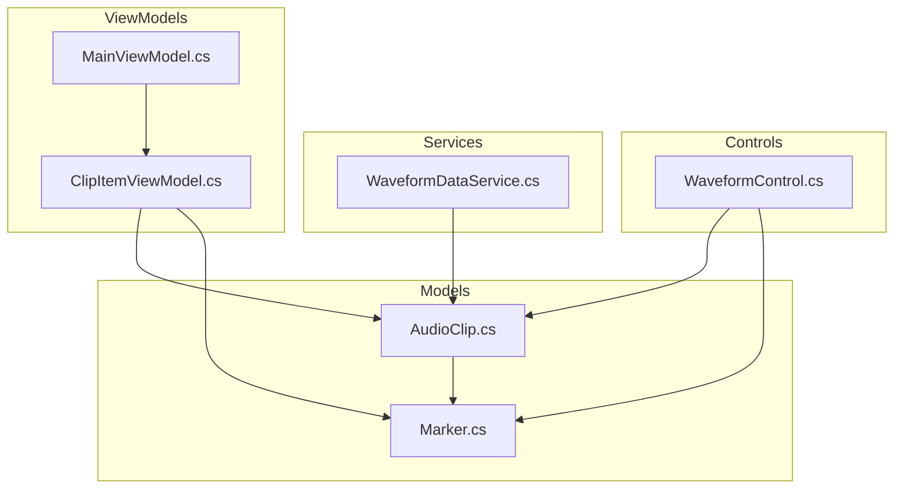

**Diagram sources**
- [Marker.cs](file://Models/Marker.cs)
- [AudioClip.cs](file://Models/AudioClip.cs)
- [WaveformControl.cs](file://Controls/WaveformControl.cs)
- [WaveformDataService.cs](file://Services/WaveformDataService.cs)
- [ClipItemViewModel.cs](file://ViewModels/ClipItemViewModel.cs)
- [MainViewModel.cs](file://ViewModels/MainViewModel.cs)

**Section sources**
- [Marker.cs](file://Models/Marker.cs)
- [AudioClip.cs](file://Models/AudioClip.cs)
- [WaveformControl.cs](file://Controls/WaveformControl.cs)
- [WaveformDataService.cs](file://Services/WaveformDataService.cs)
- [ClipItemViewModel.cs](file://ViewModels/ClipItemViewModel.cs)
- [MainViewModel.cs](file://ViewModels/MainViewModel.cs)

## Core Components
- Marker: Represents a time-based annotation on an audio clip with position, label, color, and type.
- AudioClip: Holds audio content and a collection of associated markers.
- WaveformControl: Visualizes waveform and renders markers at their positions.
- ClipItemViewModel: Manages user interactions for adding, editing, and deleting markers on a clip.
- MainViewModel: Orchestrates higher-level workflows such as navigation and exporting marker data.
- WaveformDataService: Provides waveform samples and may assist in validating marker positions against clip duration.

Key responsibilities:
- Data modeling for markers and their association with clips.
- UI binding and interaction handling for marker CRUD operations.
- Rendering markers aligned to waveform samples.
- Validation and constraints for marker properties.

**Section sources**
- [Marker.cs](file://Models/Marker.cs)
- [AudioClip.cs](file://Models/AudioClip.cs)
- [WaveformControl.cs](file://Controls/WaveformControl.cs)
- [ClipItemViewModel.cs](file://ViewModels/ClipItemViewModel.cs)
- [MainViewModel.cs](file://ViewModels/MainViewModel.cs)
- [WaveformDataService.cs](file://Services/WaveformDataService.cs)

## Architecture Overview
Markers are part of the audio clip domain and are rendered by the waveform control. View models coordinate user actions and expose commands for marker management. Services supply waveform data and can be used to validate marker positions.

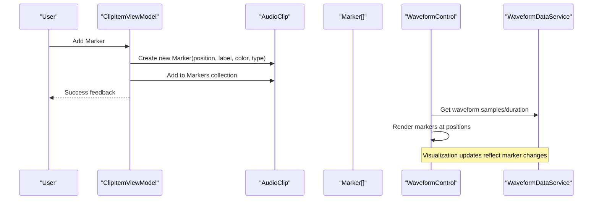

**Diagram sources**
- [ClipItemViewModel.cs](file://ViewModels/ClipItemViewModel.cs)
- [AudioClip.cs](file://Models/AudioClip.cs)
- [Marker.cs](file://Models/Marker.cs)
- [WaveformControl.cs](file://Controls/WaveformControl.cs)
- [WaveformDataService.cs](file://Services/WaveformDataService.cs)

## Detailed Component Analysis

### Marker Data Model
- Properties:
  - Position: Time offset within the clip where the marker applies.
  - Label: Human-readable text describing the marker.
  - Color: Visual indicator color for rendering.
  - Type: Semantic category influencing behavior or styling.
- Behavior:
  - Immutable or mutable depending on implementation; typically supports update methods for editing.
  - Equality and comparison based on position and/or identity.
- Validation:
  - Position must be within clip bounds [0, duration].
  - Label should not be null or empty when required.
  - Color must be valid for rendering.
  - Type must be one of allowed values.

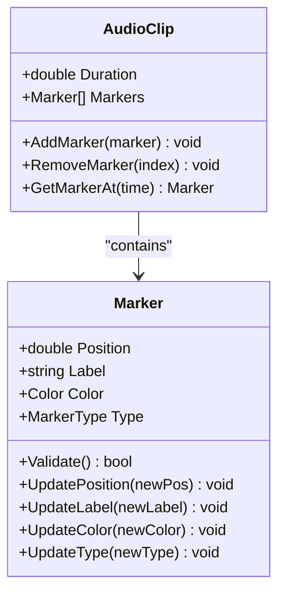

**Diagram sources**
- [Marker.cs](file://Models/Marker.cs)
- [AudioClip.cs](file://Models/AudioClip.cs)

**Section sources**
- [Marker.cs](file://Models/Marker.cs)
- [AudioClip.cs](file://Models/AudioClip.cs)

### Creating Markers
- Entry points:
  - ViewModel command to create a new marker with default or user-provided properties.
  - UI gesture in the waveform control to place a marker at the current playhead position.
- Steps:
  - Validate input parameters (position within clip, non-empty label if required).
  - Instantiate a new Marker instance.
  - Append to the clip’s marker collection.
  - Notify UI to refresh rendering.

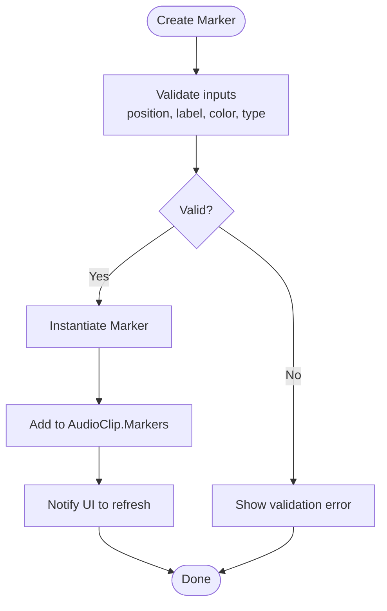

**Diagram sources**
- [ClipItemViewModel.cs](file://ViewModels/ClipItemViewModel.cs)
- [AudioClip.cs](file://Models/AudioClip.cs)
- [Marker.cs](file://Models/Marker.cs)

**Section sources**
- [ClipItemViewModel.cs](file://ViewModels/ClipItemViewModel.cs)
- [AudioClip.cs](file://Models/AudioClip.cs)
- [Marker.cs](file://Models/Marker.cs)

### Editing Markers
- Supported edits:
  - Update position (dragging marker on waveform).
  - Update label (editing text).
  - Update color (choosing a new color).
  - Update type (changing semantic category).
- Validation:
  - Ensure edited position remains within clip bounds.
  - Enforce label constraints if applicable.
  - Validate color and type values.

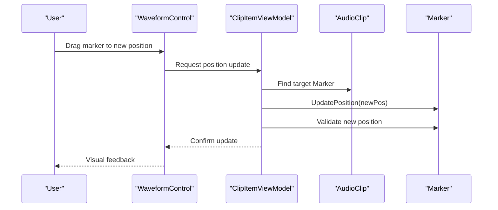

**Diagram sources**
- [WaveformControl.cs](file://Controls/WaveformControl.cs)
- [ClipItemViewModel.cs](file://ViewModels/ClipItemViewModel.cs)
- [AudioClip.cs](file://Models/AudioClip.cs)
- [Marker.cs](file://Models/Marker.cs)

**Section sources**
- [WaveformControl.cs](file://Controls/WaveformControl.cs)
- [ClipItemViewModel.cs](file://ViewModels/ClipItemViewModel.cs)
- [AudioClip.cs](file://Models/AudioClip.cs)
- [Marker.cs](file://Models/Marker.cs)

### Deleting Markers
- Operations:
  - Remove a specific marker by index or reference.
  - Bulk delete all markers from a clip.
- Considerations:
  - Maintain collection integrity.
  - Trigger UI refresh after deletion.

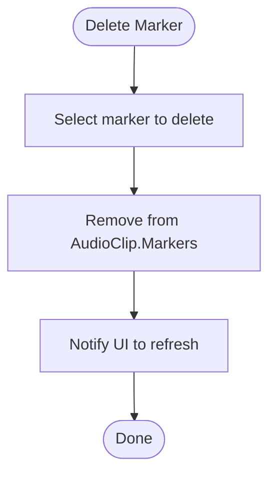

**Diagram sources**
- [ClipItemViewModel.cs](file://ViewModels/ClipItemViewModel.cs)
- [AudioClip.cs](file://Models/AudioClip.cs)

**Section sources**
- [ClipItemViewModel.cs](file://ViewModels/ClipItemViewModel.cs)
- [AudioClip.cs](file://Models/AudioClip.cs)

### Adding Markers to Clips
- Mechanism:
  - Use the clip’s marker collection to add new markers.
  - Optionally sort markers by position for consistent ordering.
- Integration:
  - Ensure waveform control re-renders markers after addition.

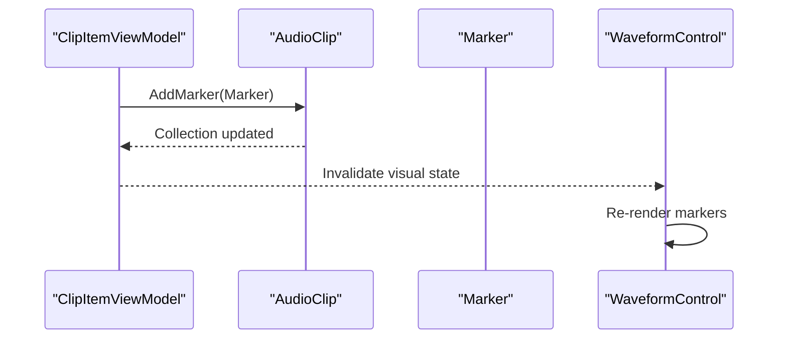

**Diagram sources**
- [ClipItemViewModel.cs](file://ViewModels/ClipItemViewModel.cs)
- [AudioClip.cs](file://Models/AudioClip.cs)
- [WaveformControl.cs](file://Controls/WaveformControl.cs)
- [Marker.cs](file://Models/Marker.cs)

**Section sources**
- [ClipItemViewModel.cs](file://ViewModels/ClipItemViewModel.cs)
- [AudioClip.cs](file://Models/AudioClip.cs)
- [WaveformControl.cs](file://Controls/WaveformControl.cs)
- [Marker.cs](file://Models/Marker.cs)

### Navigating by Markers
- Navigation features:
  - Jump to next/previous marker relative to current position.
  - Seek to a specific marker’s position.
- Implementation:
  - View model exposes commands to navigate using the clip’s marker list.
  - Waveform control highlights the active marker during playback.

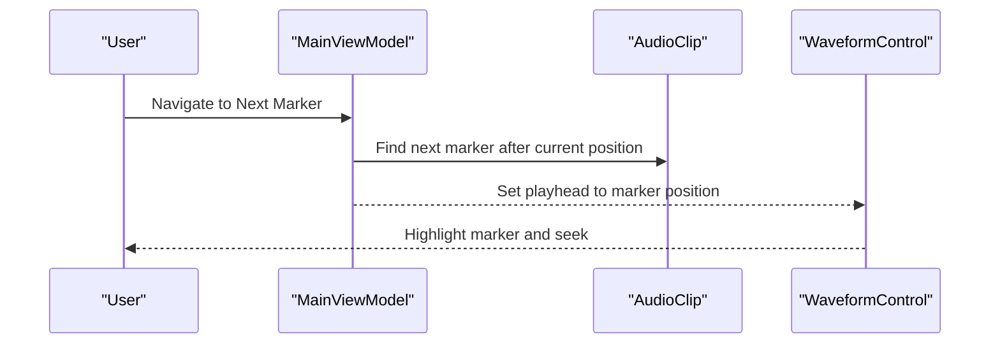

**Diagram sources**
- [MainViewModel.cs](file://ViewModels/MainViewModel.cs)
- [AudioClip.cs](file://Models/AudioClip.cs)
- [WaveformControl.cs](file://Controls/WaveformControl.cs)

**Section sources**
- [MainViewModel.cs](file://ViewModels/MainViewModel.cs)
- [AudioClip.cs](file://Models/AudioClip.cs)
- [WaveformControl.cs](file://Controls/WaveformControl.cs)

### Exporting Marker Data
- Export options:
  - Serialize markers to a structured format (e.g., JSON, CSV).
  - Include position, label, color, and type fields.
- Workflow:
  - Collect markers from the selected clip.
  - Convert to exportable representation.
  - Write to file or transmit via API.

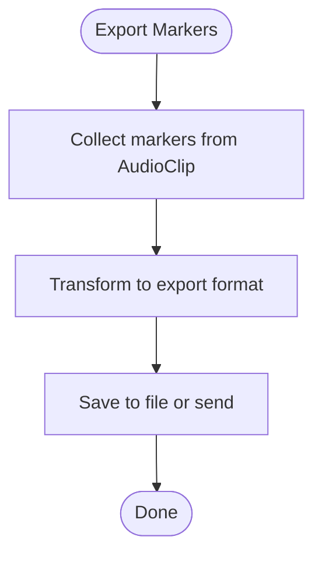

**Diagram sources**
- [MainViewModel.cs](file://ViewModels/MainViewModel.cs)
- [AudioClip.cs](file://Models/AudioClip.cs)
- [Marker.cs](file://Models/Marker.cs)

**Section sources**
- [MainViewModel.cs](file://ViewModels/MainViewModel.cs)
- [AudioClip.cs](file://Models/AudioClip.cs)
- [Marker.cs](file://Models/Marker.cs)

### Validation Rules
- Position:
  - Must be >= 0 and <= clip duration.
  - Reject NaN or infinite values.
- Label:
  - Non-empty string when required; trim whitespace.
- Color:
  - Must be a valid color value supported by the renderer.
- Type:
  - Must belong to an enumerated set of allowed types.
- Consistency:
  - Avoid duplicate positions unless explicitly allowed.
  - Maintain sorted order for efficient navigation.

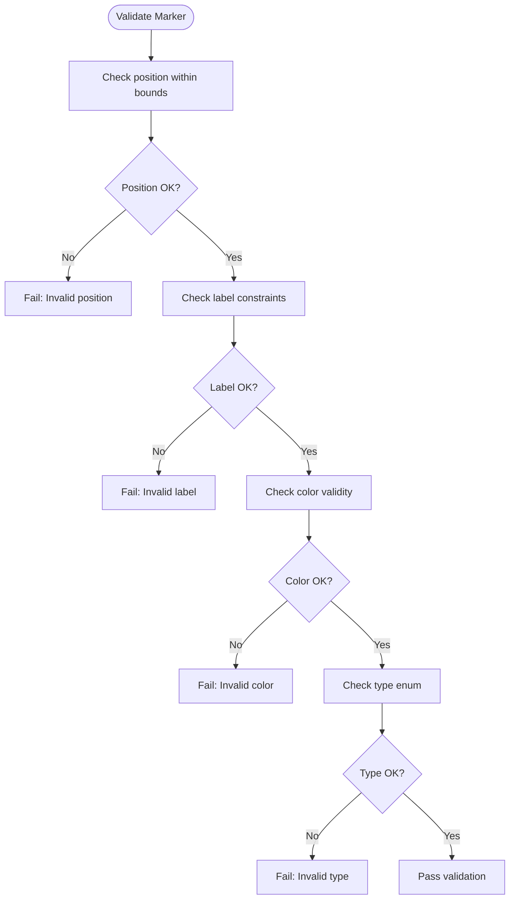

**Diagram sources**
- [Marker.cs](file://Models/Marker.cs)
- [AudioClip.cs](file://Models/AudioClip.cs)

**Section sources**
- [Marker.cs](file://Models/Marker.cs)
- [AudioClip.cs](file://Models/AudioClip.cs)

### Integration with Waveform Visualization
- Rendering:
  - Map marker positions to pixel coordinates based on waveform width and duration.
  - Draw markers at corresponding x-coordinates along the waveform.
- Interaction:
  - Detect clicks/drags near marker positions to edit or move markers.
  - Highlight the active marker during playback.
- Performance:
  - Cache marker-to-pixel mappings to avoid recalculations on every frame.
  - Batch redraws when multiple markers change.

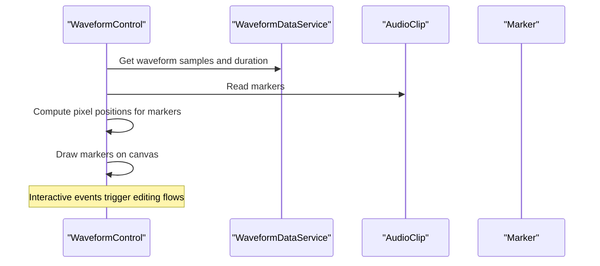

**Diagram sources**
- [WaveformControl.cs](file://Controls/WaveformControl.cs)
- [WaveformDataService.cs](file://Services/WaveformDataService.cs)
- [AudioClip.cs](file://Models/AudioClip.cs)
- [Marker.cs](file://Models/Marker.cs)

**Section sources**
- [WaveformControl.cs](file://Controls/WaveformControl.cs)
- [WaveformDataService.cs](file://Services/WaveformDataService.cs)
- [AudioClip.cs](file://Models/AudioClip.cs)
- [Marker.cs](file://Models/Marker.cs)

## Dependency Analysis
- Marker depends on basic types (position, label, color, type).
- AudioClip aggregates Marker instances and provides CRUD operations.
- WaveformControl depends on AudioClip and Marker for rendering.
- View models depend on AudioClip and Marker to implement user workflows.
- WaveformDataService supplies waveform data used by the control to align markers visually.

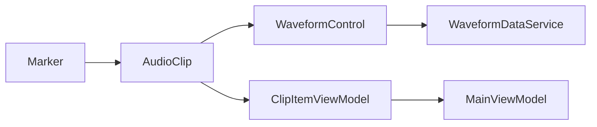

**Diagram sources**
- [Marker.cs](file://Models/Marker.cs)
- [AudioClip.cs](file://Models/AudioClip.cs)
- [WaveformControl.cs](file://Controls/WaveformControl.cs)
- [ClipItemViewModel.cs](file://ViewModels/ClipItemViewModel.cs)
- [MainViewModel.cs](file://ViewModels/MainViewModel.cs)
- [WaveformDataService.cs](file://Services/WaveformDataService.cs)

**Section sources**
- [Marker.cs](file://Models/Marker.cs)
- [AudioClip.cs](file://Models/AudioClip.cs)
- [WaveformControl.cs](file://Controls/WaveformControl.cs)
- [ClipItemViewModel.cs](file://ViewModels/ClipItemViewModel.cs)
- [MainViewModel.cs](file://ViewModels/MainViewModel.cs)
- [WaveformDataService.cs](file://Services/WaveformDataService.cs)

## Performance Considerations
- Minimize recalculations of marker positions by caching pixel mappings.
- Use efficient collections for markers (e.g., sorted lists) to speed up navigation.
- Debounce UI updates during rapid edits to reduce redraw overhead.
- Avoid heavy operations in render loops; offload computations to background tasks when necessary.

[No sources needed since this section provides general guidance]

## Troubleshooting Guide
- Common issues:
  - Markers not visible: Verify position mapping and clipping bounds.
  - Validation errors: Check label constraints, color formats, and type enums.
  - Navigation jumps incorrectly: Ensure correct search logic for next/previous markers.
  - Export contains invalid data: Confirm serialization includes all required fields and handles edge cases.
- Debugging tips:
  - Log marker creation/edit/delete events.
  - Inspect waveform control’s hit-testing logic for interactive markers.
  - Validate clip duration and sample rate alignment with marker positions.

**Section sources**
- [WaveformControl.cs](file://Controls/WaveformControl.cs)
- [ClipItemViewModel.cs](file://ViewModels/ClipItemViewModel.cs)
- [MainViewModel.cs](file://ViewModels/MainViewModel.cs)
- [Marker.cs](file://Models/Marker.cs)
- [AudioClip.cs](file://Models/AudioClip.cs)

## Conclusion
The Marker model provides a robust foundation for annotating audio clips with time-based markers. Its integration with waveform visualization enables intuitive editing and navigation. By adhering to validation rules and performance best practices, developers can deliver a responsive and reliable marker experience.

[No sources needed since this section summarizes without analyzing specific files]