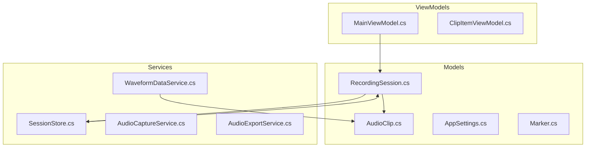
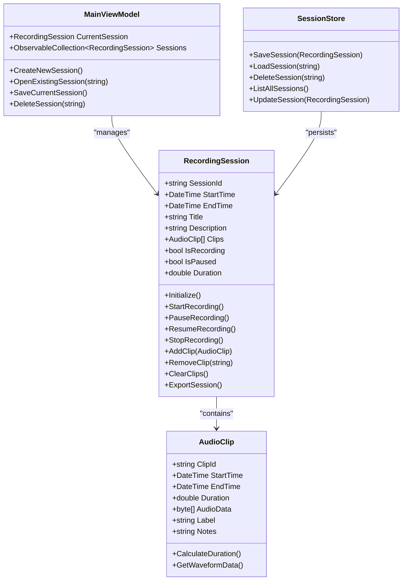
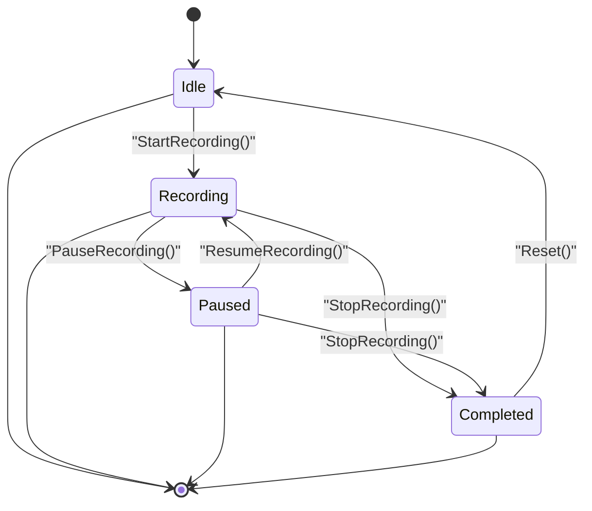
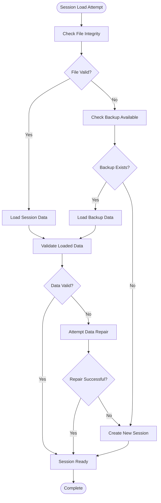
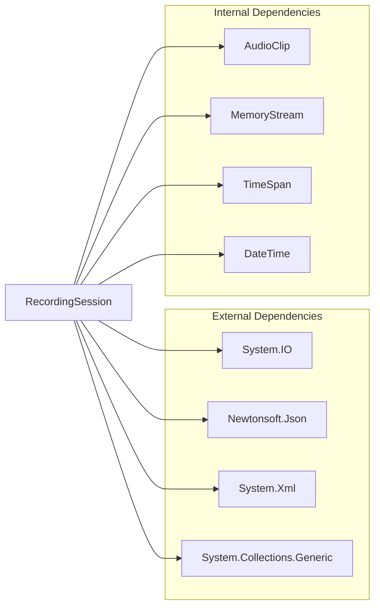

# RecordingSession Model

<cite>
**Referenced Files in This Document**
- [RecordingSession.cs](file://Models/RecordingSession.cs)
- [AudioClip.cs](file://Models/AudioClip.cs)
- [SessionStore.cs](file://Services/SessionStore.cs)
- [MainViewModel.cs](file://ViewModels/MainViewModel.cs)
- [AppSettings.cs](file://Models/AppSettings.cs)
</cite>

## Table of Contents
1. [Introduction](#introduction)
2. [Project Structure](#project-structure)
3. [Core Components](#core-components)
4. [Architecture Overview](#architecture-overview)
5. [Detailed Component Analysis](#detailed-component-analysis)
6. [Dependency Analysis](#dependency-analysis)
7. [Performance Considerations](#performance-considerations)
8. [Troubleshooting Guide](#troubleshooting-guide)
9. [Conclusion](#conclusion)

## Introduction
The RecordingSession model serves as the central data structure for managing audio recording sessions in the SamplerRecorder application. It encapsulates all aspects of a recording session including state management, clip collections, timestamps, and metadata. This document provides comprehensive documentation for understanding and working with the RecordingSession data model.

## Project Structure
The RecordingSession model is part of a well-structured C# application that follows MVVM (Model-View-ViewModel) architecture patterns. The core components are organized into logical directories:

**Diagram sources**
- [RecordingSession.cs](file://Models/RecordingSession.cs)
- [AudioClip.cs](file://Models/AudioClip.cs)
- [SessionStore.cs](file://Services/SessionStore.cs)
- [MainViewModel.cs](file://ViewModels/MainViewModel.cs)

**Section sources**
- [RecordingSession.cs](file://Models/RecordingSession.cs)
- [SessionStore.cs](file://Services/SessionStore.cs)

## Core Components

### RecordingSession Class
The RecordingSession class is the primary data model that manages the complete lifecycle of an audio recording session. It contains properties for tracking recording state, managing clips, handling timestamps, and storing metadata.

#### Key Properties
- **Session State**: Tracks whether the session is active, paused, or completed
- **Clip Collection**: Manages a collection of AudioClip objects representing individual recordings
- **Timestamps**: Records session start time, end time, and duration information
- **Metadata**: Contains descriptive information about the session including title, description, and tags
- **Recording Configuration**: Stores settings like sample rate, bit depth, and channel configuration

#### Session Lifecycle Methods
- **Initialize()**: Sets up a new recording session with default configurations
- **StartRecording()**: Begins capturing audio input
- **PauseRecording()**: Temporarily halts recording while preserving state
- **ResumeRecording()**: Continues recording from pause state
- **StopRecording()**: Ends the recording session and finalizes data
- **AddClip()**: Adds a new AudioClip to the session's collection
- **RemoveClip()**: Removes a specific clip from the session
- **ClearClips()**: Removes all clips from the session
- **ExportSession()**: Saves session data to persistent storage

**Section sources**
- [RecordingSession.cs](file://Models/RecordingSession.cs)

### AudioClip Model
The AudioClip model represents individual audio segments within a recording session. Each clip contains metadata about the audio content and its temporal position within the session.

#### Properties
- **Clip ID**: Unique identifier for the clip
- **Start Time**: Timestamp when the clip begins
- **End Time**: Timestamp when the clip ends
- **Duration**: Calculated duration of the clip
- **Audio Data**: Reference to the actual audio content
- **Waveform Data**: Visual representation data for waveform display
- **Metadata**: Additional information like labels, notes, and markers

**Section sources**
- [AudioClip.cs](file://Models/AudioClip.cs)

## Architecture Overview
The RecordingSession model follows a layered architecture pattern with clear separation of concerns between data models, business logic, and persistence operations.

**Diagram sources**
- [RecordingSession.cs](file://Models/RecordingSession.cs)
- [AudioClip.cs](file://Models/AudioClip.cs)
- [SessionStore.cs](file://Services/SessionStore.cs)
- [MainViewModel.cs](file://ViewModels/MainViewModel.cs)

## Detailed Component Analysis

### RecordingSession State Management
The RecordingSession implements a robust state machine pattern to manage different recording states and ensure data integrity throughout the session lifecycle.

#### State Transition Flow

**Diagram sources**
- [RecordingSession.cs](file://Models/RecordingSession.cs)

#### Session Properties and Validation
The RecordingSession class includes comprehensive property validation and automatic calculations:

- **Automatic Duration Calculation**: Duration is automatically calculated based on start and end times
- **State Validation**: Prevents invalid state transitions (e.g., pausing when not recording)
- **Clip Count Validation**: Ensures clip collections remain consistent with session state
- **Metadata Validation**: Validates required fields and formats for session information

**Section sources**
- [RecordingSession.cs](file://Models/RecordingSession.cs)

### Clip Management Operations
The RecordingSession provides comprehensive methods for managing audio clips within a session.

#### Clip Operations
- **Add Clip**: Creates and adds new AudioClip instances with proper timestamp assignment
- **Remove Clip**: Safely removes clips while maintaining collection integrity
- **Update Clip**: Modifies existing clip properties and metadata
- **Search Clips**: Finds clips by various criteria (time range, label, etc.)
- **Sort Clips**: Orders clips by different attributes (time, name, etc.)

#### Clip Collection Synchronization
The clip collection maintains synchronization with the underlying audio data and ensures thread safety during concurrent operations.

**Section sources**
- [RecordingSession.cs](file://Models/RecordingSession.cs)
- [AudioClip.cs](file://Models/AudioClip.cs)

### Persistence and Recovery
The SessionStore service handles all persistence operations for RecordingSession objects, providing reliable save, load, and recovery capabilities.

#### Persistence Operations
- **Save Session**: Serializes session data to disk with versioning support
- **Load Session**: Deserializes session data with backward compatibility
- **Auto-save**: Periodically saves session state to prevent data loss
- **Backup Creation**: Creates backup copies before major operations
- **Recovery**: Restores sessions from corrupted or incomplete data

#### Recovery Scenarios

**Diagram sources**
- [SessionStore.cs](file://Services/SessionStore.cs)

**Section sources**
- [SessionStore.cs](file://Services/SessionStore.cs)

## Dependency Analysis
The RecordingSession model has well-defined dependencies that maintain loose coupling and high cohesion.

**Diagram sources**
- [RecordingSession.cs](file://Models/RecordingSession.cs)
- [AudioClip.cs](file://Models/AudioClip.cs)

### Dependency Relationships
- **Low Coupling**: RecordingSession depends only on essential services and data types
- **High Cohesion**: All related functionality is encapsulated within the model
- **Interface Segregation**: Uses specific interfaces for different operations
- **Dependency Injection**: Supports injection of persistence and service dependencies

**Section sources**
- [RecordingSession.cs](file://Models/RecordingSession.cs)

## Performance Considerations
The RecordingSession model is designed with performance optimization in mind, particularly for handling large audio files and long recording sessions.

### Memory Management
- **Lazy Loading**: Audio data is loaded on-demand rather than upfront
- **Streaming Support**: Large audio files are processed in chunks to minimize memory usage
- **Garbage Collection**: Implements IDisposable pattern for proper resource cleanup
- **Object Pooling**: Reuses frequently created objects to reduce GC pressure

### Concurrency Handling
- **Thread Safety**: All public methods are thread-safe for concurrent access
- **Lock Granularity**: Fine-grained locking minimizes contention
- **Async Operations**: Long-running operations use async/await patterns
- **Event-driven Updates**: UI updates are coordinated through events

### Optimization Strategies
- **Caching**: Frequently accessed data is cached with appropriate expiration policies
- **Batch Operations**: Multiple operations are batched to reduce overhead
- **Indexing**: Clip collections are indexed for fast lookups
- **Compression**: Session data is compressed for storage efficiency

## Troubleshooting Guide

### Common Issues and Solutions

#### Session Corruption
**Symptoms**: Session fails to load, missing clips, or invalid state
**Solutions**:
- Use backup recovery mechanisms
- Run data validation and repair utilities
- Check file permissions and disk space
- Verify application version compatibility

#### Memory Leaks
**Symptoms**: Application memory usage grows over time
**Solutions**:
- Ensure proper disposal of RecordingSession instances
- Clear references to large audio data when no longer needed
- Monitor garbage collection behavior
- Implement proper event handler unsubscription

#### Performance Issues
**Symptoms**: Slow UI response, high CPU usage, or delayed operations
**Solutions**:
- Optimize clip loading strategies
- Implement virtual scrolling for large clip collections
- Use background threads for intensive operations
- Profile memory and CPU usage patterns

#### State Inconsistency
**Symptoms**: Session shows incorrect state or clips are out of sync
**Solutions**:
- Validate session state after operations
- Implement state reconciliation mechanisms
- Use database transactions for atomic updates
- Add comprehensive logging for debugging

**Section sources**
- [SessionStore.cs](file://Services/SessionStore.cs)
- [RecordingSession.cs](file://Models/RecordingSession.cs)

## Conclusion
The RecordingSession model provides a comprehensive and robust foundation for managing audio recording sessions in the SamplerRecorder application. Its design emphasizes data integrity, performance, and ease of use while maintaining flexibility for future enhancements. The model's clear separation of concerns, comprehensive error handling, and extensive API make it suitable for both simple and complex recording scenarios.

Key strengths of the RecordingSession model include:
- **Comprehensive State Management**: Robust state machine with clear transitions
- **Flexible Clip Management**: Rich set of operations for managing audio clips
- **Reliable Persistence**: Comprehensive save/load/recovery capabilities
- **Performance Optimization**: Designed for handling large audio files efficiently
- **Thread Safety**: Safe concurrent access patterns
- **Extensibility**: Easy to extend with new features and capabilities

The model serves as a solid foundation for building sophisticated audio recording applications while maintaining code quality and maintainability standards.