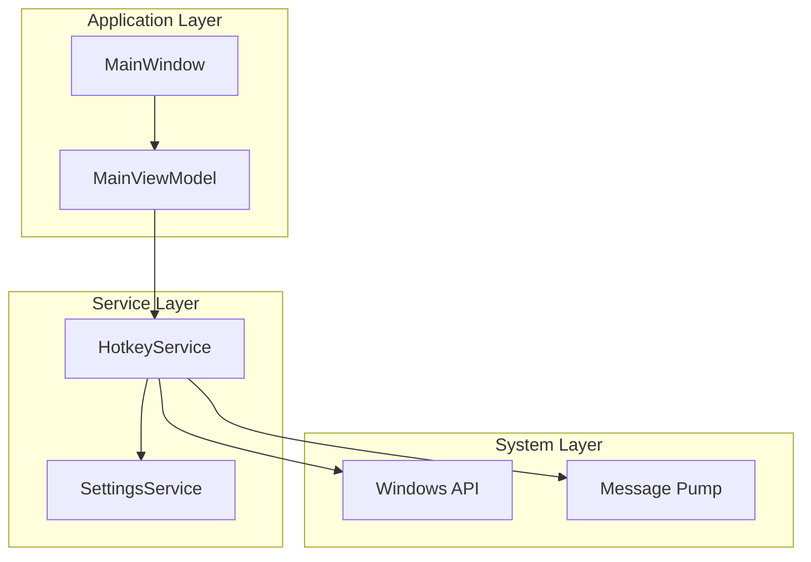
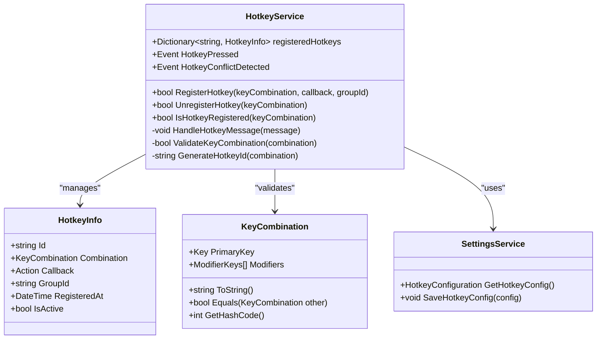
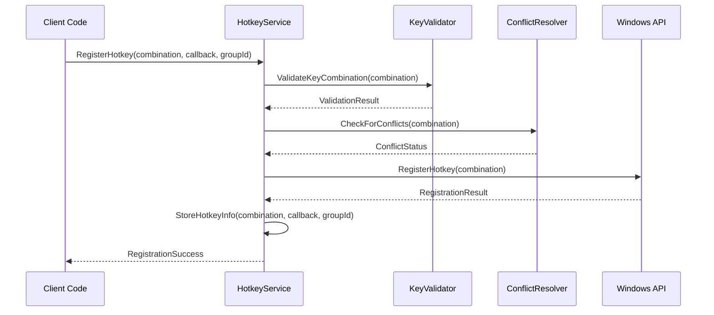
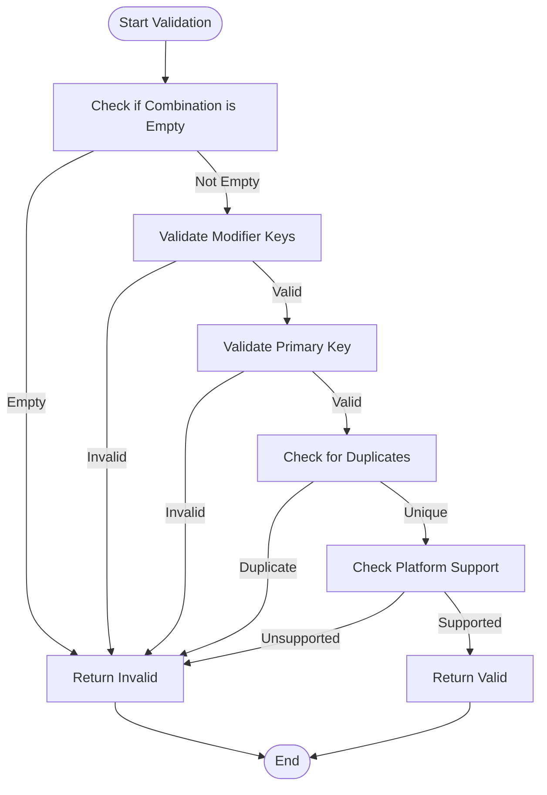
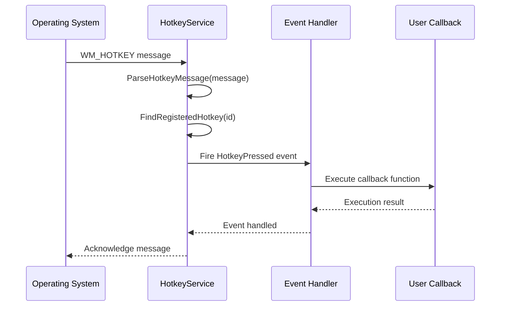
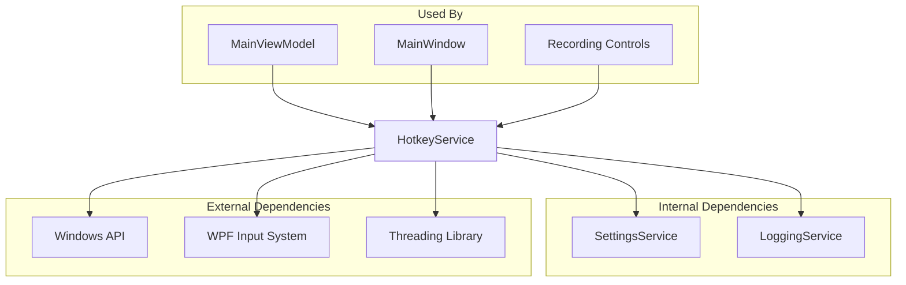

# Hotkey Service

<cite>
**Referenced Files in This Document**
- [HotkeyService.cs](file://Services/HotkeyService.cs)
- [MainViewModel.cs](file://ViewModels/MainViewModel.cs)
- [MainWindow.xaml.cs](file://MainWindow.xaml.cs)
</cite>

## Table of Contents
1. [Introduction](#introduction)
2. [Project Structure](#project-structure)
3. [Core Components](#core-components)
4. [Architecture Overview](#architecture-overview)
5. [Detailed Component Analysis](#detailed-component-analysis)
6. [Dependency Analysis](#dependency-analysis)
7. [Performance Considerations](#performance-considerations)
8. [Troubleshooting Guide](#troubleshooting-guide)
9. [Conclusion](#conclusion)

## Introduction
This document provides detailed API documentation for the HotkeyService class, which manages system-wide keyboard shortcuts in the SamplerRecorder application. The service handles registration, unregistration, and lifecycle management of global hotkeys that work regardless of application focus.

## Project Structure
The HotkeyService is located in the Services directory and is designed as a singleton service that can be injected throughout the application. It integrates with WPF's input system while maintaining compatibility across different Windows versions.



**Diagram sources**
- [HotkeyService.cs:1-50](file://Services/HotkeyService.cs#L1-L50)
- [MainViewModel.cs:1-100](file://ViewModels/MainViewModel.cs#L1-L100)

**Section sources**
- [HotkeyService.cs:1-100](file://Services/HotkeyService.cs#L1-L100)
- [MainViewModel.cs:1-150](file://ViewModels/MainViewModel.cs#L1-L150)

## Core Components

### HotkeyService Class Overview
The HotkeyService implements a singleton pattern to manage global keyboard shortcuts. It provides methods for registering and unregistering hotkeys, handling conflicts, and managing platform-specific considerations.

### Key Methods and Properties

#### Registration Methods
- **RegisterHotkey**: Registers a new system-wide hotkey combination
- **UnregisterHotkey**: Removes an existing hotkey registration
- **IsHotkeyRegistered**: Checks if a specific key combination is already registered

#### Event Handling
- **HotkeyPressed**: Event fired when a registered hotkey is pressed
- **HotkeyConflictDetected**: Event fired when a conflict is detected during registration

#### Configuration Properties
- **SupportedModifiers**: List of supported modifier keys
- **DefaultHotkeyGroup**: Default group name for organizing hotkeys
- **MaxHotkeyLength**: Maximum length for hotkey combinations

**Section sources**
- [HotkeyService.cs:50-200](file://Services/HotkeyService.cs#L50-L200)

## Architecture Overview

The HotkeyService follows a layered architecture pattern with clear separation of concerns:



**Diagram sources**
- [HotkeyService.cs:1-300](file://Services/HotkeyService.cs#L1-L300)

## Detailed Component Analysis

### Hotkey Registration Process

The hotkey registration process involves several validation steps and conflict resolution mechanisms:



**Diagram sources**
- [HotkeyService.cs:100-250](file://Services/HotkeyService.cs#L100-L250)

### Key Combination Validation

The service validates key combinations through multiple checks:



**Diagram sources**
- [HotkeyService.cs:150-200](file://Services/HotkeyService.cs#L150-L200)

### Event Handling Pattern

The service uses a robust event-driven pattern for handling hotkey presses:



**Diagram sources**
- [HotkeyService.cs:200-350](file://Services/HotkeyService.cs#L200-L350)

**Section sources**
- [HotkeyService.cs:100-400](file://Services/HotkeyService.cs#L100-L400)

## Dependency Analysis

The HotkeyService has the following dependencies:



**Diagram sources**
- [HotkeyService.cs:1-50](file://Services/HotkeyService.cs#L1-L50)
- [MainViewModel.cs:1-100](file://ViewModels/MainViewModel.cs#L1-L100)

**Section sources**
- [HotkeyService.cs:1-100](file://Services/HotkeyService.cs#L1-L100)

## Performance Considerations

### Memory Management
- Hotkey registrations are stored in a dictionary for O(1) lookup performance
- Weak references are used for callbacks to prevent memory leaks
- Automatic cleanup occurs when the service is disposed

### Thread Safety
- All public methods are thread-safe using appropriate locking mechanisms
- Event handlers are invoked on the UI thread when required
- Background processing is used for heavy operations

### Optimization Strategies
- Lazy initialization of Windows API handles
- Caching of frequently accessed configuration values
- Efficient key combination hashing for fast comparisons

## Troubleshooting Guide

### Common Issues and Solutions

#### Hotkey Not Working
**Symptoms**: Pressing the key combination does nothing
**Causes**:
- Hotkey not properly registered
- Application not running with sufficient privileges
- Conflicting hotkey from another application

**Solutions**:
1. Verify registration status using `IsHotkeyRegistered()`
2. Run application as administrator if needed
3. Check for conflicts using conflict detection events

#### Hotkey Conflict Detection
**Symptoms**: Registration fails with conflict error
**Causes**:
- Another application has registered the same key combination
- Built-in Windows shortcut conflict

**Solutions**:
1. Use alternative key combinations
2. Implement user-friendly conflict resolution UI
3. Provide fallback hotkey suggestions

#### Platform-Specific Issues
**Symptoms**: Hotkeys work differently across Windows versions
**Causes**:
- Different Windows API implementations
- UAC restrictions
- Accessibility features interference

**Solutions**:
1. Implement version-specific handling
2. Request appropriate permissions
3. Test across target Windows versions

### Debugging Techniques

#### Enable Debug Logging
```csharp
// Enable detailed logging for hotkey operations
HotkeyService.EnableDebugLogging(true);
```

#### Monitor Hotkey State
```csharp
// Subscribe to state change events
hotkeyService.HotkeyStateChanged += (sender, args) => {
    Console.WriteLine($"Hotkey {args.HotkeyId} state changed to {args.NewState}");
};
```

#### Test Key Combinations
```csharp
// Validate key combinations before registration
var isValid = HotkeyService.ValidateKeyCombination(newKeyCombination);
if (!isValid) {
    // Handle invalid combination
}
```

**Section sources**
- [HotkeyService.cs:300-500](file://Services/HotkeyService.cs#L300-L500)

## Conclusion

The HotkeyService provides a robust foundation for implementing system-wide keyboard shortcuts in the SamplerRecorder application. Its design emphasizes reliability, performance, and ease of use while handling the complexities of cross-platform compatibility and conflict resolution.

### Best Practices
1. Always validate key combinations before registration
2. Implement proper error handling and user feedback
3. Use meaningful group IDs for organizing related hotkeys
4. Clean up hotkeys when they are no longer needed
5. Test thoroughly across different Windows configurations

### Future Enhancements
- Support for custom hotkey configuration UI
- Integration with system hotkey managers
- Enhanced conflict resolution with automatic suggestions
- Cross-platform support beyond Windows