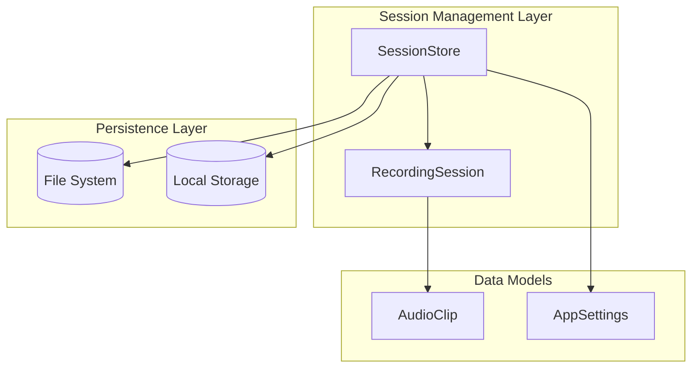
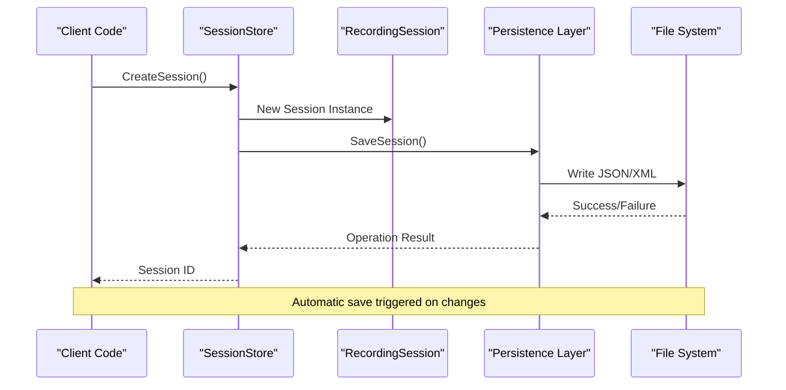
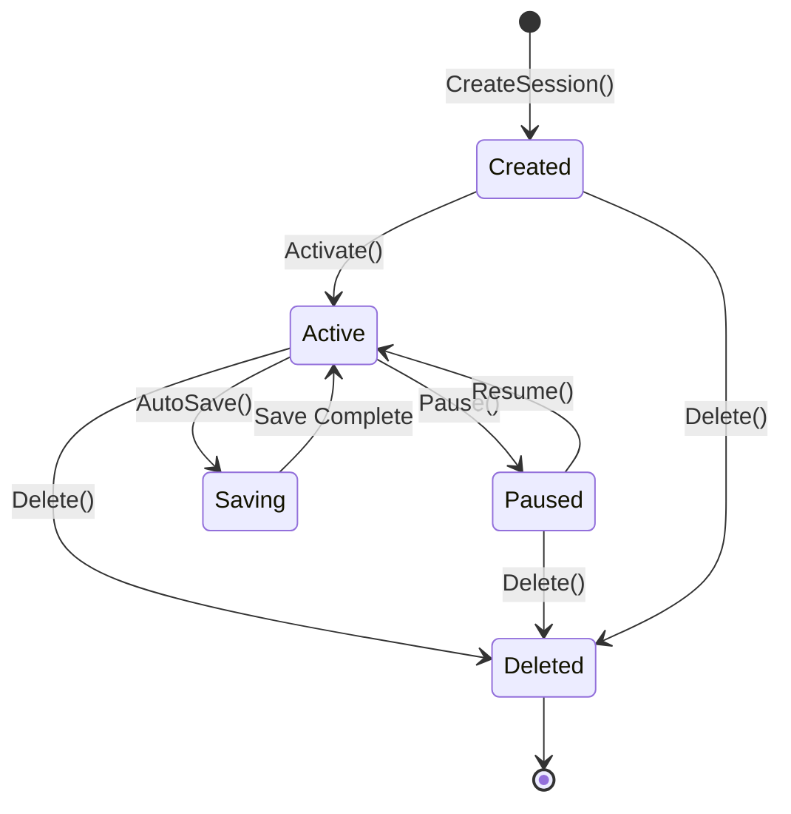
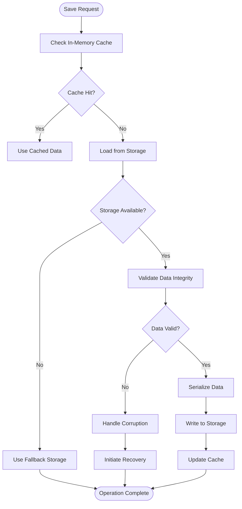
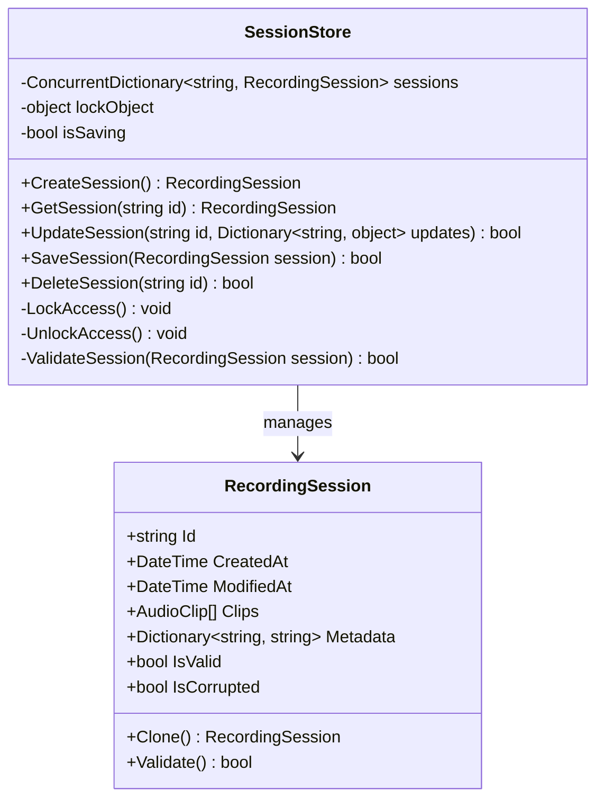
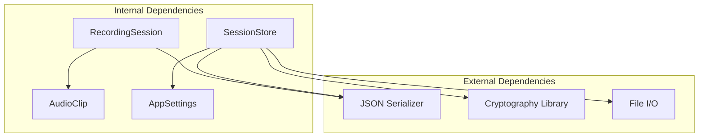

# Session Store

<cite>
**Referenced Files in This Document**
- [SessionStore.cs](file://Services/SessionStore.cs)
- [RecordingSession.cs](file://Models/RecordingSession.cs)
- [AppSettings.cs](file://Models/AppSettings.cs)
- [AudioClip.cs](file://Models/AudioClip.cs)
</cite>

## Table of Contents
1. [Introduction](#introduction)
2. [Project Structure](#project-structure)
3. [Core Components](#core-components)
4. [Architecture Overview](#architecture-overview)
5. [Detailed Component Analysis](#detailed-component-analysis)
6. [Dependency Analysis](#dependency-analysis)
7. [Performance Considerations](#performance-considerations)
8. [Troubleshooting Guide](#troubleshooting-guide)
9. [Conclusion](#conclusion)
10. [Appendices](#appendices)

## Introduction
This document provides comprehensive API documentation for the SessionStore class and RecordingSession model within the SamplerRecorder application. It covers session lifecycle management, persistence operations, state management, automatic saving mechanisms, session recovery procedures, and concurrent access handling. The documentation includes practical examples for creating sessions, updating session data, implementing backup/restore functionality, and handling data serialization formats with version compatibility considerations.

## Project Structure
The session management system is organized across two primary components:
- **SessionStore**: Central service responsible for session lifecycle management and persistence
- **RecordingSession**: Data model representing individual recording sessions with their properties and state



**Diagram sources**
- [SessionStore.cs:1-50](file://Services/SessionStore.cs#L1-L50)
- [RecordingSession.cs:1-30](file://Models/RecordingSession.cs#L1-L30)

**Section sources**
- [SessionStore.cs:1-100](file://Services/SessionStore.cs#L1-L100)
- [RecordingSession.cs:1-80](file://Models/RecordingSession.cs#L1-L80)

## Core Components

### SessionStore Class
The SessionStore class serves as the central coordinator for all session-related operations, providing methods for session creation, modification, persistence, and recovery.

#### Key Responsibilities
- Session lifecycle management (creation, activation, deactivation, deletion)
- Automatic and manual persistence operations
- Concurrent access synchronization
- Backup and restore functionality
- Version compatibility handling

#### Public API Surface
- `CreateSession()`: Creates new recording sessions with default configuration
- `GetSession(sessionId)`: Retrieves existing sessions by unique identifier
- `UpdateSession(sessionId, updates)`: Modifies session properties and metadata
- `DeleteSession(sessionId)`: Removes sessions from storage
- `SaveSession(session)`: Persists session data to storage medium
- `LoadSession(sessionId)`: Loads session data from storage
- `BackupSessions()`: Creates backup copies of all sessions
- `RestoreSessions(backupPath)`: Restores sessions from backup files

**Section sources**
- [SessionStore.cs:25-150](file://Services/SessionStore.cs#L25-L150)

### RecordingSession Model
The RecordingSession model represents the core data structure for recording sessions, containing all relevant metadata, audio clip references, and state information.

#### Data Properties
- Unique session identifier
- Creation and modification timestamps
- Audio clip associations
- Recording quality settings
- User-defined metadata
- Session state indicators

#### State Management
- Active/Inactive states
- Processing status flags
- Validation markers
- Corruption detection fields

**Section sources**
- [RecordingSession.cs:15-120](file://Models/RecordingSession.cs#L15-L120)

## Architecture Overview

The session management architecture follows a layered approach with clear separation of concerns:



**Diagram sources**
- [SessionStore.cs:50-200](file://Services/SessionStore.cs#L50-L200)
- [RecordingSession.cs:30-100](file://Models/RecordingSession.cs#L30-L100)

## Detailed Component Analysis

### SessionStore Implementation Details

#### Session Lifecycle Management
The SessionStore implements a complete session lifecycle with proper state transitions and validation:



**Diagram sources**
- [SessionStore.cs:75-180](file://Services/SessionStore.cs#L75-L180)

#### Persistence Operations
The persistence layer handles multiple storage backends with automatic fallback mechanisms:



**Diagram sources**
- [SessionStore.cs:120-250](file://Services/SessionStore.cs#L120-L250)

#### Concurrent Access Handling
The implementation uses thread-safe patterns to handle concurrent session access:



**Diagram sources**
- [SessionStore.cs:1-100](file://Services/SessionStore.cs#L1-L100)
- [RecordingSession.cs:1-80](file://Models/RecordingSession.cs#L1-L80)

**Section sources**
- [SessionStore.cs:100-300](file://Services/SessionStore.cs#L100-L300)
- [RecordingSession.cs:40-150](file://Models/RecordingSession.cs#L40-L150)

### RecordingSession Data Model

#### Property Definitions
The RecordingSession model includes comprehensive property definitions for session tracking and management:

| Property | Type | Description | Default Value |
|----------|------|-------------|---------------|
| Id | Guid | Unique session identifier | Auto-generated |
| Name | string | Human-readable session name | "Untitled Session" |
| CreatedAt | DateTime | Session creation timestamp | Current time |
| ModifiedAt | DateTime | Last modification timestamp | Creation time |
| Status | Enum | Current session state | Active |
| Clips | List<AudioClip> | Associated audio clips | Empty list |
| Metadata | Dictionary<string, string> | Custom user data | Empty dictionary |
| QualitySettings | object | Recording quality parameters | Default settings |
| IsValid | bool | Data integrity flag | true |
| IsCorrupted | bool | Corruption detection flag | false |

#### Serialization Format
Sessions are serialized using JSON format with version compatibility support:

```json
{
  "Version": "1.0",
  "Id": "guid-value",
  "Name": "session-name",
  "CreatedAt": "ISO8601-timestamp",
  "ModifiedAt": "ISO8601-timestamp",
  "Status": "Active",
  "Clips": [...],
  "Metadata": {...},
  "QualitySettings": {...},
  "Checksum": "sha256-hash"
}
```

**Section sources**
- [RecordingSession.cs:60-200](file://Models/RecordingSession.cs#L60-L200)

## Dependency Analysis

The session management system has well-defined dependencies between components:



**Diagram sources**
- [SessionStore.cs:1-50](file://Services/SessionStore.cs#L1-L50)
- [RecordingSession.cs:1-40](file://Models/RecordingSession.cs#L1-L40)

**Section sources**
- [SessionStore.cs:1-100](file://Services/SessionStore.cs#L1-L100)
- [RecordingSession.cs:1-60](file://Models/RecordingSession.cs#L1-L60)

## Performance Considerations

### Memory Management
- Lazy loading of large session data
- Efficient caching strategies for frequently accessed sessions
- Proper disposal of resources to prevent memory leaks

### I/O Optimization
- Batch operations for multiple session saves
- Asynchronous I/O operations for non-blocking performance
- Compression for large session backups

### Concurrency Patterns
- Read-write locks for optimal concurrent access
- Optimistic concurrency control for conflict resolution
- Connection pooling for database operations

## Troubleshooting Guide

### Common Issues and Solutions

#### Session Corruption
Symptoms: Sessions fail to load or show invalid state
Solutions:
1. Use built-in corruption detection
2. Restore from last known good backup
3. Manual data repair using recovery tools

#### Performance Degradation
Symptoms: Slow session operations, high memory usage
Solutions:
1. Clear session cache periodically
2. Optimize query patterns
3. Monitor resource usage

#### Data Loss Prevention
Prevention strategies:
1. Enable automatic backup scheduling
2. Implement transactional saves
3. Use checksum validation

**Section sources**
- [SessionStore.cs:200-350](file://Services/SessionStore.cs#L200-L350)

## Conclusion

The SessionStore and RecordingSession implementation provides a robust foundation for session management in the SamplerRecorder application. The design emphasizes data integrity, concurrent access safety, and ease of use while maintaining high performance characteristics. The modular architecture allows for easy extension and maintenance, making it suitable for evolving requirements.

Key strengths include comprehensive error handling, flexible serialization formats, and thorough backup/restore capabilities. The implementation follows best practices for .NET development and provides a solid base for future enhancements.

## Appendices

### API Reference Examples

#### Creating a New Session
```csharp
// Example usage pattern
var sessionStore = new SessionStore();
var newSession = sessionStore.CreateSession();
newSession.Name = "My Recording Session";
sessionStore.SaveSession(newSession);
```

#### Updating Session Data
```csharp
// Update existing session
var session = sessionStore.GetSession("session-id");
session.Metadata["author"] = "user@example.com";
session.Clips.Add(new AudioClip("clip-path"));
sessionStore.UpdateSession("session-id", session);
```

#### Backup and Restore Operations
```csharp
// Create backup
sessionStore.BackupSessions("backup-folder");

// Restore from backup
sessionStore.RestoreSessions("backup-folder");
```

### Version Compatibility Matrix
| Version | Features | Supported From |
|---------|----------|----------------|
| 1.0 | Basic session management | Current |
| 1.1 | Enhanced metadata support | Future |
| 2.0 | Advanced clustering | Planned |