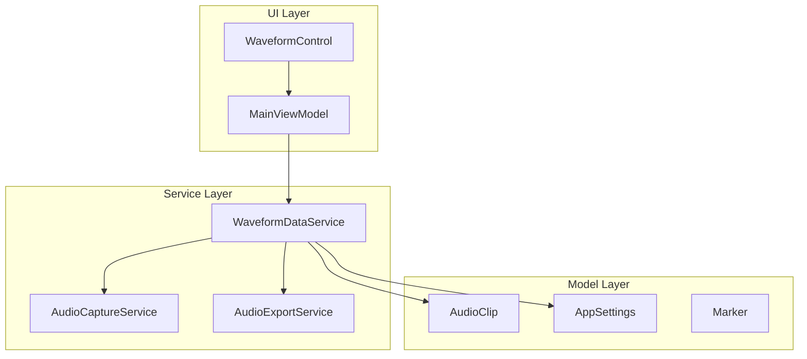
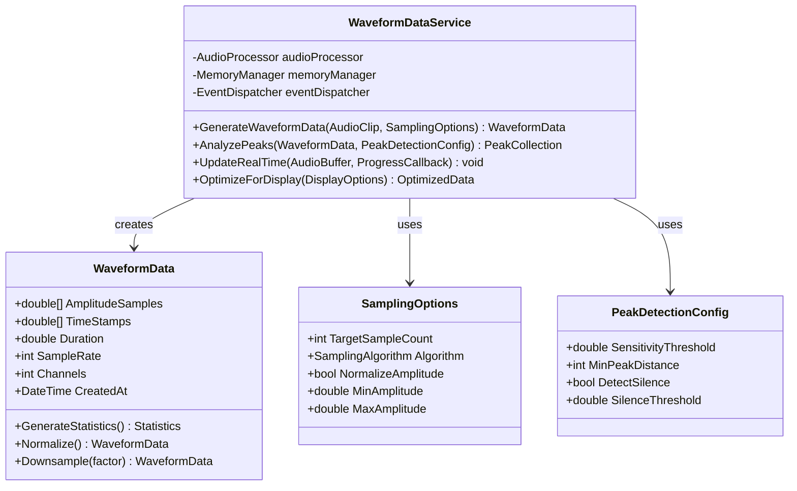
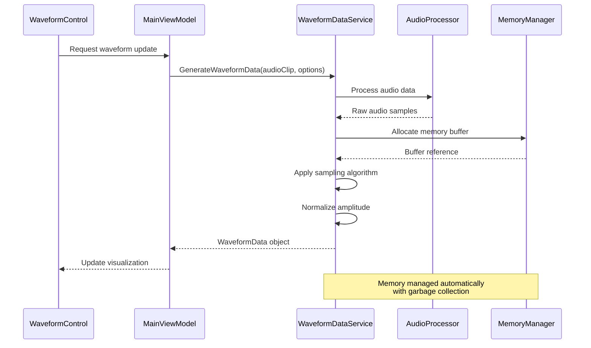
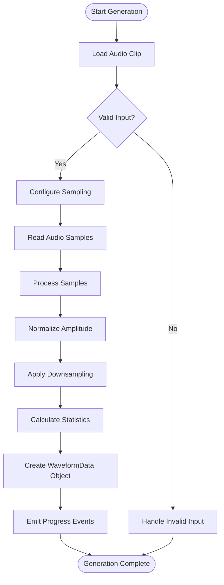
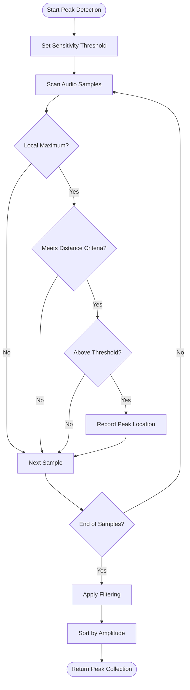
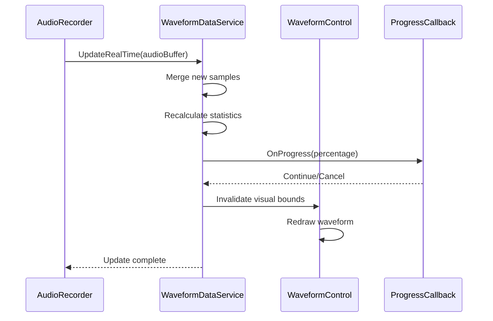
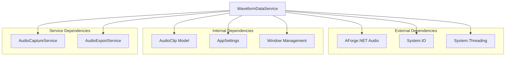

# Waveform Data Service

<cite>
**Referenced Files in This Document**
- [WaveformDataService.cs](file://Services/WaveformDataService.cs)
- [WaveformControl.cs](file://Controls/WaveformControl.cs)
- [AudioClip.cs](file://Models/AudioClip.cs)
- [MainViewModel.cs](file://ViewModels/MainViewModel.cs)
- [AppSettings.cs](file://Models/AppSettings.cs)
</cite>

## Table of Contents
1. [Introduction](#introduction)
2. [Project Structure](#project-structure)
3. [Core Components](#core-components)
4. [Architecture Overview](#architecture-overview)
5. [Detailed Component Analysis](#detailed-component-analysis)
6. [Dependency Analysis](#dependency-analysis)
7. [Performance Considerations](#performance-considerations)
8. [Troubleshooting Guide](#troubleshooting-guide)
9. [Conclusion](#conclusion)

## Introduction

The WaveformDataService is a core component of the SamplerRecorder application that handles waveform data generation, analysis, and visualization support for audio clips. This service provides comprehensive functionality for processing audio data, detecting peaks, generating waveform representations, and managing real-time updates for UI components.

The service is designed with performance in mind, supporting large audio files through efficient memory management and progressive loading techniques. It integrates seamlessly with the WPF-based UI through event-driven architecture and provides extensive customization options for waveform visualization parameters.

## Project Structure

The WaveformDataService operates within a well-structured MVVM architecture:

**Diagram sources**
- [WaveformControl.cs](file://Controls/WaveformControl.cs)
- [MainViewModel.cs](file://ViewModels/MainViewModel.cs)
- [WaveformDataService.cs](file://Services/WaveformDataService.cs)
- [AudioClip.cs](file://Models/AudioClip.cs)

**Section sources**
- [WaveformDataService.cs](file://Services/WaveformDataService.cs)
- [WaveformControl.cs](file://Controls/WaveformControl.cs)
- [AudioClip.cs](file://Models/AudioClip.cs)

## Core Components

### WaveformDataService Class Architecture

The WaveformDataService implements a comprehensive set of methods for waveform data processing:

#### Primary Methods

| Method | Purpose | Parameters | Return Type | Description |
|--------|---------|------------|-------------|-------------|
| GenerateWaveformData | Main entry point for waveform generation | AudioClip, SamplingOptions | WaveformData | Generates complete waveform data from audio clip |
| AnalyzePeaks | Peak detection algorithm | WaveformData, ThresholdConfig | PeakCollection | Identifies significant peaks in waveform data |
| UpdateRealTime | Real-time waveform updates | AudioBuffer, ProgressCallback | void | Updates waveform display during recording/playback |
| OptimizeForDisplay | Performance optimization | DisplayOptions | OptimizedData | Creates optimized data for UI rendering |
| ExportVisualization | Visualization export | ExportFormat, QualitySettings | byte[] | Exports waveform as image or data format |

#### Data Structures

**Diagram sources**
- [WaveformDataService.cs](file://Services/WaveformDataService.cs)
- [AudioClip.cs](file://Models/AudioClip.cs)

**Section sources**
- [WaveformDataService.cs](file://Services/WaveformDataService.cs)
- [AudioClip.cs](file://Models/AudioClip.cs)

## Architecture Overview

The WaveformDataService follows a layered architecture pattern with clear separation of concerns:

**Diagram sources**
- [WaveformDataService.cs](file://Services/WaveformDataService.cs)
- [WaveformControl.cs](file://Controls/WaveformControl.cs)
- [MainViewModel.cs](file://ViewModels/MainViewModel.cs)

## Detailed Component Analysis

### Waveform Generation Pipeline

The waveform generation process involves multiple stages of data processing:

**Diagram sources**
- [WaveformDataService.cs](file://Services/WaveformDataService.cs)

### Peak Detection Algorithm

The peak detection system uses adaptive thresholding and distance-based filtering:

**Diagram sources**
- [WaveformDataService.cs](file://Services/WaveformDataService.cs)

### Real-Time Update System

Real-time waveform updates are handled through a callback-based system:

**Diagram sources**
- [WaveformDataService.cs](file://Services/WaveformDataService.cs)
- [WaveformControl.cs](file://Controls/WaveformControl.cs)

**Section sources**
- [WaveformDataService.cs](file://Services/WaveformDataService.cs)
- [WaveformControl.cs](file://Controls/WaveformControl.cs)

## Dependency Analysis

The WaveformDataService has well-defined dependencies on other components:

**Diagram sources**
- [WaveformDataService.cs](file://Services/WaveformDataService.cs)
- [AudioClip.cs](file://Models/AudioClip.cs)
- [AppSettings.cs](file://Models/AppSettings.cs)

**Section sources**
- [WaveformDataService.cs](file://Services/WaveformDataService.cs)
- [AudioClip.cs](file://Models/AudioClip.cs)
- [AppSettings.cs](file://Models/AppSettings.cs)

## Performance Considerations

### Memory Management Strategies

The service implements several strategies for optimal memory usage:

1. **Streaming Processing**: Large audio files are processed in chunks to avoid memory overflow
2. **Lazy Loading**: Waveform data is generated on-demand for specific time ranges
3. **Caching**: Frequently accessed waveform segments are cached in memory
4. **Garbage Collection Optimization**: Objects are pooled and reused where possible

### Sampling Algorithms

Multiple sampling algorithms are supported for different use cases:

| Algorithm | Use Case | Performance | Quality |
|-----------|----------|-------------|---------|
| Average Pooling | General purpose | High | Good |
| Min-Max Selection | Peak preservation | Medium | Excellent |
| Random Sampling | Quick preview | Very High | Fair |
| Adaptive Sampling | Variable quality | Medium | Excellent |

### Optimization Techniques

- **Parallel Processing**: Multi-threaded sample processing for large files
- **SIMD Instructions**: Vectorized operations for sample calculations
- **Memory Mapping**: Direct file access for very large audio files
- **Progressive Rendering**: Initial low-resolution waveform with gradual refinement

## Troubleshooting Guide

### Common Issues and Solutions

#### Memory Overflow Errors
- **Symptom**: OutOfMemoryException during waveform generation
- **Solution**: Reduce target sample count or enable streaming mode
- **Prevention**: Monitor memory usage and implement proper disposal

#### Performance Bottlenecks
- **Symptom**: Slow waveform generation for large files
- **Solution**: Enable parallel processing and optimize sampling algorithm
- **Monitoring**: Use performance counters to identify bottlenecks

#### UI Freezing
- **Symptom**: Application becomes unresponsive during updates
- **Solution**: Implement background processing with progress callbacks
- **Best Practice**: Always use async/await pattern for long-running operations

#### Peak Detection Accuracy
- **Symptom**: Missing or false peak detections
- **Solution**: Adjust sensitivity threshold and minimum distance parameters
- **Tuning**: Use statistical analysis to determine optimal settings

### Debugging Utilities

The service provides several debugging features:

1. **Logging**: Comprehensive logging of processing steps and performance metrics
2. **Validation**: Input validation with detailed error messages
3. **Profiling**: Built-in performance profiling capabilities
4. **Visualization**: Debug visualization of intermediate processing steps

**Section sources**
- [WaveformDataService.cs](file://Services/WaveformDataService.cs)

## Conclusion

The WaveformDataService provides a robust and flexible solution for waveform data processing in the SamplerRecorder application. Its modular design, comprehensive feature set, and performance optimizations make it suitable for both simple waveform generation and complex audio analysis tasks.

Key strengths include:
- Efficient memory management for large audio files
- Flexible sampling algorithms for different quality/performance trade-offs
- Real-time update capabilities for live waveform visualization
- Extensive customization options for visualization parameters
- Comprehensive event system for integration with UI components

The service successfully balances performance and functionality while maintaining clean separation of concerns and extensibility for future enhancements.