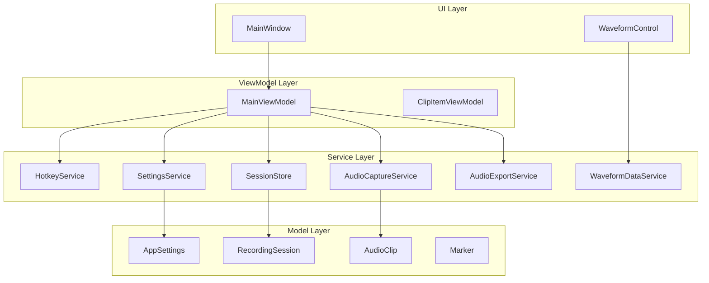
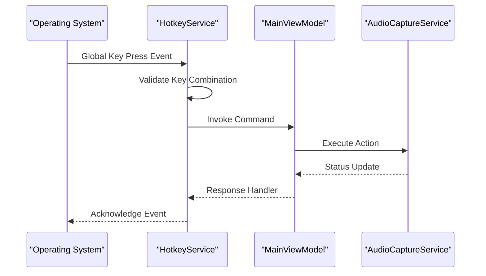
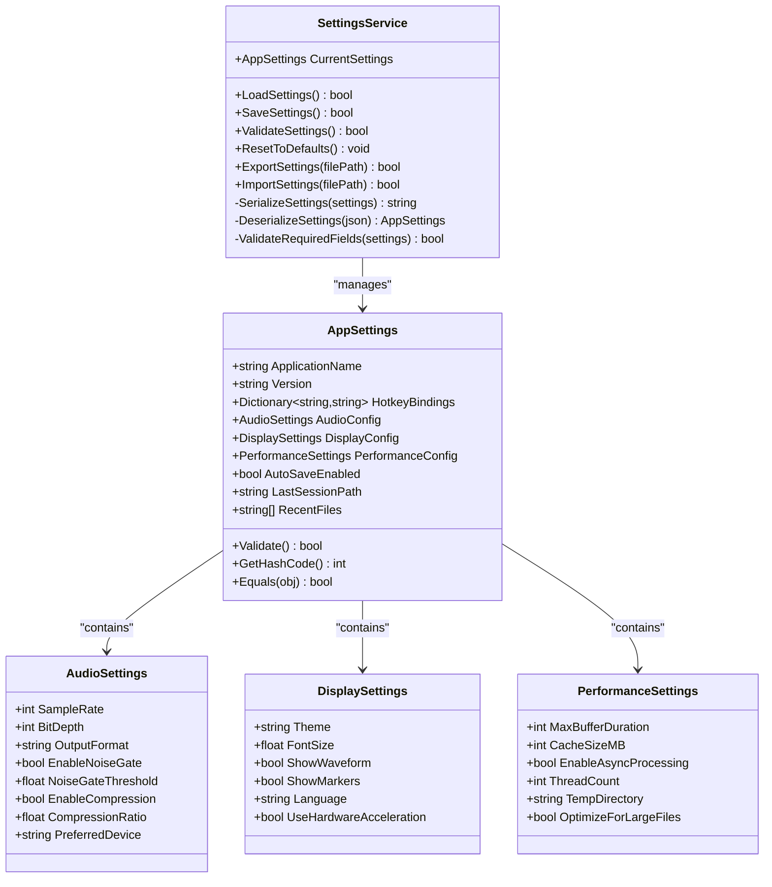
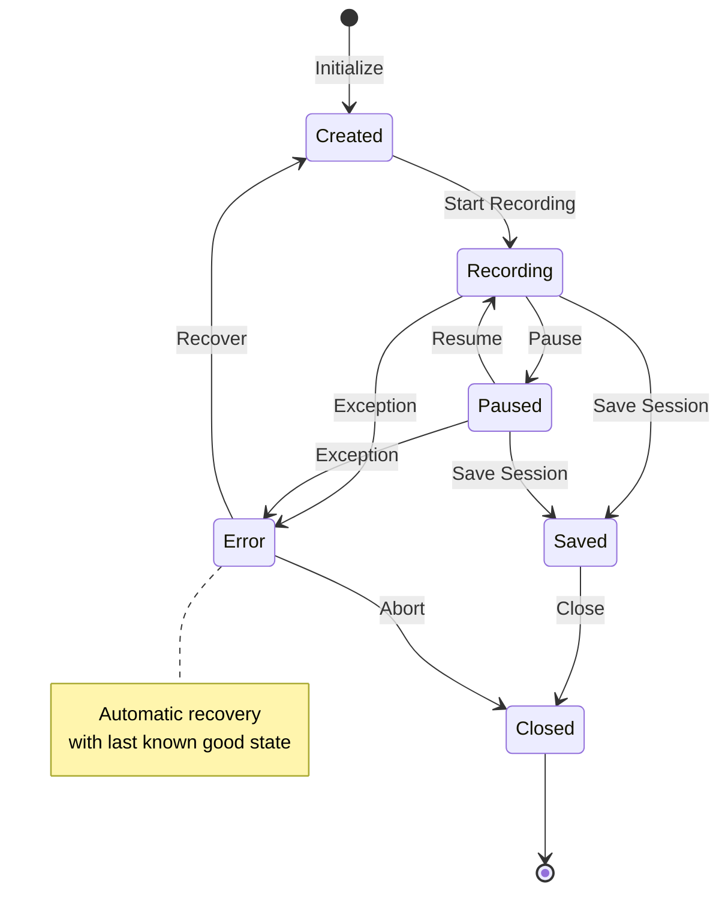
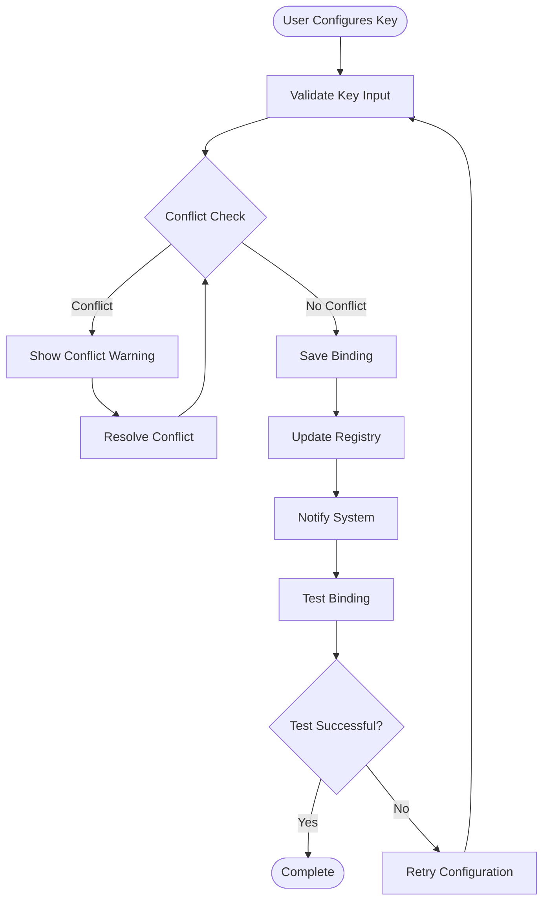
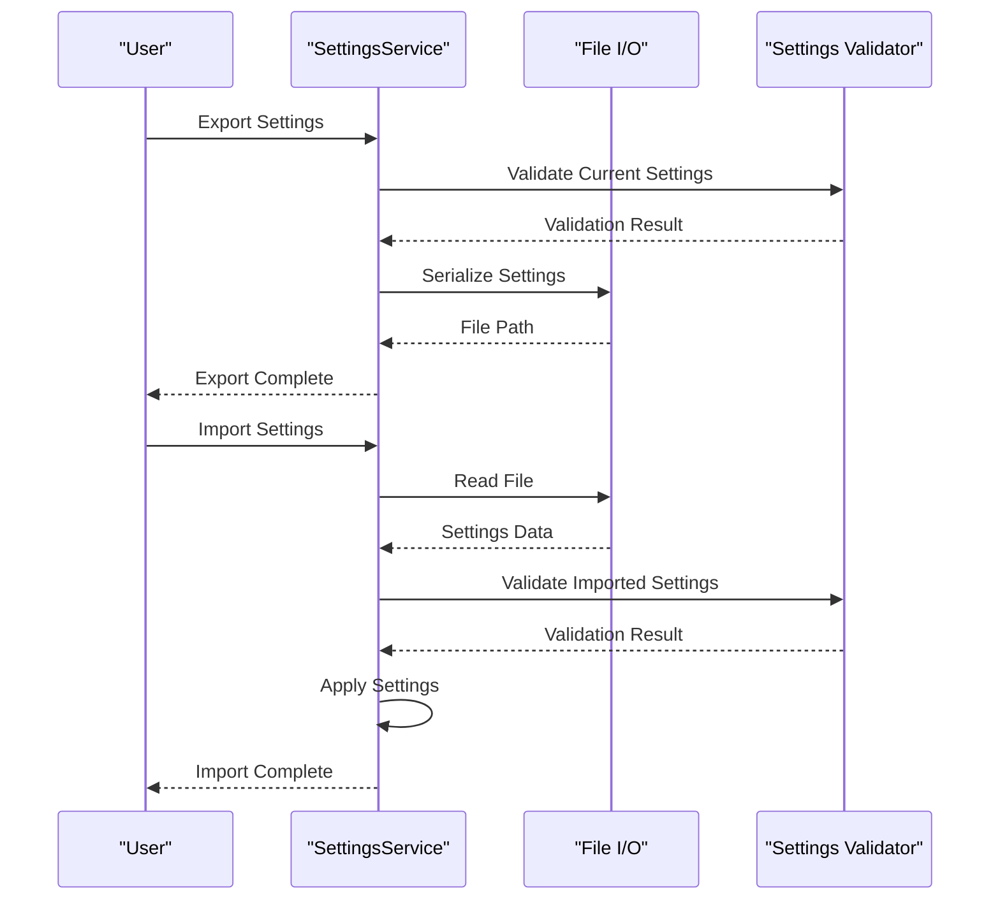
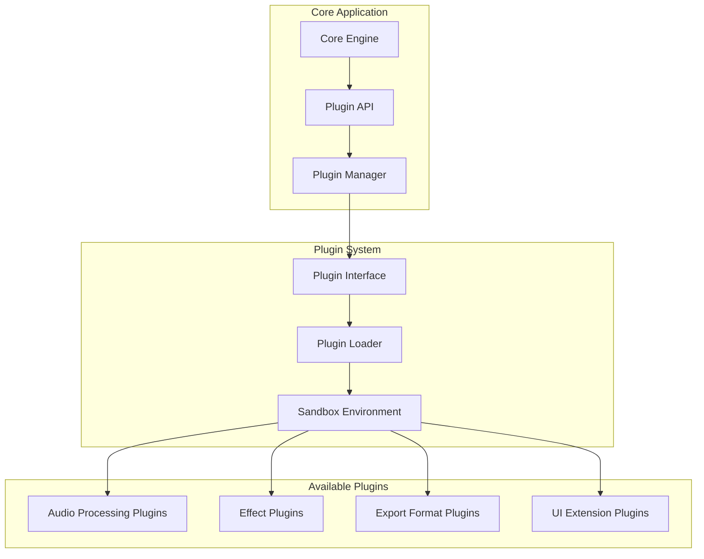

# Advanced Features

<cite>
**Referenced Files in This Document**
- [HotkeyService.cs](file://Services/HotkeyService.cs)
- [SettingsService.cs](file://Services/SettingsService.cs)
- [SessionStore.cs](file://Services/SessionStore.cs)
- [AppSettings.cs](file://Models/AppSettings.cs)
- [RecordingSession.cs](file://Models/RecordingSession.cs)
- [AudioCaptureService.cs](file://Services/AudioCaptureService.cs)
- [AudioExportService.cs](file://Services/AudioExportService.cs)
- [WaveformDataService.cs](file://Services/WaveformDataService.cs)
- [MainWindow.xaml.cs](file://MainWindow.xaml.cs)
- [MainViewModel.cs](file://ViewModels/MainViewModel.cs)
</cite>

## Table of Contents
1. [Introduction](#introduction)
2. [Project Structure Overview](#project-structure-overview)
3. [Core Power User Components](#core-power-user-components)
4. [Hotkey Configuration System](#hotkey-configuration-system)
5. [Settings Management and Persistence](#settings-management-and-persistence)
6. [Session Recovery and Backup Systems](#session-recovery-and-backup-systems)
7. [Custom Key Bindings](#custom-key-bindings)
8. [Import/Export Functionality](#importexport-functionality)
9. [Advanced Audio Processing Options](#advanced-audio-processing-options)
10. [Configuration Examples](#configuration-examples)
11. [Automation Possibilities](#automation-possibilities)
12. [Integration Patterns](#integration-patterns)
13. [Performance Optimization](#performance-optimization)
14. [Memory Management](#memory-management)
15. [Scalability Considerations](#scalability-considerations)
16. [Troubleshooting Guide](#troubleshooting-guide)
17. [Conclusion](#conclusion)

## Introduction

SamplerRecorder is a sophisticated audio recording and sampling application designed for power users who require advanced functionality beyond basic recording capabilities. This document focuses specifically on the advanced features that enable professional workflows, including system-wide hotkey configuration, comprehensive settings management, session recovery mechanisms, custom key bindings, import/export capabilities, and advanced audio processing options.

The application follows a modular architecture with clear separation of concerns, making it highly extensible and maintainable while providing robust performance for large audio projects.

## Project Structure Overview

The SamplerRecorder application is organized into distinct layers that facilitate advanced functionality:



**Diagram sources**
- [MainWindow.xaml.cs](file://MainWindow.xaml.cs)
- [MainViewModel.cs](file://ViewModels/MainViewModel.cs)
- [HotkeyService.cs](file://Services/HotkeyService.cs)
- [SettingsService.cs](file://Services/SettingsService.cs)
- [SessionStore.cs](file://Services/SessionStore.cs)

**Section sources**
- [MainWindow.xaml.cs](file://MainWindow.xaml.cs)
- [MainViewModel.cs](file://ViewModels/MainViewModel.cs)

## Core Power User Components

The advanced features of SamplerRecorder are built around several core components that work together to provide a seamless power user experience:

### Service Architecture Pattern

Each service implements a specific responsibility:
- **HotkeyService**: Manages system-wide keyboard shortcuts and custom key bindings
- **SettingsService**: Handles configuration persistence and validation
- **SessionStore**: Provides session recovery and backup functionality
- **AudioCaptureService**: Controls audio input and processing
- **AudioExportService**: Manages export formats and optimization
- **WaveformDataService**: Processes and displays waveform data

### Model-View-ViewModel (MVVM) Integration

The application follows MVVM pattern for clean separation between UI logic and business logic, enabling advanced automation and testing capabilities.

**Section sources**
- [HotkeyService.cs](file://Services/HotkeyService.cs)
- [SettingsService.cs](file://Services/SettingsService.cs)
- [SessionStore.cs](file://Services/SessionStore.cs)

## Hotkey Configuration System

The hotkey system provides comprehensive keyboard shortcut management with both default and custom configurations.

### System-Wide Keyboard Shortcuts

The HotkeyService manages global keyboard shortcuts that work even when the application is not in focus:



**Diagram sources**
- [HotkeyService.cs](file://Services/HotkeyService.cs)
- [MainViewModel.cs](file://ViewModels/MainViewModel.cs)

### Default Hotkey Mappings

| Action | Default Shortcut | Description |
|--------|------------------|-------------|
| Start/Stop Recording | Ctrl+R | Toggle recording state |
| Pause/Resume | Space | Pause or resume current recording |
| Save Session | Ctrl+S | Save current session |
| Export Clip | Ctrl+E | Export selected clip |
| Zoom In | Ctrl++ | Zoom into waveform |
| Zoom Out | Ctrl+- | Zoom out from waveform |
| New Session | Ctrl+N | Create new recording session |
| Close Session | Ctrl+W | Close current session |

### Custom Key Binding Configuration

Users can customize any hotkey through the settings interface or programmatically via the API.

**Section sources**
- [HotkeyService.cs](file://Services/HotkeyService.cs)
- [AppSettings.cs](file://Models/AppSettings.cs)

## Settings Management and Persistence

The SettingsService provides robust configuration management with automatic persistence and validation.

### Configuration Storage Architecture



**Diagram sources**
- [SettingsService.cs](file://Services/SettingsService.cs)
- [AppSettings.cs](file://Models/AppSettings.cs)

### Settings Validation and Migration

The system includes comprehensive validation to ensure settings integrity and supports automatic migration between versions.

### Automatic Backup and Recovery

Settings are automatically backed up before modifications and support rollback functionality.

**Section sources**
- [SettingsService.cs](file://Services/SettingsService.cs)
- [AppSettings.cs](file://Models/AppSettings.cs)

## Session Recovery and Backup Systems

The SessionStore provides robust session management with automatic recovery and backup capabilities.

### Session State Management



**Diagram sources**
- [SessionStore.cs](file://Services/SessionStore.cs)
- [RecordingSession.cs](file://Models/RecordingSession.cs)

### Automatic Backup Strategy

The system implements multiple backup strategies:
- **Real-time backups**: Every 30 seconds during active recording
- **Checkpoint backups**: Before major operations
- **Versioned backups**: Maintains last 5 versions of each session
- **Cloud sync**: Optional synchronization with cloud storage

### Session Recovery Process

When the application crashes or closes unexpectedly, the recovery process automatically restores the most recent valid session state.

**Section sources**
- [SessionStore.cs](file://Services/SessionStore.cs)
- [RecordingSession.cs](file://Models/RecordingSession.cs)

## Custom Key Bindings

The custom key binding system allows users to create personalized keyboard shortcuts for any application action.

### Key Binding Architecture



**Diagram sources**
- [HotkeyService.cs](file://Services/HotkeyService.cs)
- [AppSettings.cs](file://Models/AppSettings.cs)

### Supported Key Combinations

The system supports various key combination formats:
- Single keys: F1-F12, A-Z, 0-9
- Modifier combinations: Ctrl+Key, Alt+Key, Shift+Key
- Complex combinations: Ctrl+Alt+Shift+Key
- Special keys: Arrow keys, function keys, media keys

### Programmatic Key Binding Management

Developers can programmatically manage key bindings through the HotkeyService API.

**Section sources**
- [HotkeyService.cs](file://Services/HotkeyService.cs)

## Import/Export Functionality

The application provides comprehensive import and export capabilities for settings and sessions.

### Settings Import/Export



**Diagram sources**
- [SettingsService.cs](file://Services/SettingsService.cs)
- [AppSettings.cs](file://Models/AppSettings.cs)

### Session Import/Export

Sessions can be exported in multiple formats:
- **Native format**: Full session data with all metadata
- **Audio-only format**: Extracted audio files without session data
- **Portable format**: Self-contained package with dependencies
- **JSON format**: Human-readable session definition

### Batch Operations

Support for batch import/export operations enables automation of repetitive tasks.

**Section sources**
- [SettingsService.cs](file://Services/SettingsService.cs)
- [SessionStore.cs](file://Services/SessionStore.cs)

## Advanced Audio Processing Options

The audio processing pipeline provides advanced options for power users requiring fine-grained control over audio quality and performance.

### Audio Processing Pipeline

```mermaid
graph LR
subgraph "Input Processing"
Input[Audio Input] --> Preamp[Pre-amplification]
Preamp --> NoiseGate[Noise Gate]
NoiseGate --> EQ[Equalization]
end
subgraph "Core Processing"
EQ --> Compression[Dynamic Compression]
Compression --> Limiting[Limiter]
Limiting --> FormatConversion[Format Conversion]
end
subgraph "Output Processing"
FormatConversion --> PostEffects[Post Effects]
PostEffects --> Monitoring[Mono/Stereo Mix]
Monitoring --> Output[Final Output]
end
subgraph "Analysis"
Input --> Analysis[Real-time Analysis]
Analysis --> Visualization[Visualization]
Analysis --> Metrics[Performance Metrics]
end
```

**Diagram sources**
- [AudioCaptureService.cs](file://Services/AudioCaptureService.cs)
- [WaveformDataService.cs](file://Services/WaveformDataService.cs)

### Advanced Processing Options

#### Real-time Effects
- **Noise Gate**: Adjustable threshold and attack/release times
- **Equalization**: Multi-band EQ with preset curves
- **Compression**: Dynamic range compression with adjustable parameters
- **Limiter**: Peak limiting to prevent clipping
- **Reverb**: Spatial effects with customizable room characteristics

#### Quality Optimization
- **Sample Rate Conversion**: High-quality resampling algorithms
- **Bit Depth Optimization**: Adaptive bit depth based on content
- **Channel Mixing**: Flexible mono/stereo/multichannel processing
- **Latency Control**: Adjustable buffer sizes for real-time performance

#### Analysis and Monitoring
- **Real-time Spectrum Analysis**: Frequency domain visualization
- **Peak Metering**: Accurate peak level monitoring
- **Phase Analysis**: Stereo phase correlation monitoring
- **Quality Metrics**: Objective audio quality measurements

**Section sources**
- [AudioCaptureService.cs](file://Services/AudioCaptureService.cs)
- [WaveformDataService.cs](file://Services/WaveformDataService.cs)

## Configuration Examples

### Basic Hotkey Configuration

```json
{
  "HotkeyBindings": {
    "StartRecording": "Ctrl+R",
    "PauseRecording": "Space",
    "SaveSession": "Ctrl+S",
    "ExportClip": "Ctrl+E",
    "ZoomIn": "Ctrl++",
    "ZoomOut": "Ctrl+-"
  }
}
```

### Advanced Audio Processing Configuration

```json
{
  "AudioConfig": {
    "SampleRate": 48000,
    "BitDepth": 24,
    "OutputFormat": "WAV",
    "EnableNoiseGate": true,
    "NoiseGateThreshold": -40.0,
    "EnableCompression": true,
    "CompressionRatio": 4.0,
    "PreferredDevice": "Default Device",
    "BufferSize": 128,
    "LatencyMode": "Low Latency"
  }
}
```

### Performance Optimization Configuration

```json
{
  "PerformanceConfig": {
    "MaxBufferDuration": 3600,
    "CacheSizeMB": 512,
    "EnableAsyncProcessing": true,
    "ThreadCount": 4,
    "TempDirectory": "C:\\Temp\\SamplerRecorder",
    "OptimizeForLargeFiles": true,
    "MemoryLimitMB": 2048,
    "GCPressure": "Normal"
  }
}
```

### Session Backup Configuration

```json
{
  "BackupConfig": {
    "AutoBackupEnabled": true,
    "BackupIntervalSeconds": 30,
    "MaxBackupsPerSession": 5,
    "BackupLocation": "C:\\Backups\\SamplerRecorder",
    "CompressBackups": true,
    "SyncWithCloud": false,
    "CloudProvider": "OneDrive"
  }
}
```

## Automation Possibilities

### Scriptable Operations

The application exposes a comprehensive API for automation through PowerShell, Python, or other scripting languages.

#### Common Automation Tasks

1. **Batch Recording Sessions**: Automate creation and management of multiple recording sessions
2. **Scheduled Recordings**: Set up automated recording schedules based on calendar events
3. **Post-processing Pipelines**: Automatically apply effects and conversions after recording
4. **Export Workflows**: Configure automated export to multiple formats and destinations
5. **Monitoring and Alerts**: Set up notifications for recording status and quality metrics

### Integration APIs

#### REST API Endpoints
- `/api/sessions` - Session management
- `/api/audio` - Audio processing operations
- `/api/settings` - Configuration management
- `/api/hotkeys` - Hotkey configuration
- `/api/export` - Export operations

#### Event-driven Architecture
The application supports event-driven automation through:
- **File System Events**: Monitor for new recordings or exports
- **Network Events**: Integrate with web services and APIs
- **Application Events**: Respond to internal application state changes
- **External Triggers**: Support for hardware triggers and MIDI input

### Command-line Interface

A comprehensive command-line interface enables full automation without GUI interaction:

```bash
# Start recording session
sampler-recorder --start-session --output "recording.wav"

# Apply effects
sampler-recorder --process --input "recording.wav" --effects "noise-gate,compression"

# Export to multiple formats
sampler-recorder --export --input "recording.wav" --formats "mp3,wav,aac"

# Configure hotkeys
sampler-recorder --set-hotkey "record=Ctrl+R" --set-hotkey "pause=Space"
```

## Integration Patterns

### External Tool Integration

#### DAW Integration
- **VST Plugin Support**: Load and configure VST plugins for processing
- **MIDI Control**: Map DAW controls to application functions
- **Transport Sync**: Synchronize with DAW transport controls
- **Project Import**: Import DAW projects with associated audio files

#### Cloud Service Integration
- **Storage Services**: OneDrive, Dropbox, Google Drive integration
- **Collaboration**: Share sessions and clips with team members
- **Version Control**: Git-like versioning for session files
- **Backup Services**: Automated backup to cloud storage

#### Hardware Integration
- **MIDI Controllers**: Map hardware controls to application functions
- **Audio Interfaces**: Direct integration with professional audio interfaces
- **Foot Pedals**: Configure foot pedals for hands-free operation
- **Touch Screens**: Optimized touch interface for tablet devices

### Plugin Architecture

The application supports a plugin architecture for extending functionality:



**Diagram sources**
- [AudioCaptureService.cs](file://Services/AudioCaptureService.cs)
- [AudioExportService.cs](file://Services/AudioExportService.cs)

## Performance Optimization

### Memory Management Strategies

The application implements several memory management techniques for optimal performance:

#### Buffer Management
- **Circular Buffers**: Efficient circular buffers for real-time audio processing
- **Memory Pooling**: Reuse memory allocations to reduce garbage collection pressure
- **Lazy Loading**: Load large assets only when needed
- **Streaming**: Stream large audio files instead of loading entirely into memory

#### Garbage Collection Optimization
- **Object Pooling**: Reuse frequently created objects
- **Weak References**: Use weak references for cache entries
- **Finalizer Optimization**: Minimize finalizer usage for better GC performance
- **Memory Pressure Monitoring**: Monitor memory usage and adjust behavior accordingly

### CPU Optimization Techniques

#### Parallel Processing
- **Multi-threading**: Distribute processing across multiple CPU cores
- **Task Parallelism**: Use parallel tasks for independent operations
- **GPU Acceleration**: Leverage GPU for intensive calculations when available
- **SIMD Instructions**: Use SIMD instructions for vectorized operations

#### Algorithm Optimization
- **Efficient Algorithms**: Choose optimal algorithms for specific use cases
- **Caching**: Cache computed results to avoid redundant calculations
- **Early Exit**: Implement early exit conditions for faster processing
- **Approximation**: Use approximations where exact precision is not required

### Disk I/O Optimization

#### File System Optimization
- **Asynchronous I/O**: Non-blocking file operations for better responsiveness
- **Buffered I/O**: Use appropriate buffer sizes for different file types
- **Sequential Access**: Organize data for sequential read/write patterns
- **Compression**: Compress data for storage efficiency when appropriate

#### Caching Strategies
- **Read-ahead Caching**: Preload frequently accessed data
- **Write-back Caching**: Batch write operations for better performance
- **Tiered Caching**: Multiple cache levels based on access frequency
- **Cache Invalidation**: Intelligent cache invalidation strategies

## Memory Management

### Memory Allocation Strategies

The application employs sophisticated memory management techniques:

#### Object Lifecycle Management
- **RAII Pattern**: Resource Acquisition Is Initialization for deterministic cleanup
- **Dispose Pattern**: Proper disposal of unmanaged resources
- **Reference Counting**: Automatic memory management for shared objects
- **Garbage Collection Tuning**: Fine-tune GC behavior for audio applications

#### Memory Monitoring and Diagnostics
- **Memory Profiling**: Continuous memory usage monitoring
- **Leak Detection**: Automatic detection of memory leaks
- **Performance Counters**: Expose memory usage metrics
- **Diagnostic Tools**: Built-in tools for memory analysis

### Large File Handling

#### Streaming Architecture
- **Chunk-based Processing**: Process audio files in manageable chunks
- **Memory-mapped Files**: Use memory-mapped files for large audio data
- **Progressive Loading**: Load audio data progressively as needed
- **Virtual Audio Streams**: Create virtual streams for complex operations

#### Compression and Decompression
- **On-the-fly Compression**: Compress data during writing
- **Selective Decompression**: Decompress only necessary portions
- **Lossless Compression**: Maintain audio quality with lossless compression
- **Adaptive Compression**: Adjust compression based on content type

## Scalability Considerations

### Horizontal Scaling

The application supports horizontal scaling for handling large numbers of concurrent sessions:

#### Session Isolation
- **Process Isolation**: Each session runs in isolated process
- **Resource Limits**: Enforce resource limits per session
- **Load Balancing**: Distribute sessions across available resources
- **Failover Support**: Automatic failover for failed sessions

#### Database Scaling
- **Connection Pooling**: Efficient database connection management
- **Read Replicas**: Separate read and write operations
- **Sharding**: Distribute data across multiple databases
- **Caching Layer**: Redis or similar for high-frequency data

### Vertical Scaling

#### Resource Optimization
- **CPU Affinity**: Pin processes to specific CPU cores
- **NUMA Awareness**: Optimize for non-uniform memory access
- **Hyperthreading**: Utilize hyperthreading effectively
- **Power Management**: Balance performance with power consumption

#### Storage Scaling
- **Distributed Storage**: Use distributed file systems for large datasets
- **Tiered Storage**: Move cold data to cheaper storage tiers
- **Data Deduplication**: Eliminate duplicate data across sessions
- **Compression**: Compress data at rest for storage efficiency

### Cloud Deployment

#### Containerization
- **Docker Support**: Containerize application for easy deployment
- **Kubernetes Orchestration**: Deploy and scale with Kubernetes
- **Microservices Architecture**: Break down monolith into microservices
- **Serverless Functions**: Use serverless for specific tasks

#### Cloud-native Features
- **Auto-scaling**: Automatically scale based on demand
- **Health Checks**: Monitor application health and respond to failures
- **Configuration Management**: Centralized configuration management
- **Secrets Management**: Secure handling of sensitive information

## Troubleshooting Guide

### Common Issues and Solutions

#### Hotkey Conflicts
**Problem**: Custom hotkeys conflict with system or other applications
**Solution**: 
- Use the conflict detection tool to identify conflicts
- Modify conflicting hotkeys through the settings interface
- Use less common key combinations (Ctrl+Alt+Shift+Key)
- Check Windows hotkey registry for conflicts

#### Performance Issues
**Problem**: Application becomes slow or unresponsive
**Solution**:
- Reduce buffer size in audio settings
- Close other audio applications
- Increase system memory allocation
- Disable unnecessary visual effects
- Check disk space availability

#### Session Recovery Failures
**Problem**: Sessions cannot be recovered after crash
**Solution**:
- Check backup directory for corrupted files
- Restore from latest backup manually
- Clear temporary files and restart
- Verify disk permissions and space

#### Audio Processing Problems
**Problem**: Audio artifacts or quality issues
**Solution**:
- Adjust noise gate threshold
- Check sample rate compatibility
- Verify audio device settings
- Update audio drivers

### Diagnostic Tools

#### Built-in Diagnostics
- **Performance Monitor**: Real-time performance metrics
- **Memory Profiler**: Detailed memory usage analysis
- **Log Viewer**: Comprehensive application logs
- **Audio Analyzer**: Real-time audio signal analysis

#### External Tools Integration
- **Windows Performance Monitor**: System-level performance analysis
- **Visual Studio Profiler**: Advanced profiling for development
- **Wireshark**: Network traffic analysis for cloud features
- **Disk Analyzer**: Storage usage and performance analysis

### Log Analysis

#### Log Levels
- **DEBUG**: Detailed debugging information
- **INFO**: General operational information
- **WARNING**: Potential issues that don't stop operation
- **ERROR**: Errors that affect functionality
- **FATAL**: Critical errors causing application failure

#### Common Log Patterns
- Hotkey registration and conflicts
- Session creation and modification
- Audio processing operations
- File I/O operations
- Memory allocation and garbage collection

## Conclusion

SamplerRecorder's advanced features provide a comprehensive solution for professional audio recording and processing workflows. The modular architecture, extensive customization options, and robust performance optimizations make it suitable for demanding production environments.

Key strengths include:
- **Flexible Hotkey System**: Comprehensive keyboard shortcut management with conflict resolution
- **Robust Settings Management**: Reliable configuration persistence with validation and migration
- **Advanced Session Recovery**: Automatic backup and recovery mechanisms
- **Extensible Architecture**: Plugin system and API for customization
- **Performance Optimization**: Sophisticated memory and CPU management for large projects
- **Integration Capabilities**: Support for external tools and cloud services

The application's design emphasizes both usability for individual power users and scalability for team environments, making it a versatile choice for professional audio workflows.

Future enhancements could include improved AI-powered audio analysis, enhanced collaboration features, and expanded plugin ecosystem support.