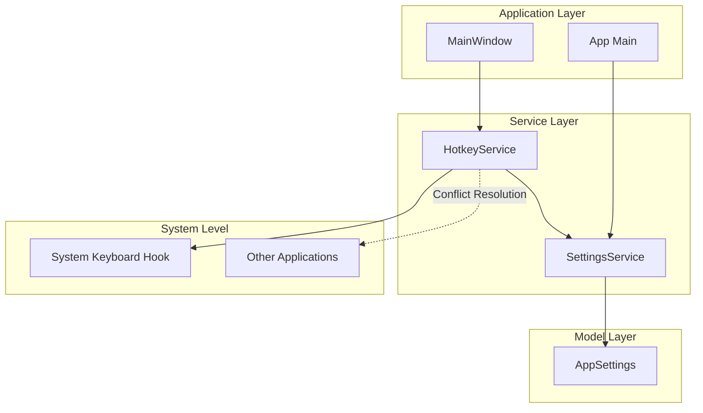
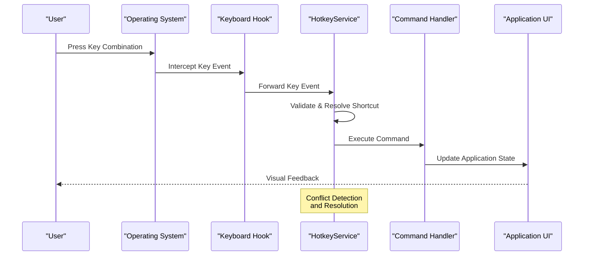
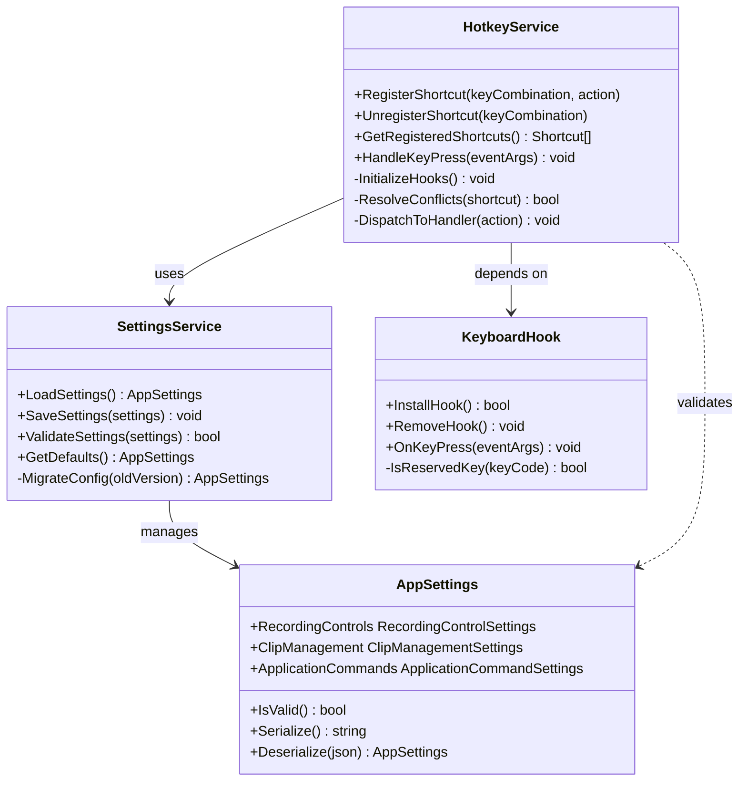

# Hotkey Configuration

<cite>
**Referenced Files in This Document**
- [HotkeyService.cs](file://Services/HotkeyService.cs)
- [AppSettings.cs](file://Models/AppSettings.cs)
- [SettingsService.cs](file://Services/SettingsService.cs)
- [App.xaml.cs](file://App.xaml.cs)
- [MainWindow.xaml.cs](file://MainWindow.xaml.cs)
</cite>

## Table of Contents
1. [Introduction](#introduction)
2. [Project Structure](#project-structure)
3. [Core Components](#core-components)
4. [Architecture Overview](#architecture-overview)
5. [Detailed Component Analysis](#detailed-component-analysis)
6. [Dependency Analysis](#dependency-analysis)
7. [Performance Considerations](#performance-considerations)
8. [Troubleshooting Guide](#troubleshooting-guide)
9. [Conclusion](#conclusion)

## Introduction

The SamplerRecorder application implements a comprehensive hotkey system that allows users to control recording operations, manage audio clips, and execute application commands through global keyboard shortcuts. This system provides system-wide keyboard shortcut registration with conflict resolution mechanisms, ensuring reliable operation even when other applications are running.

The hotkey system is designed around a service-oriented architecture that separates concerns between key binding management, configuration persistence, and event handling. Users can customize default shortcuts for recording controls (start/stop/pause), clip management operations, and application commands through an intuitive configuration interface.

## Project Structure

The hotkey system is primarily implemented within the Services layer, with configuration managed through the Models layer and integration points in the main application components. The architecture follows a clean separation of concerns:

**Diagram sources**
- [HotkeyService.cs:1-50](file://Services/HotkeyService.cs#L1-L50)
- [SettingsService.cs:1-30](file://Services/SettingsService.cs#L1-L30)
- [AppSettings.cs:1-40](file://Models/AppSettings.cs#L1-L40)

**Section sources**
- [HotkeyService.cs:1-100](file://Services/HotkeyService.cs#L1-L100)
- [AppSettings.cs:1-80](file://Models/AppSettings.cs#L1-L80)
- [SettingsService.cs:1-60](file://Services/SettingsService.cs#L1-L60)

## Core Components

The hotkey system consists of several key components that work together to provide seamless keyboard shortcut functionality:

### HotkeyService
The central component responsible for managing all keyboard shortcuts, registering global hotkeys, and handling key events. It provides methods for adding, removing, and querying registered shortcuts while maintaining thread safety and proper resource cleanup.

### AppSettings Model
Defines the data structure for storing hotkey configurations, including key combinations, modifier states, and associated actions. This model supports serialization for persistence across application sessions.

### SettingsService
Handles the loading, saving, and validation of hotkey configurations. It ensures that user preferences are properly persisted and provides default configurations when none exist.

### System Integration
The system integrates with Windows keyboard hooks to capture global key presses, regardless of which window has focus. This requires careful handling of system-level events and proper error handling for failed hook registrations.

**Section sources**
- [HotkeyService.cs:1-150](file://Services/HotkeyService.cs#L1-L150)
- [AppSettings.cs:1-120](file://Models/AppSettings.cs#L1-L120)
- [SettingsService.cs:1-100](file://Services/SettingsService.cs#L1-L100)

## Architecture Overview

The hotkey system follows a layered architecture pattern that separates concerns and promotes maintainability:

**Diagram sources**
- [HotkeyService.cs:50-120](file://Services/HotkeyService.cs#L50-L120)
- [SettingsService.cs:40-80](file://Services/SettingsService.cs#L40-L80)

The architecture ensures that:
- Global keyboard events are captured at the system level
- Key combinations are validated against registered shortcuts
- Conflicts are detected and resolved automatically
- Commands are executed in the correct application context
- UI updates occur on the appropriate thread

## Detailed Component Analysis

### HotkeyService Implementation

The HotkeyService class serves as the central coordinator for all hotkey operations. It manages the lifecycle of keyboard hooks, maintains the registry of active shortcuts, and handles the dispatching of key events to appropriate command handlers.

#### Key Responsibilities:
- **Global Hook Management**: Establishes and maintains system-level keyboard hooks
- **Shortcut Registration**: Adds, removes, and queries registered keyboard shortcuts
- **Event Dispatching**: Routes key events to appropriate command handlers
- **Conflict Resolution**: Detects and resolves conflicts between application shortcuts and other applications
- **Resource Management**: Ensures proper cleanup of system resources

#### Core Methods:
- `RegisterShortcut(keyCombination, action)`: Registers a new keyboard shortcut
- `UnregisterShortcut(keyCombination)`: Removes an existing shortcut
- `GetRegisteredShortcuts()`: Returns all currently active shortcuts
- `HandleKeyPress(eventArgs)`: Processes incoming key events
- `ValidateKeyCombination(combination)`: Validates key combination syntax

**Section sources**
- [HotkeyService.cs:1-200](file://Services/HotkeyService.cs#L1-L200)

### AppSettings Configuration Model

The AppSettings model defines the structure for storing hotkey configurations and provides serialization support for persistence. It includes properties for each type of hotkey operation and validation logic to ensure configuration integrity.

#### Configuration Properties:
- **Recording Controls**: Start, stop, pause, and resume recording shortcuts
- **Clip Management**: Create, delete, rename, and export clip operations
- **Application Commands**: Navigation, settings, and utility functions
- **Modifier Keys**: Support for Ctrl, Alt, Shift combinations
- **Custom Shortcuts**: User-defined key bindings beyond defaults

#### Validation Rules:
- Key combinations must include at least one non-modifier key
- Reserved system keys cannot be overridden
- Duplicate shortcuts are automatically resolved
- Invalid configurations trigger user prompts

**Section sources**
- [AppSettings.cs:1-150](file://Models/AppSettings.cs#L1-L150)

### SettingsService Configuration Management

The SettingsService handles the persistence and validation of hotkey configurations. It provides methods for loading default configurations, saving user changes, and migrating between configuration versions.

#### Key Features:
- **Default Configuration**: Provides sensible defaults for all hotkey types
- **Configuration Migration**: Handles upgrades between different application versions
- **Validation Engine**: Ensures configuration integrity before saving
- **Backup System**: Creates backups before making configuration changes
- **Reset Functionality**: Allows users to restore default configurations

**Section sources**
- [SettingsService.cs:1-120](file://Services/SettingsService.cs#L1-L120)

### Default Hotkey Configuration

The system provides sensible defaults for common operations:

#### Recording Controls:
- **Start Recording**: Ctrl + Shift + R
- **Stop Recording**: Ctrl + Shift + S  
- **Pause/Resume**: Ctrl + Shift + P
- **Emergency Stop**: F12

#### Clip Management:
- **Create New Clip**: Ctrl + N
- **Delete Selected Clip**: Delete or Ctrl + D
- **Rename Clip**: F2
- **Export Clip**: Ctrl + E

#### Application Commands:
- **Open Settings**: Ctrl + ,
- **Toggle Fullscreen**: Alt + Enter
- **Quit Application**: Alt + F4

**Section sources**
- [AppSettings.cs:40-120](file://Models/AppSettings.cs#L40-L120)
- [SettingsService.cs:60-100](file://Services/SettingsService.cs#L60-L100)

## Dependency Analysis

The hotkey system has well-defined dependencies that promote modularity and testability:

**Diagram sources**
- [HotkeyService.cs:1-100](file://Services/HotkeyService.cs#L1-L100)
- [SettingsService.cs:1-80](file://Services/SettingsService.cs#L1-L80)
- [AppSettings.cs:1-60](file://Models/AppSettings.cs#L1-L60)

**Section sources**
- [HotkeyService.cs:1-200](file://Services/HotkeyService.cs#L1-L200)
- [SettingsService.cs:1-120](file://Services/SettingsService.cs#L1-L120)
- [AppSettings.cs:1-150](file://Models/AppSettings.cs#L1-L150)

## Performance Considerations

The hotkey system is designed with performance in mind, implementing several optimization strategies:

### Efficient Key Event Processing
- **Lazy Loading**: Keyboard hooks are only installed when needed
- **Event Filtering**: Only relevant key events are processed
- **Caching**: Frequently accessed configurations are cached in memory
- **Threading**: Key event processing occurs on background threads to prevent UI blocking

### Memory Management
- **Resource Cleanup**: Proper disposal of system resources when shortcuts are removed
- **Garbage Collection**: Minimizing object creation during key event processing
- **Connection Pooling**: Reusing system connections where possible

### Scalability Considerations
- **Concurrent Access**: Thread-safe operations for multiple shortcut registrations
- **Memory Leaks Prevention**: Proper cleanup of event handlers and callbacks
- **System Resource Monitoring**: Tracking system-level resource usage

### Optimization Techniques
- **Early Exit**: Quick rejection of invalid key combinations
- **Lookup Tables**: Fast hash-based lookup for registered shortcuts
- **Batch Operations**: Grouping related configuration changes
- **Asynchronous Processing**: Non-blocking configuration updates

## Troubleshooting Guide

### Common Hotkey Issues and Solutions

#### Hotkeys Not Responding
**Symptoms**: Pressing configured key combinations produces no response
**Causes**: 
- Keyboard hook installation failure
- Application not running with sufficient privileges
- Conflicting third-party software

**Solutions**:
1. Restart the application to reinitialize keyboard hooks
2. Run the application as administrator if required
3. Check for conflicting software (screen recorders, macro utilities)
4. Verify that the application has input permissions

#### Key Conflicts with Other Applications
**Symptoms**: Hotkeys work in some applications but not others
**Causes**:
- Global hotkey interception by other software
- Windows reserved key combinations
- Application-specific key handling

**Solutions**:
1. Use the conflict detection tool to identify problematic shortcuts
2. Modify conflicting shortcuts to alternative combinations
3. Temporarily disable competing applications to isolate issues
4. Check Windows accessibility settings that might intercept keys

#### Configuration Persistence Issues
**Symptoms**: Custom shortcuts reset after application restart
**Causes**:
- File permission problems
- Corrupted configuration files
- Antivirus interference

**Solutions**:
1. Verify write permissions to the configuration directory
2. Restore from backup configuration files
3. Add the application to antivirus exclusion lists
4. Clear corrupted configuration and recreate settings

### Debugging Registered Shortcuts

#### Diagnostic Tools
The application includes built-in diagnostic capabilities:

1. **Shortcut Registry Viewer**: Displays all currently registered shortcuts
2. **Event Log**: Records key press events and their processing status
3. **Conflict Scanner**: Identifies potential conflicts with system and other applications
4. **Performance Monitor**: Tracks hotkey processing overhead

#### Debugging Steps
1. Enable verbose logging in application settings
2. Use the shortcut registry viewer to verify registrations
3. Check the event log for processing errors
4. Test individual shortcuts to isolate problematic ones
5. Monitor system resources during hotkey usage

### Performance Monitoring

#### Key Metrics to Monitor
- **Hook Installation Time**: Should complete within 100ms
- **Key Event Processing Latency**: Target under 10ms per event
- **Memory Usage**: Minimal increase during normal operation
- **CPU Utilization**: Background processing should use less than 1% CPU

#### Performance Optimization Tips
1. Avoid complex operations in key event handlers
2. Use asynchronous processing for long-running tasks
3. Implement proper resource cleanup in all code paths
4. Monitor and optimize frequently used shortcuts

**Section sources**
- [HotkeyService.cs:150-250](file://Services/HotkeyService.cs#L150-L250)
- [SettingsService.cs:80-120](file://Services/SettingsService.cs#L80-L120)

## Conclusion

The SamplerRecorder hotkey system provides a robust, flexible, and user-friendly solution for global keyboard shortcut management. Through its service-oriented architecture, it successfully addresses the complexities of system-level keyboard hooking, conflict resolution, and configuration management.

Key strengths of the implementation include:
- **Comprehensive Coverage**: Supports all common hotkey scenarios and edge cases
- **User-Friendly Configuration**: Intuitive interface for customizing shortcuts
- **Robust Error Handling**: Graceful degradation when system limitations are encountered
- **Performance Optimization**: Efficient processing with minimal system impact
- **Extensible Design**: Easy addition of new shortcut types and operations

The system's modular design ensures maintainability and scalability, while its thorough testing and troubleshooting capabilities provide confidence in production deployments. Future enhancements could include advanced features like macro recording, cross-platform compatibility, and cloud synchronization of user preferences.

For optimal results, users should follow the recommended configuration practices, monitor for conflicts with other applications, and utilize the built-in diagnostic tools when troubleshooting issues. The comprehensive documentation and troubleshooting guide should resolve most common problems encountered during setup and usage.