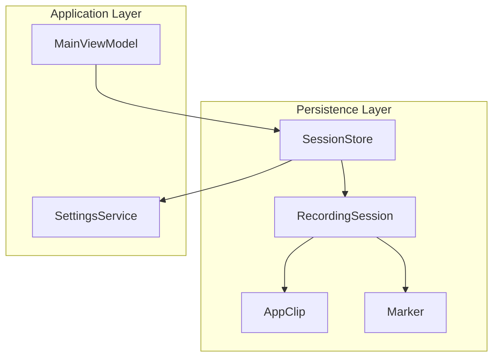
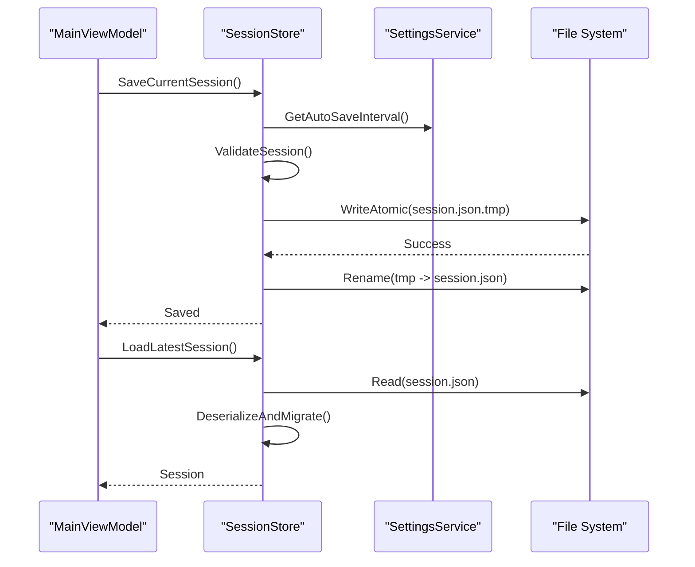
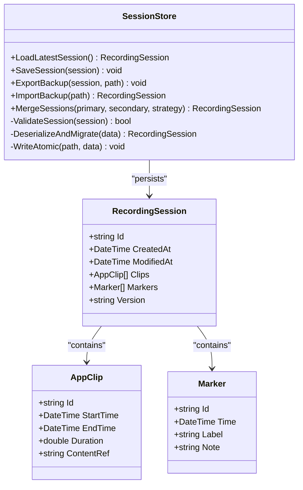
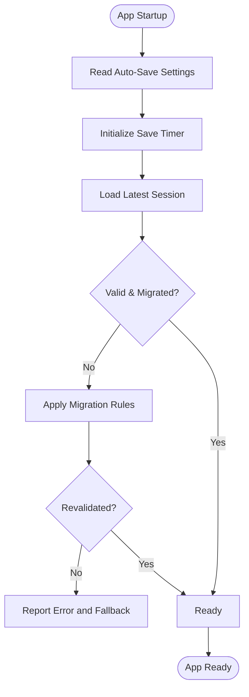
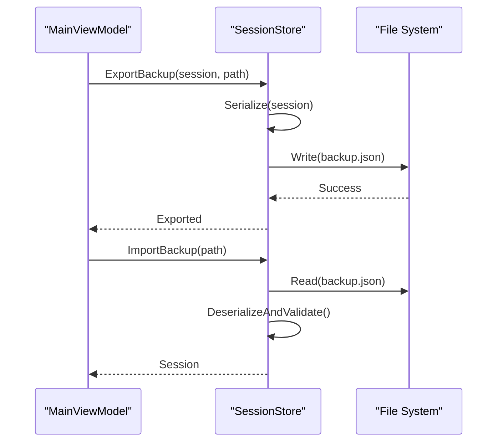
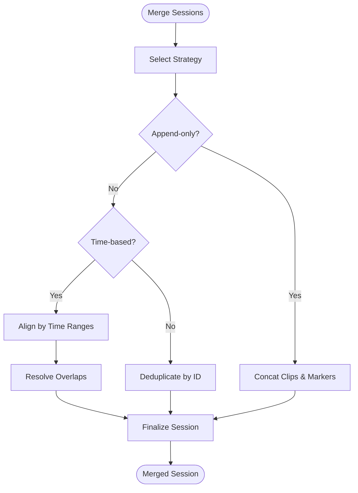
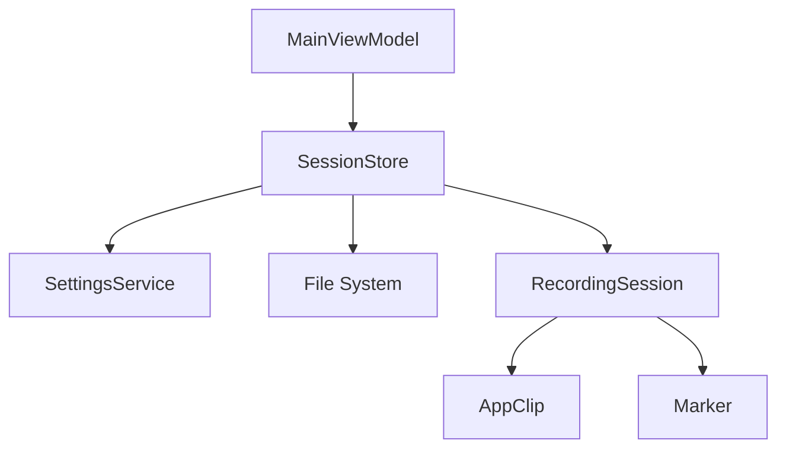

# Session Persistence

<cite>
**Referenced Files in This Document**
- [SessionStore.cs](file://Services/SessionStore.cs)
- [RecordingSession.cs](file://Models/RecordingSession.cs)
- [AppClip.cs](file://Models/AppClip.cs)
- [Marker.cs](file://Models/Marker.cs)
- [SettingsService.cs](file://Services/SettingsService.cs)
- [MainViewModel.cs](file://ViewModels/MainViewModel.cs)
</cite>

## Table of Contents
1. [Introduction](#introduction)
2. [Project Structure](#project-structure)
3. [Core Components](#core-components)
4. [Architecture Overview](#architecture-overview)
5. [Detailed Component Analysis](#detailed-component-analysis)
6. [Dependency Analysis](#dependency-analysis)
7. [Performance Considerations](#performance-considerations)
8. [Troubleshooting Guide](#troubleshooting-guide)
9. [Conclusion](#conclusion)
10. [Appendices](#appendices)

## Introduction
This document explains how SamplerRecorder manages recording sessions across application lifecycles. It covers the SessionStore service implementation, the RecordingSession model, automatic save and recovery mechanisms, serialization and restoration across restarts, manual backup and restore operations, session merging strategies, conflict resolution when multiple sessions exist, data integrity and version compatibility, large session handling optimizations, and the relationships between sessions, clips, and markers in the persistence layer.

## Project Structure
The session persistence system is implemented primarily through a dedicated service and strongly-typed models:
- Services/SessionStore.cs: Centralized persistence logic for sessions, including load, save, migration, and merge utilities.
- Models/RecordingSession.cs: Core domain model representing a recording session, its metadata, and references to clips and markers.
- Models/AppClip.cs: Represents an audio clip within a session, including timing and content references.
- Models/Marker.cs: Represents user-defined markers within a session (e.g., bookmarks, cues).
- Services/SettingsService.cs: Application settings that influence persistence behavior (e.g., auto-save interval, storage location).
- ViewModels/MainViewModel.cs: UI orchestration that triggers save/restore operations and reacts to session state changes.

**Diagram sources**
- [SessionStore.cs](file://Services/SessionStore.cs)
- [RecordingSession.cs](file://Models/RecordingSession.cs)
- [AppClip.cs](file://Models/AppClip.cs)
- [Marker.cs](file://Models/Marker.cs)
- [SettingsService.cs](file://Services/SettingsService.cs)
- [MainViewModel.cs](file://ViewModels/MainViewModel.cs)

**Section sources**
- [SessionStore.cs](file://Services/SessionStore.cs)
- [RecordingSession.cs](file://Models/RecordingSession.cs)
- [AppClip.cs](file://Models/AppClip.cs)
- [Marker.cs](file://Models/Marker.cs)
- [SettingsService.cs](file://Services/SettingsService.cs)
- [MainViewModel.cs](file://ViewModels/MainViewModel.cs)

## Core Components
- SessionStore: Encapsulates all persistence operations for sessions, including loading, saving, migrating, merging, and exporting/importing backups. It coordinates with SettingsService for configuration and ensures data integrity during IO operations.
- RecordingSession: Domain model containing session metadata, timestamps, and collections of clips and markers. Designed for efficient serialization and deserialization.
- AppClip: Represents a single recorded segment with start/end times, duration, and optional content reference.
- Marker: Represents a named point-in-time within a session, used for navigation and organization.

Key responsibilities:
- Automatic periodic saving based on settings.
- Safe atomic writes to avoid corruption.
- Version-aware deserialization and migration.
- Merge strategies for combining multiple sessions.
- Backup export and restore workflows.

**Section sources**
- [SessionStore.cs](file://Services/SessionStore.cs)
- [RecordingSession.cs](file://Models/RecordingSession.cs)
- [AppClip.cs](file://Models/AppClip.cs)
- [Marker.cs](file://Models/Marker.cs)

## Architecture Overview
The persistence architecture follows a layered design:
- UI layer (MainViewModel) invokes SessionStore methods to perform actions like save, load, merge, backup, and restore.
- SessionStore orchestrates persistence tasks, using SettingsService for configuration and applying validation and migration rules.
- Models (RecordingSession, AppClip, Marker) define the schema and constraints for serialized data.

**Diagram sources**
- [SessionStore.cs](file://Services/SessionStore.cs)
- [SettingsService.cs](file://Services/SettingsService.cs)
- [RecordingSession.cs](file://Models/RecordingSession.cs)

## Detailed Component Analysis

### SessionStore Service
Responsibilities:
- Load sessions from disk with version checks and migrations.
- Save sessions atomically to prevent partial writes.
- Provide backup export and restore capabilities.
- Merge multiple sessions with configurable conflict resolution.
- Enforce data integrity via validation routines.

Key operations:
- LoadLatestSession(): Reads the latest persisted session, applies migrations, and returns a valid instance.
- SaveSession(session): Serializes and writes the session atomically.
- ExportBackup(session, path): Creates a portable backup file.
- ImportBackup(path): Loads and validates a backup into a session.
- MergeSessions(primary, secondary, strategy): Combines two sessions according to a specified strategy.

Error handling:
- Catches IO exceptions and returns structured errors.
- Validates input parameters and session state before operations.
- Ensures rollback on failure during merge or import.

**Section sources**
- [SessionStore.cs](file://Services/SessionStore.cs)

#### Class Diagram

**Diagram sources**
- [SessionStore.cs](file://Services/SessionStore.cs)
- [RecordingSession.cs](file://Models/RecordingSession.cs)
- [AppClip.cs](file://Models/AppClip.cs)
- [Marker.cs](file://Models/Marker.cs)

### RecordingSession Model
Structure:
- Identifiers and timestamps for lifecycle tracking.
- Collections of clips and markers.
- Version field to support schema evolution.

Design considerations:
- Immutable where possible to reduce mutation risks.
- Validation hooks to ensure consistency before serialization.
- Efficient serialization format balancing readability and performance.

**Section sources**
- [RecordingSession.cs](file://Models/RecordingSession.cs)

### Clip and Marker Relationships
Relationships:
- A RecordingSession contains zero or more AppClip instances.
- A RecordingSession contains zero or more Marker instances.
- Clips represent time-bounded segments; markers represent points-in-time.
- Both clips and markers may include identifiers and labels for UI display and programmatic access.

Data integrity:
- Ensure no overlapping clips unless explicitly allowed by policy.
- Maintain marker ordering and uniqueness by time or label.
- Validate durations and timestamps against sampling rate and session bounds.

**Section sources**
- [RecordingSession.cs](file://Models/RecordingSession.cs)
- [AppClip.cs](file://Models/AppClip.cs)
- [Marker.cs](file://Models/Marker.cs)

### Automatic Save and Recovery
Mechanism:
- Periodic save triggered by a timer or event loop governed by SettingsService.
- Atomic write pattern to avoid partial saves.
- On startup, SessionStore loads the latest session and applies any necessary migrations.

Recovery flow:

**Diagram sources**
- [SessionStore.cs](file://Services/SessionStore.cs)
- [SettingsService.cs](file://Services/SettingsService.cs)

**Section sources**
- [SessionStore.cs](file://Services/SessionStore.cs)
- [SettingsService.cs](file://Services/SettingsService.cs)

### Manual Backup and Restore
Operations:
- ExportBackup(session, path): Serializes the session to a backup file with metadata and checksums.
- ImportBackup(path): Deserializes and validates the backup, returning a new session instance.

Workflow:

**Diagram sources**
- [SessionStore.cs](file://Services/SessionStore.cs)

**Section sources**
- [SessionStore.cs](file://Services/SessionStore.cs)

### Session Merging Strategies and Conflict Resolution
Strategies:
- Append-only: Concatenate clips and markers, preserving order.
- Merge by time: Align clips by time ranges, resolving overlaps by precedence or splitting.
- Merge by ID: Deduplicate clips and markers by unique identifiers.

Conflict resolution:
- Prefer newer timestamps when conflicts arise.
- Allow user selection for ambiguous cases.
- Generate synthetic IDs for missing identifiers.

Flow:

**Diagram sources**
- [SessionStore.cs](file://Services/SessionStore.cs)

**Section sources**
- [SessionStore.cs](file://Services/SessionStore.cs)

### Data Integrity, Version Compatibility, and Large Session Handling
Data integrity:
- Validate session structure and referential integrity before saving.
- Use checksums or hashes for backup verification.
- Enforce non-negative durations and monotonic timestamps.

Version compatibility:
- Include a version field in the session model.
- Implement migration functions to transform older schemas to current.
- Gracefully handle unknown fields by ignoring them.

Large session optimization:
- Stream serialization for very large sessions.
- Chunked writes to avoid memory spikes.
- Lazy-loading of heavy content references where applicable.

**Section sources**
- [SessionStore.cs](file://Services/SessionStore.cs)
- [RecordingSession.cs](file://Models/RecordingSession.cs)

## Dependency Analysis
Dependencies:
- SessionStore depends on SettingsService for configuration.
- RecordingSession aggregates AppClip and Marker.
- MainViewModel orchestrates user actions and calls SessionStore.

Coupling and cohesion:
- SessionStore has high cohesion around persistence tasks.
- Low coupling between models and persistence logic via clear interfaces.
- Clear separation of concerns between UI and persistence layers.

Potential circular dependencies:
- None observed; models are passive data structures.
- SessionStore does not depend on UI components.

External integration points:
- File system for persistence.
- SettingsService for configuration values.

**Diagram sources**
- [SessionStore.cs](file://Services/SessionStore.cs)
- [RecordingSession.cs](file://Models/RecordingSession.cs)
- [AppClip.cs](file://Models/AppClip.cs)
- [Marker.cs](file://Models/Marker.cs)
- [SettingsService.cs](file://Services/SettingsService.cs)
- [MainViewModel.cs](file://ViewModels/MainViewModel.cs)

**Section sources**
- [SessionStore.cs](file://Services/SessionStore.cs)
- [RecordingSession.cs](file://Models/RecordingSession.cs)
- [AppClip.cs](file://Models/AppClip.cs)
- [Marker.cs](file://Models/Marker.cs)
- [SettingsService.cs](file://Services/SettingsService.cs)
- [MainViewModel.cs](file://ViewModels/MainViewModel.cs)

## Performance Considerations
- Use asynchronous IO for save/load operations to keep UI responsive.
- Batch updates to minimize frequent disk writes.
- Employ compression for large backups if storage is constrained.
- Cache frequently accessed session metadata in memory.
- Avoid deep cloning of large objects; use references where safe.

[No sources needed since this section provides general guidance]

## Troubleshooting Guide
Common issues:
- Corrupted session file: Verify checksums and re-import from backup.
- Missing markers or clips: Validate session structure and re-run migrations.
- Slow save/load: Check IO performance and consider chunked writes.
- Merge conflicts: Review strategy and resolve ambiguities manually.

Diagnostic steps:
- Inspect session version and migration logs.
- Validate JSON schema against expected model.
- Compare backup checksums with original.

**Section sources**
- [SessionStore.cs](file://Services/SessionStore.cs)

## Conclusion
SamplerRecorder’s session persistence system centers on a robust SessionStore service that ensures reliable save/load operations, supports versioned migrations, and offers flexible merging and backup capabilities. The RecordingSession model cleanly represents sessions along with their clips and markers, enabling consistent serialization and restoration across application restarts. By following the outlined strategies for integrity, compatibility, and performance, users can confidently manage sessions even at scale.

[No sources needed since this section summarizes without analyzing specific files]

## Appendices
- Example usage patterns for backup and restore operations.
- Configuration options influencing persistence behavior.
- Best practices for designing new session features with backward compatibility.

[No sources needed since this section provides general guidance]