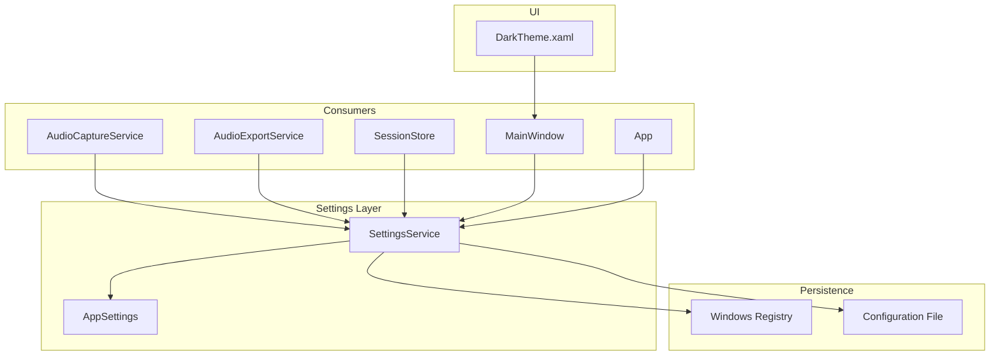
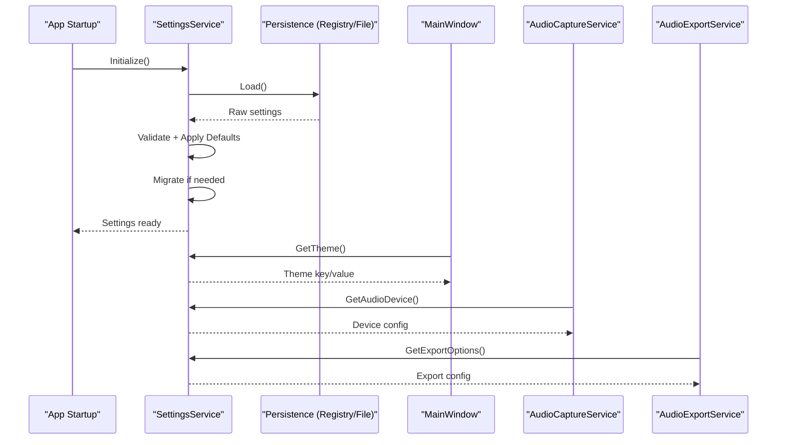
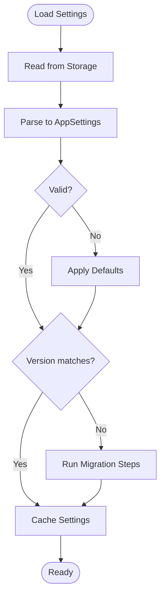
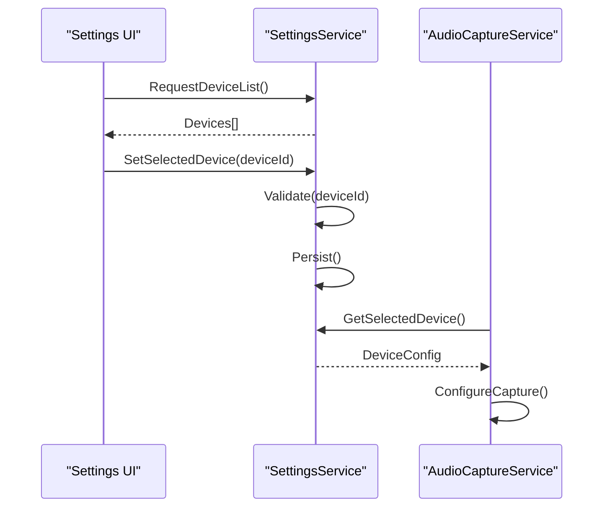
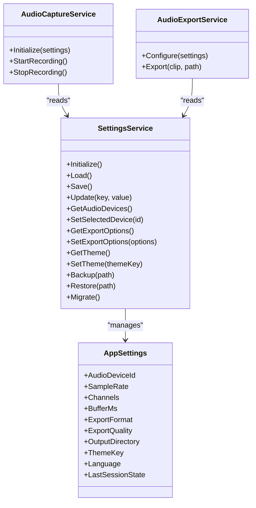

# Settings Management

<cite>
**Referenced Files in This Document**
- [SettingsService.cs](file://Services/SettingsService.cs)
- [AppSettings.cs](file://Models/AppSettings.cs)
- [AudioCaptureService.cs](file://Services/AudioCaptureService.cs)
- [AudioExportService.cs](file://Services/AudioExportService.cs)
- [SessionStore.cs](file://Services/SessionStore.cs)
- [DarkTheme.xaml](file://Themes/DarkTheme.xaml)
- [MainWindow.xaml.cs](file://MainWindow.xaml.cs)
- [App.xaml.cs](file://App.xaml.cs)
</cite>

## Table of Contents
1. [Introduction](#introduction)
2. [Project Structure](#project-structure)
3. [Core Components](#core-components)
4. [Architecture Overview](#architecture-overview)
5. [Detailed Component Analysis](#detailed-component-analysis)
6. [Dependency Analysis](#dependency-analysis)
7. [Performance Considerations](#performance-considerations)
8. [Troubleshooting Guide](#troubleshooting-guide)
9. [Conclusion](#conclusion)
10. [Appendices](#appendices)

## Introduction
This document explains the settings and configuration system for SamplerRecorder. It focuses on the SettingsService architecture, the AppSettings model structure, persistence mechanisms, and how to access and modify application preferences such as audio device configurations, theme settings, and export options. It also covers programmatic manipulation patterns, validation rules, default value handling, version migration, backup and restore, and integration with Windows registry or configuration files. Finally, it outlines user interface elements for settings management and advanced configuration scenarios.

## Project Structure
The settings-related code is primarily organized under Services and Models:
- Services/SettingsService.cs: Centralized settings service responsible for loading, saving, validating, and exposing settings to the rest of the application.
- Models/AppSettings.cs: Data model representing all configurable application preferences.
- Supporting services (AudioCaptureService, AudioExportService, SessionStore) consume settings for runtime behavior.
- UI components (MainWindow, App) initialize and bind to settings where applicable.
- Theme resources (DarkTheme.xaml) provide visual themes that can be selected via settings.

**Diagram sources**
- [SettingsService.cs](file://Services/SettingsService.cs)
- [AppSettings.cs](file://Models/AppSettings.cs)
- [AudioCaptureService.cs](file://Services/AudioCaptureService.cs)
- [AudioExportService.cs](file://Services/AudioExportService.cs)
- [SessionStore.cs](file://Services/SessionStore.cs)
- [MainWindow.xaml.cs](file://MainWindow.xaml.cs)
- [App.xaml.cs](file://App.xaml.cs)
- [DarkTheme.xaml](file://Themes/DarkTheme.xaml)

**Section sources**
- [SettingsService.cs](file://Services/SettingsService.cs)
- [AppSettings.cs](file://Models/AppSettings.cs)
- [AudioCaptureService.cs](file://Services/AudioCaptureService.cs)
- [AudioExportService.cs](file://Services/AudioExportService.cs)
- [SessionStore.cs](file://Services/SessionStore.cs)
- [MainWindow.xaml.cs](file://MainWindow.xaml.cs)
- [App.xaml.cs](file://App.xaml.cs)
- [DarkTheme.xaml](file://Themes/DarkTheme.xaml)

## Core Components
- SettingsService: Provides a single entry point to read and write application settings. It encapsulates persistence logic, validation, defaults, and migration. Consumers request settings through this service rather than directly accessing storage.
- AppSettings: A strongly-typed model representing all user-configurable options, including audio devices, recording/export parameters, theme selection, and other preferences.

Key responsibilities:
- Load settings from persistent storage at startup.
- Validate incoming values before persisting.
- Apply default values when keys are missing or invalid.
- Provide change notifications or events for UI updates (if implemented).
- Support migration between versions by detecting schema changes and transforming stored data.

**Section sources**
- [SettingsService.cs](file://Services/SettingsService.cs)
- [AppSettings.cs](file://Models/AppSettings.cs)

## Architecture Overview
The settings architecture follows a layered approach:
- Model layer (AppSettings) defines the shape of configuration data.
- Service layer (SettingsService) manages lifecycle, validation, persistence, and migration.
- Consumer services and UI layers depend only on the service interface, not on storage details.
- Persistence is abstracted behind the service, allowing integration with Windows registry or configuration files without changing consumers.

**Diagram sources**
- [SettingsService.cs](file://Services/SettingsService.cs)
- [AppSettings.cs](file://Models/AppSettings.cs)
- [MainWindow.xaml.cs](file://MainWindow.xaml.cs)
- [AudioCaptureService.cs](file://Services/AudioCaptureService.cs)
- [AudioExportService.cs](file://Services/AudioExportService.cs)

## Detailed Component Analysis

### SettingsService
Responsibilities:
- Initialization and lifecycle management of settings.
- Loading from and saving to persistent storage.
- Validation of settings values.
- Applying default values for missing or invalid entries.
- Version migration to ensure compatibility across app versions.
- Exposing typed accessors for common settings categories (audio, export, theme).

Typical operations:
- Load: Reads raw settings from storage, parses them into AppSettings, validates, applies defaults, migrates, then caches.
- Save: Serializes current AppSettings back to storage atomically where possible.
- Update: Validates new values, merges into current settings, persists changes, and notifies consumers if required.
- Migrate: Detects version differences and transforms stored data to match current schema.

Validation and defaults:
- Enforce non-null constraints, range checks, and format validations.
- Fill missing keys with sensible defaults to prevent runtime errors.

Migration strategy:
- Maintain a version number in settings or metadata.
- On load, compare stored version with current version; apply incremental migrations.
- Preserve user data while updating structure.

Persistence integration:
- Abstract storage behind methods so you can switch between Windows registry and configuration files.
- Ensure thread-safety for concurrent reads/writes.

**Diagram sources**
- [SettingsService.cs](file://Services/SettingsService.cs)

**Section sources**
- [SettingsService.cs](file://Services/SettingsService.cs)

### AppSettings Model
Structure:
- Represents all configurable preferences grouped logically:
  - Audio: device selection, sample rate, channels, buffer size.
  - Export: output format, quality, destination folder, naming pattern.
  - Theme: selected theme resource key or name.
  - General: language, UI options, hotkeys, last session state.
- Strongly-typed properties enable compile-time safety and IntelliSense.
- May include validation attributes or helper methods for in-model checks.

Usage:
- Consumed by SettingsService for serialization/deserialization.
- Accessed via SettingsService getters/setters to enforce validation and persistence.

Best practices:
- Keep properties immutable where possible; expose setters through SettingsService.
- Group related settings into nested objects to improve readability and maintainability.

**Section sources**
- [AppSettings.cs](file://Models/AppSettings.cs)

### Audio Device Configuration
Integration points:
- AudioCaptureService uses settings to select input device and configure capture parameters.
- SettingsService exposes audio device list retrieval and selection helpers.

Workflow:
- Application queries SettingsService for available devices.
- User selects a device in UI; SettingsService validates and saves selection.
- AudioCaptureService reads the selected device and applies configuration during initialization.

**Diagram sources**
- [SettingsService.cs](file://Services/SettingsService.cs)
- [AudioCaptureService.cs](file://Services/AudioCaptureService.cs)

**Section sources**
- [SettingsService.cs](file://Services/SettingsService.cs)
- [AudioCaptureService.cs](file://Services/AudioCaptureService.cs)

### Export Options
Integration points:
- AudioExportService reads export settings to determine output format, quality, and destination.
- SettingsService provides export option getters and validators.

Common options:
- Format (e.g., WAV, MP3), bitrate/quality, sample rate conversion, file naming template, default output directory.

Validation:
- Ensure format is supported, bitrate within allowed ranges, and paths are valid.

**Section sources**
- [SettingsService.cs](file://Services/SettingsService.cs)
- [AudioExportService.cs](file://Services/AudioExportService.cs)

### Theme Settings
Integration points:
- MainWindow and App manage theme switching based on settings.
- DarkTheme.xaml defines theme resources; settings store the active theme key.

Behavior:
- On startup, App loads theme setting and applies corresponding resource dictionary.
- Changing theme in UI triggers SettingsService to update and persist the selection.

**Section sources**
- [SettingsService.cs](file://Services/SettingsService.cs)
- [MainWindow.xaml.cs](file://MainWindow.xaml.cs)
- [App.xaml.cs](file://App.xaml.cs)
- [DarkTheme.xaml](file://Themes/DarkTheme.xaml)

### Backup and Restore
Capabilities:
- SettingsService should support exporting all settings to a portable format (JSON/XML) for backup.
- Import functionality allows restoring settings from a backup file, with conflict resolution strategies (merge, overwrite, skip).

Recommendations:
- Include version metadata in backups to detect compatibility.
- Provide a dry-run mode to preview changes before applying.

**Section sources**
- [SettingsService.cs](file://Services/SettingsService.cs)

### Persistence Mechanisms
Options:
- Windows Registry: Suitable for machine-wide or per-user settings; use appropriate hive (CurrentUser vs LocalMachine).
- Configuration files: JSON or XML files stored in application data directories; easier to version control and migrate.

Implementation guidance:
- Abstract storage behind interfaces to allow swapping implementations.
- Ensure atomic writes to avoid partial corruption.
- Handle permission issues gracefully and log errors.

**Section sources**
- [SettingsService.cs](file://Services/SettingsService.cs)

### Programmatic Manipulation Examples
Patterns:
- Reading settings: Use typed getters from SettingsService to retrieve values safely.
- Updating settings: Call update methods that validate and persist changes.
- Bulk updates: Use transaction-like methods to apply multiple changes atomically.
- Event-driven updates: Subscribe to settings change events to refresh UI or dependent services.

Example flows:
- Change audio device: Retrieve device list, validate selection, update settings, notify AudioCaptureService.
- Modify export options: Validate new options, persist, and inform AudioExportService.

**Section sources**
- [SettingsService.cs](file://Services/SettingsService.cs)
- [AudioCaptureService.cs](file://Services/AudioCaptureService.cs)
- [AudioExportService.cs](file://Services/AudioExportService.cs)

### Validation Rules and Default Values
Rules:
- Non-empty strings for required fields.
- Numeric ranges for sample rates, bitrates, buffer sizes.
- Enumerations for format and theme selections.
- Path validation for output directories.

Defaults:
- Sensible fallbacks when values are missing or invalid.
- Environment-aware defaults (e.g., default device based on OS).

**Section sources**
- [SettingsService.cs](file://Services/SettingsService.cs)
- [AppSettings.cs](file://Models/AppSettings.cs)

### Settings Migration Between Versions
Strategy:
- Store a version field in settings or metadata.
- On load, compare stored version with current version.
- Apply incremental migration steps to transform old schema to new.
- Log migration actions for auditability.

Considerations:
- Preserve user data during migration.
- Make migrations idempotent and reversible where feasible.

**Section sources**
- [SettingsService.cs](file://Services/SettingsService.cs)

### User Interface Elements for Settings Management
Elements:
- Settings dialog or page with sections for Audio, Export, Theme, and General.
- Live previews for theme changes.
- Validation feedback inline with controls.
- Backup/Restore buttons with progress indicators.

Integration:
- Bind UI controls to SettingsService properties.
- Trigger save operations on explicit user action or auto-save with debouncing.

**Section sources**
- [MainWindow.xaml.cs](file://MainWindow.xaml.cs)
- [SettingsService.cs](file://Services/SettingsService.cs)

## Dependency Analysis
SettingsService depends on:
- AppSettings model for data representation.
- Persistence abstraction for registry/file I/O.
- Optional event system for change notifications.

Consumers depend on:
- SettingsService for reading/writing settings.
- Do not directly access storage to maintain separation of concerns.

Potential circular dependencies:
- Avoid having SettingsService depend on consumer services; instead, let consumers subscribe to settings changes.

**Diagram sources**
- [SettingsService.cs](file://Services/SettingsService.cs)
- [AppSettings.cs](file://Models/AppSettings.cs)
- [AudioCaptureService.cs](file://Services/AudioCaptureService.cs)
- [AudioExportService.cs](file://Services/AudioExportService.cs)

**Section sources**
- [SettingsService.cs](file://Services/SettingsService.cs)
- [AppSettings.cs](file://Models/AppSettings.cs)
- [AudioCaptureService.cs](file://Services/AudioCaptureService.cs)
- [AudioExportService.cs](file://Services/AudioExportService.cs)

## Performance Considerations
- Cache settings in memory after initial load to avoid repeated I/O.
- Debounce frequent UI-triggered updates to reduce write operations.
- Use asynchronous I/O for backup/restore to keep UI responsive.
- Minimize validation overhead by batching updates where possible.

## Troubleshooting Guide
Common issues:
- Missing settings keys: Ensure defaults are applied and migration runs correctly.
- Invalid device IDs: Validate device lists against OS capabilities.
- Permission errors on registry/file: Handle exceptions and prompt users appropriately.
- Corrupted backup files: Validate file integrity before restore; provide rollback.

Debugging tips:
- Log all read/write operations with timestamps and values.
- Enable verbose logging for migration steps.
- Use unit tests for validation and migration logic.

**Section sources**
- [SettingsService.cs](file://Services/SettingsService.cs)

## Conclusion
SamplerRecorder’s settings system centers around a robust SettingsService and a well-structured AppSettings model. By abstracting persistence, enforcing validation, applying defaults, and supporting migration, the system ensures reliable configuration management. Consumers like AudioCaptureService and AudioExportService interact solely through the service, maintaining clean boundaries. With proper UI integration and backup/restore capabilities, users can confidently manage their preferences across versions and environments.

## Appendices
- Best practices for extending settings: Add new properties to AppSettings, update validation in SettingsService, and implement migration if needed.
- Security considerations: Protect sensitive settings and avoid storing secrets in plain text; consider encryption where appropriate.
- Testing strategies: Mock SettingsService for unit tests; verify validation and migration paths.