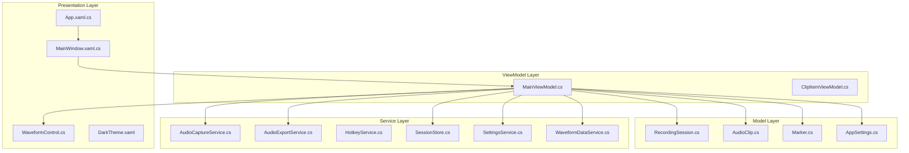
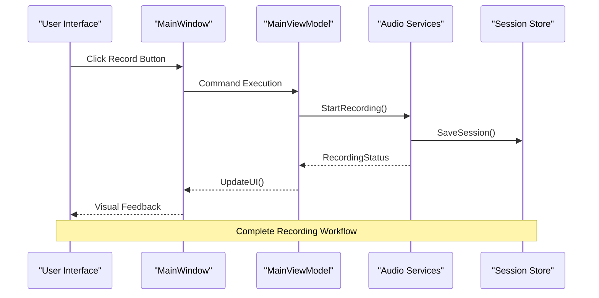
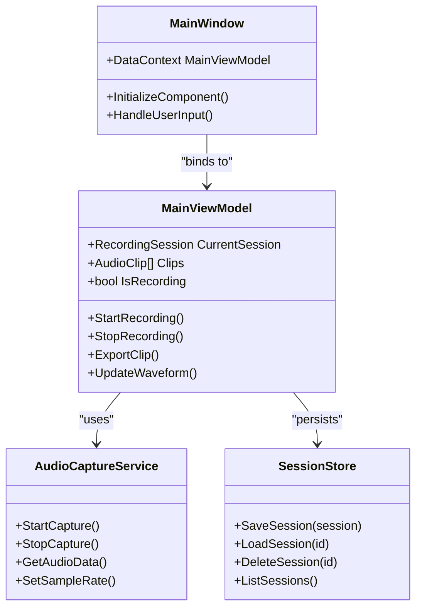
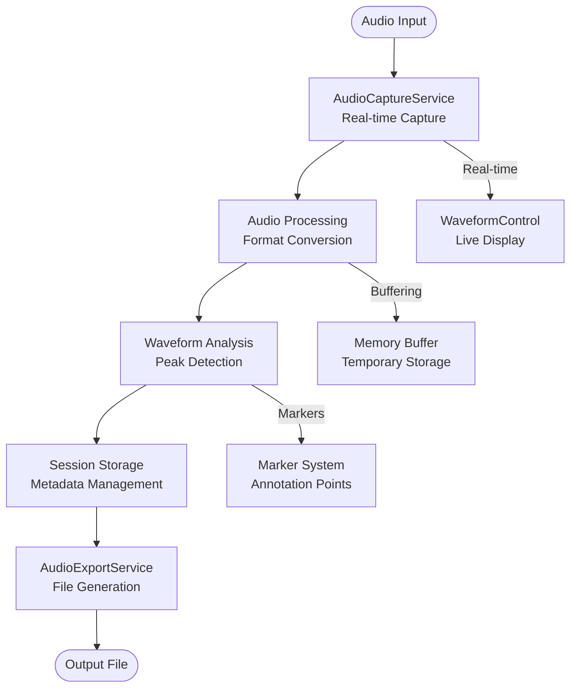
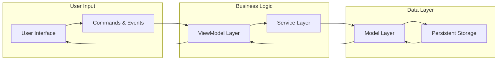
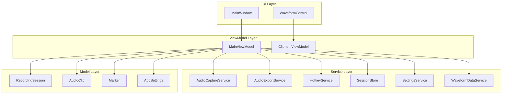

# Application Overview

<cite>
**Referenced Files in This Document**
- [App.xaml.cs](file://App.xaml.cs)
- [MainWindow.xaml.cs](file://MainWindow.xaml.cs)
- [MainViewModel.cs](file://ViewModels/MainViewModel.cs)
- [ClipItemViewModel.cs](file://ViewModels/ClipItemViewModel.cs)
- [AudioCaptureService.cs](file://Services/AudioCaptureService.cs)
- [AudioExportService.cs](file://Services/AudioExportService.cs)
- [HotkeyService.cs](file://Services/HotkeyService.cs)
- [SessionStore.cs](file://Services/SessionStore.cs)
- [SettingsService.cs](file://Services/SettingsService.cs)
- [WaveformDataService.cs](file://Services/WaveformDataService.cs)
- [RecordingSession.cs](file://Models/RecordingSession.cs)
- [AudioClip.cs](file://Models/AudioClip.cs)
- [Marker.cs](file://Models/Marker.cs)
- [AppSettings.cs](file://Models/AppSettings.cs)
- [WaveformControl.cs](file://Controls/WaveformControl.cs)
- [DarkTheme.xaml](file://Themes/DarkTheme.xaml)
- [SamplerRecorder.csproj](file://SamplerRecorder.csproj)
</cite>

## Table of Contents
1. [Introduction](#introduction)
2. [Project Structure](#project-structure)
3. [Core Components](#core-components)
4. [Architecture Overview](#architecture-overview)
5. [Detailed Component Analysis](#detailed-component-analysis)
6. [Dependency Analysis](#dependency-analysis)
7. [Performance Considerations](#performance-considerations)
8. [Troubleshooting Guide](#troubleshooting-guide)
9. [Conclusion](#conclusion)

## Introduction

SamplerRecorder is a desktop audio recording application built using the Model-View-ViewModel (MVVM) architectural pattern. The application serves as a specialized tool for audio production workflows, enabling users to capture, manage, and export audio clips with professional-grade features. As a WPF-based application, it provides a modern, responsive user interface while leveraging .NET Framework/Core capabilities for robust audio processing functionality.

The application is designed primarily for audio engineers, podcasters, musicians, and content creators who require precise control over audio recording sessions, waveform visualization, and efficient workflow management. Its modular architecture ensures scalability and maintainability while providing a seamless user experience for audio production tasks.

## Project Structure

The SamplerRecorder application follows a well-organized MVVM architecture with clear separation of concerns across different layers:

**Diagram sources**
- [App.xaml.cs](file://App.xaml.cs)
- [MainWindow.xaml.cs](file://MainWindow.xaml.cs)
- [MainViewModel.cs](file://ViewModels/MainViewModel.cs)
- [AudioCaptureService.cs](file://Services/AudioCaptureService.cs)
- [RecordingSession.cs](file://Models/RecordingSession.cs)

**Section sources**
- [SamplerRecorder.csproj](file://SamplerRecorder.csproj)
- [App.xaml.cs](file://App.xaml.cs)
- [MainWindow.xaml.cs](file://MainWindow.xaml.cs)

## Core Components

The SamplerRecorder application is built around several core components that work together to provide a comprehensive audio recording solution:

### View Models
The ViewModel layer implements the MVVM pattern's binding logic and business coordination:

- **MainViewModel**: Central coordinator managing application state, recording sessions, and service interactions
- **ClipItemViewModel**: Individual clip representation with properties for UI binding and clip-specific operations

### Services
The Service layer encapsulates business logic and external system interactions:

- **AudioCaptureService**: Handles low-level audio input capture and real-time processing
- **AudioExportService**: Manages audio file export to various formats and quality settings
- **HotkeyService**: Provides global hotkey registration and event handling for quick access
- **SessionStore**: Persistent storage for recording sessions and project data
- **SettingsService**: Application configuration management with user preferences
- **WaveformDataService**: Generates and manages waveform data for visualization

### Models
The Model layer represents domain entities and data structures:

- **RecordingSession**: Core entity representing a complete recording session with metadata
- **AudioClip**: Individual audio clip within a session with timing and properties
- **Marker**: Annotation points within audio clips for navigation and editing
- **AppSettings**: Configuration data structure for application settings

**Section sources**
- [MainViewModel.cs](file://ViewModels/MainViewModel.cs)
- [ClipItemViewModel.cs](file://ViewModels/ClipItemViewModel.cs)
- [AudioCaptureService.cs](file://Services/AudioCaptureService.cs)
- [AudioExportService.cs](file://Services/AudioExportService.cs)
- [HotkeyService.cs](file://Services/HotkeyService.cs)
- [SessionStore.cs](file://Services/SessionStore.cs)
- [SettingsService.cs](file://Services/SettingsService.cs)
- [WaveformDataService.cs](file://Services/WaveformDataService.cs)
- [RecordingSession.cs](file://Models/RecordingSession.cs)
- [AudioClip.cs](file://Models/AudioClip.cs)
- [Marker.cs](file://Models/Marker.cs)
- [AppSettings.cs](file://Models/AppSettings.cs)

## Architecture Overview

The SamplerRecorder application follows a strict MVVM architectural pattern with clear separation between presentation, business logic, and data management layers:

**Diagram sources**
- [MainWindow.xaml.cs](file://MainWindow.xaml.cs)
- [MainViewModel.cs](file://ViewModels/MainViewModel.cs)
- [AudioCaptureService.cs](file://Services/AudioCaptureService.cs)
- [SessionStore.cs](file://Services/SessionStore.cs)

The architecture emphasizes loose coupling through dependency injection and clear interfaces, allowing for easy testing and maintenance. Each component has a single responsibility, promoting code reusability and reducing complexity.

## Detailed Component Analysis

### MVVM Pattern Implementation

The application implements the MVVM pattern with clear separation of concerns:

**Diagram sources**
- [MainWindow.xaml.cs](file://MainWindow.xaml.cs)
- [MainViewModel.cs](file://ViewModels/MainViewModel.cs)
- [AudioCaptureService.cs](file://Services/AudioCaptureService.cs)
- [SessionStore.cs](file://Services/SessionStore.cs)

### Audio Processing Pipeline

The audio processing pipeline handles real-time audio capture, processing, and export:

**Diagram sources**
- [AudioCaptureService.cs](file://Services/AudioCaptureService.cs)
- [WaveformControl.cs](file://Controls/WaveformControl.cs)
- [AudioExportService.cs](file://Services/AudioExportService.cs)
- [WaveformDataService.cs](file://Services/WaveformDataService.cs)

### Data Flow Architecture

The application implements a unidirectional data flow pattern typical of modern MVVM implementations:

**Diagram sources**
- [MainViewModel.cs](file://ViewModels/MainViewModel.cs)
- [RecordingSession.cs](file://Models/RecordingSession.cs)
- [SessionStore.cs](file://Services/SessionStore.cs)

**Section sources**
- [MainViewModel.cs](file://ViewModels/MainViewModel.cs)
- [ClipItemViewModel.cs](file://ViewModels/ClipItemViewModel.cs)
- [AudioCaptureService.cs](file://Services/AudioCaptureService.cs)
- [WaveformControl.cs](file://Controls/WaveformControl.cs)

## Dependency Analysis

The application demonstrates clean dependency management with clear separation between layers:

**Diagram sources**
- [MainWindow.xaml.cs](file://MainWindow.xaml.cs)
- [MainViewModel.cs](file://ViewModels/MainViewModel.cs)
- [All Service Files](file://Services/)
- [All Model Files](file://Models/)

The dependency structure ensures high cohesion within layers and low coupling between them, making the application maintainable and testable.

**Section sources**
- [MainViewModel.cs](file://ViewModels/MainViewModel.cs)
- [All Service Files](file://Services/)
- [All Model Files](file://Models/)

## Performance Considerations

The SamplerRecorder application incorporates several performance optimization strategies:

### Real-time Audio Processing
- Efficient buffer management for low-latency audio capture
- Background threading for non-blocking UI updates
- Optimized waveform generation algorithms
- Memory-mapped file access for large audio files

### UI Responsiveness
- Async/await pattern for long-running operations
- Virtualization for large clip lists
- Debounced property changes to prevent excessive UI updates
- Efficient data binding with minimal overhead

### Resource Management
- Proper disposal of audio resources
- Garbage collection optimization for audio buffers
- Lazy loading of waveform data
- Efficient serialization for session persistence

## Troubleshooting Guide

Common issues and their solutions in the SamplerRecorder application:

### Audio Capture Issues
- **No Audio Input**: Verify audio device permissions and default device selection
- **Latency Problems**: Adjust buffer size and sample rate settings
- **Audio Distortion**: Check input levels and clipping indicators

### Performance Issues
- **UI Freezing**: Ensure background processing for long operations
- **Memory Leaks**: Monitor audio buffer disposal and resource cleanup
- **Slow Export**: Optimize export settings and file format choices

### Session Management
- **Corrupted Sessions**: Implement session validation and recovery mechanisms
- **Missing Files**: Provide file integrity checks and repair utilities
- **Sync Issues**: Handle concurrent access to shared resources

**Section sources**
- [AudioCaptureService.cs](file://Services/AudioCaptureService.cs)
- [SessionStore.cs](file://Services/SessionStore.cs)
- [SettingsService.cs](file://Services/SettingsService.cs)

## Conclusion

SamplerRecorder represents a well-architected desktop audio recording application that effectively implements the MVVM pattern to deliver a professional audio production tool. The application's modular design, clear separation of concerns, and robust service layer make it suitable for both individual audio professionals and team-based production environments.

The technology stack choice of WPF with C# and .NET provides a solid foundation for cross-platform compatibility while maintaining high performance for audio processing tasks. The application's extensible architecture allows for future enhancements such as plugin support, advanced audio effects, and collaborative features.

Key strengths of the implementation include its clean MVVM architecture, comprehensive service layer abstraction, and efficient audio processing pipeline. The application successfully balances usability with technical sophistication, making it an excellent example of modern desktop application development for audio production workflows.