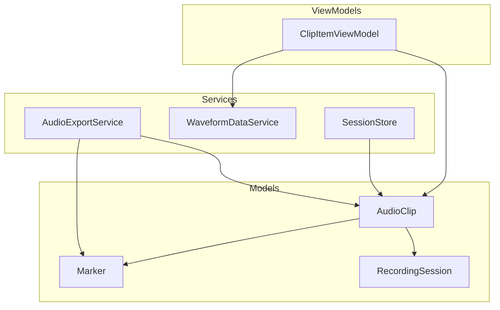
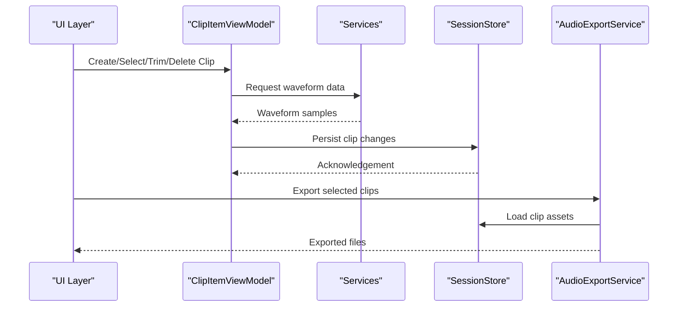
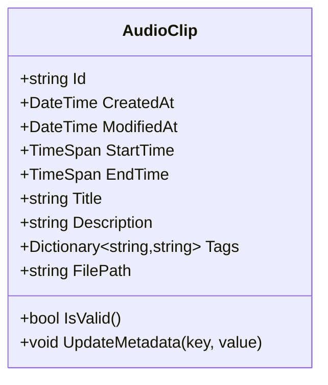
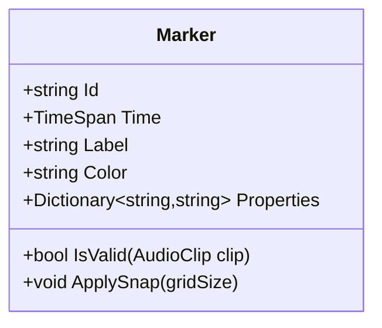
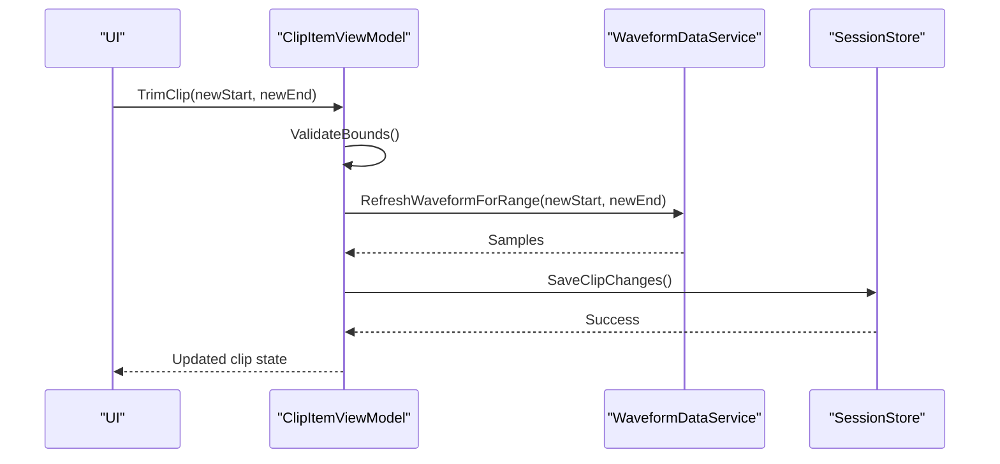
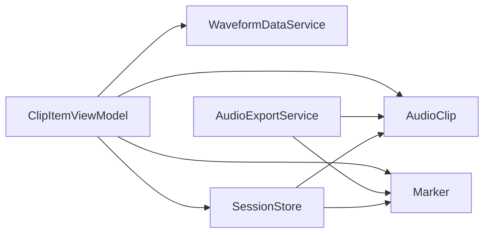

# Clip Management

<cite>
**Referenced Files in This Document**
- [AudioClip.cs](file://Models/AudioClip.cs)
- [Marker.cs](file://Models/Marker.cs)
- [ClipItemViewModel.cs](file://ViewModels/ClipItemViewModel.cs)
- [AudioExportService.cs](file://Services/AudioExportService.cs)
- [SessionStore.cs](file://Services/SessionStore.cs)
- [WaveformDataService.cs](file://Services/WaveformDataService.cs)
- [RecordingSession.cs](file://Models/RecordingSession.cs)
</cite>

## Table of Contents
1. [Introduction](#introduction)
2. [Project Structure](#project-structure)
3. [Core Components](#core-components)
4. [Architecture Overview](#architecture-overview)
5. [Detailed Component Analysis](#detailed-component-analysis)
6. [Dependency Analysis](#dependency-analysis)
7. [Performance Considerations](#performance-considerations)
8. [Troubleshooting Guide](#troubleshooting-guide)
9. [Conclusion](#conclusion)

## Introduction
This document explains the clip management system in SamplerRecorder, focusing on how clips are modeled, segmented via markers, managed through view models, persisted, exported, and optimized for performance. It provides guidance for programmatic manipulation, custom property extensions, and integration with export workflows.

## Project Structure
The clip management system spans Models, ViewModels, and Services layers:
- Models define data structures for clips and markers.
- ViewModels manage UI state and operations for individual clips.
- Services handle persistence, waveform data, and export.

**Diagram sources**
- [AudioClip.cs](file://Models/AudioClip.cs)
- [Marker.cs](file://Models/Marker.cs)
- [ClipItemViewModel.cs](file://ViewModels/ClipItemViewModel.cs)
- [SessionStore.cs](file://Services/SessionStore.cs)
- [WaveformDataService.cs](file://Services/WaveformDataService.cs)
- [AudioExportService.cs](file://Services/AudioExportService.cs)
- [RecordingSession.cs](file://Models/RecordingSession.cs)

**Section sources**
- [AudioClip.cs](file://Models/AudioClip.cs)
- [Marker.cs](file://Models/Marker.cs)
- [ClipItemViewModel.cs](file://ViewModels/ClipItemViewModel.cs)
- [SessionStore.cs](file://Services/SessionStore.cs)
- [WaveformDataService.cs](file://Services/WaveformDataService.cs)
- [AudioExportService.cs](file://Services/AudioExportService.cs)
- [RecordingSession.cs](file://Models/RecordingSession.cs)

## Core Components
- AudioClip: Represents an audio clip with metadata and file associations.
- Marker: Defines segmentation points and annotations within a clip.
- ClipItemViewModel: Encapsulates per-clip state and operations for UI interaction.
- SessionStore: Persists and loads clips and related data.
- WaveformDataService: Provides waveform visualization data for clips.
- AudioExportService: Exports clips and markers into output formats.

Key responsibilities:
- Model integrity and validation for clips and markers.
- ViewModel commands for selection, trimming, moving, and deletion.
- Service-level persistence and export orchestration.

**Section sources**
- [AudioClip.cs](file://Models/AudioClip.cs)
- [Marker.cs](file://Models/Marker.cs)
- [ClipItemViewModel.cs](file://ViewModels/ClipItemViewModel.cs)
- [SessionStore.cs](file://Services/SessionStore.cs)
- [WaveformDataService.cs](file://Services/WaveformDataService.cs)
- [AudioExportService.cs](file://Services/AudioExportService.cs)

## Architecture Overview
The clip management follows a layered architecture:
- Models hold immutable or validated state.
- ViewModels expose reactive properties and commands for UI binding.
- Services implement cross-cutting concerns like persistence and export.

**Diagram sources**
- [ClipItemViewModel.cs](file://ViewModels/ClipItemViewModel.cs)
- [SessionStore.cs](file://Services/SessionStore.cs)
- [AudioExportService.cs](file://Services/AudioExportService.cs)
- [WaveformDataService.cs](file://Services/WaveformDataService.cs)

## Detailed Component Analysis

### AudioClip Model
Responsibilities:
- Stores clip identity, timestamps, duration, and file paths.
- Holds metadata such as title, tags, notes, and custom properties.
- Maintains relationships to markers and session context.

Data model highlights:
- Identity fields: unique ID, creation time, modification time.
- Temporal fields: start time, end time, duration.
- File associations: path to audio asset, thumbnail or preview.
- Metadata: descriptive fields and extensible key-value store.
- Validation: ensures non-negative durations and valid file references.

Complexity considerations:
- O(1) access to core properties.
- Metadata dictionary operations are O(1) average case.
- Memory footprint scales with number of clips and metadata size.

Best practices:
- Keep metadata minimal; offload large blobs to external storage.
- Validate before persistence to avoid inconsistent states.

**Section sources**
- [AudioClip.cs](file://Models/AudioClip.cs)

#### Class Diagram

**Diagram sources**
- [AudioClip.cs](file://Models/AudioClip.cs)

### Marker System
Responsibilities:
- Define precise positions within a clip for segmentation and annotation.
- Support labels, colors, and arbitrary metadata.
- Maintain ordering and uniqueness constraints.

Features:
- Creation at current playhead position or by time offset.
- Dragging and snapping to grid or other markers.
- Persistence alongside clip data.

Validation rules:
- Marker times must be within clip bounds.
- Duplicate times resolved by snapping or error feedback.

Operations:
- Add, remove, reorder markers.
- Batch update marker metadata.

**Section sources**
- [Marker.cs](file://Models/Marker.cs)

#### Class Diagram

**Diagram sources**
- [Marker.cs](file://Models/Marker.cs)

### ClipItemViewModel
Responsibilities:
- Wraps an AudioClip instance for UI binding.
- Exposes commands for create, select, trim, move, delete, duplicate.
- Coordinates with services for waveform data and persistence.

State management:
- Selected state, editing flags, and undo/redo stack.
- Reactive properties for UI updates (e.g., IsSelected, DisplayName).

Commands:
- TrimClip(start, end): adjusts clip boundaries and validates.
- MoveClip(offset): shifts temporal position with boundary checks.
- DeleteClip(): removes clip and associated resources.
- AddMarker(time, label): inserts a marker with validation.

Integration:
- Requests waveform samples from WaveformDataService.
- Persists changes via SessionStore.
- Triggers export actions via AudioExportService.

**Section sources**
- [ClipItemViewModel.cs](file://ViewModels/ClipItemViewModel.cs)

#### Sequence Diagram: Trim Operation

**Diagram sources**
- [ClipItemViewModel.cs](file://ViewModels/ClipItemViewModel.cs)
- [WaveformDataService.cs](file://Services/WaveformDataService.cs)
- [SessionStore.cs](file://Services/SessionStore.cs)

### Lifecycle Management
Creation:
- New clips created from recordings or imports.
- Initial metadata set and default markers added if needed.

Editing:
- In-memory edits buffered until save.
- Undo/redo supported via command history.

Persistence:
- Changes saved incrementally or on explicit save.
- References to external assets maintained via stable paths.

Deletion:
- Soft delete flag or immediate removal depending on policy.
- Cleanup of temporary files and thumbnails.

Batch operations:
- Select multiple clips for bulk trim, move, tag, or delete.
- Progress reporting and rollback on partial failures.

Search and filter:
- Filter by title, tags, date range, duration, and presence of markers.
- Full-text search over metadata.

**Section sources**
- [SessionStore.cs](file://Services/SessionStore.cs)
- [ClipItemViewModel.cs](file://ViewModels/ClipItemViewModel.cs)

### Programmatic Manipulation Examples
- Create a clip programmatically: instantiate AudioClip, set metadata, persist via SessionStore.
- Add markers: call ViewModel.AddMarker or service-level methods for batch insertion.
- Export workflow: use AudioExportService to export selected clips with markers embedded in metadata or sidecar files.

Custom property extensions:
- Extend AudioClip metadata dictionary for domain-specific attributes.
- Use consistent naming conventions and validate values during edit.

Integration with export:
- Map clip metadata to export headers or sidecar JSON/XML.
- Include marker annotations in export artifacts for downstream processing.

**Section sources**
- [AudioExportService.cs](file://Services/AudioExportService.cs)
- [SessionStore.cs](file://Services/SessionStore.cs)
- [AudioClip.cs](file://Models/AudioClip.cs)
- [Marker.cs](file://Models/Marker.cs)

## Dependency Analysis
Relationships:
- ClipItemViewModel depends on AudioClip and Marker models.
- Services depend on models and coordinate persistence/export.
- SessionStore orchestrates read/write operations across clips and markers.

Potential coupling:
- Tight coupling between ViewModel and specific services can hinder testability.
- Decouple via interfaces for WaveformDataService and SessionStore.

Circular dependencies:
- Avoid circular references between models and services.
- Ensure ViewModel does not directly reference low-level IO.

**Diagram sources**
- [ClipItemViewModel.cs](file://ViewModels/ClipItemViewModel.cs)
- [AudioClip.cs](file://Models/AudioClip.cs)
- [Marker.cs](file://Models/Marker.cs)
- [WaveformDataService.cs](file://Services/WaveformDataService.cs)
- [SessionStore.cs](file://Services/SessionStore.cs)
- [AudioExportService.cs](file://Services/AudioExportService.cs)

**Section sources**
- [ClipItemViewModel.cs](file://ViewModels/ClipItemViewModel.cs)
- [AudioClip.cs](file://Models/AudioClip.cs)
- [Marker.cs](file://Models/Marker.cs)
- [WaveformDataService.cs](file://Services/WaveformDataService.cs)
- [SessionStore.cs](file://Services/SessionStore.cs)
- [AudioExportService.cs](file://Services/AudioExportService.cs)

## Performance Considerations
- Lazy loading: load waveform data on demand for visible clips only.
- Virtualization: render only visible items in clip lists.
- Caching: cache waveform samples and thumbnails with eviction policies.
- Batching: group persistence writes to reduce IO overhead.
- Memory optimization:
  - Stream large audio assets instead of loading fully into memory.
  - Use weak references for transient objects.
  - Dispose of unmanaged resources promptly.
- Concurrency:
  - Offload heavy operations to background threads.
  - Use thread-safe collections for shared state.

[No sources needed since this section provides general guidance]

## Troubleshooting Guide
Common issues:
- Invalid clip duration: ensure start <= end and both within asset bounds.
- Missing file associations: verify file paths exist and permissions are correct.
- Marker out-of-bounds: clamp or reject markers outside clip limits.
- Export failures: check codec support and available disk space.

Debugging steps:
- Inspect ViewModel state and command parameters.
- Log SessionStore operations to confirm persistence.
- Validate waveform data ranges and sample rates.

Recovery strategies:
- Implement undo/redo for user actions.
- Provide fallbacks for missing assets (placeholders).
- Graceful degradation when export codecs unavailable.

**Section sources**
- [ClipItemViewModel.cs](file://ViewModels/ClipItemViewModel.cs)
- [SessionStore.cs](file://Services/SessionStore.cs)
- [AudioExportService.cs](file://Services/AudioExportService.cs)

## Conclusion
The clip management system in SamplerRecorder is structured around robust models, responsive view models, and dedicated services for persistence and export. By following the guidelines for lifecycle management, performance optimization, and extensibility, developers can build reliable and scalable audio clip workflows. Adhering to validation rules and best practices ensures data integrity and a smooth user experience.