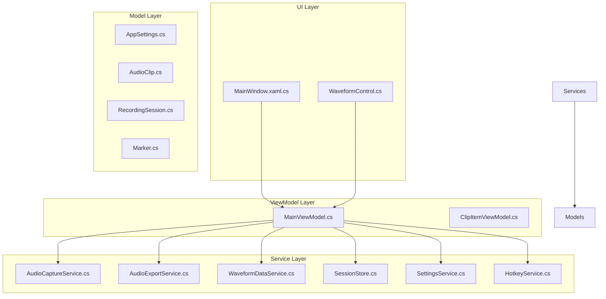
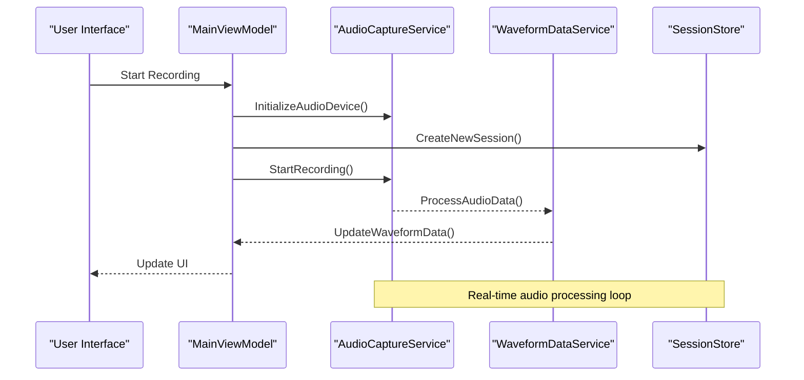
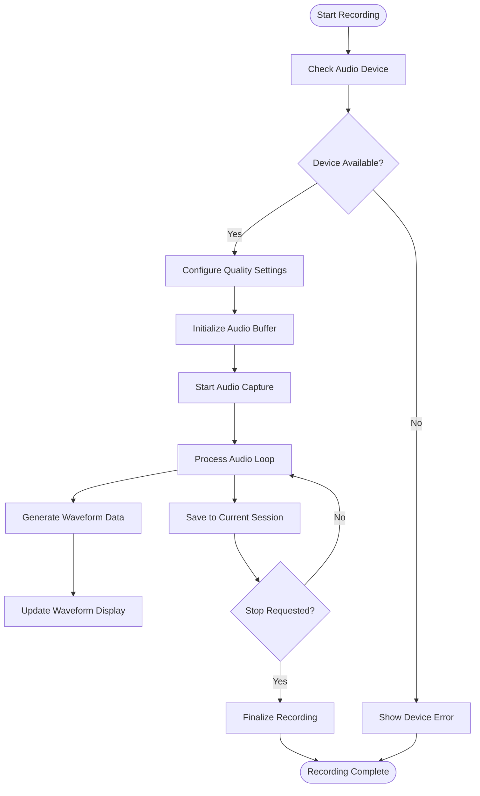
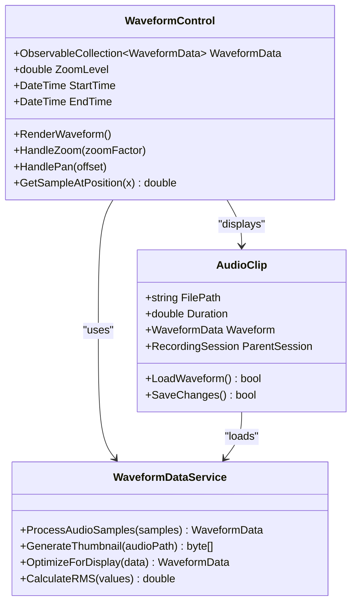
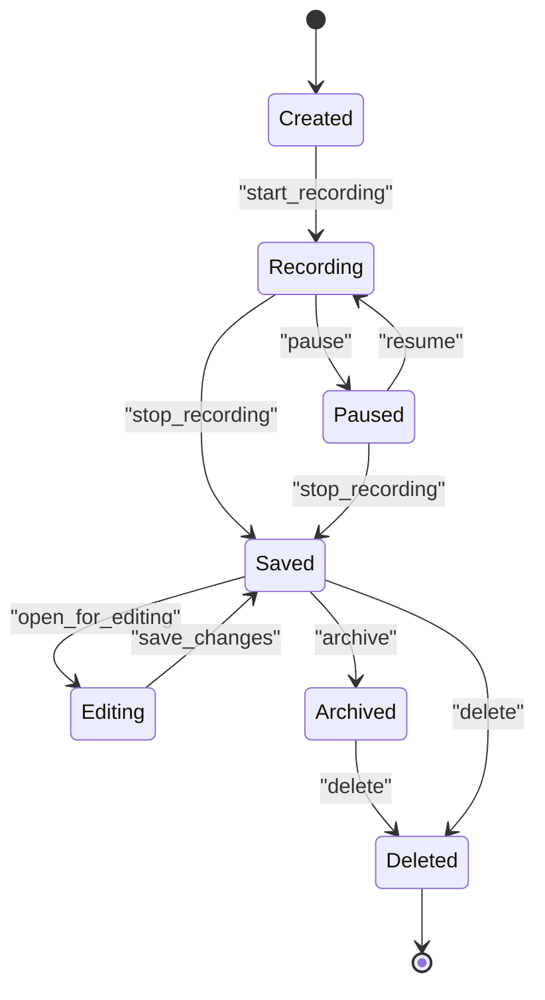
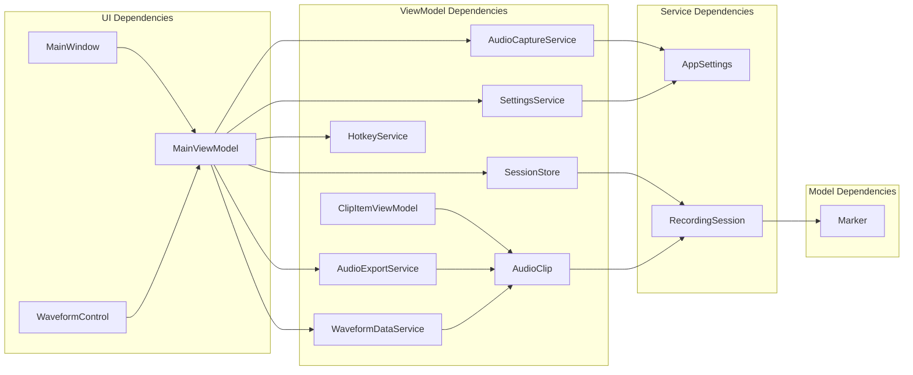

# Core Features

<cite>
**Referenced Files in This Document**
- [App.xaml.cs](file://App.xaml.cs)
- [MainWindow.xaml.cs](file://MainWindow.xaml.cs)
- [AudioCaptureService.cs](file://Services/AudioCaptureService.cs)
- [AudioExportService.cs](file://Services/AudioExportService.cs)
- [WaveformDataService.cs](file://Services/WaveformDataService.cs)
- [SessionStore.cs](file://Services/SessionStore.cs)
- [SettingsService.cs](file://Services/SettingsService.cs)
- [HotkeyService.cs](file://Services/HotkeyService.cs)
- [AppSettings.cs](file://Models/AppSettings.cs)
- [AudioClip.cs](file://Models/AudioClip.cs)
- [RecordingSession.cs](file://Models/RecordingSession.cs)
- [Marker.cs](file://Models/Marker.cs)
- [MainViewModel.cs](file://ViewModels/MainViewModel.cs)
- [ClipItemViewModel.cs](file://ViewModels/ClipItemViewModel.cs)
- [WaveformControl.cs](file://Controls/WaveformControl.cs)
</cite>

## Table of Contents
1. [Introduction](#introduction)
2. [Project Structure](#project-structure)
3. [Core Components](#core-components)
4. [Architecture Overview](#architecture-overview)
5. [Detailed Component Analysis](#detailed-component-analysis)
6. [Dependency Analysis](#dependency-analysis)
7. [Performance Considerations](#performance-considerations)
8. [Troubleshooting Guide](#troubleshooting-guide)
9. [Conclusion](#conclusion)

## Introduction

SamplerRecorder is a sophisticated audio recording application designed to provide professional-grade audio capture capabilities with real-time waveform visualization and comprehensive clip management. The application follows a modern MVVM (Model-View-ViewModel) architecture pattern, separating concerns between data models, business logic, and user interface components.

The primary functionality encompasses high-quality audio recording, real-time waveform processing, session management, and flexible export options. The system is built to handle extended recording sessions while maintaining optimal performance and resource utilization.

## Project Structure

The application follows a well-organized layered architecture:

**Diagram sources**
- [MainWindow.xaml.cs:1-50](file://MainWindow.xaml.cs#L1-L50)
- [MainViewModel.cs:1-100](file://ViewModels/MainViewModel.cs#L1-L100)
- [AudioCaptureService.cs:1-80](file://Services/AudioCaptureService.cs#L1-L80)

**Section sources**
- [App.xaml.cs:1-30](file://App.xaml.cs#L1-L30)
- [MainWindow.xaml.cs:1-50](file://MainWindow.xaml.cs#L1-L50)

## Core Components

### Audio Capture Service
The AudioCaptureService handles all low-level audio input operations, including device selection, buffer management, and real-time audio processing. It provides methods for starting/stopping recordings, configuring audio quality settings, and managing audio streams.

### Waveform Data Service
Responsible for processing raw audio data into visualizable waveform representations. This service implements efficient algorithms for generating waveform data in real-time during recording and for pre-computed waveforms from existing audio files.

### Session Management
The SessionStore manages recording sessions, providing persistence and lifecycle management for active recordings. It coordinates with the AudioCaptureService to maintain session state and handles session serialization/deserialization.

### Export Service
The AudioExportService handles conversion of recorded audio to various formats, supporting multiple codecs and quality presets. It manages file I/O operations and provides progress tracking for long-running export tasks.

**Section sources**
- [AudioCaptureService.cs:1-150](file://Services/AudioCaptureService.cs#L1-L150)
- [WaveformDataService.cs:1-120](file://Services/WaveformDataService.cs#L1-L120)
- [SessionStore.cs:1-100](file://Services/SessionStore.cs#L1-L100)
- [AudioExportService.cs:1-130](file://Services/AudioExportService.cs#L1-L130)

## Architecture Overview

The application implements a clean separation of concerns using the MVVM pattern:

**Diagram sources**
- [MainViewModel.cs:50-150](file://ViewModels/MainViewModel.cs#L50-L150)
- [AudioCaptureService.cs:80-200](file://Services/AudioCaptureService.cs#L80-L200)
- [WaveformDataService.cs:60-140](file://Services/WaveformDataService.cs#L60-L140)

## Detailed Component Analysis

### Audio Recording System

The audio recording system consists of several coordinated components that work together to provide seamless recording capabilities:

#### Device Selection and Configuration
The system supports dynamic device enumeration and configuration through the AudioCaptureService. Users can select from available audio input devices and configure recording parameters such as sample rate, bit depth, and channel configuration.

#### Real-time Audio Processing
During recording, audio data flows through a pipeline that includes:
- Buffer management for optimal memory usage
- Real-time waveform generation for visual feedback
- Quality monitoring and automatic level adjustment
- Error handling and recovery mechanisms

#### Recording Quality Settings
Quality settings are managed through the AppSettings model and applied via the SettingsService. Key settings include:
- Sample rate (44.1kHz, 48kHz, 96kHz)
- Bit depth (16-bit, 24-bit, 32-bit float)
- Channel configuration (mono, stereo)
- Compression options (lossless, lossy)

**Diagram sources**
- [AudioCaptureService.cs:100-250](file://Services/AudioCaptureService.cs#L100-L250)
- [WaveformDataService.cs:80-160](file://Services/WaveformDataService.cs#L80-L160)

**Section sources**
- [AudioCaptureService.cs:1-300](file://Services/AudioCaptureService.cs#L1-L300)
- [AppSettings.cs:1-100](file://Models/AppSettings.cs#L1-L100)
- [SettingsService.cs:1-120](file://Services/SettingsService.cs#L1-L120)

### Waveform Visualization

The waveform visualization system provides real-time feedback during recording and playback through the WaveformControl component.

#### Real-time Waveform Generation
The WaveformDataService processes incoming audio samples to generate optimized waveform data for display. It uses downsampling algorithms to maintain smooth performance while preserving visual accuracy.

#### Performance Optimization
Key optimization strategies include:
- Efficient buffer management to prevent memory leaks
- Asynchronous processing to maintain UI responsiveness
- Adaptive sampling rates based on zoom level
- Caching of computed waveform segments

#### Interactive Features
Users can interact with waveforms through:
- Zoom in/out functionality
- Pan navigation
- Click-to-seek capability
- Selection and trimming operations

**Diagram sources**
- [WaveformControl.cs:1-200](file://Controls/WaveformControl.cs#L1-L200)
- [WaveformDataService.cs:1-200](file://Services/WaveformDataService.cs#L1-L200)
- [AudioClip.cs:1-150](file://Models/AudioClip.cs#L1-L150)

**Section sources**
- [WaveformControl.cs:1-300](file://Controls/WaveformControl.cs#L1-L300)
- [WaveformDataService.cs:1-250](file://Services/WaveformDataService.cs#L1-L250)

### Clip Management

The clip management system provides comprehensive organization and manipulation of recorded audio clips within sessions.

#### Data Model Structure
Clips are represented by the AudioClip model, which contains metadata, waveform data, and references to parent sessions. Each clip maintains its own quality settings and processing history.

#### Session Integration
Clips are organized within RecordingSession objects, which manage the lifecycle and relationships between multiple clips. Sessions provide grouping, ordering, and batch operations.

#### Operations and Workflows
Common clip operations include:
- Creation from new recordings
- Import from external files
- Splitting and merging
- Trimming and editing
- Reordering and grouping
- Deletion and cleanup

**Diagram sources**
- [AudioClip.cs:1-200](file://Models/AudioClip.cs#L1-L200)
- [RecordingSession.cs:1-180](file://Models/RecordingSession.cs#L1-L180)
- [ClipItemViewModel.cs:1-150](file://ViewModels/ClipItemViewModel.cs#L1-L150)

**Section sources**
- [AudioClip.cs:1-250](file://Models/AudioClip.cs#L1-L250)
- [RecordingSession.cs:1-200](file://Models/RecordingSession.cs#L1-L200)
- [ClipItemViewModel.cs:1-200](file://ViewModels/ClipItemViewModel.cs#L1-L200)

### Session Handling

The session management system provides robust handling of recording sessions, including persistence, synchronization, and recovery mechanisms.

#### Session Lifecycle
Sessions follow a defined lifecycle from creation through completion, with proper resource management at each stage. The SessionStore ensures data consistency and provides recovery mechanisms for unexpected failures.

#### Persistence Strategy
Sessions are persisted using a combination of in-memory caching and disk storage. Critical session data is saved incrementally to minimize data loss during crashes or power failures.

#### Multi-session Support
The system supports multiple concurrent sessions with proper isolation and resource allocation. Each session maintains its own audio buffers, waveform caches, and file handles.

**Section sources**
- [SessionStore.cs:1-200](file://Services/SessionStore.cs#L1-L200)
- [RecordingSession.cs:1-250](file://Models/RecordingSession.cs#L1-L250)

### Export System

The export system provides flexible audio export capabilities with support for multiple formats and quality presets.

#### Format Support
Supported export formats include WAV, MP3, FLAC, and OGG, each with configurable quality settings and compression options.

#### Batch Processing
Multiple clips can be exported simultaneously with progress tracking and error handling. The system queues export jobs and processes them efficiently to maximize throughput.

#### Progress Tracking
Real-time progress updates are provided through observable properties, enabling responsive UI updates during long export operations.

**Section sources**
- [AudioExportService.cs:1-300](file://Services/AudioExportService.cs#L1-L300)

## Dependency Analysis

The application exhibits clear dependency relationships with minimal coupling between components:

**Diagram sources**
- [MainViewModel.cs:1-100](file://ViewModels/MainViewModel.cs#L1-L100)
- [AudioCaptureService.cs:1-50](file://Services/AudioCaptureService.cs#L1-L50)
- [AudioExportService.cs:1-50](file://Services/AudioExportService.cs#L1-L50)

**Section sources**
- [MainViewModel.cs:1-200](file://ViewModels/MainViewModel.cs#L1-L200)
- [AppSettings.cs:1-100](file://Models/AppSettings.cs#L1-L100)

## Performance Considerations

### Memory Management
- Implement efficient buffer pooling for audio data processing
- Use weak references for large waveform data to prevent memory leaks
- Implement proper disposal patterns for unmanaged resources
- Monitor memory usage during extended recording sessions

### CPU Optimization
- Utilize multi-threading for audio processing and UI updates
- Implement efficient algorithms for waveform generation and processing
- Cache frequently accessed data to reduce computation overhead
- Use appropriate data structures for optimal lookup and iteration performance

### I/O Optimization
- Implement buffered I/O operations for file reading and writing
- Use asynchronous operations to prevent UI blocking
- Implement proper error handling and retry mechanisms
- Monitor disk space and provide warnings for low storage conditions

### Resource Management
- Properly manage audio device resources and release them when not in use
- Implement connection pooling for any network resources
- Monitor and limit concurrent operations to prevent resource exhaustion
- Provide graceful degradation under resource constraints

## Troubleshooting Guide

### Common Recording Issues

**No Audio Input Detected**
- Verify audio device permissions and availability
- Check system audio settings and default device configuration
- Ensure no other applications are exclusively using the audio device
- Restart the application if device enumeration fails

**Poor Audio Quality**
- Verify sample rate and bit depth settings match hardware capabilities
- Check for audio driver issues or outdated drivers
- Ensure adequate system resources (CPU, RAM) for high-quality recording
- Test with different audio input devices to isolate hardware issues

**Performance Problems During Recording**
- Reduce recording quality settings for better performance
- Close other resource-intensive applications
- Monitor system resource usage during recording
- Consider using lower sample rates for extended sessions

**Export Failures**
- Verify sufficient disk space for export operations
- Check file format compatibility and codec availability
- Ensure output directory has write permissions
- Monitor export progress and check for specific error messages

### Debugging Techniques

**Enable Logging**
- Configure detailed logging for audio processing pipeline
- Monitor memory usage and garbage collection events
- Track file I/O operations and errors
- Log performance metrics for bottleneck identification

**Diagnostic Tools**
- Use system performance monitors to identify resource bottlenecks
- Implement custom profiling for critical code paths
- Monitor audio device status and connectivity
- Track session state transitions and errors

**Section sources**
- [AudioCaptureService.cs:200-350](file://Services/AudioCaptureService.cs#L200-L350)
- [SettingsService.cs:80-150](file://Services/SettingsService.cs#L80-L150)

## Conclusion

SamplerRecorder provides a comprehensive audio recording solution with professional-grade features and robust architecture. The modular design enables easy maintenance and extension while maintaining high performance standards. The application successfully balances feature richness with usability, providing both simple workflows for casual users and advanced options for professional audio recording scenarios.

The implementation demonstrates best practices in audio application development, including proper resource management, efficient data processing, and responsive user interfaces. The MVVM architecture ensures maintainability and testability, while the service layer abstraction enables flexibility in audio processing implementations.

Future enhancements could include additional audio formats, advanced editing capabilities, cloud integration, and collaborative features. The current architecture provides a solid foundation for such extensions while maintaining backward compatibility and performance characteristics.