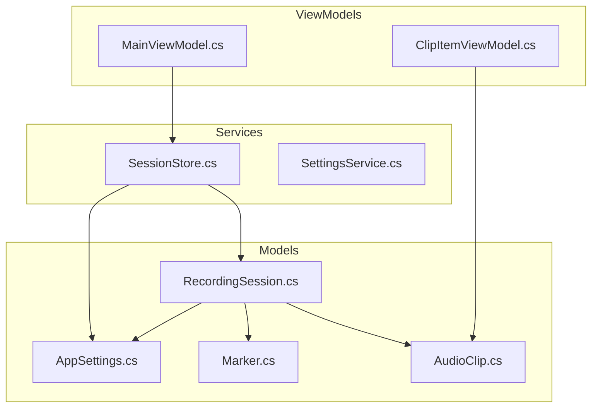
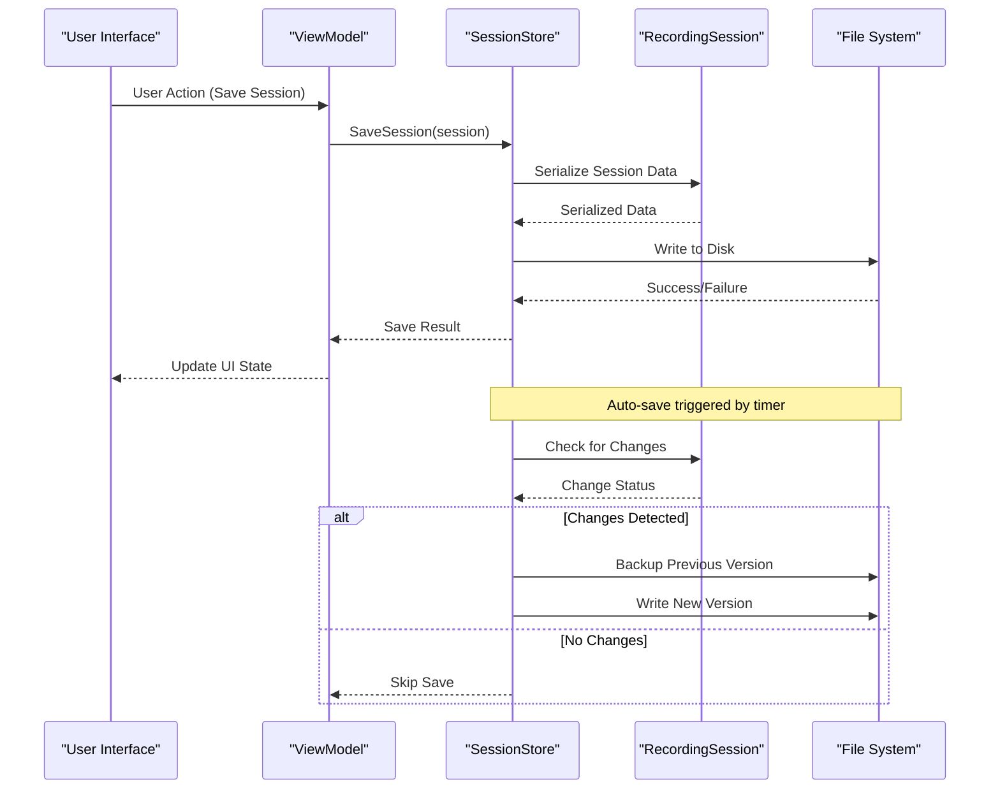
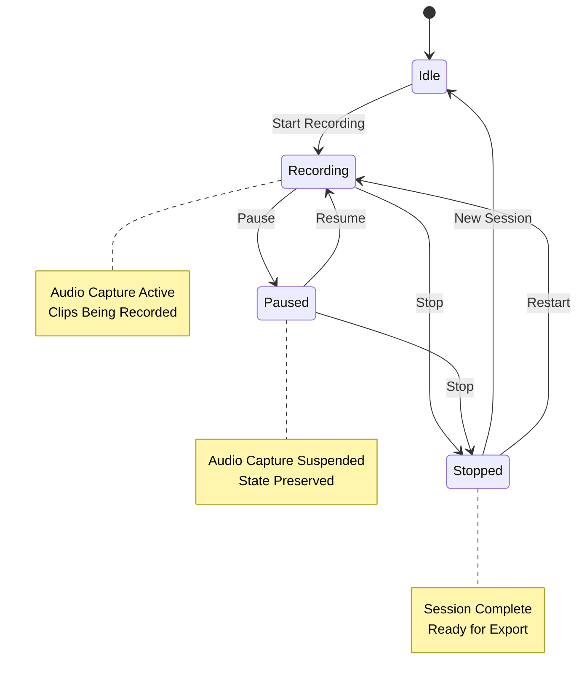
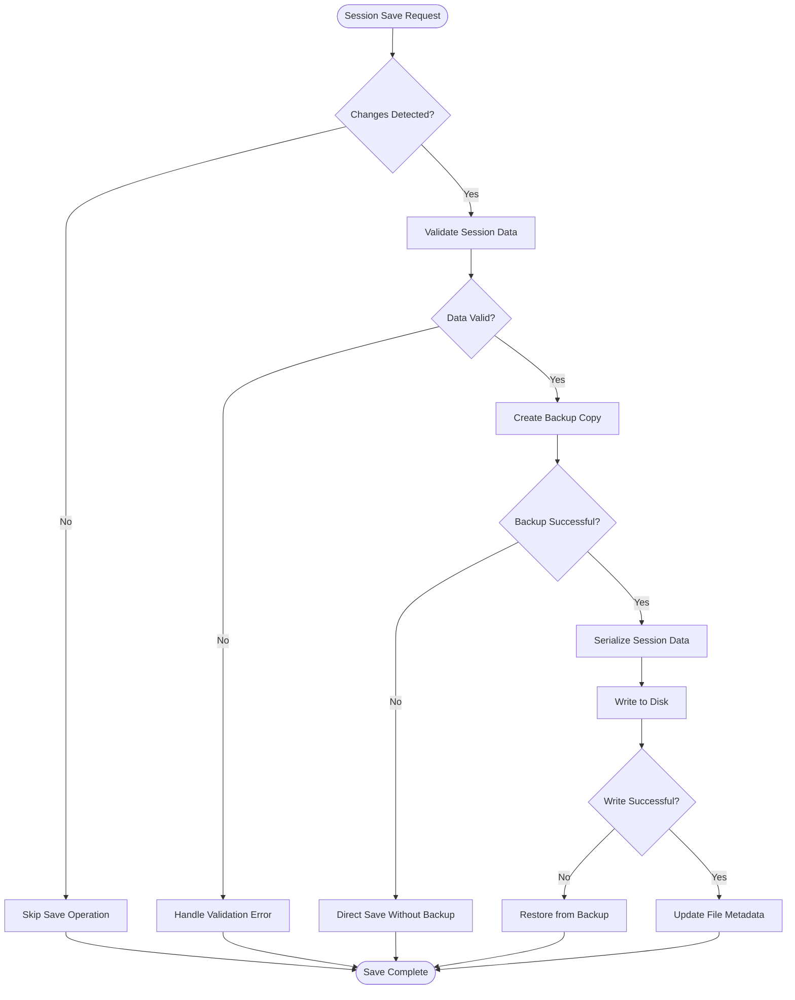
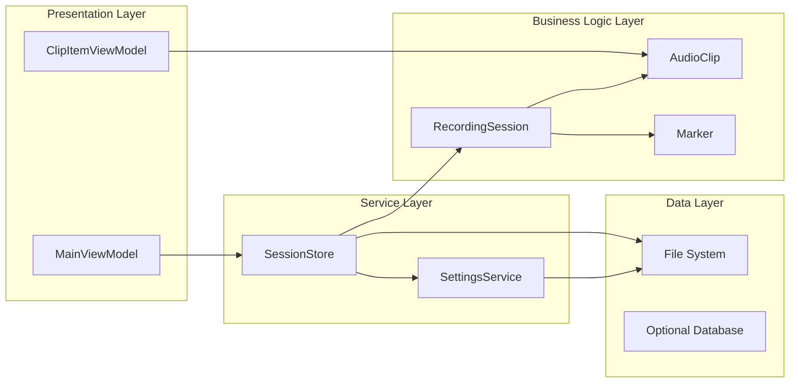

# Session Handling

<cite>
**Referenced Files in This Document**
- [RecordingSession.cs](file://Models/RecordingSession.cs)
- [SessionStore.cs](file://Services/SessionStore.cs)
- [AppSettings.cs](file://Models/AppSettings.cs)
- [SettingsService.cs](file://Services/SettingsService.cs)
- [AudioClip.cs](file://Models/AudioClip.cs)
- [Marker.cs](file://Models/Marker.cs)
</cite>

## Table of Contents
1. [Introduction](#introduction)
2. [Project Structure](#project-structure)
3. [Core Components](#core-components)
4. [Architecture Overview](#architecture-overview)
5. [Detailed Component Analysis](#detailed-component-analysis)
6. [Dependency Analysis](#dependency-analysis)
7. [Performance Considerations](#performance-considerations)
8. [Troubleshooting Guide](#troubleshooting-guide)
9. [Conclusion](#conclusion)
10. [Appendices](#appendices)

## Introduction

The SamplerRecorder session management system provides a robust framework for managing audio recording sessions, including state tracking, clip collections, and application settings persistence. The system is designed to handle automatic session saving, recovery mechanisms, and cross-platform compatibility while maintaining data integrity during concurrent access scenarios.

This documentation covers the complete session lifecycle from creation to destruction, including import/export functionality, backup procedures, and advanced features like custom metadata extension and session synchronization.

## Project Structure

The session management system is organized across several key directories:

**Diagram sources**
- [RecordingSession.cs:1-200](file://Models/RecordingSession.cs#L1-L200)
- [SessionStore.cs:1-300](file://Services/SessionStore.cs#L1-L300)
- [AppSettings.cs:1-150](file://Models/AppSettings.cs#L1-L150)

**Section sources**
- [RecordingSession.cs:1-200](file://Models/RecordingSession.cs#L1-L200)
- [SessionStore.cs:1-300](file://Services/SessionStore.cs#L1-L300)

## Core Components

### RecordingSession Model

The `RecordingSession` class serves as the central data model for managing audio recording sessions. It encapsulates all session-related data including state tracking, clip collections, markers, and application settings.

#### Key Properties and State Management

The RecordingSession model implements a comprehensive state machine that tracks the current session status through various states such as Idle, Recording, Paused, and Stopped. Each state transition is validated and logged for debugging purposes.

#### Clip Collection Management

The session maintains a collection of AudioClip objects, each representing a recorded audio segment. The collection supports operations like adding, removing, reordering, and searching clips based on various criteria.

#### Settings Integration

Application settings are persisted within the session model, allowing for seamless transfer of user preferences between sessions and applications.

**Section sources**
- [RecordingSession.cs:1-200](file://Models/RecordingSession.cs#L1-L200)
- [AudioClip.cs:1-100](file://Models/AudioClip.cs#L1-L100)
- [Marker.cs:1-80](file://Models/Marker.cs#L1-L80)

### SessionStore Service

The `SessionStore` service provides persistent storage capabilities for recording sessions, implementing both file-based storage and memory caching for optimal performance.

#### Automatic Saving Mechanism

The service implements an intelligent auto-save mechanism that triggers saves based on configurable intervals, session state changes, and user interactions. It uses a debouncing strategy to prevent excessive disk writes during rapid state changes.

#### Recovery System

A robust recovery system automatically detects corrupted or incomplete session files and attempts to restore the last known good state. The system maintains backup copies of previous sessions to ensure data integrity.

#### File Format and Migration

Sessions are stored in a structured format that supports versioning and migration. The service handles backward and forward compatibility when loading sessions created with different versions of the application.

**Section sources**
- [SessionStore.cs:1-300](file://Services/SessionStore.cs#L1-L300)

### AppSettings Model

The `AppSettings` class manages application-wide configuration settings that persist across sessions and application restarts. It includes user preferences, default recording parameters, and UI customization options.

**Section sources**
- [AppSettings.cs:1-150](file://Models/AppSettings.cs#L1-L150)

## Architecture Overview

The session management system follows a layered architecture pattern with clear separation of concerns:

**Diagram sources**
- [SessionStore.cs:150-250](file://Services/SessionStore.cs#L150-L250)
- [RecordingSession.cs:80-150](file://Models/RecordingSession.cs#L80-L150)

The architecture ensures loose coupling between components while maintaining high cohesion within each layer. The SessionStore acts as a mediator between the business logic (RecordingSession) and persistence mechanisms (File System).

## Detailed Component Analysis

### RecordingSession State Machine

The RecordingSession implements a sophisticated state machine that manages the lifecycle of audio recording sessions:

**Diagram sources**
- [RecordingSession.cs:40-120](file://Models/RecordingSession.cs#L40-L120)

### Session Persistence Flow

The persistence mechanism handles complex scenarios including concurrent access, partial writes, and corruption recovery:

**Diagram sources**
- [SessionStore.cs:200-300](file://Services/SessionStore.cs#L200-L300)

### Import/Export Functionality

The session management system provides comprehensive import/export capabilities for sharing sessions between users and platforms:

#### Export Process
- Supports multiple formats (JSON, XML, proprietary binary)
- Includes optional compression for reduced file size
- Handles large sessions through streaming operations
- Validates exported data before completion

#### Import Process
- Accepts multiple input formats with automatic detection
- Performs schema validation and version compatibility checks
- Offers conflict resolution strategies for duplicate content
- Provides preview mode for selective import

**Section sources**
- [SessionStore.cs:100-200](file://Services/SessionStore.cs#L100-L200)

### Cross-Platform Compatibility

The system ensures compatibility across different operating systems through:

- Abstracted file path handling using platform-specific utilities
- Consistent encoding and line ending normalization
- Platform-appropriate file permissions and security models
- Memory management optimized for different architectures

## Dependency Analysis

The session management system exhibits well-defined dependencies between components:

**Diagram sources**
- [RecordingSession.cs:1-200](file://Models/RecordingSession.cs#L1-L200)
- [SessionStore.cs:1-300](file://Services/SessionStore.cs#L1-L300)
- [AppSettings.cs:1-150](file://Models/AppSettings.cs#L1-L150)

The dependency structure promotes modularity and testability while maintaining clear separation between concerns.

## Performance Considerations

The session management system incorporates several performance optimizations:

### Memory Management
- Lazy loading of large clip collections
- Garbage collection optimization for temporary objects
- Efficient serialization using streaming for large datasets

### I/O Optimization
- Asynchronous file operations to prevent UI blocking
- Buffered writing with configurable buffer sizes
- Intelligent caching of frequently accessed data

### Concurrency Control
- Thread-safe operations using appropriate locking mechanisms
- Optimistic concurrency control for collaborative editing scenarios
- Background processing for non-critical operations

## Troubleshooting Guide

### Common Issues and Solutions

#### Session Corruption Recovery
When sessions become corrupted due to power failures or crashes:

1. **Automatic Recovery**: The system attempts to load the last known good backup
2. **Manual Recovery**: Use the built-in recovery tool to scan and repair damaged files
3. **Data Extraction**: Extract recoverable data from severely corrupted sessions

#### Performance Degradation
If session operations become slow:

1. **Check Storage Space**: Ensure adequate disk space for session files
2. **Monitor Memory Usage**: Verify sufficient RAM allocation for large sessions
3. **Optimize Settings**: Adjust auto-save intervals and cache sizes

#### Cross-Platform Issues
For compatibility problems:

1. **Verify File Permissions**: Ensure proper read/write access to session directories
2. **Check Encoding**: Confirm consistent character encoding across platforms
3. **Validate Paths**: Use absolute paths when sharing sessions between systems

**Section sources**
- [SessionStore.cs:250-350](file://Services/SessionStore.cs#L250-L350)

## Conclusion

The SamplerRecorder session management system provides a comprehensive solution for managing audio recording sessions with robust persistence, recovery, and cross-platform support. The modular architecture enables easy extension and customization while maintaining high performance and reliability.

Key strengths include:
- Comprehensive state management with full lifecycle support
- Intelligent auto-save and recovery mechanisms
- Flexible import/export capabilities
- Strong error handling and data integrity protection
- Cross-platform compatibility considerations

The system is designed to scale with growing requirements while maintaining backward compatibility and ease of use.

## Appendices

### Extending Session Data with Custom Metadata

To add custom metadata to sessions:

1. **Extend the RecordingSession class** with additional properties
2. **Implement serialization/deserialization** for new fields
3. **Add validation logic** for custom data types
4. **Update UI components** to display and edit custom metadata

### Implementing Session Synchronization

For multi-device synchronization:

1. **Implement conflict detection** using timestamps and checksums
2. **Define merge strategies** for conflicting changes
3. **Provide user interface** for resolving conflicts
4. **Support offline operation** with automatic sync when connected

### Handling Session Corruption Scenarios

Recovery procedures for different corruption types:

1. **Partial File Corruption**: Use backup files and checksum validation
2. **Schema Incompatibility**: Implement version migration strategies
3. **Missing Dependencies**: Provide fallback implementations and warnings
4. **Data Inconsistency**: Run integrity checks and repair algorithms