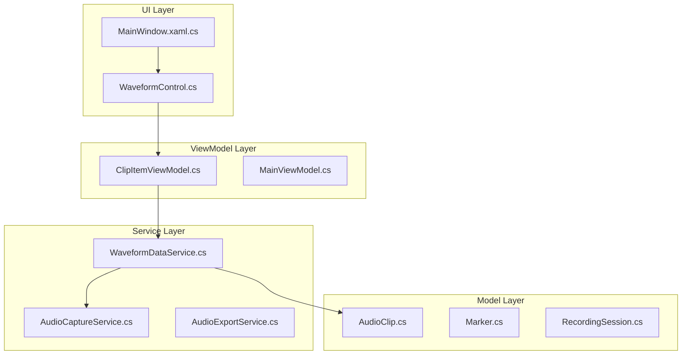
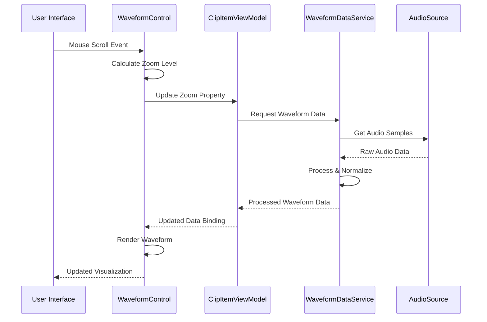
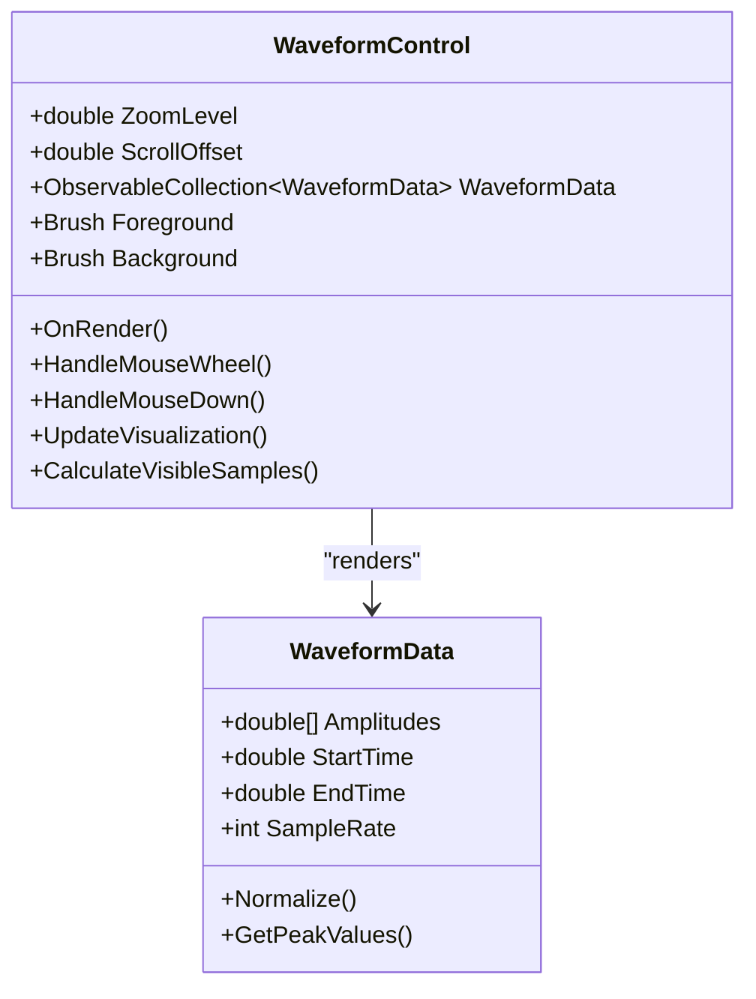
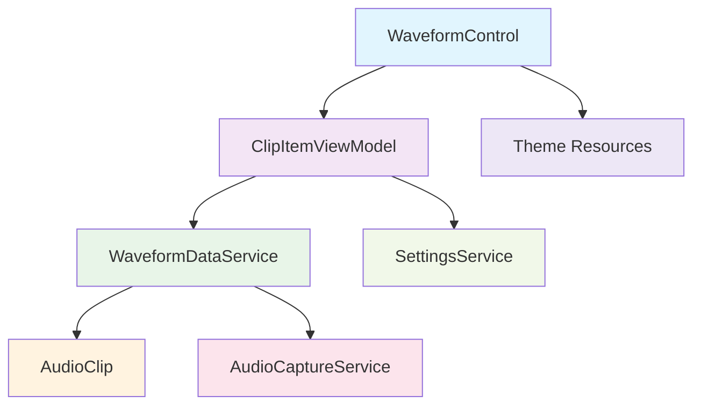
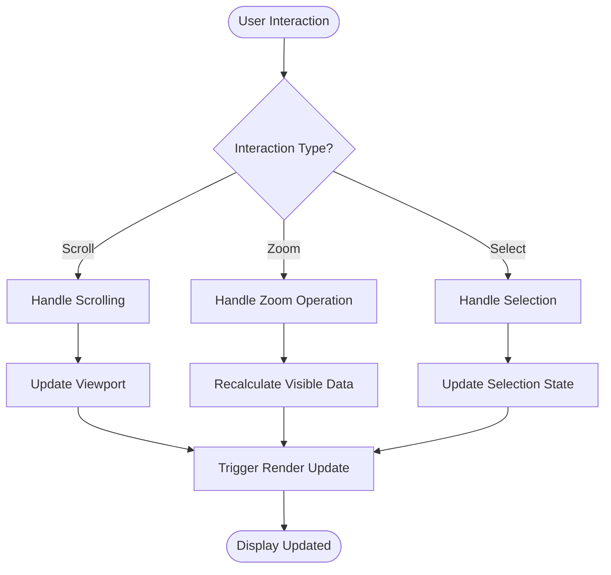

# Waveform Visualization

<cite>
**Referenced Files in This Document**
- [WaveformControl.cs](file://Controls/WaveformControl.cs)
- [WaveformDataService.cs](file://Services/WaveformDataService.cs)
- [AudioClip.cs](file://Models/AudioClip.cs)
- [ClipItemViewModel.cs](file://ViewModels/ClipItemViewModel.cs)
- [MainWindow.xaml.cs](file://MainWindow.xaml.cs)
- [App.xaml.cs](file://App.xaml.cs)
</cite>

## Table of Contents
1. [Introduction](#introduction)
2. [Project Structure](#project-structure)
3. [Core Components](#core-components)
4. [Architecture Overview](#architecture-overview)
5. [Detailed Component Analysis](#detailed-component-analysis)
6. [Dependency Analysis](#dependency-analysis)
7. [Performance Considerations](#performance-considerations)
8. [User Interaction Patterns](#user-interaction-patterns)
9. [Customization Options](#customization-options)
10. [Troubleshooting Guide](#troubleshooting-guide)
11. [Conclusion](#conclusion)

## Introduction

The SamplerRecorder waveform visualization system provides a sophisticated WPF-based interface for displaying, manipulating, and interacting with audio waveforms. This system enables users to visualize audio recordings with real-time updates, precise zoom controls, selection capabilities, and seamless integration with recording workflows. The implementation follows modern WPF patterns with custom drawing algorithms optimized for large audio files while maintaining smooth user interactions.

## Project Structure

The waveform visualization system is organized into distinct layers following MVVM architecture principles:

**Diagram sources**
- [WaveformControl.cs](file://Controls/WaveformControl.cs)
- [WaveformDataService.cs](file://Services/WaveformDataService.cs)
- [ClipItemViewModel.cs](file://ViewModels/ClipItemViewModel.cs)
- [AudioClip.cs](file://Models/AudioClip.cs)

**Section sources**
- [WaveformControl.cs](file://Controls/WaveformControl.cs)
- [WaveformDataService.cs](file://Services/WaveformDataService.cs)
- [ClipItemViewModel.cs](file://ViewModels/ClipItemViewModel.cs)

## Core Components

### WaveformControl Custom WPF Control

The `WaveformControl` is a custom WPF control that extends the base `Control` class to provide specialized waveform rendering functionality. It implements custom drawing logic using WPF's graphics APIs to render audio data efficiently.

Key responsibilities include:
- Custom rendering pipeline for waveform visualization
- Mouse interaction handling for scrolling and zooming
- Real-time update mechanisms during recording
- Visual feedback for selection states
- Performance optimization through virtualization

### WaveformDataService Data Processing Service

The `WaveformDataService` serves as the central data processing component responsible for converting raw audio samples into visual representations. It handles sample rate conversion, memory management, and data transformation operations.

Primary functions encompass:
- Audio sample processing and normalization
- Memory-efficient data chunking for large files
- Sample rate handling and resampling
- Peak detection and amplitude calculation
- Cache management for performance optimization

**Section sources**
- [WaveformControl.cs](file://Controls/WaveformControl.cs)
- [WaveformDataService.cs](file://Services/WaveformDataService.cs)

## Architecture Overview

The waveform visualization system follows a layered architecture pattern with clear separation of concerns:

**Diagram sources**
- [WaveformControl.cs](file://Controls/WaveformControl.cs)
- [ClipItemViewModel.cs](file://ViewModels/ClipItemViewModel.cs)
- [WaveformDataService.cs](file://Services/WaveformDataService.cs)

The architecture ensures:
- **Loose Coupling**: Components communicate through well-defined interfaces
- **Testability**: Each layer can be tested independently
- **Scalability**: Easy addition of new features without affecting existing code
- **Maintainability**: Clear separation makes debugging and updates straightforward

## Detailed Component Analysis

### WaveformControl Implementation

The `WaveformControl` implements a sophisticated rendering engine with multiple optimization strategies:

#### Rendering Algorithm
The control uses a pixel-based rendering approach where each column represents a time segment of the audio. For each column, it calculates the minimum and maximum amplitude values within that segment to create the characteristic waveform shape.

#### Zoom Functionality
Zoom operations are implemented through viewport manipulation rather than data resampling. The control maintains a virtual coordinate system that maps to the actual audio data, allowing smooth zoom transitions without recalculating all data points.

#### Real-time Updates
During recording, the control implements incremental updates by only redrawing changed portions of the waveform. This prevents UI freezing and maintains responsive interactions even during active recording sessions.

**Diagram sources**
- [WaveformControl.cs](file://Controls/WaveformControl.cs)
- [AudioClip.cs](file://Models/AudioClip.cs)

### WaveformDataService Processing Pipeline

The `WaveformDataService` implements a multi-stage processing pipeline designed for optimal performance with large audio files:

#### Memory Management Strategy
The service processes audio data in chunks to prevent memory overflow when handling large files. Each chunk is processed independently and results are cached strategically to balance memory usage with retrieval speed.

#### Sample Rate Handling
Automatic sample rate detection and conversion ensures compatibility across different audio formats. The service normalizes all input to a consistent internal format before visualization processing.

#### Optimization Techniques
- **Lazy Loading**: Data is loaded on-demand as the user scrolls or zooms
- **Caching**: Frequently accessed data segments are cached in memory
- **Background Processing**: Heavy computations run on background threads
- **Progressive Rendering**: Initial low-resolution display followed by detailed updates

**Section sources**
- [WaveformDataService.cs](file://Services/WaveformDataService.cs)
- [AudioClip.cs](file://Models/AudioClip.cs)

## Dependency Analysis

The waveform system exhibits careful dependency management with minimal coupling between components:

**Diagram sources**
- [WaveformControl.cs](file://Controls/WaveformControl.cs)
- [ClipItemViewModel.cs](file://ViewModels/ClipItemViewModel.cs)
- [WaveformDataService.cs](file://Services/WaveformDataService.cs)

Key dependency characteristics:
- **Unidirectional Flow**: Dependencies flow downward from UI to services
- **Interface-Based**: Services are accessed through abstract interfaces
- **Event-Driven**: Loose coupling through event notifications
- **Configuration-Driven**: Behavior controlled through settings rather than hardcoded values

**Section sources**
- [WaveformControl.cs](file://Controls/WaveformControl.cs)
- [ClipItemViewModel.cs](file://ViewModels/ClipItemViewModel.cs)
- [WaveformDataService.cs](file://Services/WaveformDataService.cs)

## Performance Considerations

### Memory Optimization Strategies

The system employs several techniques to handle large audio files efficiently:

1. **Chunked Processing**: Audio data is processed in manageable chunks (typically 1MB segments)
2. **Virtual Scrolling**: Only visible portions of the waveform are rendered
3. **Lazy Loading**: Data loads progressively as needed
4. **Garbage Collection Tuning**: Strategic object disposal to minimize GC pressure

### Rendering Performance

Rendering optimizations include:
- **Hardware Acceleration**: Utilization of WPF's GPU acceleration where available
- **Batched Drawing**: Multiple drawing operations are batched to reduce overhead
- **Anti-Aliasing Control**: Selective anti-aliasing based on zoom level
- **Canvas Optimization**: Efficient use of WPF canvas elements

### Threading Model

The system uses a multi-threaded approach:
- **UI Thread**: Handles user interactions and rendering
- **Background Threads**: Perform heavy audio processing tasks
- **Async Operations**: Non-blocking data loading and processing

## User Interaction Patterns

### Scrolling and Navigation

Users can navigate through long audio recordings using:
- **Mouse Wheel Scrolling**: Smooth horizontal scrolling with configurable sensitivity
- **Keyboard Navigation**: Arrow keys for precise movement
- **Touch Gestures**: Swipe gestures on touch-enabled devices
- **Programmatic Navigation**: API methods for automated navigation

### Zoom Controls

Multiple zoom methods are supported:
- **Mouse Wheel Zoom**: Centered zoom with smooth transitions
- **Button Controls**: Dedicated zoom in/out buttons
- **Gesture Support**: Pinch-to-zoom on touch devices
- **Range Selection**: Click and drag to select specific time ranges

### Selection and Editing

Selection functionality includes:
- **Click Selection**: Single click to set playhead position
- **Drag Selection**: Click and drag to select time ranges
- **Multi-Selection**: Shift+click for multiple selections
- **Copy/Cut/Paste**: Standard editing operations on selected regions

**Diagram sources**
- [WaveformControl.cs](file://Controls/WaveformControl.cs)

## Customization Options

### Visual Appearance

The waveform display supports extensive customization:

#### Color Schemes
- **Foreground Color**: Waveform line color
- **Background Color**: Canvas background
- **Selection Color**: Highlight color for selected regions
- **Grid Lines**: Optional grid overlay with customizable colors

#### Styling Options
- **Line Width**: Adjustable thickness of waveform lines
- **Smoothing**: Anti-aliasing toggle for smoother appearance
- **Grid Overlay**: Optional frequency markers and time indicators
- **Theme Integration**: Automatic theme switching support

### Performance Tuning

Configurable performance parameters include:
- **Cache Size**: Memory allocation for waveform data caching
- **Update Frequency**: Refresh rate for real-time updates
- **Quality vs Speed**: Trade-off between visual quality and performance
- **Memory Limits**: Maximum memory usage thresholds

### Extension Points

The system provides extension mechanisms for additional features:

#### Visual Indicators
- **Markers**: Custom markers for important timestamps
- **Annotations**: Text annotations at specific positions
- **Heat Maps**: Visual representation of audio energy levels
- **Spectrum Display**: Optional frequency domain visualization

#### Custom Renderers
- **Alternative Algorithms**: Pluggable rendering algorithms
- **Specialized Views**: Different visualization modes (spectrogram, etc.)
- **Export Formats**: Custom export options for generated images

**Section sources**
- [WaveformControl.cs](file://Controls/WaveformControl.cs)
- [App.xaml.cs](file://App.xaml.cs)

## Troubleshooting Guide

### Common Issues and Solutions

#### Performance Problems
- **Symptom**: Slow scrolling or laggy interactions
- **Solution**: Adjust cache size settings or reduce visual quality
- **Diagnostic**: Monitor memory usage and frame rates

#### Memory Issues
- **Symptom**: Application crashes with large files
- **Solution**: Enable chunked processing and increase memory limits
- **Diagnostic**: Use memory profiling tools to identify leaks

#### Rendering Artifacts
- **Symptom**: Incorrect waveform display or visual glitches
- **Solution**: Verify sample rate configuration and data integrity
- **Diagnostic**: Check audio file format and encoding

#### Real-time Update Problems
- **Symptom**: Stuttering during recording
- **Solution**: Optimize update frequency and background processing
- **Diagnostic**: Monitor thread utilization and CPU usage

### Debugging Tools

Built-in debugging capabilities include:
- **Performance Metrics**: Real-time FPS and memory usage monitoring
- **Error Logging**: Comprehensive logging of processing errors
- **Visual Diagnostics**: Overlay showing current zoom level and viewport
- **Export Functions**: Save diagnostic information for analysis

**Section sources**
- [WaveformDataService.cs](file://Services/WaveformDataService.cs)
- [WaveformControl.cs](file://Controls/WaveformControl.cs)

## Conclusion

The SamplerRecorder waveform visualization system provides a robust, high-performance solution for audio waveform display and interaction. Through careful architectural design, efficient algorithms, and comprehensive customization options, it delivers an excellent user experience for both casual and professional audio editing workflows.

The system's modular architecture ensures easy maintenance and extensibility, while its performance optimizations enable smooth operation even with large audio files. The extensive customization options allow developers to tailor the visualization to specific needs, and the well-documented extension points facilitate future enhancements.

Key strengths of the implementation include:
- **High Performance**: Optimized for large audio files and real-time updates
- **User-Friendly**: Intuitive interactions with multiple input methods
- **Extensible**: Clean architecture supporting customizations and extensions
- **Reliable**: Robust error handling and debugging capabilities

This foundation provides an excellent platform for building sophisticated audio editing applications with professional-grade waveform visualization capabilities.