# Development Guide

<cite>
**Referenced Files in This Document**
- [SamplerRecorder.csproj](file://SamplerRecorder.csproj)
- [App.xaml](file://App.xaml)
- [App.xaml.cs](file://App.xaml.cs)
- [MainWindow.xaml](file://MainWindow.xaml)
- [MainWindow.xaml.cs](file://MainWindow.xaml.cs)
- [AssemblyInfo.cs](file://AssemblyInfo.cs)
- [Controls/WaveformControl.cs](file://Controls/WaveformControl.cs)
- [Models/AppSettings.cs](file://Models/AppSettings.cs)
- [Models/AudioClip.cs](file://Models/AudioClip.cs)
- [Models/Marker.cs](file://Models/Marker.cs)
- [Models/RecordingSession.cs](file://Models/RecordingSession.cs)
- [Services/AudioCaptureService.cs](file://Services/AudioCaptureService.cs)
- [Services/AudioExportService.cs](file://Services/AudioExportService.cs)
- [Services/HotkeyService.cs](file://Services/HotkeyService.cs)
- [Services/SessionStore.cs](file://Services/SessionStore.cs)
- [Services/SettingsService.cs](file://Services/SettingsService.cs)
- [Services/WaveformDataService.cs](file://Services/WaveformDataService.cs)
- [Themes/DarkTheme.xaml](file://Themes/DarkTheme.xaml)
- [ViewModels/ClipItemViewModel.cs](file://ViewModels/ClipItemViewModel.cs)
- [ViewModels/MainViewModel.cs](file://ViewModels/MainViewModel.cs)
</cite>

## Table of Contents
1. [Introduction](#introduction)
2. [Project Structure](#project-structure)
3. [Core Components](#core-components)
4. [Architecture Overview](#architecture-overview)
5. [Detailed Component Analysis](#detailed-component-analysis)
6. [Dependency Analysis](#dependency-analysis)
7. [Performance Considerations](#performance-considerations)
8. [Troubleshooting Guide](#troubleshooting-guide)
9. [Conclusion](#conclusion)
10. [Appendices](#appendices)

## Introduction
This development guide explains how to set up the development environment, understand the project structure, build and run SamplerRecorder, debug issues, test functionality, and contribute code following established conventions. It also covers architectural principles, extension points for new audio formats and custom controls, version control workflows, issue reporting, and performance profiling techniques.

## Project Structure
The solution is a WPF application organized by feature areas:
- UI layer: XAML views and code-behind
- ViewModels: presentation logic and data binding
- Models: domain entities and settings
- Services: audio capture, export, hotkeys, session persistence, settings, waveform processing
- Controls: reusable UI components (waveform visualization)
- Themes: styling resources
- Entry points: App and MainWindow

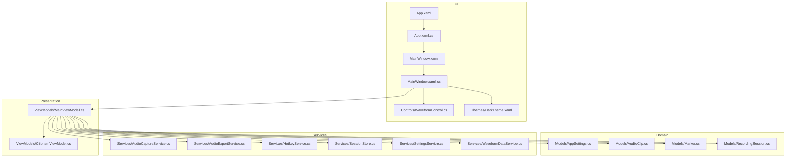

**Diagram sources**
- [App.xaml](file://App.xaml)
- [App.xaml.cs](file://App.xaml.cs)
- [MainWindow.xaml](file://MainWindow.xaml)
- [MainWindow.xaml.cs](file://MainWindow.xaml.cs)
- [Controls/WaveformControl.cs](file://Controls/WaveformControl.cs)
- [ViewModels/MainViewModel.cs](file://ViewModels/MainViewModel.cs)
- [ViewModels/ClipItemViewModel.cs](file://ViewModels/ClipItemViewModel.cs)
- [Models/AppSettings.cs](file://Models/AppSettings.cs)
- [Models/AudioClip.cs](file://Models/AudioClip.cs)
- [Models/Marker.cs](file://Models/Marker.cs)
- [Models/RecordingSession.cs](file://Models/RecordingSession.cs)
- [Services/AudioCaptureService.cs](file://Services/AudioCaptureService.cs)
- [Services/AudioExportService.cs](file://Services/AudioExportService.cs)
- [Services/HotkeyService.cs](file://Services/HotkeyService.cs)
- [Services/SessionStore.cs](file://Services/SessionStore.cs)
- [Services/SettingsService.cs](file://Services/SettingsService.cs)
- [Services/WaveformDataService.cs](file://Services/WaveformDataService.cs)
- [Themes/DarkTheme.xaml](file://Themes/DarkTheme.xaml)

**Section sources**
- [SamplerRecorder.csproj](file://SamplerRecorder.csproj)
- [App.xaml](file://App.xaml)
- [App.xaml.cs](file://App.xaml.cs)
- [MainWindow.xaml](file://MainWindow.xaml)
- [MainWindow.xaml.cs](file://MainWindow.xaml.cs)

## Core Components
- Application bootstrap: Initializes services, theme, and main window lifecycle.
- Main window: Hosts UI, binds to view models, and wires user interactions.
- ViewModels: Coordinate UI state, orchestrate service calls, and expose observable data.
- Models: Represent recording sessions, clips, markers, and app settings.
- Services: Encapsulate audio capture, export, hotkey handling, session persistence, settings management, and waveform data generation.
- Controls: Provide waveform visualization and interaction.
- Theme: Centralized styling for consistent look-and-feel.

Key responsibilities:
- AudioCaptureService: manages input device selection, buffering, and real-time capture.
- AudioExportService: encodes and writes audio files to disk with format-specific options.
- HotkeyService: registers global shortcuts for start/stop/pause actions.
- SessionStore: persists active sessions and metadata across runs.
- SettingsService: loads/saves user preferences and runtime configuration.
- WaveformDataService: computes waveform samples for rendering.

**Section sources**
- [App.xaml.cs](file://App.xaml.cs)
- [MainWindow.xaml.cs](file://MainWindow.xaml.cs)
- [ViewModels/MainViewModel.cs](file://ViewModels/MainViewModel.cs)
- [ViewModels/ClipItemViewModel.cs](file://ViewModels/ClipItemViewModel.cs)
- [Models/AppSettings.cs](file://Models/AppSettings.cs)
- [Models/AudioClip.cs](file://Models/AudioClip.cs)
- [Models/Marker.cs](file://Models/Marker.cs)
- [Models/RecordingSession.cs](file://Models/RecordingSession.cs)
- [Services/AudioCaptureService.cs](file://Services/AudioCaptureService.cs)
- [Services/AudioExportService.cs](file://Services/AudioExportService.cs)
- [Services/HotkeyService.cs](file://Services/HotkeyService.cs)
- [Services/SessionStore.cs](file://Services/SessionStore.cs)
- [Services/SettingsService.cs](file://Services/SettingsService.cs)
- [Services/WaveformDataService.cs](file://Services/WaveformDataService.cs)
- [Controls/WaveformControl.cs](file://Controls/WaveformControl.cs)
- [Themes/DarkTheme.xaml](file://Themes/DarkTheme.xaml)

## Architecture Overview
The application follows MVVM with clear separation between UI, presentation logic, and domain services. Data flows from services into view models and then to the UI via bindings. Cross-cutting concerns like settings and session persistence are encapsulated in dedicated services.

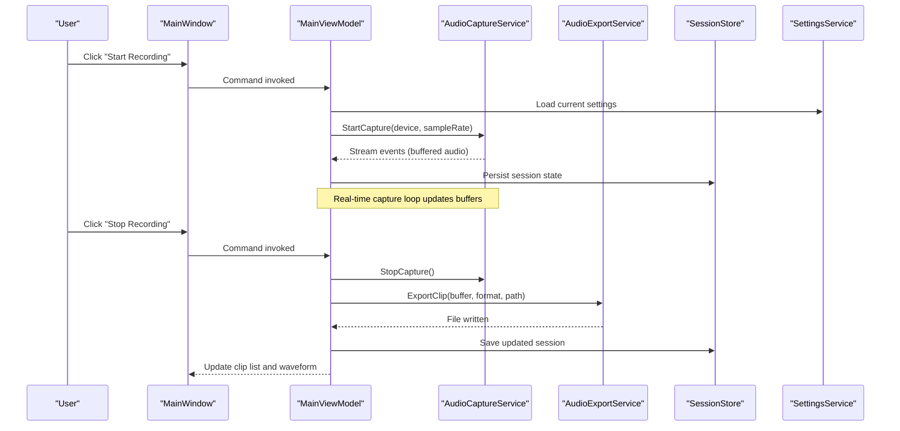

**Diagram sources**
- [MainWindow.xaml.cs](file://MainWindow.xaml.cs)
- [ViewModels/MainViewModel.cs](file://ViewModels/MainViewModel.cs)
- [Services/AudioCaptureService.cs](file://Services/AudioCaptureService.cs)
- [Services/AudioExportService.cs](file://Services/AudioExportService.cs)
- [Services/SessionStore.cs](file://Services/SessionStore.cs)
- [Services/SettingsService.cs](file://Services/SettingsService.cs)

## Detailed Component Analysis

### Application Bootstrap and Lifecycle
- App initializes services, applies theme, and creates the main window.
- Startup sequence ensures settings are loaded before UI renders.
- Graceful shutdown flushes pending operations and releases resources.

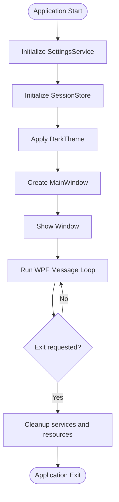

**Diagram sources**
- [App.xaml.cs](file://App.xaml.cs)
- [Themes/DarkTheme.xaml](file://Themes/DarkTheme.xaml)

**Section sources**
- [App.xaml.cs](file://App.xaml.cs)
- [AssemblyInfo.cs](file://AssemblyInfo.cs)

### Main Window and View Model Coordination
- MainWindow hosts UI elements and binds commands to MainViewModel.
- MainViewModel orchestrates capture/export workflows and maintains clip lists.
- ClipItemViewModel represents individual clips with properties for playback and metadata.

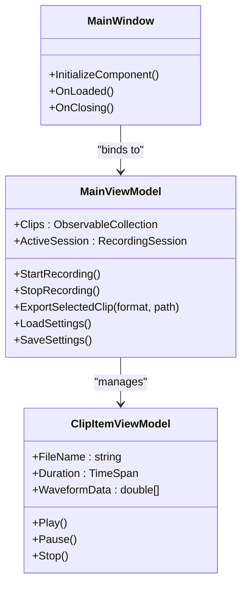

**Diagram sources**
- [MainWindow.xaml.cs](file://MainWindow.xaml.cs)
- [ViewModels/MainViewModel.cs](file://ViewModels/MainViewModel.cs)
- [ViewModels/ClipItemViewModel.cs](file://ViewModels/ClipItemViewModel.cs)

**Section sources**
- [MainWindow.xaml.cs](file://MainWindow.xaml.cs)
- [ViewModels/MainViewModel.cs](file://ViewModels/MainViewModel.cs)
- [ViewModels/ClipItemViewModel.cs](file://ViewModels/ClipItemViewModel.cs)

### Audio Capture Service
- Manages device enumeration, buffer management, and event-driven audio streaming.
- Provides methods to start/stop capture and subscribe to audio buffer events.
- Integrates with system audio APIs to minimize latency and ensure stability.

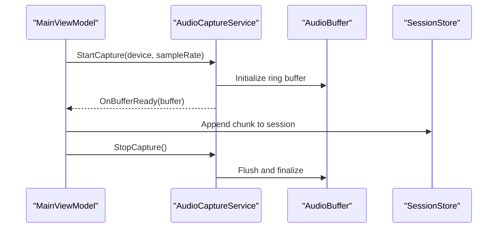

**Diagram sources**
- [Services/AudioCaptureService.cs](file://Services/AudioCaptureService.cs)
- [Services/SessionStore.cs](file://Services/SessionStore.cs)

**Section sources**
- [Services/AudioCaptureService.cs](file://Services/AudioCaptureService.cs)

### Audio Export Service
- Encodes raw audio buffers into supported formats and writes to disk.
- Supports configurable bitrate, sample rate, and channel layout.
- Handles asynchronous writing to avoid blocking UI thread.

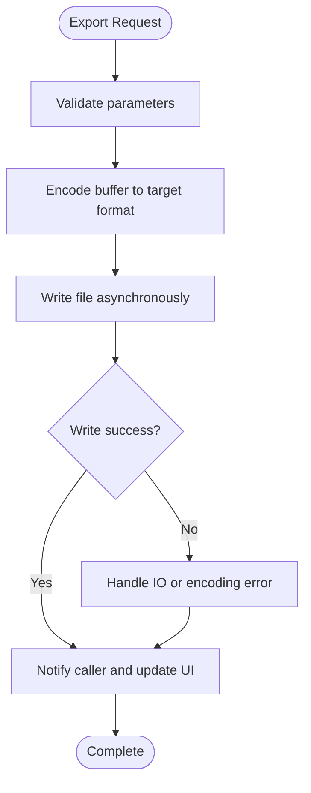

**Diagram sources**
- [Services/AudioExportService.cs](file://Services/AudioExportService.cs)

**Section sources**
- [Services/AudioExportService.cs](file://Services/AudioExportService.cs)

### Hotkey Service
- Registers global keyboard shortcuts for recording control.
- Maps key combinations to commands in MainViewModel.
- Ensures proper unregistration on application exit.

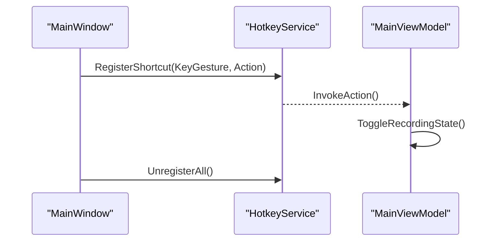

**Diagram sources**
- [Services/HotkeyService.cs](file://Services/HotkeyService.cs)
- [ViewModels/MainViewModel.cs](file://ViewModels/MainViewModel.cs)

**Section sources**
- [Services/HotkeyService.cs](file://Services/HotkeyService.cs)

### Session Store and Settings Service
- SessionStore persists active session state and clip metadata to local storage.
- SettingsService loads and saves user preferences such as default device, output directory, and quality settings.

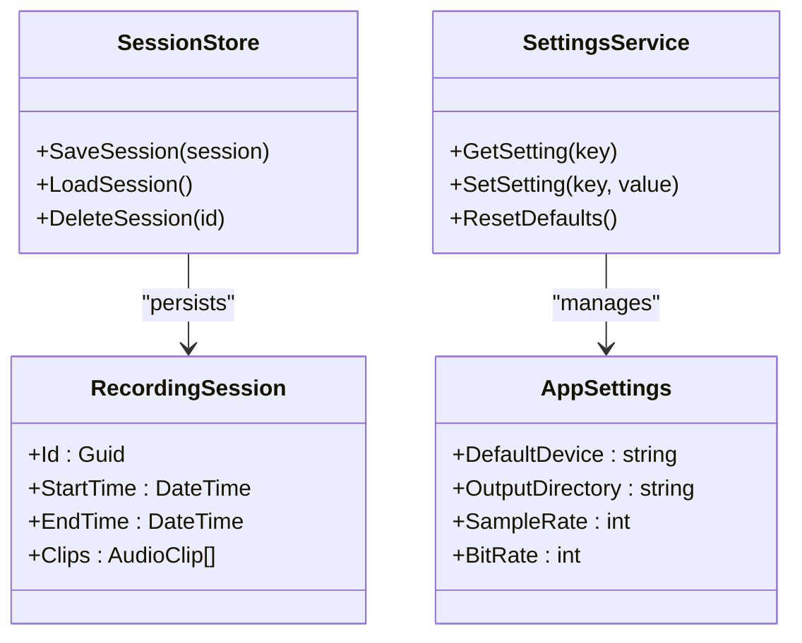

**Diagram sources**
- [Services/SessionStore.cs](file://Services/SessionStore.cs)
- [Services/SettingsService.cs](file://Services/SettingsService.cs)
- [Models/RecordingSession.cs](file://Models/RecordingSession.cs)
- [Models/AppSettings.cs](file://Models/AppSettings.cs)

**Section sources**
- [Services/SessionStore.cs](file://Services/SessionStore.cs)
- [Services/SettingsService.cs](file://Services/SettingsService.cs)
- [Models/RecordingSession.cs](file://Models/RecordingSession.cs)
- [Models/AppSettings.cs](file://Models/AppSettings.cs)

### Waveform Control and Data Service
- WaveformControl renders waveform visualizations and supports zoom/pan interactions.
- WaveformDataService computes waveform samples from audio buffers for efficient rendering.

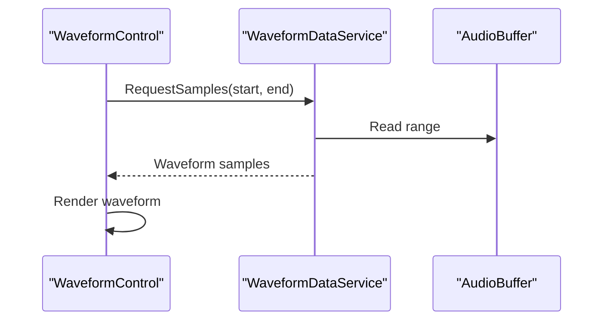

**Diagram sources**
- [Controls/WaveformControl.cs](file://Controls/WaveformControl.cs)
- [Services/WaveformDataService.cs](file://Services/WaveformDataService.cs)

**Section sources**
- [Controls/WaveformControl.cs](file://Controls/WaveformControl.cs)
- [Services/WaveformDataService.cs](file://Services/WaveformDataService.cs)

### Conceptual Overview
The architecture emphasizes modularity and separation of concerns:
- UI remains thin and declarative.
- ViewModels coordinate business logic without direct UI manipulation.
- Services encapsulate platform-specific and I/O-heavy operations.
- Models represent core domain concepts and are independent of UI and services.

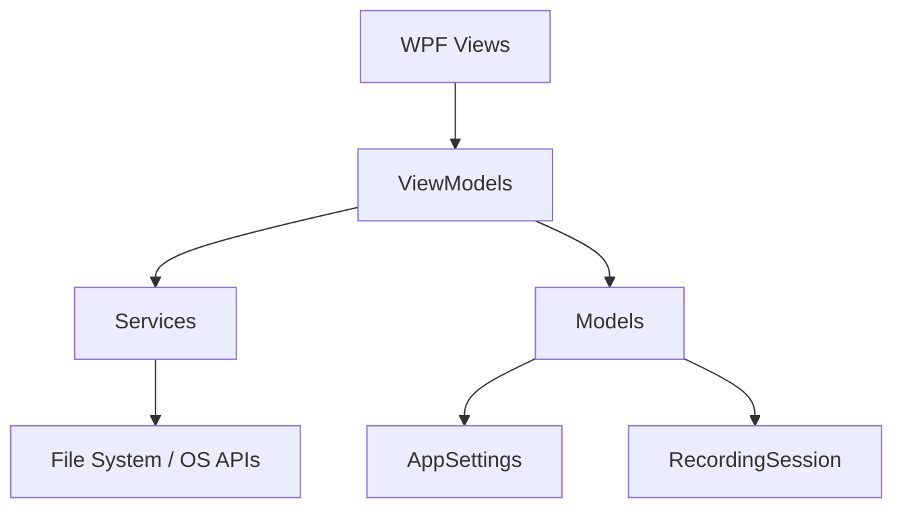

[No sources needed since this diagram shows conceptual workflow, not actual code structure]

## Dependency Analysis
The project uses a layered dependency model where higher layers depend on lower layers but not vice versa. ViewModels depend on services; services depend on models and OS/file system APIs.

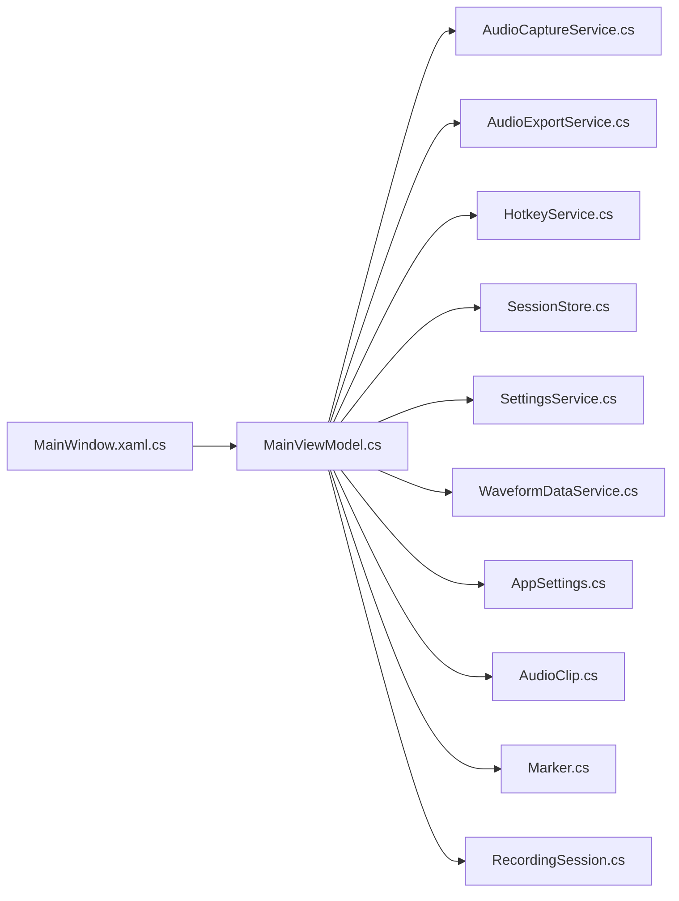

**Diagram sources**
- [MainWindow.xaml.cs](file://MainWindow.xaml.cs)
- [ViewModels/MainViewModel.cs](file://ViewModels/MainViewModel.cs)
- [Services/AudioCaptureService.cs](file://Services/AudioCaptureService.cs)
- [Services/AudioExportService.cs](file://Services/AudioExportService.cs)
- [Services/HotkeyService.cs](file://Services/HotkeyService.cs)
- [Services/SessionStore.cs](file://Services/SessionStore.cs)
- [Services/SettingsService.cs](file://Services/SettingsService.cs)
- [Services/WaveformDataService.cs](file://Services/WaveformDataService.cs)
- [Models/AppSettings.cs](file://Models/AppSettings.cs)
- [Models/AudioClip.cs](file://Models/AudioClip.cs)
- [Models/Marker.cs](file://Models/Marker.cs)
- [Models/RecordingSession.cs](file://Models/RecordingSession.cs)

**Section sources**
- [SamplerRecorder.csproj](file://SamplerRecorder.csproj)
- [ViewModels/MainViewModel.cs](file://ViewModels/MainViewModel.cs)

## Performance Considerations
- Use asynchronous operations for I/O-bound tasks (export, save/load) to keep UI responsive.
- Implement ring buffers for audio capture to minimize memory churn and latency.
- Compute waveform samples lazily and cache results to reduce CPU usage during rendering.
- Profile audio capture loops to avoid dropped frames and buffer underruns.
- Monitor memory usage when handling large audio buffers; consider streaming and chunked processing.

[No sources needed since this section provides general guidance]

## Troubleshooting Guide
Common development issues and resolutions:
- Build errors: Ensure .NET SDK and WPF workloads are installed; restore NuGet packages; clean obj/bin folders.
- Runtime crashes: Check for null references in view models; verify service initialization order; inspect exception logs.
- Audio capture failures: Validate device permissions; confirm sample rate compatibility; check for exclusive mode conflicts.
- Export failures: Verify write permissions to output directory; ensure sufficient disk space; validate format codecs.
- Hotkey conflicts: Detect overlapping global shortcuts; unregister unused keys on shutdown.
- UI responsiveness: Offload heavy computations to background threads; use progress callbacks for long-running tasks.

Debugging techniques:
- Attach Visual Studio debugger to running process.
- Use logging statements in services to trace data flow and errors.
- Inspect waveforms and buffers using temporary diagnostic endpoints or UI panels.
- Enable detailed exception messages and stack traces in development builds.

**Section sources**
- [Services/AudioCaptureService.cs](file://Services/AudioCaptureService.cs)
- [Services/AudioExportService.cs](file://Services/AudioExportService.cs)
- [Services/HotkeyService.cs](file://Services/HotkeyService.cs)
- [Services/SessionStore.cs](file://Services/SessionStore.cs)
- [Services/SettingsService.cs](file://Services/SettingsService.cs)
- [Services/WaveformDataService.cs](file://Services/WaveformDataService.cs)

## Conclusion
SamplerRecorder is structured around MVVM with well-defined services and models, enabling extensibility and maintainability. By following the coding standards, leveraging the provided extension points, and adhering to the contribution guidelines outlined below, developers can confidently add features, improve performance, and collaborate effectively.

## Appendices

### Development Environment Setup
- Install .NET SDK compatible with the project’s target framework.
- Install Visual Studio with WPF workload.
- Clone the repository and open the solution file.
- Restore packages and build the project.
- Run the application to verify setup.

**Section sources**
- [SamplerRecorder.csproj](file://SamplerRecorder.csproj)

### Build Processes
- Clean and rebuild to resolve stale artifacts.
- Use release builds for performance testing.
- Configure signing and packaging if distributing binaries.

**Section sources**
- [SamplerRecorder.csproj](file://SamplerRecorder.csproj)

### Debugging Techniques
- Set breakpoints in view models and services.
- Log critical paths and exceptions.
- Use performance profiler to identify bottlenecks.

**Section sources**
- [ViewModels/MainViewModel.cs](file://ViewModels/MainViewModel.cs)
- [Services/AudioCaptureService.cs](file://Services/AudioCaptureService.cs)

### Testing Strategies
- Unit tests for services and view models.
- Integration tests for audio capture and export pipelines.
- UI tests for command execution and state transitions.

[No sources needed since this section provides general guidance]

### Coding Standards and Naming Conventions
- Use PascalCase for classes, methods, and public members.
- Use camelCase for private fields and local variables.
- Keep methods focused and small; prefer composition over inheritance.
- Avoid magic numbers; define constants or enums for clarity.
- Document public APIs with XML comments.

[No sources needed since this section provides general guidance]

### Extending Functionality
- Add new audio formats by implementing an encoder in the export service pipeline.
- Create custom controls by extending existing UI components and integrating with view models.
- Introduce new services for additional capabilities (e.g., effects, analytics).

**Section sources**
- [Services/AudioExportService.cs](file://Services/AudioExportService.cs)
- [Controls/WaveformControl.cs](file://Controls/WaveformControl.cs)

### Version Control Workflows
- Use feature branches for new functionality.
- Commit frequently with descriptive messages.
- Open pull requests for review before merging.
- Tag releases and document changes in changelogs.

[No sources needed since this section provides general guidance]

### Issue Reporting Procedures
- Search existing issues to avoid duplicates.
- Provide steps to reproduce, expected behavior, and environment details.
- Include logs and screenshots when applicable.

[No sources needed since this section provides general guidance]

### Community Contribution Processes
- Follow coding standards and style guides.
- Add tests for new features and bug fixes.
- Update documentation and examples as needed.
- Engage in discussions and respond to feedback promptly.

[No sources needed since this section provides general guidance]

### Performance Profiling Techniques
- Use Visual Studio Profiler to analyze CPU and memory usage.
- Measure audio capture latency and buffer sizes.
- Optimize waveform computation and rendering paths.

[No sources needed since this section provides general guidance]