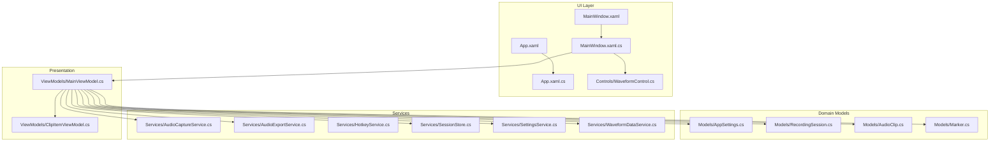
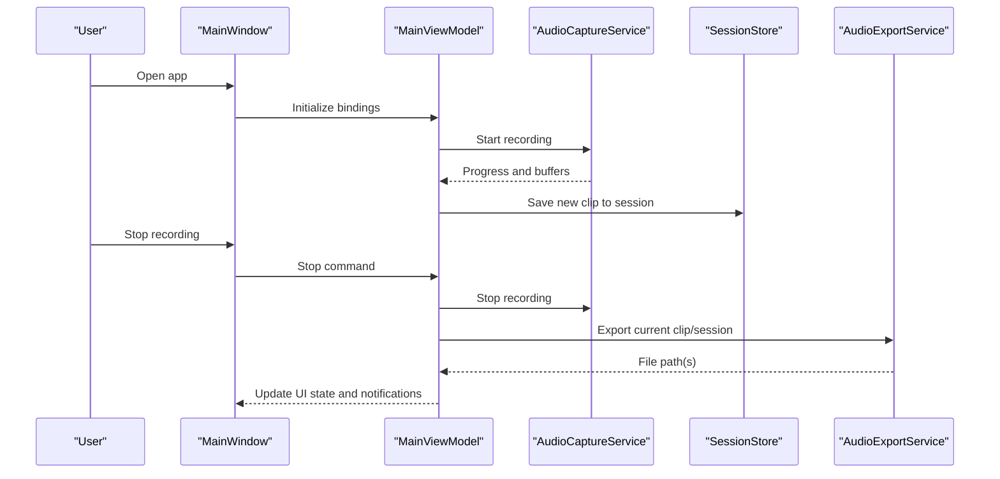
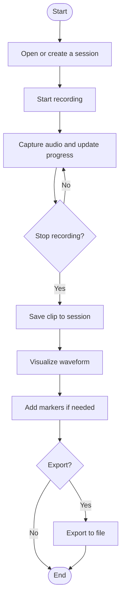
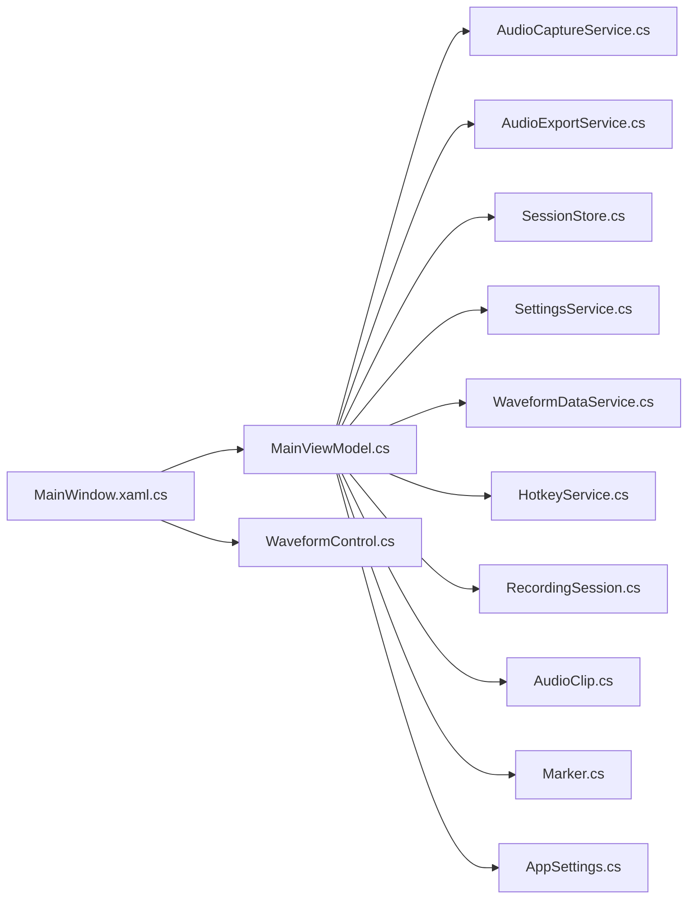

# Getting Started

<cite>
**Referenced Files in This Document**
- [App.xaml](file://App.xaml)
- [App.xaml.cs](file://App.xaml.cs)
- [MainWindow.xaml](file://MainWindow.xaml)
- [MainWindow.xaml.cs](file://MainWindow.xaml.cs)
- [SamplerRecorder.csproj](file://SamplerRecorder.csproj)
- [Models/AppSettings.cs](file://Models/AppSettings.cs)
- [Models/AudioClip.cs](file://Models/AudioClip.cs)
- [Models/Marker.cs](file://Models/Marker.cs)
- [Models/RecordingSession.cs](file://Models/RecordingSession.cs)
- [Services/AudioCaptureService.cs](file://Services/AudioCaptureService.cs)
- [Services/AudioExportService.cs](file://Services/AudioExportService.cs)
- [Services/HotkeyService.cs](file://Services/HotkeyService.cs)
- [Services/SessionStore.cs](file://Services/SessionStore.cs)
- [Services/SettingsService.cs](file://Services/SettingsService.cs)
- [Services/WaveformDataService.cs](file://Services/WaveformDataService.cs)
- [ViewModels/MainViewModel.cs](file://ViewModels/MainViewModel.cs)
- [ViewModels/ClipItemViewModel.cs](file://ViewModels/ClipItemViewModel.cs)
- [Controls/WaveformControl.cs](file://Controls/WaveformControl.cs)
</cite>

## Table of Contents
1. [Introduction](#introduction)
2. [Project Structure](#project-structure)
3. [Core Components](#core-components)
4. [Architecture Overview](#architecture-overview)
5. [Detailed Component Analysis](#detailed-component-analysis)
6. [Dependency Analysis](#dependency-analysis)
7. [Performance Considerations](#performance-considerations)
8. [Troubleshooting Guide](#troubleshooting-guide)
9. [Conclusion](#conclusion)
10. [Appendices](#appendices)

## Introduction
SamplerRecorder is a professional audio recording and sampling application built with WPF and C#. It provides an intuitive interface for capturing audio, organizing clips within sessions, marking regions of interest, visualizing waveforms, and exporting recordings to common formats. The app follows the MVVM pattern to separate UI from business logic and services that encapsulate audio capture, export, settings persistence, hotkeys, and waveform processing.

This guide helps you install, configure, and start using SamplerRecorder quickly, with step-by-step instructions for first-time setup, selecting your audio device, creating your first recording session, and exporting your work.

## Project Structure
The project is organized into logical layers:
- UI layer (WPF): App entry points, main window, and custom controls
- ViewModels: Presentation logic bound to the UI
- Models: Core data structures such as sessions, clips, markers, and settings
- Services: Audio capture, export, settings, hotkeys, session storage, and waveform data
- Resources and Themes: Visual assets and styling

**Diagram sources**
- [App.xaml](file://App.xaml)
- [App.xaml.cs](file://App.xaml.cs)
- [MainWindow.xaml](file://MainWindow.xaml)
- [MainWindow.xaml.cs](file://MainWindow.xaml.cs)
- [ViewModels/MainViewModel.cs](file://ViewModels/MainViewModel.cs)
- [ViewModels/ClipItemViewModel.cs](file://ViewModels/ClipItemViewModel.cs)
- [Models/AppSettings.cs](file://Models/AppSettings.cs)
- [Models/RecordingSession.cs](file://Models/RecordingSession.cs)
- [Models/AudioClip.cs](file://Models/AudioClip.cs)
- [Models/Marker.cs](file://Models/Marker.cs)
- [Services/AudioCaptureService.cs](file://Services/AudioCaptureService.cs)
- [Services/AudioExportService.cs](file://Services/AudioExportService.cs)
- [Services/HotkeyService.cs](file://Services/HotkeyService.cs)
- [Services/SessionStore.cs](file://Services/SessionStore.cs)
- [Services/SettingsService.cs](file://Services/SettingsService.cs)
- [Services/WaveformDataService.cs](file://Services/WaveformDataService.cs)
- [Controls/WaveformControl.cs](file://Controls/WaveformControl.cs)

**Section sources**
- [SamplerRecorder.csproj](file://SamplerRecorder.csproj)
- [App.xaml](file://App.xaml)
- [App.xaml.cs](file://App.xaml.cs)
- [MainWindow.xaml](file://MainWindow.xaml)
- [MainWindow.xaml.cs](file://MainWindow.xaml.cs)

## Core Components
- Application Entry Points:
  - App initialization and lifecycle are defined in the application files.
  - The main window hosts the primary UI and binds to the main view model.
- ViewModels:
  - MainViewModel orchestrates user actions, coordinates services, and updates the UI state.
  - ClipItemViewModel represents individual clip items in the UI.
- Models:
  - RecordingSession groups related AudioClip entries and metadata.
  - AudioClip stores captured audio data and properties.
  - Marker marks specific time positions within a clip or session.
  - AppSettings holds configuration values persisted by the settings service.
- Services:
  - AudioCaptureService handles real-time audio input and recording.
  - AudioExportService writes recorded data to disk in supported formats.
  - SessionStore persists and loads sessions between runs.
  - SettingsService manages application preferences.
  - WaveformDataService computes waveform samples for visualization.
  - HotkeyService registers global shortcuts for quick control.
- Controls:
  - WaveformControl renders waveform visuals for selected clips.

**Section sources**
- [ViewModels/MainViewModel.cs](file://ViewModels/MainViewModel.cs)
- [ViewModels/ClipItemViewModel.cs](file://ViewModels/ClipItemViewModel.cs)
- [Models/RecordingSession.cs](file://Models/RecordingSession.cs)
- [Models/AudioClip.cs](file://Models/AudioClip.cs)
- [Models/Marker.cs](file://Models/Marker.cs)
- [Models/AppSettings.cs](file://Models/AppSettings.cs)
- [Services/AudioCaptureService.cs](file://Services/AudioCaptureService.cs)
- [Services/AudioExportService.cs](file://Services/AudioExportService.cs)
- [Services/SessionStore.cs](file://Services/SessionStore.cs)
- [Services/SettingsService.cs](file://Services/SettingsService.cs)
- [Services/WaveformDataService.cs](file://Services/WaveformDataService.cs)
- [Services/HotkeyService.cs](file://Services/HotkeyService.cs)
- [Controls/WaveformControl.cs](file://Controls/WaveformControl.cs)

## Architecture Overview
SamplerRecorder follows MVVM with clear separation of concerns:
- UI (WPF) binds to ViewModels.
- ViewModels coordinate Services and update Models.
- Services encapsulate platform-specific audio operations, file I/O, and persistence.

**Diagram sources**
- [MainWindow.xaml.cs](file://MainWindow.xaml.cs)
- [ViewModels/MainViewModel.cs](file://ViewModels/MainViewModel.cs)
- [Services/AudioCaptureService.cs](file://Services/AudioCaptureService.cs)
- [Services/SessionStore.cs](file://Services/SessionStore.cs)
- [Services/AudioExportService.cs](file://Services/AudioExportService.cs)

## Detailed Component Analysis

### First-Time Setup and Installation
- System requirements:
  - Windows operating system supporting WPF applications.
  - A working audio input device (microphone or line-in).
  - Sufficient disk space for recording files.
- Install and launch:
  - Build or run the project using your preferred .NET tooling.
  - Launch the application; the main window will appear.
- Initial configuration:
  - Select your preferred audio input device via the settings panel.
  - Adjust recording quality and output format according to your needs.
  - Optionally configure hotkeys for quick start/stop/recording actions.

[No sources needed since this section provides general guidance]

### Audio Device Setup
- Choose an input device:
  - Use the settings service to enumerate available devices and select one.
- Verify levels and latency:
  - Ensure input levels are appropriate to avoid clipping.
  - Adjust buffer sizes if you experience audio dropouts.

**Section sources**
- [Services/SettingsService.cs](file://Services/SettingsService.cs)
- [Models/AppSettings.cs](file://Models/AppSettings.cs)

### Basic Recording Workflow
- Create or open a session:
  - Sessions group related clips and persist across runs.
- Record a clip:
  - Start recording; the app captures audio and updates progress.
  - Stop recording when finished; the clip is saved to the current session.
- Visualize and mark:
  - Use the waveform control to inspect the clip.
  - Add markers to highlight important sections.
- Export:
  - Export the selected clip or entire session to your chosen format.

**Diagram sources**
- [ViewModels/MainViewModel.cs](file://ViewModels/MainViewModel.cs)
- [Services/AudioCaptureService.cs](file://Services/AudioCaptureService.cs)
- [Services/SessionStore.cs](file://Services/SessionStore.cs)
- [Services/AudioExportService.cs](file://Services/AudioExportService.cs)
- [Controls/WaveformControl.cs](file://Controls/WaveformControl.cs)
- [Models/AudioClip.cs](file://Models/AudioClip.cs)
- [Models/Marker.cs](file://Models/Marker.cs)

**Section sources**
- [Models/RecordingSession.cs](file://Models/RecordingSession.cs)
- [Models/AudioClip.cs](file://Models/AudioClip.cs)
- [Models/Marker.cs](file://Models/Marker.cs)
- [Services/AudioCaptureService.cs](file://Services/AudioCaptureService.cs)
- [Services/SessionStore.cs](file://Services/SessionStore.cs)
- [Services/AudioExportService.cs](file://Services/AudioExportService.cs)
- [Controls/WaveformControl.cs](file://Controls/WaveformControl.cs)

### Quick Start Examples
- Record a single audio clip:
  - Start recording, perform your action, then stop. The clip appears in the current session.
- Manage sessions:
  - Create a new session for different projects; switch between sessions to organize clips.
- Export files:
  - Select a clip or session and export to your preferred format; files are saved to the configured directory.

[No sources needed since this section provides general guidance]

## Dependency Analysis
The following diagram shows how components depend on each other during typical operations:

**Diagram sources**
- [MainWindow.xaml.cs](file://MainWindow.xaml.cs)
- [ViewModels/MainViewModel.cs](file://ViewModels/MainViewModel.cs)
- [Services/AudioCaptureService.cs](file://Services/AudioCaptureService.cs)
- [Services/AudioExportService.cs](file://Services/AudioExportService.cs)
- [Services/SessionStore.cs](file://Services/SessionStore.cs)
- [Services/SettingsService.cs](file://Services/SettingsService.cs)
- [Services/WaveformDataService.cs](file://Services/WaveformDataService.cs)
- [Services/HotkeyService.cs](file://Services/HotkeyService.cs)
- [Models/RecordingSession.cs](file://Models/RecordingSession.cs)
- [Models/AudioClip.cs](file://Models/AudioClip.cs)
- [Models/Marker.cs](file://Models/Marker.cs)
- [Models/AppSettings.cs](file://Models/AppSettings.cs)
- [Controls/WaveformControl.cs](file://Controls/WaveformControl.cs)

**Section sources**
- [ViewModels/MainViewModel.cs](file://ViewModels/MainViewModel.cs)
- [Services/AudioCaptureService.cs](file://Services/AudioCaptureService.cs)
- [Services/AudioExportService.cs](file://Services/AudioExportService.cs)
- [Services/SessionStore.cs](file://Services/SessionStore.cs)
- [Services/SettingsService.cs](file://Services/SettingsService.cs)
- [Services/WaveformDataService.cs](file://Services/WaveformDataService.cs)
- [Services/HotkeyService.cs](file://Services/HotkeyService.cs)
- [Models/RecordingSession.cs](file://Models/RecordingSession.cs)
- [Models/AudioClip.cs](file://Models/AudioClip.cs)
- [Models/Marker.cs](file://Models/Marker.cs)
- [Models/AppSettings.cs](file://Models/AppSettings.cs)
- [Controls/WaveformControl.cs](file://Controls/WaveformControl.cs)

## Performance Considerations
- Buffer size and latency:
  - Larger buffers reduce CPU usage but increase latency; smaller buffers improve responsiveness at the cost of higher CPU.
- Real-time capture:
  - Avoid heavy operations on the UI thread during recording to prevent dropouts.
- Waveform generation:
  - Compute waveform samples asynchronously and update the UI incrementally.
- Disk I/O:
  - Batch writes where possible and choose efficient output formats for export.

[No sources needed since this section provides general guidance]

## Troubleshooting Guide
- No audio input detected:
  - Verify the selected device in settings and ensure it is not muted or disabled.
- Distorted or clipped audio:
  - Lower input gain or adjust levels to avoid clipping.
- Export failures:
  - Check write permissions and available disk space; verify the selected output format.
- Hotkeys not responding:
  - Confirm hotkey registration and ensure no conflicts with other applications.

**Section sources**
- [Services/SettingsService.cs](file://Services/SettingsService.cs)
- [Services/AudioCaptureService.cs](file://Services/AudioCaptureService.cs)
- [Services/AudioExportService.cs](file://Services/AudioExportService.cs)
- [Services/HotkeyService.cs](file://Services/HotkeyService.cs)

## Conclusion
You now have the essentials to set up SamplerRecorder, configure your audio device, record clips, manage sessions, and export your work. Explore the waveform visualization and markers to refine your recordings, and use hotkeys to streamline your workflow. For advanced customization, review the settings and services to tailor behavior to your needs.

[No sources needed since this section summarizes without analyzing specific files]

## Appendices
- Recommended settings:
  - Start with a moderate sample rate and bit depth suitable for your use case.
  - Choose a reliable output format for compatibility with your downstream tools.
- Tips:
  - Organize clips into sessions per project or session type.
  - Use markers to annotate key moments for quick navigation.

[No sources needed since this section provides general guidance]