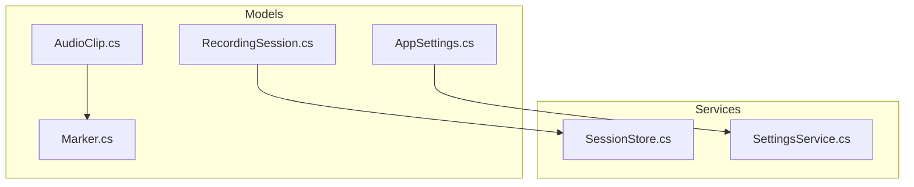
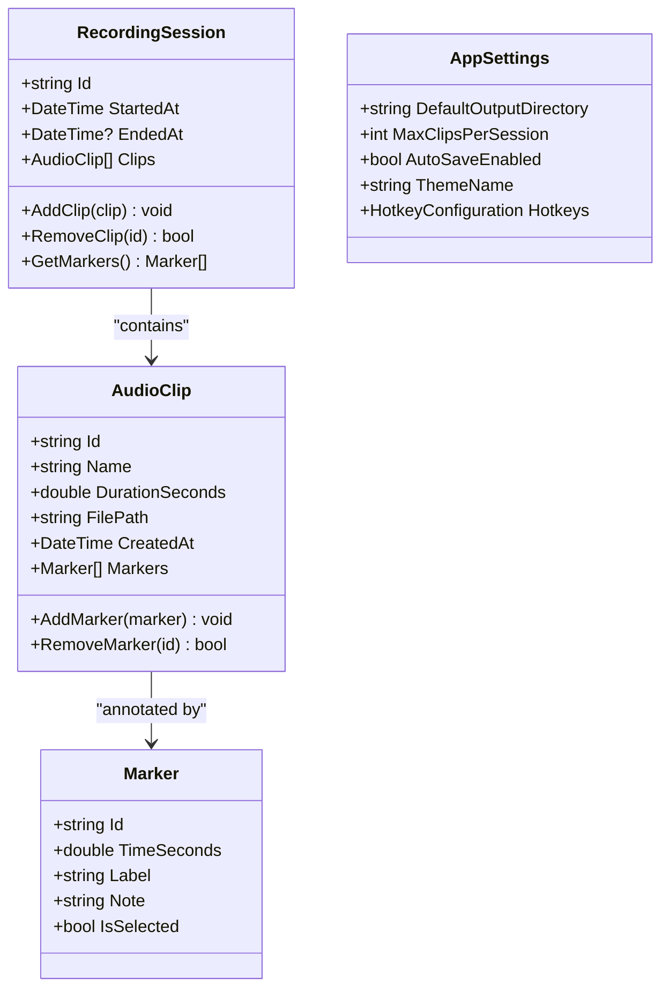
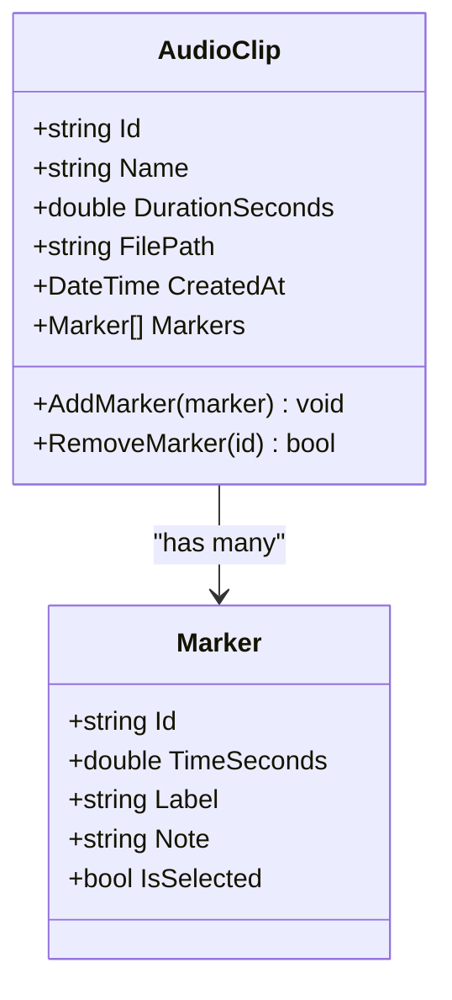
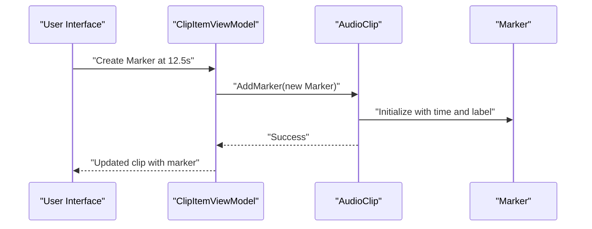
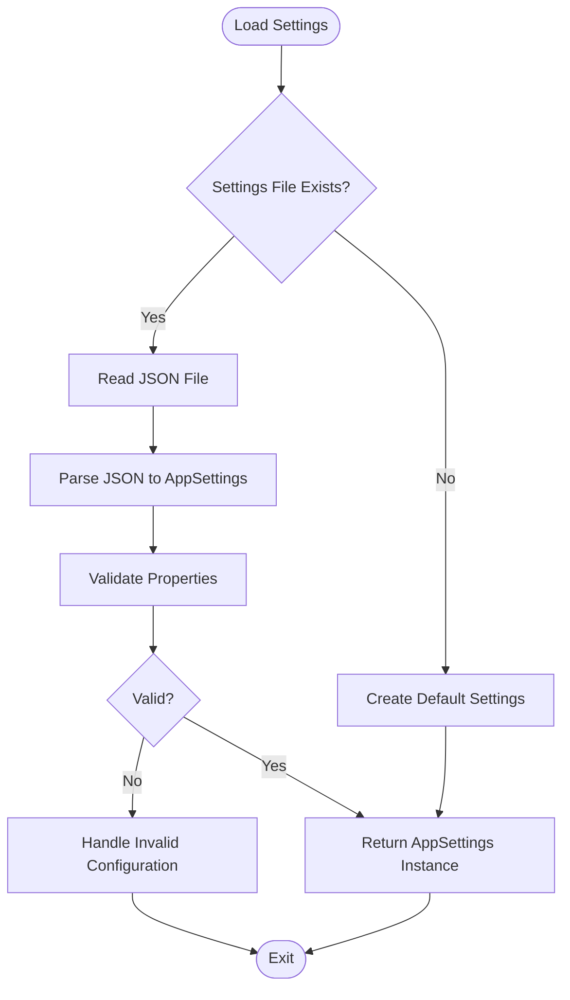
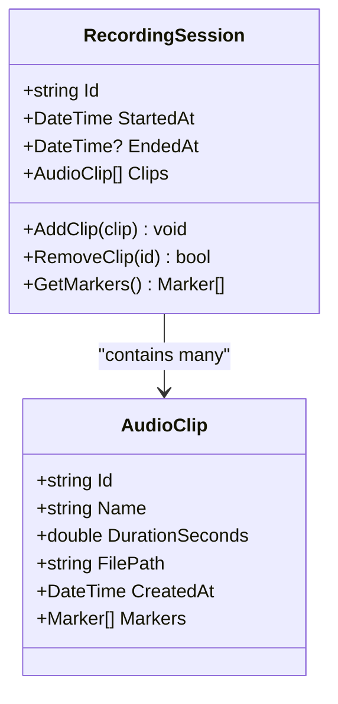
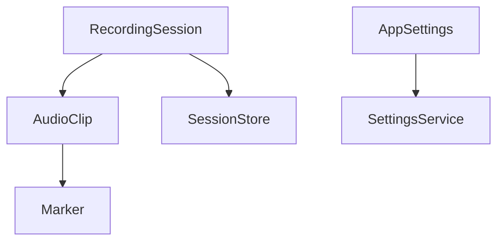

# Data Models

<cite>
**Referenced Files in This Document**
- [AppSettings.cs](file://Models/AppSettings.cs)
- [AudioClip.cs](file://Models/AudioClip.cs)
- [Marker.cs](file://Models/Marker.cs)
- [RecordingSession.cs](file://Models/RecordingSession.cs)
- [SessionStore.cs](file://Services/SessionStore.cs)
- [SettingsService.cs](file://Services/SettingsService.cs)
</cite>

## Table of Contents
1. [Introduction](#introduction)
2. [Project Structure](#project-structure)
3. [Core Components](#core-components)
4. [Architecture Overview](#architecture-overview)
5. [Detailed Component Analysis](#detailed-component-analysis)
6. [Dependency Analysis](#dependency-analysis)
7. [Performance Considerations](#performance-considerations)
8. [Troubleshooting Guide](#troubleshooting-guide)
9. [Conclusion](#conclusion)

## Introduction
This document provides comprehensive data model documentation for SamplerRecorder’s core entities. It focuses on the AudioClip, Marker, AppSettings, and RecordingSession models, detailing their properties, relationships, validation rules, serialization formats, and transformation patterns. It also includes examples of instantiation, property manipulation, and relationship navigation, along with guidance on immutable design patterns and performance considerations for large audio datasets.

## Project Structure
The data models are organized under the Models directory, with supporting services for persistence and configuration located under Services. The key files relevant to this documentation are:
- Models/AppSettings.cs
- Models/AudioClip.cs
- Models/Marker.cs
- Models/RecordingSession.cs
- Services/SessionStore.cs
- Services/SettingsService.cs

**Diagram sources**
- [AppSettings.cs](file://Models/AppSettings.cs)
- [AudioClip.cs](file://Models/AudioClip.cs)
- [Marker.cs](file://Models/Marker.cs)
- [RecordingSession.cs](file://Models/RecordingSession.cs)
- [SessionStore.cs](file://Services/SessionStore.cs)
- [SettingsService.cs](file://Services/SettingsService.cs)

**Section sources**
- [AppSettings.cs](file://Models/AppSettings.cs)
- [AudioClip.cs](file://Models/AudioClip.cs)
- [Marker.cs](file://Models/Marker.cs)
- [RecordingSession.cs](file://Models/RecordingSession.cs)
- [SessionStore.cs](file://Services/SessionStore.cs)
- [SettingsService.cs](file://Services/SettingsService.cs)

## Core Components
This section outlines the primary data models and their responsibilities:
- AudioClip: Represents an audio clip with metadata, duration, and file references.
- Marker: Represents a time-based annotation within an AudioClip.
- AppSettings: Defines application-wide configuration options.
- RecordingSession: Captures state for a recording session, including associated clips and markers.

Key aspects covered include:
- Entity structure and properties
- Relationships between entities
- Validation strategies
- Serialization formats
- Data transformation patterns
- Examples of instantiation and navigation

**Section sources**
- [AudioClip.cs](file://Models/AudioClip.cs)
- [Marker.cs](file://Models/Marker.cs)
- [AppSettings.cs](file://Models/AppSettings.cs)
- [RecordingSession.cs](file://Models/RecordingSession.cs)

## Architecture Overview
The data models form a cohesive system where RecordingSession aggregates multiple AudioClip instances, each potentially containing multiple Marker annotations. AppSettings provides configuration that influences behavior across the application, while services handle persistence and settings management.

**Diagram sources**
- [AudioClip.cs](file://Models/AudioClip.cs)
- [Marker.cs](file://Models/Marker.cs)
- [RecordingSession.cs](file://Models/RecordingSession.cs)
- [AppSettings.cs](file://Models/AppSettings.cs)

## Detailed Component Analysis

### AudioClip Model
Responsibilities:
- Stores audio metadata such as name, creation timestamp, and duration.
- Maintains file path references for storage and playback.
- Manages associated Marker annotations through a collection.

Key properties:
- Identifier (unique ID)
- Name (display label)
- DurationSeconds (duration in seconds)
- FilePath (path to audio file)
- CreatedAt (creation timestamp)
- Markers (collection of Marker objects)

Relationships:
- One-to-many with Marker (each AudioClip can have multiple markers).

Validation rules:
- Non-empty Name
- Positive DurationSeconds
- Valid FilePath format

Serialization format:
- JSON representation with nested Marker array.

Data transformation patterns:
- Convert raw audio metadata into structured AudioClip instance.
- Map UI-bound properties to underlying model fields.

Examples:
- Instantiation: Create a new AudioClip with metadata and empty marker list.
- Property manipulation: Update duration after processing audio file.
- Relationship navigation: Iterate over Markers to find specific annotations.

**Section sources**
- [AudioClip.cs](file://Models/AudioClip.cs)

#### Class Diagram for AudioClip

**Diagram sources**
- [AudioClip.cs](file://Models/AudioClip.cs)
- [Marker.cs](file://Models/Marker.cs)

### Marker System
Responsibilities:
- Represents time-based annotations within an AudioClip.
- Supports labeling and optional notes for context.
- Tracks selection state for UI interactions.

Key properties:
- Identifier (unique ID)
- TimeSeconds (position in seconds)
- Label (short descriptive text)
- Note (additional context)
- IsSelected (selection flag)

Validation rules:
- Non-negative TimeSeconds
- Unique Id per AudioClip

Serialization format:
- JSON object with numeric time and string fields.

Data transformation patterns:
- Convert user input into Marker instances.
- Serialize markers for persistence or export.

Examples:
- Instantiation: Create a Marker at a specific time with a label.
- Property manipulation: Toggle IsSelected for highlighting.
- Relationship navigation: Access parent AudioClip via reference.

**Section sources**
- [Marker.cs](file://Models/Marker.cs)

#### Sequence Diagram for Marker Creation

**Diagram sources**
- [AudioClip.cs](file://Models/AudioClip.cs)
- [Marker.cs](file://Models/Marker.cs)

### AppSettings Schema
Responsibilities:
- Defines application-wide configuration options.
- Controls behavior such as default output directories, limits, and UI themes.

Key properties:
- DefaultOutputDirectory (string)
- MaxClipsPerSession (integer)
- AutoSaveEnabled (boolean)
- ThemeName (string)
- Hotkeys (custom configuration object)

Validation rules:
- Valid directory path for DefaultOutputDirectory
- Positive integer for MaxClipsPerSession
- Recognized theme name

Serialization format:
- JSON configuration file with typed values.

Data transformation patterns:
- Load from disk into AppSettings instance.
- Save changes back to persistent storage.

Examples:
- Instantiation: Create default settings with sensible defaults.
- Property manipulation: Update theme based on user preference.
- Persistence: Save settings to disk via SettingsService.

**Section sources**
- [AppSettings.cs](file://Models/AppSettings.cs)
- [SettingsService.cs](file://Services/SettingsService.cs)

#### Flowchart for Settings Loading

**Diagram sources**
- [AppSettings.cs](file://Models/AppSettings.cs)
- [SettingsService.cs](file://Services/SettingsService.cs)

### RecordingSession Model
Responsibilities:
- Captures state for a recording session, including start/end times and associated clips.
- Provides methods to manage clips and aggregate markers across sessions.

Key properties:
- Identifier (unique ID)
- StartedAt (start timestamp)
- EndedAt (optional end timestamp)
- Clips (collection of AudioClip instances)

Methods:
- AddClip(AudioClip): Add a clip to the session.
- RemoveClip(string): Remove a clip by identifier.
- GetMarkers(): Aggregate all markers from all clips.

Validation rules:
- Non-null StartedAt
- Valid clip identifiers

Serialization format:
- JSON with nested clips and markers.

Data transformation patterns:
- Convert session state to/from persistent storage.
- Aggregate data for reporting or export.

Examples:
- Instantiation: Create a new session with current timestamp.
- Property manipulation: Set EndedAt when session completes.
- Relationship navigation: Traverse clips to access markers.

**Section sources**
- [RecordingSession.cs](file://Models/RecordingSession.cs)
- [SessionStore.cs](file://Services/SessionStore.cs)

#### Class Diagram for RecordingSession

**Diagram sources**
- [RecordingSession.cs](file://Models/RecordingSession.cs)
- [AudioClip.cs](file://Models/AudioClip.cs)

## Dependency Analysis
The data models exhibit clear dependencies:
- RecordingSession depends on AudioClip for managing audio content.
- AudioClip depends on Marker for annotations.
- AppSettings is independent but consumed by services for configuration.
- SessionStore and SettingsService provide persistence and configuration management.

**Diagram sources**
- [RecordingSession.cs](file://Models/RecordingSession.cs)
- [AudioClip.cs](file://Models/AudioClip.cs)
- [Marker.cs](file://Models/Marker.cs)
- [AppSettings.cs](file://Models/AppSettings.cs)
- [SessionStore.cs](file://Services/SessionStore.cs)
- [SettingsService.cs](file://Services/SettingsService.cs)

**Section sources**
- [RecordingSession.cs](file://Models/RecordingSession.cs)
- [AudioClip.cs](file://Models/AudioClip.cs)
- [Marker.cs](file://Models/Marker.cs)
- [AppSettings.cs](file://Models/AppSettings.cs)
- [SessionStore.cs](file://Services/SessionStore.cs)
- [SettingsService.cs](file://Services/SettingsService.cs)

## Performance Considerations
For large audio datasets:
- Use lazy loading for Marker collections to avoid memory overhead.
- Implement pagination for clip lists in UI.
- Optimize JSON serialization with streaming for large sessions.
- Cache frequently accessed settings to reduce I/O operations.
- Consider using efficient data structures like HashSet for unique identifiers.

[No sources needed since this section provides general guidance]

## Troubleshooting Guide
Common issues and resolutions:
- Invalid configuration: Validate AppSettings properties during load.
- Missing audio files: Verify FilePath existence before playback.
- Corrupted sessions: Implement backup and recovery mechanisms.
- Memory leaks: Ensure proper disposal of resources and event handlers.

**Section sources**
- [AppSettings.cs](file://Models/AppSettings.cs)
- [RecordingSession.cs](file://Models/RecordingSession.cs)

## Conclusion
The data models in SamplerRecorder provide a robust foundation for managing audio clips, annotations, configuration, and session state. By following the outlined validation rules, serialization formats, and performance considerations, developers can build reliable and efficient applications. The clear separation of concerns and well-defined relationships facilitate maintainability and extensibility.

[No sources needed since this section summarizes without analyzing specific files]