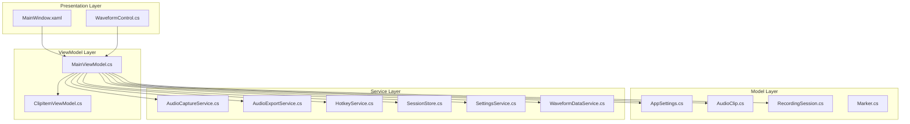
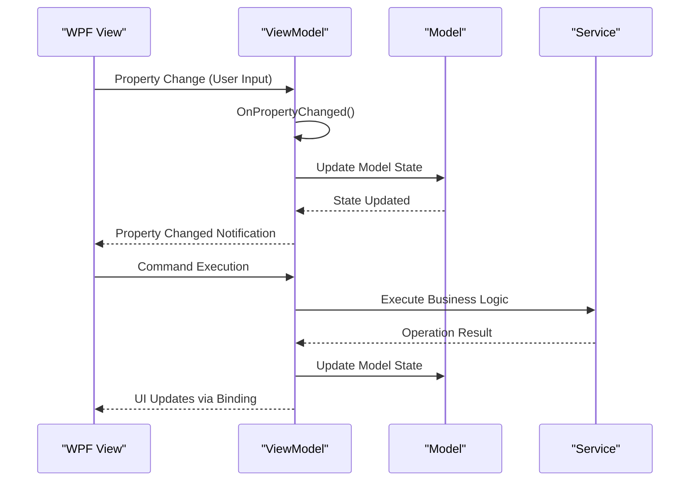
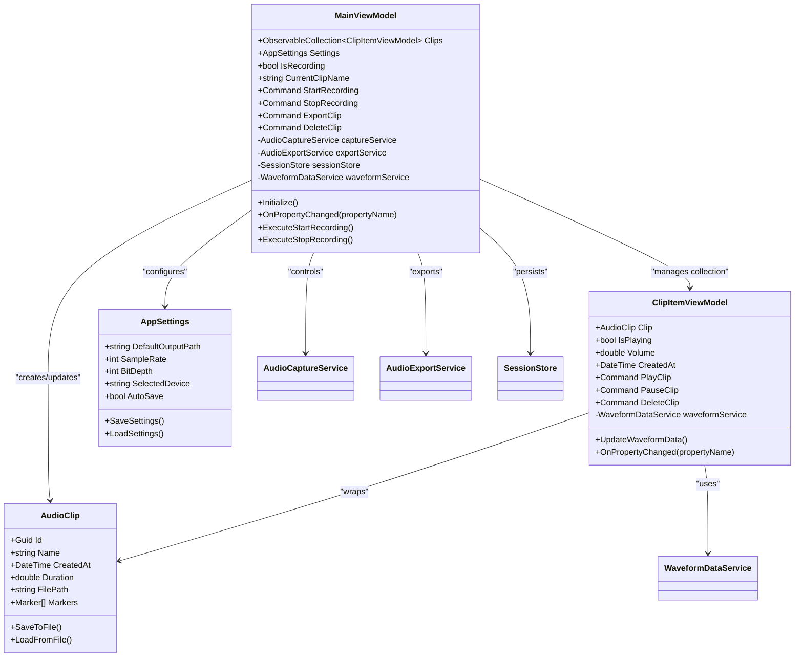
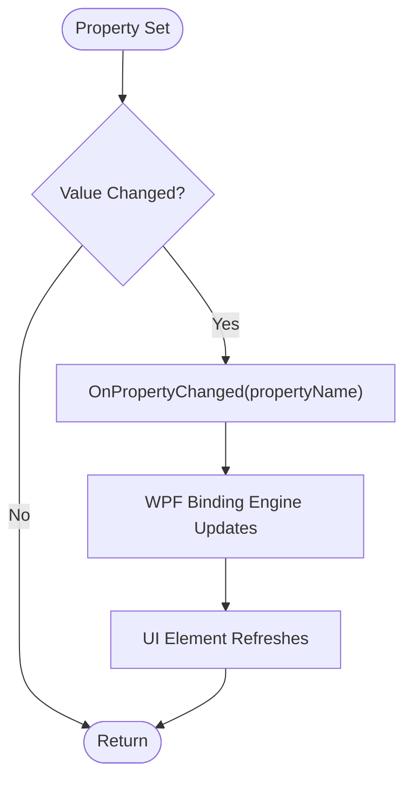
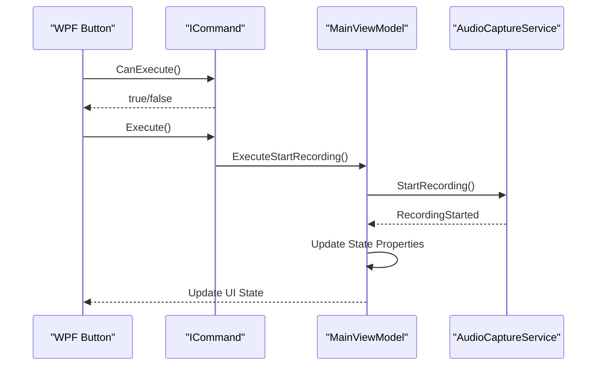
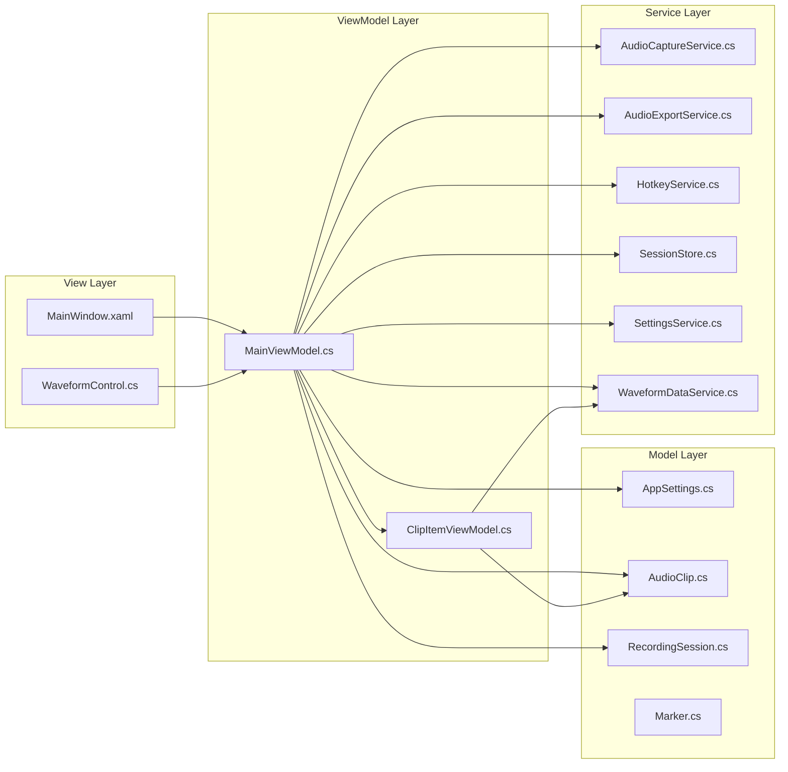

# MVVM Implementation

<cite>
**Referenced Files in This Document**
- [MainViewModel.cs](file://ViewModels/MainViewModel.cs)
- [ClipItemViewModel.cs](file://ViewModels/ClipItemViewModel.cs)
- [AppSettings.cs](file://Models/AppSettings.cs)
- [AudioClip.cs](file://Models/AudioClip.cs)
- [RecordingSession.cs](file://Models/RecordingSession.cs)
- [Marker.cs](file://Models/Marker.cs)
- [AudioCaptureService.cs](file://Services/AudioCaptureService.cs)
- [AudioExportService.cs](file://Services/AudioExportService.cs)
- [HotkeyService.cs](file://Services/HotkeyService.cs)
- [SessionStore.cs](file://Services/SessionStore.cs)
- [SettingsService.cs](file://Services/SettingsService.cs)
- [WaveformDataService.cs](file://Services/WaveformDataService.cs)
- [MainWindow.xaml](file://MainWindow.xaml)
- [MainWindow.xaml.cs](file://MainWindow.xaml.cs)
- [App.xaml](file://App.xaml)
- [App.xaml.cs](file://App.xaml.cs)
- [WaveformControl.cs](file://Controls/WaveformControl.cs)
</cite>

## Table of Contents
1. [Introduction](#introduction)
2. [Project Structure](#project-structure)
3. [Core Components](#core-components)
4. [Architecture Overview](#architecture-overview)
5. [Detailed Component Analysis](#detailed-component-analysis)
6. [Dependency Analysis](#dependency-analysis)
7. [Performance Considerations](#performance-considerations)
8. [Troubleshooting Guide](#troubleshooting-guide)
9. [Testing Strategies](#testing-strategies)
10. [Conclusion](#conclusion)

## Introduction

This document provides comprehensive documentation for the Model-View-ViewModel (MVVM) implementation in SamplerRecorder, a WPF application designed for audio recording and clip management. The MVVM pattern is used to separate UI logic from business logic, enabling better testability, maintainability, and separation of concerns.

The implementation follows standard MVVM principles where:
- **Models** represent domain data and business logic
- **Views** handle user interface and presentation
- **ViewModels** act as intermediaries between Models and Views, exposing data and commands for binding

## Project Structure

The SamplerRecorder application follows a well-organized MVVM architecture with clear separation of concerns:



**Diagram sources**
- [MainWindow.xaml](file://MainWindow.xaml)
- [MainViewModel.cs](file://ViewModels/MainViewModel.cs)
- [ClipItemViewModel.cs](file://ViewModels/ClipItemViewModel.cs)
- [AppSettings.cs](file://Models/AppSettings.cs)
- [AudioClip.cs](file://Models/AudioClip.cs)
- [RecordingSession.cs](file://Models/RecordingSession.cs)
- [AudioCaptureService.cs](file://Services/AudioCaptureService.cs)
- [AudioExportService.cs](file://Services/AudioExportService.cs)
- [HotkeyService.cs](file://Services/HotkeyService.cs)
- [SessionStore.cs](file://Services/SessionStore.cs)
- [SettingsService.cs](file://Services/SettingsService.cs)
- [WaveformDataService.cs](file://Services/WaveformDataService.cs)

**Section sources**
- [MainWindow.xaml](file://MainWindow.xaml)
- [App.xaml](file://App.xaml)
- [App.xaml.cs](file://App.xaml.cs)

## Core Components

### MainViewModel - Primary Coordinator

The MainViewModel serves as the central coordinator for the entire application, managing the overall state and coordinating between different components. It handles:

- Application lifecycle management
- Clip collection management
- Service coordination
- Command handling for major operations
- State synchronization across the application

### ClipItemViewModel - Individual Clip Management

Each ClipItemViewModel represents a single audio clip with its own state and behavior. It manages:

- Individual clip properties and metadata
- Playback controls for specific clips
- Local state management for clip-specific operations
- Event handling for clip interactions

### Data Binding Architecture

The application implements two-way data binding between views and view models:



**Diagram sources**
- [MainViewModel.cs](file://ViewModels/MainViewModel.cs)
- [ClipItemViewModel.cs](file://ViewModels/ClipItemViewModel.cs)

**Section sources**
- [MainViewModel.cs](file://ViewModels/MainViewModel.cs)
- [ClipItemViewModel.cs](file://ViewModels/ClipItemViewModel.cs)

## Architecture Overview

The MVVM architecture in SamplerRecorder follows a layered approach with clear separation of responsibilities:



**Diagram sources**
- [MainViewModel.cs](file://ViewModels/MainViewModel.cs)
- [ClipItemViewModel.cs](file://ViewModels/ClipItemViewModel.cs)
- [AudioClip.cs](file://Models/AudioClip.cs)
- [AppSettings.cs](file://Models/AppSettings.cs)

## Detailed Component Analysis

### MainViewModel Implementation

The MainViewModel implements the core MVVM patterns including property change notifications, command patterns, and service coordination:

#### Key Responsibilities:
- **State Management**: Maintains application-wide state including recording status, selected clips, and settings
- **Command Coordination**: Handles user actions through ICommand implementations
- **Service Integration**: Coordinates between various services for audio processing and storage
- **Collection Management**: Manages the ObservableCollection of ClipItemViewModel instances

#### Property Change Notifications:
The view model implements INotifyPropertyChanged to enable two-way data binding:



**Diagram sources**
- [MainViewModel.cs](file://ViewModels/MainViewModel.cs)

#### Command Pattern Implementation:
Commands encapsulate user actions and provide a clean separation between UI events and business logic:



**Diagram sources**
- [MainViewModel.cs](file://ViewModels/MainViewModel.cs)
- [AudioCaptureService.cs](file://Services/AudioCaptureService.cs)

**Section sources**
- [MainViewModel.cs](file://ViewModels/MainViewModel.cs)

### ClipItemViewModel Implementation

Each ClipItemViewModel represents an individual audio clip with its own state and behavior:

#### Clip-Specific State Management:
- **Playback State**: Tracks whether the clip is currently playing, paused, or stopped
- **Volume Control**: Manages individual clip volume levels
- **Waveform Data**: Integrates with WaveformDataService for visual representation
- **Clip Metadata**: Manages name, duration, creation date, and file path

#### Event Handling:
ClipItemViewModel handles clip-specific events such as playback completion, errors during playback, and user interactions with clip controls.

**Section sources**
- [ClipItemViewModel.cs](file://ViewModels/ClipItemViewModel.cs)

### Data Binding Examples

#### XAML Binding Syntax:
The views use standard WPF data binding syntax to connect to view model properties:

```xml
<!-- Example binding patterns used in the application -->
<TextBlock Text="{Binding CurrentClipName}" />
<Button Content="Start Recording" 
        Command="{Binding StartRecording}" 
        IsEnabled="{Binding CanStartRecording}" />
<ListBox ItemsSource="{Binding Clips}" 
         SelectedItem="{Binding SelectedClip}" />
<Slider Value="{Binding Volume}" 
        Minimum="0" Maximum="1" />
```

#### Two-Way Binding:
Properties marked with appropriate setters automatically update when users interact with UI elements:

```xml
<TextBox Text="{Binding ClipName, Mode=TwoWay}" />
<CheckBox IsChecked="{Binding AutoSave, Mode=TwoWay}" />
```

**Section sources**
- [MainWindow.xaml](file://MainWindow.xaml)

## Dependency Analysis

The dependency relationships in the MVVM implementation follow clear patterns:



**Diagram sources**
- [MainViewModel.cs](file://ViewModels/MainViewModel.cs)
- [ClipItemViewModel.cs](file://ViewModels/ClipItemViewModel.cs)
- [AppSettings.cs](file://Models/AppSettings.cs)
- [AudioClip.cs](file://Models/AudioClip.cs)
- [RecordingSession.cs](file://Models/RecordingSession.cs)
- [AudioCaptureService.cs](file://Services/AudioCaptureService.cs)
- [AudioExportService.cs](file://Services/AudioExportService.cs)
- [HotkeyService.cs](file://Services/HotkeyService.cs)
- [SessionStore.cs](file://Services/SessionStore.cs)
- [SettingsService.cs](file://Services/SettingsService.cs)
- [WaveformDataService.cs](file://Services/WaveformDataService.cs)

**Section sources**
- [MainViewModel.cs](file://ViewModels/MainViewModel.cs)
- [ClipItemViewModel.cs](file://ViewModels/ClipItemViewModel.cs)

## Performance Considerations

### Efficient Data Binding:
- Use `ObservableCollection` for collections that need to notify the UI of changes
- Implement `INotifyPropertyChanged` efficiently to avoid unnecessary UI updates
- Consider using `DispatcherPriority` for background operations that update UI properties

### Memory Management:
- Properly dispose of services and resources when view models are no longer needed
- Avoid memory leaks by unsubscribing from events and timers
- Use weak references for event handlers when appropriate

### UI Responsiveness:
- Perform long-running operations on background threads
- Use `async/await` patterns for asynchronous operations
- Implement progress reporting for lengthy operations

## Troubleshooting Guide

### Common MVVM Issues:

#### Binding Not Working:
- Verify that the DataContext is properly set
- Check that property names match exactly (case-sensitive)
- Ensure properties have public getters and setters
- Confirm that `INotifyPropertyChanged` is implemented correctly

#### Memory Leaks:
- Check for unsubscribed event handlers
- Verify proper disposal of services and resources
- Look for circular references between objects

#### Performance Issues:
- Monitor property change notifications for excessive updates
- Use virtualization for large collections
- Implement lazy loading for expensive operations

**Section sources**
- [MainViewModel.cs](file://ViewModels/MainViewModel.cs)
- [ClipItemViewModel.cs](file://ViewModels/ClipItemViewModel.cs)

## Testing Strategies

### Unit Testing Approach:

#### ViewModel Testing:
- Test property change notifications independently
- Verify command execution logic without UI dependencies
- Mock service dependencies to isolate view model logic
- Test state transitions and validation rules

#### Service Testing:
- Mock external dependencies like file system and audio devices
- Test error handling and edge cases
- Verify data persistence operations

#### Integration Testing:
- Test complete workflows from UI to services
- Verify data binding works correctly
- Test application startup and shutdown sequences

### Testing Best Practices:
- Use dependency injection for testable code
- Create mock implementations of services for testing
- Implement test-friendly constructors and methods
- Use assertion libraries for comprehensive test coverage

## Conclusion

The MVVM implementation in SamplerRecorder demonstrates a clean separation of concerns between UI logic and business logic. The architecture provides:

- **Maintainability**: Clear separation makes code easier to understand and modify
- **Testability**: View models can be tested independently of UI components
- **Reusability**: Services and models can be reused across different views
- **Scalability**: The pattern supports adding new features without disrupting existing code

The implementation follows established MVVM patterns including property change notifications, command patterns, and data binding, making it a solid foundation for future development and maintenance.