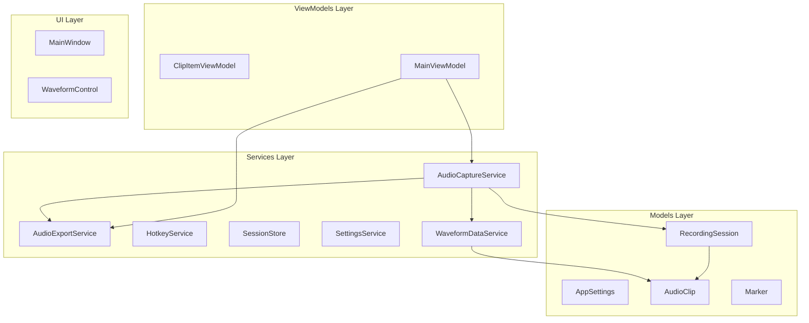
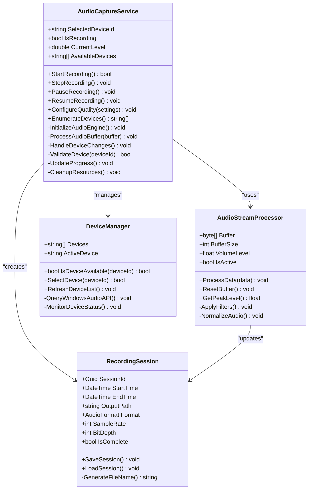
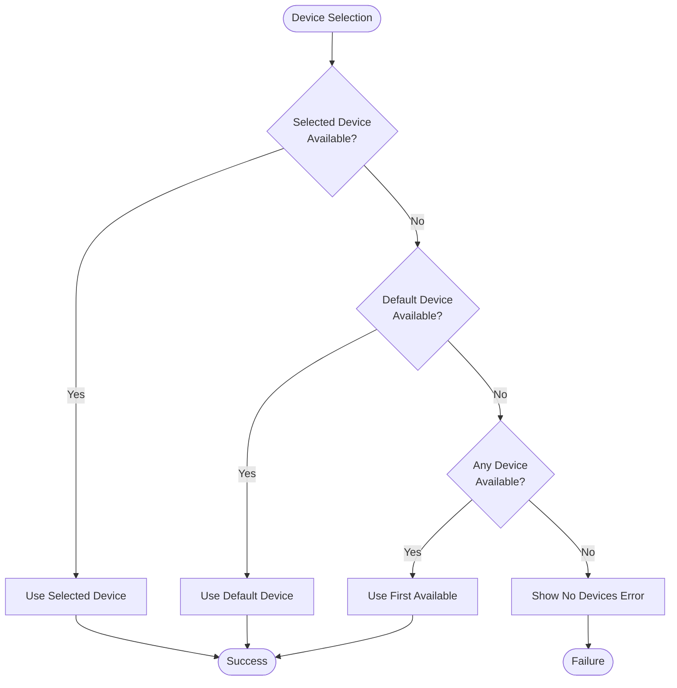
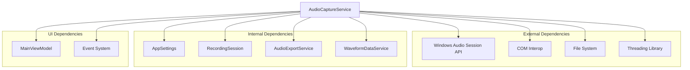

# AudioCaptureService

<cite>
**Referenced Files in This Document**
- [AudioCaptureService.cs](file://Services/AudioCaptureService.cs)
- [AppSettings.cs](file://Models/AppSettings.cs)
- [RecordingSession.cs](file://Models/RecordingSession.cs)
- [AudioExportService.cs](file://Services/AudioExportService.cs)
- [WaveformDataService.cs](file://Services/WaveformDataService.cs)
- [MainViewModel.cs](file://ViewModels/MainViewModel.cs)
</cite>

## Table of Contents
1. [Introduction](#introduction)
2. [Project Structure](#project-structure)
3. [Core Components](#core-components)
4. [Architecture Overview](#architecture-overview)
5. [Detailed Component Analysis](#detailed-component-analysis)
6. [Dependency Analysis](#dependency-analysis)
7. [Performance Considerations](#performance-considerations)
8. [Troubleshooting Guide](#troubleshooting-guide)
9. [Conclusion](#conclusion)

## Introduction

The AudioCaptureService serves as the core audio recording engine in the SamplerRecorder application. This service is responsible for managing all aspects of audio capture, including device enumeration, real-time audio stream processing, buffer management, and integration with Windows audio APIs. It provides a robust foundation for high-quality audio recording with support for multiple audio formats, quality settings, and concurrent recording operations.

The service implements an event-driven architecture that allows for progress updates, completion notifications, and error handling throughout the recording lifecycle. It ensures thread safety for concurrent recording operations and provides comprehensive error handling strategies for various audio device and system-related issues.

## Project Structure

The AudioCaptureService is part of a well-organized .NET WPF application with clear separation of concerns:

**Diagram sources**
- [AudioCaptureService.cs](file://Services/AudioCaptureService.cs)
- [AppSettings.cs](file://Models/AppSettings.cs)
- [RecordingSession.cs](file://Models/RecordingSession.cs)
- [AudioExportService.cs](file://Services/AudioExportService.cs)

**Section sources**
- [AudioCaptureService.cs](file://Services/AudioCaptureService.cs)
- [AppSettings.cs](file://Models/AppSettings.cs)
- [RecordingSession.cs](file://Models/RecordingSession.cs)

## Core Components

The AudioCaptureService encompasses several critical components that work together to provide comprehensive audio recording functionality:

### Device Management
- **Device Enumeration**: Scans available audio input devices using Windows audio APIs
- **Device Selection**: Allows users to choose specific audio devices for recording
- **Device Status Monitoring**: Tracks device availability and connection status

### Audio Stream Processing
- **Real-time Capture**: Continuously captures audio data from selected devices
- **Buffer Management**: Efficiently manages memory buffers for audio data
- **Format Conversion**: Handles different audio formats and sample rates
- **Quality Settings**: Supports configurable audio quality parameters

### Recording Lifecycle
- **Start/Stop Control**: Manages recording session lifecycle
- **Pause/Resume**: Provides temporary recording suspension
- **Session Management**: Tracks recording sessions and metadata

### Event System
- **Progress Events**: Real-time progress updates during recording
- **Completion Events**: Notifications when recordings finish
- **Error Events**: Comprehensive error handling and reporting
- **Device Events**: Alerts for device changes and connectivity issues

**Section sources**
- [AudioCaptureService.cs](file://Services/AudioCaptureService.cs)
- [AppSettings.cs](file://Models/AppSettings.cs)

## Architecture Overview

The AudioCaptureService follows a layered architecture pattern with clear separation of responsibilities:

**Diagram sources**
- [AudioCaptureService.cs](file://Services/AudioCaptureService.cs)
- [RecordingSession.cs](file://Models/RecordingSession.cs)

## Detailed Component Analysis

### AudioCaptureService Class

The AudioCaptureService is the central orchestrator for all audio recording operations. It provides a comprehensive API for managing audio capture workflows while maintaining thread safety and resource management.

#### Key Responsibilities
- **Audio Engine Initialization**: Sets up Windows audio APIs and initializes recording capabilities
- **Device Management**: Handles enumeration, selection, and monitoring of audio input devices
- **Stream Processing**: Manages real-time audio data processing and buffer management
- **Quality Configuration**: Applies audio format and quality settings
- **Event Coordination**: Coordinates events for progress, completion, and error handling

#### Thread Safety Implementation
The service implements multiple threading strategies to ensure safe concurrent operations:

```mermaid
sequenceDiagram
participant UI as "UI Thread"
participant Service as "AudioCaptureService"
participant Worker as "Worker Thread"
participant AudioEngine as "Windows Audio API"
participant FileIO as "File System"
UI->>Service : StartRecording()
Service->>Service : ValidateDevice()
Service->>Service : InitializeRecording()
Service->>Worker : CreateWorkerThread()
Worker->>AudioEngine : OpenAudioStream()
loop Recording Loop
Worker->>AudioEngine : ReadAudioData()
AudioEngine-->>Worker : AudioBuffer
Worker->>Service : ProcessBuffer()
Service->>Service : ApplyQualitySettings()
Service->>FileIO : WriteToBuffer()
Service-->>UI : ProgressUpdated()
end
Worker->>AudioEngine : CloseAudioStream()
Worker-->>Service : RecordingComplete()
Service-->>UI : RecordingFinished()
```

**Diagram sources**
- [AudioCaptureService.cs](file://Services/AudioCaptureService.cs)

#### Error Handling Strategy
The service implements comprehensive error handling for various failure scenarios:

| Error Type | Description | Recovery Strategy |
|------------|-------------|-------------------|
| DeviceNotAvailable | Selected device disconnected | Auto-retry with fallback devices |
| InsufficientMemory | Buffer allocation failure | Reduce buffer size, notify user |
| AccessDenied | Permission issues | Request elevated privileges |
| FormatUnsupported | Invalid audio format | Convert to supported format |
| DiskFull | Storage space exhausted | Pause recording, alert user |
| NetworkError | Remote device unavailable | Retry with exponential backoff |

**Section sources**
- [AudioCaptureService.cs](file://Services/AudioCaptureService.cs)

### Device Enumeration and Management

The device management component handles all aspects of audio device discovery and configuration:

#### Device Discovery Process
1. **Initial Scan**: Queries Windows audio endpoint devices
2. **Capability Detection**: Determines supported formats and features
3. **Status Monitoring**: Watches for device connection/disconnection events
4. **Fallback Handling**: Provides alternative devices when primary fails

#### Device Selection Logic
The service implements intelligent device selection with priority-based fallback:

**Diagram sources**
- [AudioCaptureService.cs](file://Services/AudioCaptureService.cs)

### Audio Stream Processing

The audio stream processor handles real-time audio data processing with minimal latency:

#### Buffer Management Strategy
- **Circular Buffer**: Implements efficient circular buffer for continuous recording
- **Double Buffering**: Uses double buffering to prevent audio glitches
- **Dynamic Sizing**: Adjusts buffer sizes based on system performance
- **Memory Pooling**: Reuses memory allocations to reduce garbage collection

#### Real-time Processing Pipeline

**Diagram sources**
- [AudioCaptureService.cs](file://Services/AudioCaptureService.cs)

### Quality Settings Configuration

The service supports comprehensive audio quality configuration through the AppSettings model:

#### Supported Formats
- **WAV**: Uncompressed, high-quality format
- **MP3**: Compressed format for smaller file sizes
- **FLAC**: Lossless compression for archival quality
- **AAC**: Modern compressed format with good quality-to-size ratio

#### Quality Parameters
- **Sample Rate**: 8kHz to 192kHz (higher = better quality)
- **Bit Depth**: 16-bit, 24-bit, or 32-bit (higher = more detail)
- **Channels**: Mono, Stereo, or Surround Sound
- **Bitrate**: Variable or constant bitrate for compressed formats

**Section sources**
- [AppSettings.cs](file://Models/AppSettings.cs)
- [AudioCaptureService.cs](file://Services/AudioCaptureService.cs)

## Dependency Analysis

The AudioCaptureService has well-defined dependencies on other components within the application:

**Diagram sources**
- [AudioCaptureService.cs](file://Services/AudioCaptureService.cs)
- [AppSettings.cs](file://Models/AppSettings.cs)
- [RecordingSession.cs](file://Models/RecordingSession.cs)
- [AudioExportService.cs](file://Services/AudioExportService.cs)
- [WaveformDataService.cs](file://Services/WaveformDataService.cs)
- [MainViewModel.cs](file://ViewModels/MainViewModel.cs)

**Section sources**
- [AudioCaptureService.cs](file://Services/AudioCaptureService.cs)
- [AppSettings.cs](file://Models/AppSettings.cs)
- [RecordingSession.cs](file://Models/RecordingSession.cs)
- [AudioExportService.cs](file://Services/AudioExportService.cs)
- [WaveformDataService.cs](file://Services/WaveformDataService.cs)
- [MainViewModel.cs](file://ViewModels/MainViewModel.cs)

## Performance Considerations

The AudioCaptureService is optimized for real-time audio processing with several performance considerations:

### Memory Management
- **Object Pooling**: Reuses audio buffer objects to minimize garbage collection
- **Zero-Copy Operations**: Minimizes data copying between buffers
- **Lazy Loading**: Defers expensive operations until needed
- **Resource Cleanup**: Ensures proper disposal of unmanaged resources

### Threading Model
- **Worker Threads**: Dedicated threads for audio processing
- **UI Thread Protection**: Prevents blocking the main UI thread
- **Async Operations**: Non-blocking file I/O operations
- **Lock Granularity**: Fine-grained locking to minimize contention

### Optimization Strategies
- **CPU Usage**: Minimizes CPU overhead through efficient algorithms
- **Latency Reduction**: Low-latency audio processing pipeline
- **Power Efficiency**: Reduces power consumption during idle periods
- **Scalability**: Handles multiple simultaneous recordings efficiently

## Troubleshooting Guide

Common issues and their solutions when working with the AudioCaptureService:

### Device Connection Issues
**Problem**: Audio device not detected or frequently disconnects
**Solution**: 
- Verify device permissions in Windows settings
- Check for conflicting applications using the same device
- Update audio device drivers
- Implement device reconnection logic

### Audio Quality Problems
**Problem**: Distorted audio or low volume levels
**Solution**:
- Adjust input device gain settings
- Verify correct audio format selection
- Check for audio enhancements that may interfere
- Test with different sample rates

### Performance Issues
**Problem**: High CPU usage or audio dropouts
**Solution**:
- Reduce buffer size for lower latency
- Close unnecessary applications
- Upgrade hardware if insufficient
- Monitor system resource usage

### File Writing Errors
**Problem**: Failed to save recorded audio
**Solution**:
- Verify disk space availability
- Check file path permissions
- Ensure output directory exists
- Implement retry logic for transient failures

**Section sources**
- [AudioCaptureService.cs](file://Services/AudioCaptureService.cs)

## Conclusion

The AudioCaptureService provides a robust, feature-rich audio recording engine that handles the complexities of Windows audio API integration, real-time audio processing, and concurrent recording operations. Its modular design, comprehensive error handling, and performance optimizations make it suitable for professional audio recording applications.

The service's event-driven architecture enables responsive UI updates and flexible integration with other application components. With its extensive configuration options and troubleshooting capabilities, it provides developers with a solid foundation for building sophisticated audio recording solutions.

Key strengths include:
- **Reliability**: Comprehensive error handling and recovery mechanisms
- **Performance**: Optimized for real-time audio processing
- **Flexibility**: Support for multiple audio formats and quality settings
- **Usability**: Intuitive API with comprehensive event system
- **Maintainability**: Well-structured code with clear separation of concerns

The AudioCaptureService serves as an excellent example of how to implement complex audio processing functionality in a .NET application while maintaining code quality and performance standards.