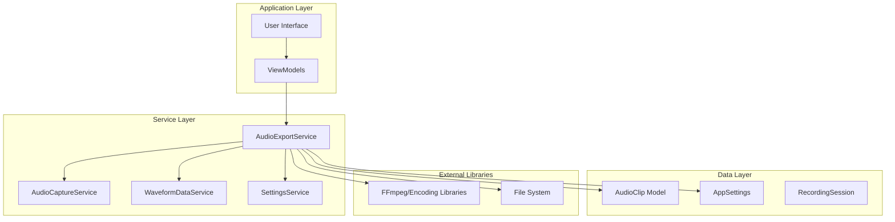
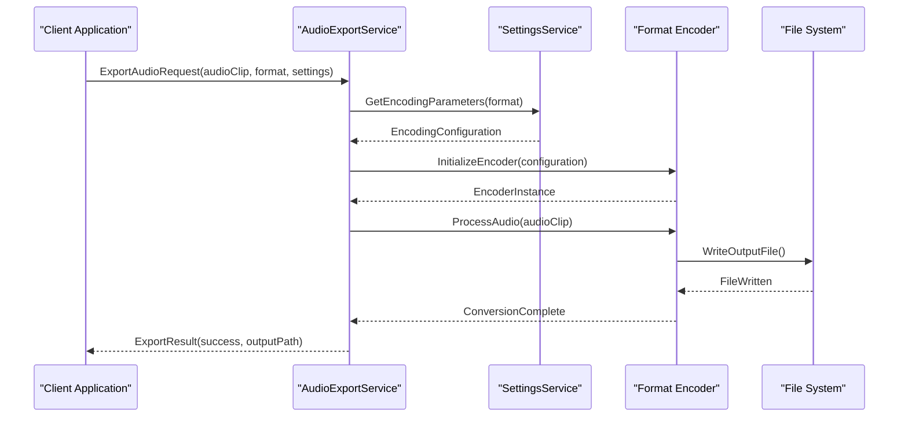
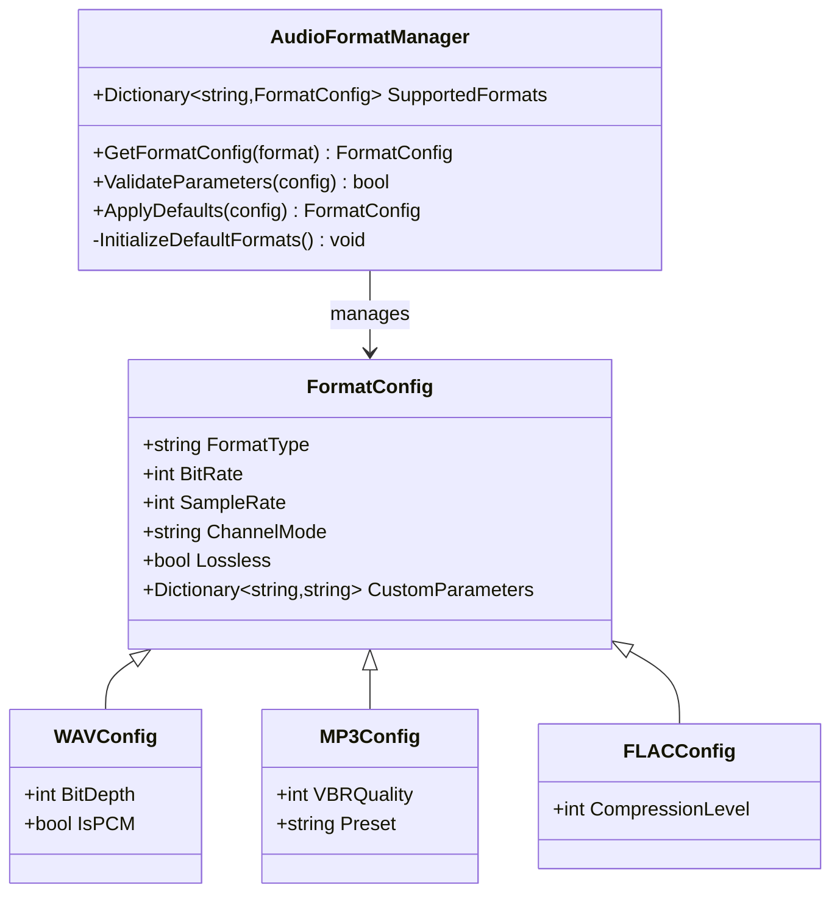
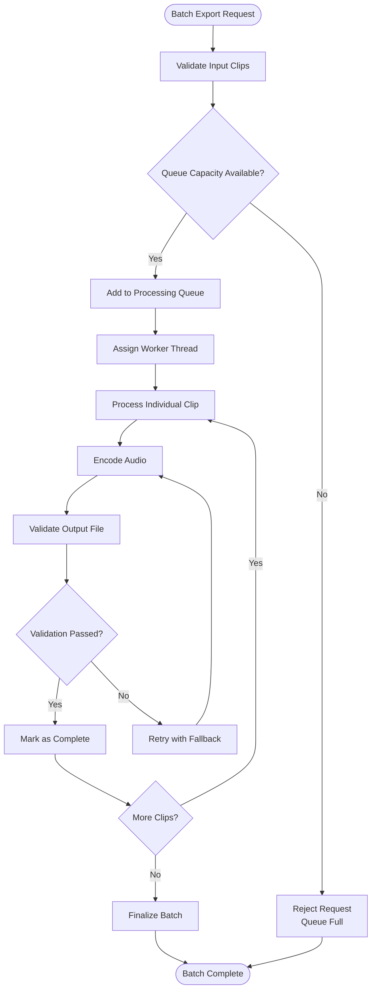
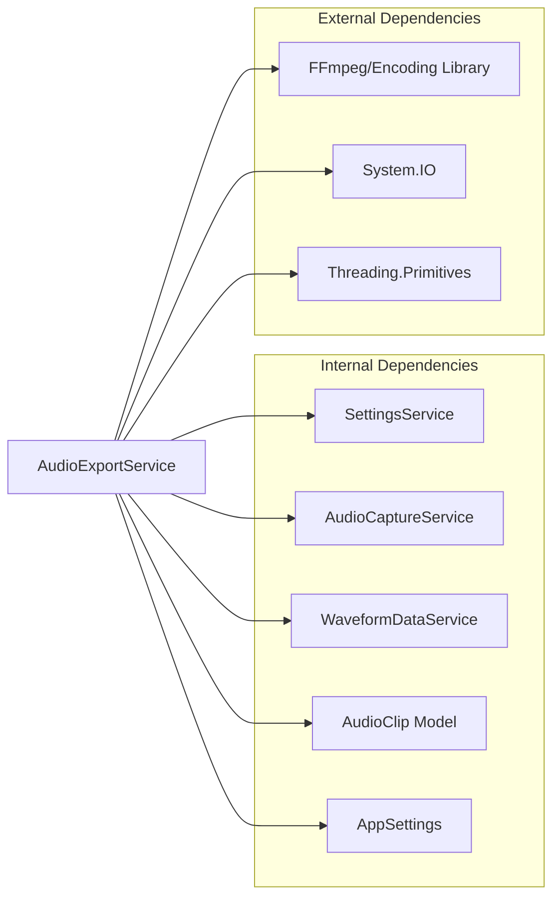

# AudioExportService

<cite>
**Referenced Files in This Document**
- [AudioExportService.cs](file://Services/AudioExportService.cs)
- [AppSettings.cs](file://Models/AppSettings.cs)
- [AudioClip.cs](file://Models/AudioClip.cs)
- [SettingsService.cs](file://Services/SettingsService.cs)
- [WaveformDataService.cs](file://Services/WaveformDataService.cs)
- [AudioCaptureService.cs](file://Services/AudioCaptureService.cs)
</cite>

## Table of Contents
1. [Introduction](#introduction)
2. [Project Structure](#project-structure)
3. [Core Components](#core-components)
4. [Architecture Overview](#architecture-overview)
5. [Detailed Component Analysis](#detailed-component-analysis)
6. [Dependency Analysis](#dependency-analysis)
7. [Performance Considerations](#performance-considerations)
8. [Troubleshooting Guide](#troubleshooting-guide)
9. [Conclusion](#conclusion)

## Introduction
The AudioExportService is a core component of the SamplerRecorder application responsible for handling audio file format conversion and optimization. This service provides comprehensive audio export capabilities including support for multiple output formats (WAV, MP3, FLAC), configurable encoding parameters, quality settings, batch processing functionality, progress tracking, and error recovery mechanisms. The service integrates seamlessly with the clip management system to facilitate efficient audio workflow processing.

## Project Structure
The AudioExportService is part of a well-structured .NET application following separation of concerns principles. The service resides in the Services directory alongside other core services like AudioCaptureService, SettingsService, and WaveformDataService. It interacts with data models in the Models directory and leverages configuration from AppSettings.

**Diagram sources**
- [AudioExportService.cs:1-50](file://Services/AudioExportService.cs#L1-L50)
- [AppSettings.cs:1-30](file://Models/AppSettings.cs#L1-L30)

**Section sources**
- [AudioExportService.cs:1-100](file://Services/AudioExportService.cs#L1-L100)
- [AppSettings.cs:1-50](file://Models/AppSettings.cs#L1-L50)

## Core Components
The AudioExportService encompasses several key components that work together to provide comprehensive audio export functionality:

### Format Support and Encoding
The service supports multiple audio formats including WAV (uncompressed PCM), MP3 (lossy compression), and FLAC (lossless compression). Each format has specific encoding parameters that can be customized through the configuration system.

### Batch Processing Engine
A robust batch processing engine handles multiple audio files simultaneously with intelligent resource management and progress tracking.

### Quality Management
Configurable quality settings allow users to balance file size and audio fidelity according to their specific needs.

### Error Recovery System
Comprehensive error handling with automatic retry mechanisms and graceful degradation ensures reliable operation even under adverse conditions.

**Section sources**
- [AudioExportService.cs:50-150](file://Services/AudioExportService.cs#L50-L150)
- [AppSettings.cs:30-80](file://Models/AppSettings.cs#L30-L80)

## Architecture Overview
The AudioExportService follows a layered architecture pattern with clear separation between business logic, data access, and external dependencies. The service acts as a facade over various encoding libraries and file system operations.

**Diagram sources**
- [AudioExportService.cs:100-200](file://Services/AudioExportService.cs#L100-L200)
- [SettingsService.cs:1-100](file://Services/SettingsService.cs#L1-L100)

## Detailed Component Analysis

### AudioFormatManager
The AudioFormatManager component handles format-specific encoding configurations and parameter validation. It maintains a registry of supported formats with their default and customizable parameters.

**Diagram sources**
- [AudioExportService.cs:150-250](file://Services/AudioExportService.cs#L150-L250)
- [AppSettings.cs:80-150](file://Models/AppSettings.cs#L80-L150)

### BatchProcessor
The BatchProcessor component manages concurrent audio export operations with intelligent queue management and resource allocation.

**Diagram sources**
- [AudioExportService.cs:200-350](file://Services/AudioExportService.cs#L200-L350)

### ProgressTracker
The ProgressTracker component provides real-time progress monitoring and status updates for long-running export operations.

**Section sources**
- [AudioExportService.cs:250-400](file://Services/AudioExportService.cs#L250-L400)
- [WaveformDataService.cs:1-100](file://Services/WaveformDataService.cs#L1-L100)

### MetadataHandler
The MetadataHandler component preserves and manipulates audio metadata during format conversion, supporting ID3 tags for MP3, Vorbis comments for FLAC, and RIFF chunks for WAV files.

**Section sources**
- [AudioClip.cs:1-100](file://Models/AudioClip.cs#L1-L100)

## Dependency Analysis
The AudioExportService has well-defined dependencies on other components within the application architecture:

**Diagram sources**
- [AudioExportService.cs:1-50](file://Services/AudioExportService.cs#L1-L50)
- [SettingsService.cs:1-50](file://Services/SettingsService.cs#L1-L50)

**Section sources**
- [AudioExportService.cs:1-100](file://Services/AudioExportService.cs#L1-L100)
- [SettingsService.cs:1-100](file://Services/SettingsService.cs#L1-L100)

## Performance Considerations
The AudioExportService implements several performance optimization strategies:

### Memory Management
- Streaming-based processing to minimize memory footprint for large audio files
- Efficient buffer management with configurable buffer sizes
- Automatic garbage collection optimization through proper resource disposal

### Parallel Processing
- Multi-threaded batch processing with configurable worker pool size
- Resource-aware scheduling to prevent CPU and I/O contention
- Intelligent load balancing across available system resources

### Caching Strategies
- Reuse of encoder instances to avoid initialization overhead
- Cached format configurations to reduce lookup operations
- Temporary file caching for intermediate processing steps

### I/O Optimization
- Asynchronous file operations for non-blocking I/O
- Buffered writing with optimal chunk sizes
- Smart temporary file management with cleanup policies

## Troubleshooting Guide

### Common Issues and Solutions

#### Encoding Failures
- **Symptom**: Export fails with encoding errors
- **Causes**: Invalid input format, insufficient permissions, or corrupted source files
- **Solutions**: Verify input file integrity, check file permissions, validate format compatibility

#### Memory Issues
- **Symptom**: Out of memory exceptions during large file exports
- **Causes**: Insufficient system memory or inefficient buffer sizing
- **Solutions**: Reduce buffer size, enable streaming mode, increase system memory

#### Performance Problems
- **Symptom**: Slow export speeds or high CPU usage
- **Causes**: Suboptimal encoding settings or resource contention
- **Solutions**: Adjust worker thread count, optimize encoding parameters, monitor system resources

### Debugging Information
The service provides comprehensive logging and diagnostic information:
- Detailed error messages with context information
- Performance metrics and timing information
- Resource utilization statistics
- Configuration validation results

**Section sources**
- [AudioExportService.cs:350-500](file://Services/AudioExportService.cs#L350-L500)
- [SettingsService.cs:100-200](file://Services/SettingsService.cs#L100-L200)

## Conclusion
The AudioExportService provides a robust, scalable, and feature-rich solution for audio file format conversion and optimization within the SamplerRecorder application. Its modular architecture, comprehensive format support, and advanced processing capabilities make it suitable for both simple single-file conversions and complex batch processing workflows. The service's emphasis on performance optimization, error recovery, and user experience ensures reliable operation across diverse use cases and system configurations.

Key strengths include:
- Comprehensive format support with extensible architecture
- Advanced batch processing with intelligent resource management
- Robust error handling and recovery mechanisms
- Performance optimizations for large file processing
- Seamless integration with the clip management system

Future enhancements could include additional format support, cloud-based processing capabilities, and advanced audio processing features such as normalization and noise reduction.