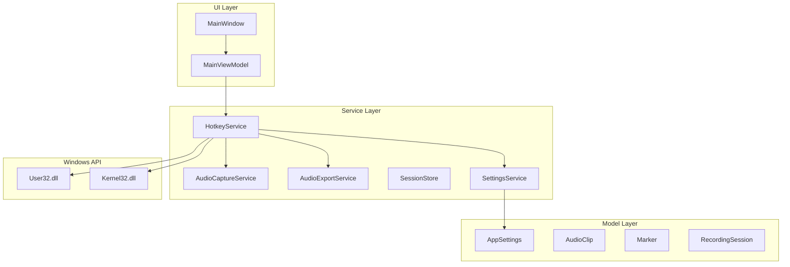
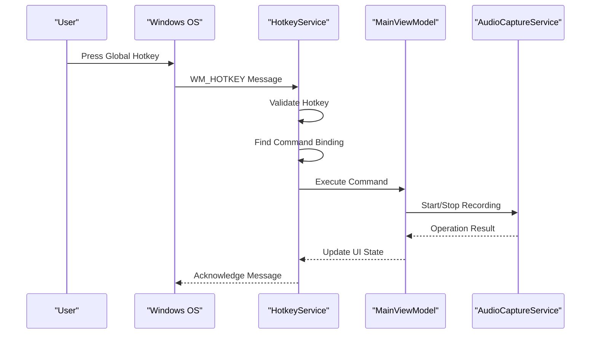
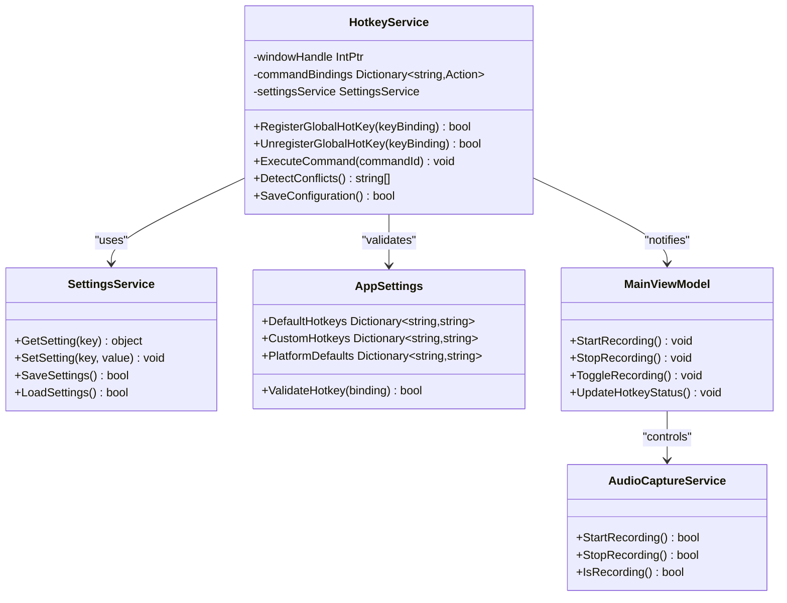

# HotkeyService

<cite>
**Referenced Files in This Document**
- [HotkeyService.cs](file://Services/HotkeyService.cs)
- [AppSettings.cs](file://Models/AppSettings.cs)
- [SettingsService.cs](file://Services/SettingsService.cs)
- [MainViewModel.cs](file://ViewModels/MainViewModel.cs)
- [AudioCaptureService.cs](file://Services/AudioCaptureService.cs)
- [AudioExportService.cs](file://Services/AudioExportService.cs)
- [SessionStore.cs](file://Services/SessionStore.cs)
</cite>

## Table of Contents
1. [Introduction](#introduction)
2. [Project Structure](#project-structure)
3. [Core Components](#core-components)
4. [Architecture Overview](#architecture-overview)
5. [Detailed Component Analysis](#detailed-component-analysis)
6. [Dependency Analysis](#dependency-analysis)
7. [Performance Considerations](#performance-considerations)
8. [Troubleshooting Guide](#troubleshooting-guide)
9. [Conclusion](#conclusion)

## Introduction

The HotkeyService is a critical component in the SamplerRecorder application that manages system-wide keyboard shortcuts and global hotkeys. This service enables users to control audio recording functionality through keyboard shortcuts that work across all applications, providing seamless integration with the Windows operating system's input handling mechanisms.

The service implements Windows API integration for registering global hotkeys, conflict detection and resolution mechanisms, command binding systems, and asynchronous operation management. It supports configuration interfaces for custom key bindings, default shortcut mappings, and user preference persistence across different Windows versions.

## Project Structure

The HotkeyService is part of a larger WPF application architecture that follows a layered design pattern:

**Diagram sources**
- [HotkeyService.cs](file://Services/HotkeyService.cs)
- [MainViewModel.cs](file://ViewModels/MainViewModel.cs)
- [AppSettings.cs](file://Models/AppSettings.cs)

**Section sources**
- [HotkeyService.cs](file://Services/HotkeyService.cs)
- [MainViewModel.cs](file://ViewModels/MainViewModel.cs)

## Core Components

The HotkeyService consists of several key components that work together to provide robust global hotkey functionality:

### Hotkey Registration System
The registration system handles the low-level Windows API calls required to register global hotkeys. It manages the lifecycle of hotkey registrations, including proper cleanup when the application exits or when hotkeys are unregistered.

### Command Binding Framework
The command binding system provides a flexible mechanism for associating keyboard shortcuts with application commands. It supports modifier keys (Ctrl, Alt, Shift), function keys, and alphanumeric characters.

### Conflict Detection Engine
The conflict detection engine monitors registered hotkeys and identifies potential conflicts with other applications or system shortcuts. It provides resolution strategies and user notifications.

### Configuration Management
The configuration management system handles persistence of user-defined hotkey mappings, default configurations, and platform-specific settings.

**Section sources**
- [HotkeyService.cs](file://Services/HotkeyService.cs)
- [SettingsService.cs](file://Services/SettingsService.cs)
- [AppSettings.cs](file://Models/AppSettings.cs)

## Architecture Overview

The HotkeyService follows a mediator pattern where it acts as a central coordinator between the UI layer, Windows API, and application services:

**Diagram sources**
- [HotkeyService.cs](file://Services/HotkeyService.cs)
- [MainViewModel.cs](file://ViewModels/MainViewModel.cs)
- [AudioCaptureService.cs](file://Services/AudioCaptureService.cs)

The architecture ensures separation of concerns while maintaining efficient communication between components. The service handles all Windows API interactions, leaving the UI layer focused on presentation logic.

## Detailed Component Analysis

### HotkeyService Class Implementation

The HotkeyService class serves as the main entry point for global hotkey management. It implements IDisposable for proper resource cleanup and provides thread-safe operations for hotkey registration and event handling.

#### Key Responsibilities:
- Windows API integration for hotkey registration
- Event routing and command execution
- Conflict detection and resolution
- Configuration management integration
- Error handling and logging

#### Core Methods:
- `RegisterGlobalHotKey()`: Registers a new global hotkey with Windows
- `UnregisterGlobalHotKey()`: Removes an existing hotkey registration
- `ExecuteCommand()`: Routes hotkey events to appropriate command handlers
- `DetectConflicts()`: Identifies potential hotkey conflicts
- `SaveConfiguration()`: Persists user preferences to storage

**Section sources**
- [HotkeyService.cs](file://Services/HotkeyService.cs)

### Command Binding System

The command binding system provides a flexible framework for associating keyboard shortcuts with application functionality. It supports various key combinations and provides validation for valid key sequences.

#### Supported Key Combinations:
- Modifier keys: Ctrl, Alt, Shift, Win
- Function keys: F1-F24
- Alphanumeric keys: A-Z, 0-9
- Special keys: Enter, Space, Escape, etc.

#### Binding Validation:
- Prevents invalid key combinations
- Validates modifier key usage
- Ensures compatibility across Windows versions
- Handles platform-specific limitations

**Section sources**
- [HotkeyService.cs](file://Services/HotkeyService.cs)

### Configuration Interface

The configuration interface allows users to customize hotkey mappings through a user-friendly interface. It integrates with the SettingsService for persistence and provides validation for user inputs.

#### Configuration Features:
- Real-time preview of key combinations
- Conflict detection during configuration
- Default preset configurations
- Export/import of custom configurations
- Platform-specific defaults

**Section sources**
- [AppSettings.cs](file://Models/AppSettings.cs)
- [SettingsService.cs](file://Services/SettingsService.cs)

### Windows API Integration

The service integrates with Windows API functions to register and manage global hotkeys. It handles platform-specific considerations and error conditions gracefully.

#### Windows API Functions Used:
- `RegisterHotKey()`: Registers a global hotkey
- `UnregisterHotKey()`: Unregisters a global hotkey
- `GetAsyncKeyState()`: Checks current key states
- `PostMessage()`: Sends messages to window procedures

#### Error Handling:
- Handles insufficient privileges
- Manages registry access errors
- Provides fallback mechanisms
- Logs detailed error information

**Section sources**
- [HotkeyService.cs](file://Services/HotkeyService.cs)

## Dependency Analysis

The HotkeyService has well-defined dependencies on other components within the application:

**Diagram sources**
- [HotkeyService.cs](file://Services/HotkeyService.cs)
- [SettingsService.cs](file://Services/SettingsService.cs)
- [AppSettings.cs](file://Models/AppSettings.cs)
- [MainViewModel.cs](file://ViewModels/MainViewModel.cs)
- [AudioCaptureService.cs](file://Services/AudioCaptureService.cs)

The dependency relationships ensure loose coupling between components while maintaining clear interfaces for interaction.

**Section sources**
- [HotkeyService.cs](file://Services/HotkeyService.cs)
- [SettingsService.cs](file://Services/SettingsService.cs)
- [AppSettings.cs](file://Models/AppSettings.cs)

## Performance Considerations

The HotkeyService is designed with performance in mind, implementing several optimization strategies:

### Memory Management
- Efficient storage of hotkey bindings using dictionaries
- Proper disposal of Windows API resources
- Minimal memory footprint for background operations

### Event Processing
- Asynchronous command execution to prevent UI blocking
- Debouncing of rapid key presses
- Priority-based event processing

### Resource Optimization
- Lazy loading of configuration data
- Caching of frequently accessed settings
- Efficient Windows API call batching

### Scalability
- Support for multiple concurrent hotkey registrations
- Thread-safe operations for multi-threaded environments
- Graceful degradation under high load

## Troubleshooting Guide

### Common Issues and Solutions

#### Hotkey Conflicts
**Problem**: Global hotkey conflicts with other applications or system shortcuts
**Symptoms**: 
- Hotkey not responding
- Multiple applications responding to same shortcut
- System instability

**Solutions**:
1. Use the built-in conflict detection tool
2. Check for conflicting applications in startup programs
3. Modify default Windows shortcuts if necessary
4. Use alternative key combinations

#### Permission Issues
**Problem**: Insufficient privileges to register global hotkeys
**Symptoms**:
- Registration failures
- Access denied errors
- Inconsistent behavior across user accounts

**Solutions**:
1. Run application as administrator
2. Check UAC settings
3. Verify user account permissions
4. Review security policy restrictions

#### Platform-Specific Issues
**Problem**: Different behavior across Windows versions
**Symptoms**:
- Inconsistent hotkey registration
- Missing functionality on older systems
- Compatibility warnings

**Solutions**:
1. Check Windows version compatibility
2. Use appropriate fallback mechanisms
3. Test on target platforms
4. Implement version detection

#### Configuration Problems
**Problem**: Settings not persisting or loading correctly
**Symptoms**:
- Lost custom configurations
- Invalid key combinations
- Corrupted settings files

**Solutions**:
1. Reset to default configuration
2. Backup and restore settings
3. Validate configuration format
4. Check file permissions

### Debugging Techniques

#### Logging and Diagnostics
Enable detailed logging to identify issues:
- Hotkey registration attempts
- Command execution traces
- Error conditions and exceptions
- Performance metrics

#### Testing Procedures
Systematic testing approaches:
- Unit tests for individual components
- Integration tests for full workflows
- Cross-platform compatibility testing
- Stress testing under load

**Section sources**
- [HotkeyService.cs](file://Services/HotkeyService.cs)
- [SettingsService.cs](file://Services/SettingsService.cs)

## Conclusion

The HotkeyService provides a robust and flexible solution for managing system-wide keyboard shortcuts in the SamplerRecorder application. Its architecture ensures reliability, performance, and maintainability while providing a seamless user experience across different Windows platforms.

Key strengths of the implementation include:
- Comprehensive Windows API integration
- Flexible command binding system
- Robust conflict detection and resolution
- Configurable user interface
- Cross-platform compatibility considerations

Future enhancements could include:
- Advanced conflict resolution algorithms
- Cloud synchronization of configurations
- Enhanced accessibility features
- Plugin architecture for custom hotkey behaviors

The service successfully balances complexity with usability, providing powerful functionality while remaining accessible to users with varying technical expertise.