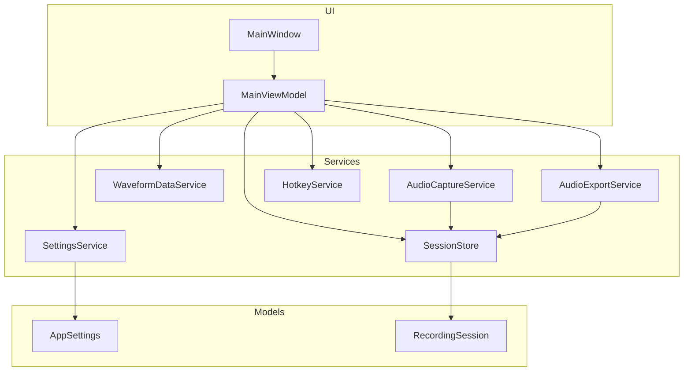
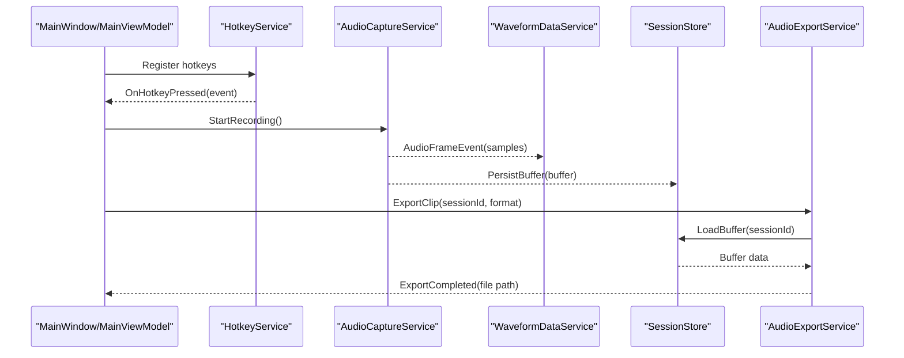
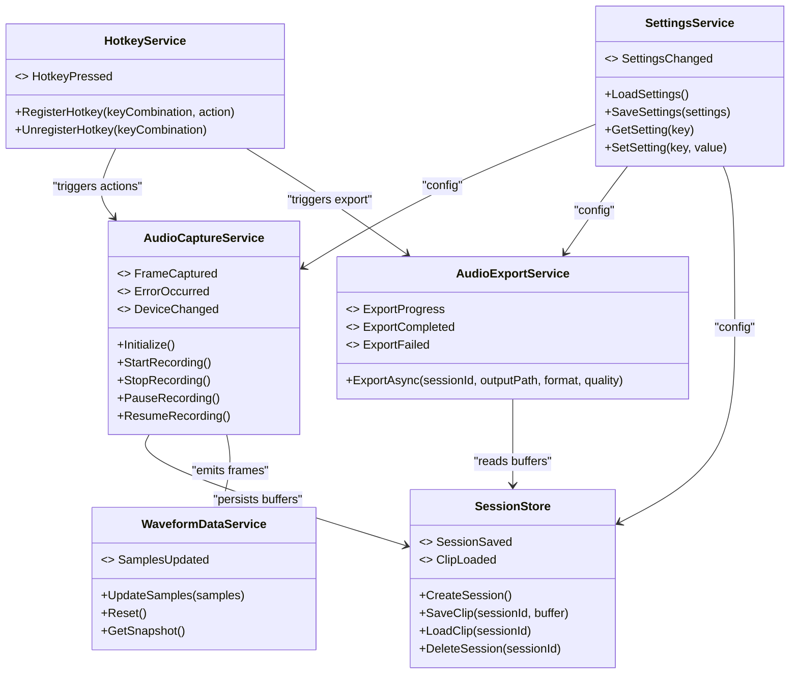

# Service Layer Architecture

<cite>
**Referenced Files in This Document**
- [AudioCaptureService.cs](file://Services/AudioCaptureService.cs)
- [WaveformDataService.cs](file://Services/WaveformDataService.cs)
- [AudioExportService.cs](file://Services/AudioExportService.cs)
- [HotkeyService.cs](file://Services/HotkeyService.cs)
- [SettingsService.cs](file://Services/SettingsService.cs)
- [SessionStore.cs](file://Services/SessionStore.cs)
- [AppSettings.cs](file://Models/AppSettings.cs)
- [RecordingSession.cs](file://Models/RecordingSession.cs)
- [App.xaml.cs](file://App.xaml.cs)
- [MainWindow.xaml.cs](file://MainWindow.xaml.cs)
</cite>

## Table of Contents
1. [Introduction](#introduction)
2. [Project Structure](#project-structure)
3. [Core Components](#core-components)
4. [Architecture Overview](#architecture-overview)
5. [Detailed Component Analysis](#detailed-component-analysis)
6. [Dependency Analysis](#dependency-analysis)
7. [Performance Considerations](#performance-considerations)
8. [Troubleshooting Guide](#troubleshooting-guide)
9. [Conclusion](#conclusion)

## Introduction
This document explains the service layer architecture of SamplerRecorder, focusing on responsibilities, interfaces, and interaction patterns across key services: AudioCaptureService, WaveformDataService, AudioExportService, HotkeyService, SettingsService, and SessionStore. It also covers dependency injection patterns, error handling strategies, asynchronous operation management, lifecycle management, thread safety considerations, and integration points with external systems such as audio devices and the file system.

## Project Structure
The application follows a layered design where Services encapsulate domain-specific functionality and are consumed by UI layers (ViewModels and Views). Models define core data structures used across services and UI.

**Diagram sources**
- [App.xaml.cs](file://App.xaml.cs)
- [MainWindow.xaml.cs](file://MainWindow.xaml.cs)
- [AudioCaptureService.cs](file://Services/AudioCaptureService.cs)
- [WaveformDataService.cs](file://Services/WaveformDataService.cs)
- [AudioExportService.cs](file://Services/AudioExportService.cs)
- [HotkeyService.cs](file://Services/HotkeyService.cs)
- [SettingsService.cs](file://Services/SettingsService.cs)
- [SessionStore.cs](file://Services/SessionStore.cs)
- [AppSettings.cs](file://Models/AppSettings.cs)
- [RecordingSession.cs](file://Models/RecordingSession.cs)

**Section sources**
- [App.xaml.cs](file://App.xaml.cs)
- [MainWindow.xaml.cs](file://MainWindow.xaml.cs)

## Core Components
- AudioCaptureService: Manages audio device enumeration, initialization, recording start/stop, and stream processing. Provides events for captured audio frames and errors.
- WaveformDataService: Consumes audio frames to compute waveform samples, exposes real-time updates via events or callbacks, and maintains state for current session.
- AudioExportService: Converts recorded buffers into various file formats, handles codec selection, metadata, and writes files to disk asynchronously.
- HotkeyService: Registers global keyboard shortcuts, maps them to commands, and raises events when hotkeys are pressed.
- SettingsService: Loads, validates, and persists application settings; provides change notifications and default values.
- SessionStore: Persists recording sessions and clip metadata to local storage; supports CRUD operations and background save strategies.

Key responsibilities and interactions:
- AudioCaptureService emits raw audio frames to WaveformDataService for visualization and to SessionStore for persistence.
- AudioExportService reads persisted buffers from SessionStore and writes formatted files.
- HotkeyService triggers actions in other services (e.g., start/stop recording, export).
- SettingsService supplies configuration to all services and persists user preferences.
- SessionStore coordinates data consistency across recording and export operations.

**Section sources**
- [AudioCaptureService.cs](file://Services/AudioCaptureService.cs)
- [WaveformDataService.cs](file://Services/WaveformDataService.cs)
- [AudioExportService.cs](file://Services/AudioExportService.cs)
- [HotkeyService.cs](file://Services/HotkeyService.cs)
- [SettingsService.cs](file://Services/SettingsService.cs)
- [SessionStore.cs](file://Services/SessionStore.cs)

## Architecture Overview
The service layer is designed around clear separation of concerns and event-driven communication. Dependency injection is used to wire services together at application startup. Asynchronous operations are managed using async/await patterns, and thread safety is ensured through synchronization primitives and immutable data where appropriate.

**Diagram sources**
- [HotkeyService.cs](file://Services/HotkeyService.cs)
- [AudioCaptureService.cs](file://Services/AudioCaptureService.cs)
- [WaveformDataService.cs](file://Services/WaveformDataService.cs)
- [SessionStore.cs](file://Services/SessionStore.cs)
- [AudioExportService.cs](file://Services/AudioExportService.cs)

## Detailed Component Analysis

### AudioCaptureService
Responsibilities:
- Enumerate and select audio input devices.
- Initialize capture streams and manage lifecycle (start/stop/pause).
- Process incoming audio frames and raise events for downstream consumers.
- Handle device changes and errors gracefully.

Interfaces and contracts:
- Methods: Initialize(), StartRecording(), StopRecording(), PauseRecording(), ResumeRecording().
- Events: FrameCaptured(samples), ErrorOccurred(exception), DeviceChanged(deviceInfo).

Asynchronous operations:
- Uses async I/O for device enumeration and stream initialization.
- Frames are processed on a dedicated background thread to avoid UI blocking.

Thread safety:
- Synchronizes access to internal buffers and state using locks or concurrent collections.
- Ensures event handlers are invoked on appropriate threads (e.g., UI thread via dispatcher if needed).

Error handling:
- Catches device-related exceptions and raises ErrorOccurred events.
- Implements retry logic for transient failures during initialization.

Integration points:
- Integrates with OS audio APIs for device access and streaming.
- Publishes frames to WaveformDataService and buffers to SessionStore.

Lifecycle:
- Initialized once per app session; disposed on shutdown to release resources.

**Section sources**
- [AudioCaptureService.cs](file://Services/AudioCaptureService.cs)

### WaveformDataService
Responsibilities:
- Compute waveform samples from audio frames.
- Maintain rolling window of samples for real-time display.
- Expose updates via events or observable sequences.

Interfaces and contracts:
- Methods: UpdateSamples(samples), Reset(), GetSnapshot().
- Events: SamplesUpdated(waveformData).

Asynchronous operations:
- Processes frames asynchronously to keep up with real-time input.
- Debounces updates to reduce UI churn.

Thread safety:
- Uses thread-safe collections for sample storage.
- Locks critical sections during snapshot generation.

Error handling:
- Validates input frame size and format.
- Ignores malformed frames and logs warnings.

Integration points:
- Subscribes to AudioCaptureService.FrameCaptured.
- Notifies UI components via events.

Lifecycle:
- Created per active recording session; reset on new session start.

**Section sources**
- [WaveformDataService.cs](file://Services/WaveformDataService.cs)

### AudioExportService
Responsibilities:
- Convert recorded audio buffers to target file formats (e.g., WAV, MP3).
- Manage codec selection and quality settings.
- Write output files asynchronously and report progress.

Interfaces and contracts:
- Methods: ExportAsync(sessionId, outputPath, format, quality).
- Events: ExportProgress(percent), ExportCompleted(filePath), ExportFailed(exception).

Asynchronous operations:
- Uses async I/O for reading buffers and writing files.
- Supports cancellation tokens for long-running exports.

Thread safety:
- Ensures concurrent exports do not corrupt shared state.
- Uses file locking mechanisms to prevent conflicts.

Error handling:
- Handles codec errors, disk write failures, and invalid parameters.
- Raises ExportFailed with detailed exception information.

Integration points:
- Reads buffers from SessionStore.
- Writes files to the file system.

Lifecycle:
- Stateless service; instantiated per export request or reused with pooled instances.

**Section sources**
- [AudioExportService.cs](file://Services/AudioExportService.cs)

### HotkeyService
Responsibilities:
- Register global keyboard shortcuts.
- Map hotkeys to commands or actions.
- Raise events when hotkeys are pressed.

Interfaces and contracts:
- Methods: RegisterHotkey(keyCombination, action), UnregisterHotkey(keyCombination).
- Events: HotkeyPressed(keyCombination).

Asynchronous operations:
- Minimal async usage; primarily event-driven.

Thread safety:
- Thread-safe registration/unregistration of hotkeys.
- Marshals event invocations to appropriate context if needed.

Error handling:
- Validates key combinations and handles OS-level registration failures.
- Logs and surfaces errors to callers.

Integration points:
- Triggers actions in AudioCaptureService (start/stop) and AudioExportService (export).

Lifecycle:
- Initialized at app startup; cleaned up on shutdown.

**Section sources**
- [HotkeyService.cs](file://Services/HotkeyService.cs)

### SettingsService
Responsibilities:
- Load, validate, and persist application settings.
- Provide default values and schema validation.
- Notify subscribers of setting changes.

Interfaces and contracts:
- Methods: LoadSettings(), SaveSettings(settings), GetSetting<T>(key), SetSetting<T>(key, value).
- Events: SettingsChanged(settingName, newValue).

Asynchronous operations:
- Async file I/O for loading/saving settings.

Thread safety:
- Uses locks or concurrent dictionaries for settings storage.
- Ensures consistent reads/writes under concurrent access.

Error handling:
- Handles corrupted config files and missing keys.
- Falls back to defaults and logs warnings.

Integration points:
- Supplies configuration to all services (e.g., buffer sizes, export formats).

Lifecycle:
- Singleton instance created at app startup; disposed on shutdown.

**Section sources**
- [SettingsService.cs](file://Services/SettingsService.cs)
- [AppSettings.cs](file://Models/AppSettings.cs)

### SessionStore
Responsibilities:
- Persist recording sessions and clip metadata.
- Support CRUD operations for sessions and clips.
- Implement background save strategies to avoid blocking.

Interfaces and contracts:
- Methods: CreateSession(), SaveClip(sessionId, buffer), LoadClip(sessionId), DeleteSession(sessionId).
- Events: SessionSaved(sessionId), ClipLoaded(sessionId).

Asynchronous operations:
- Async I/O for database/file operations.
- Background tasks for batch saves.

Thread safety:
- Uses transactions or atomic writes to ensure data integrity.
- Synchronizes concurrent access to session data.

Error handling:
- Handles disk full, permission errors, and corruption.
- Implements rollback and recovery mechanisms.

Integration points:
- Consumed by AudioCaptureService for buffer persistence.
- Used by AudioExportService to retrieve buffers for export.

Lifecycle:
- Singleton instance initialized at app startup; disposed on shutdown.

**Section sources**
- [SessionStore.cs](file://Services/SessionStore.cs)
- [RecordingSession.cs](file://Models/RecordingSession.cs)

## Dependency Analysis
Services depend on each other through well-defined interfaces and events. Dependency injection is used to wire dependencies at startup, promoting loose coupling and testability.

**Diagram sources**
- [AudioCaptureService.cs](file://Services/AudioCaptureService.cs)
- [WaveformDataService.cs](file://Services/WaveformDataService.cs)
- [AudioExportService.cs](file://Services/AudioExportService.cs)
- [HotkeyService.cs](file://Services/HotkeyService.cs)
- [SettingsService.cs](file://Services/SettingsService.cs)
- [SessionStore.cs](file://Services/SessionStore.cs)

**Section sources**
- [AudioCaptureService.cs](file://Services/AudioCaptureService.cs)
- [WaveformDataService.cs](file://Services/WaveformDataService.cs)
- [AudioExportService.cs](file://Services/AudioExportService.cs)
- [HotkeyService.cs](file://Services/HotkeyService.cs)
- [SettingsService.cs](file://Services/SettingsService.cs)
- [SessionStore.cs](file://Services/SessionStore.cs)

## Performance Considerations
- AudioCaptureService should use ring buffers to minimize memory allocations and handle high-throughput audio streams efficiently.
- WaveformDataService should downsample or aggregate frames to reduce CPU load during real-time visualization.
- AudioExportService should leverage hardware-accelerated codecs where available and stream writes to disk to avoid large memory spikes.
- SessionStore should implement incremental saves and compression for large buffers to improve I/O performance.
- HotkeyService should minimize overhead by caching key mappings and avoiding unnecessary event dispatching.
- SettingsService should cache frequently accessed settings and debounce frequent writes.

[No sources needed since this section provides general guidance]

## Troubleshooting Guide
Common issues and resolutions:
- Audio device not found: Verify device enumeration and permissions; check for driver issues.
- Recording fails to start: Ensure no other process is using the device; check buffer sizes and format compatibility.
- Waveform lagging: Reduce update frequency or sample resolution; optimize UI rendering.
- Export fails: Validate output path permissions and available disk space; check codec availability.
- Hotkeys not registering: Confirm OS-level restrictions and unique key combinations; handle conflicts.
- Settings not saving: Check file permissions and serialization errors; validate schema.

**Section sources**
- [AudioCaptureService.cs](file://Services/AudioCaptureService.cs)
- [WaveformDataService.cs](file://Services/WaveformDataService.cs)
- [AudioExportService.cs](file://Services/AudioExportService.cs)
- [HotkeyService.cs](file://Services/HotkeyService.cs)
- [SettingsService.cs](file://Services/SettingsService.cs)
- [SessionStore.cs](file://Services/SessionStore.cs)

## Conclusion
The SamplerRecorder service layer is designed with clear separation of concerns, robust error handling, and efficient asynchronous operations. Each service has distinct responsibilities and interacts through well-defined interfaces and events. Dependency injection promotes modularity and testability. Proper lifecycle management and thread safety ensure reliability under real-world conditions. Integration with external systems like audio devices and file storage is handled gracefully with comprehensive error handling and recovery mechanisms.

[No sources needed since this section summarizes without analyzing specific files]