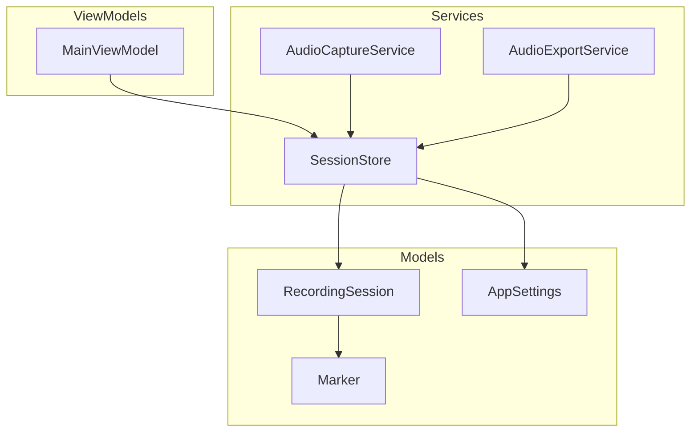
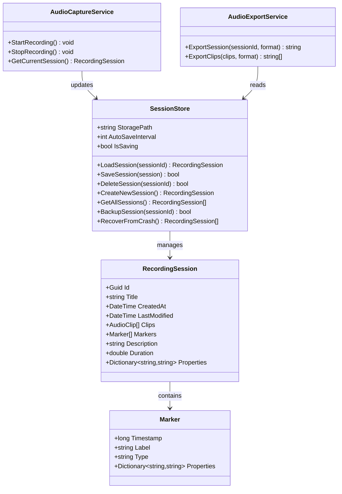
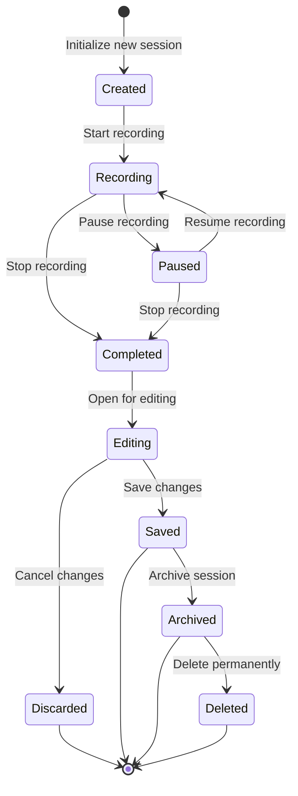
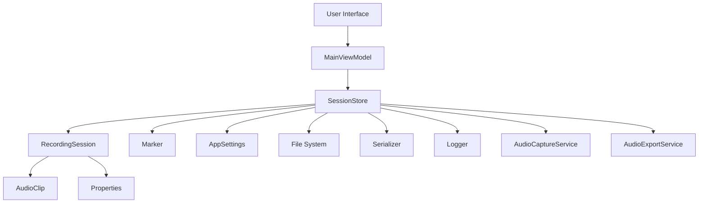

# SessionStore

<cite>
**Referenced Files in This Document**
- [SessionStore.cs](file://Services/SessionStore.cs)
- [RecordingSession.cs](file://Models/RecordingSession.cs)
- [Marker.cs](file://Models/Marker.cs)
- [AppSettings.cs](file://Models/AppSettings.cs)
- [AudioCaptureService.cs](file://Services/AudioCaptureService.cs)
- [AudioExportService.cs](file://Services/AudioExportService.cs)
- [MainViewModel.cs](file://ViewModels/MainViewModel.cs)
</cite>

## Table of Contents
1. [Introduction](#introduction)
2. [Project Structure](#project-structure)
3. [Core Components](#core-components)
4. [Architecture Overview](#architecture-overview)
5. [Detailed Component Analysis](#detailed-component-analysis)
6. [Dependency Analysis](#dependency-analysis)
7. [Performance Considerations](#performance-considerations)
8. [Troubleshooting Guide](#troubleshooting-guide)
9. [Conclusion](#conclusion)

## Introduction
This document provides comprehensive documentation for the SessionStore component responsible for recording session persistence and state management. The SessionStore manages RecordingSession objects that contain clip collections, markers, and session metadata. It implements automatic save mechanisms, crash recovery strategies, and data integrity checks using a file-based storage format with version compatibility handling and backup procedures.

## Project Structure
The SessionStore is part of a larger audio recording application with the following key components:

**Diagram sources**
- [SessionStore.cs](file://Services/SessionStore.cs)
- [RecordingSession.cs](file://Models/RecordingSession.cs)
- [Marker.cs](file://Models/Marker.cs)
- [AppSettings.cs](file://Models/AppSettings.cs)
- [AudioCaptureService.cs](file://Services/AudioCaptureService.cs)
- [AudioExportService.cs](file://Services/AudioExportService.cs)
- [MainViewModel.cs](file://ViewModels/MainViewModel.cs)

**Section sources**
- [SessionStore.cs](file://Services/SessionStore.cs)
- [RecordingSession.cs](file://Models/RecordingSession.cs)

## Core Components

### RecordingSession Model
The RecordingSession model represents a complete recording session with the following structure:

- **Clip Collections**: Contains multiple AudioClip objects representing individual recorded segments
- **Markers**: Timestamped annotations for important points within the session
- **Session Metadata**: Includes creation time, duration, title, description, and other session properties
- **State Management**: Tracks recording status, editing state, and synchronization flags

### Marker Model
The Marker model defines timestamped annotations within sessions:

- **Timestamp**: Precise time position in milliseconds
- **Label**: Descriptive text for the marker
- **Type**: Categorization (e.g., start, end, note, highlight)
- **Properties**: Additional metadata specific to marker type

### AppSettings Integration
SessionStore integrates with AppSettings for configuration:

- **Storage Path**: Directory location for session files
- **Auto-save Interval**: Time between automatic saves
- **Backup Configuration**: Backup retention policies and compression settings
- **Version Compatibility**: Supported file format versions

**Section sources**
- [RecordingSession.cs](file://Models/RecordingSession.cs)
- [Marker.cs](file://Models/Marker.cs)
- [AppSettings.cs](file://Models/AppSettings.cs)

## Architecture Overview

The SessionStore follows a layered architecture pattern with clear separation of concerns:

**Diagram sources**
- [SessionStore.cs](file://Services/SessionStore.cs)
- [RecordingSession.cs](file://Models/RecordingSession.cs)
- [Marker.cs](file://Models/Marker.cs)
- [AudioCaptureService.cs](file://Services/AudioCaptureService.cs)
- [AudioExportService.cs](file://Services/AudioExportService.cs)

## Detailed Component Analysis

### SessionStore Implementation
The SessionStore implements comprehensive session management with the following key features:

#### File-Based Storage Format
- **JSON Serialization**: Sessions are stored as JSON files for human readability
- **Binary Assets**: Audio clips are stored as separate binary files with references in session metadata
- **Atomic Writes**: Uses temporary files and atomic operations to prevent corruption
- **Compression**: Optional gzip compression for large sessions

#### Automatic Save Mechanisms
- **Timer-based Saving**: Configurable intervals for automatic persistence
- **Change Detection**: Only saves when modifications are detected
- **Background Threading**: Non-blocking save operations
- **Queue Management**: Handles concurrent save requests efficiently

#### Crash Recovery Strategies
- **Checkpoint System**: Regular checkpoints during long operations
- **Recovery Mode**: Automatic detection and recovery from interrupted saves
- **Data Validation**: Integrity checks on loaded sessions
- **Fallback Loading**: Graceful degradation with partial data recovery

#### Data Integrity Checks
- **Schema Validation**: Version-aware loading with migration support
- **Checksum Verification**: CRC validation for binary assets
- **Reference Integrity**: Ensures all referenced files exist
- **Consistency Checks**: Validates internal data relationships

**Section sources**
- [SessionStore.cs](file://Services/SessionStore.cs)

### RecordingSession Lifecycle Management
The RecordingSession lifecycle includes several distinct phases:

**Diagram sources**
- [RecordingSession.cs](file://Models/RecordingSession.cs)

### Manual Save Operations
Manual save operations provide explicit control over session persistence:

- **Immediate Save**: Forces immediate persistence without waiting for auto-save
- **Batch Operations**: Multiple session updates before single save
- **Validation Before Save**: Pre-save validation and error reporting
- **Progress Tracking**: Real-time feedback during save operations

### Integration with Main Application Workflow
The SessionStore integrates seamlessly with the main application through:

- **Event-driven Updates**: Notifications when sessions change
- **UI Binding**: Direct binding to UI components for real-time updates
- **Command Pattern**: Encapsulated operations for undo/redo support
- **Plugin Architecture**: Extensible hooks for custom processing

**Section sources**
- [RecordingSession.cs](file://Models/RecordingSession.cs)
- [MainViewModel.cs](file://ViewModels/MainViewModel.cs)

## Dependency Analysis

The SessionStore has well-defined dependencies and relationships:

**Diagram sources**
- [SessionStore.cs](file://Services/SessionStore.cs)
- [RecordingSession.cs](file://Models/RecordingSession.cs)
- [Marker.cs](file://Models/Marker.cs)
- [AppSettings.cs](file://Models/AppSettings.cs)
- [AudioCaptureService.cs](file://Services/AudioCaptureService.cs)
- [AudioExportService.cs](file://Services/AudioExportService.cs)
- [MainViewModel.cs](file://ViewModels/MainViewModel.cs)

### Concurrency Considerations
The SessionStore implements robust concurrency handling:

- **Thread Safety**: All public methods are thread-safe
- **Lock Granularity**: Fine-grained locking for optimal performance
- **Deadlock Prevention**: Careful lock ordering and timeout mechanisms
- **Async Operations**: Asynchronous I/O operations to prevent UI blocking

### Data Synchronization Patterns
- **Observer Pattern**: Notifies subscribers of session changes
- **Command Pattern**: Encapsulates operations for transactional behavior
- **Repository Pattern**: Abstracts data access logic
- **Factory Pattern**: Creates properly initialized session instances

**Section sources**
- [SessionStore.cs](file://Services/SessionStore.cs)

## Performance Considerations

### Storage Optimization
- **Lazy Loading**: Loads only necessary data on demand
- **Memory Mapping**: Efficient handling of large audio files
- **Caching Strategy**: Intelligent caching of frequently accessed data
- **Compression Tuning**: Balanced compression ratios for different session sizes

### I/O Optimization
- **Buffered Writing**: Batched write operations for better performance
- **Asynchronous Processing**: Non-blocking I/O operations
- **Connection Pooling**: Reuses resources where applicable
- **Disk Space Monitoring**: Proactive cleanup of temporary files

### Memory Management
- **Object Pooling**: Reuses expensive objects when possible
- **Garbage Collection Tuning**: Minimizes GC pressure during operations
- **Large Object Handling**: Special handling for large audio buffers
- **Memory Leak Prevention**: Proper disposal patterns throughout

## Troubleshooting Guide

### Common Issues and Solutions

#### Session Corruption
- **Symptoms**: Unable to load sessions, missing data, or invalid formats
- **Causes**: Interrupted writes, disk failures, or version mismatches
- **Solutions**: 
  - Use recovery mode to restore from checkpoints
  - Verify file checksums and repair corrupted files
  - Restore from backup if available

#### Performance Problems
- **Symptoms**: Slow save operations, high memory usage, or UI freezing
- **Causes**: Large sessions, insufficient resources, or inefficient operations
- **Solutions**:
  - Enable compression for large sessions
  - Adjust auto-save intervals
  - Monitor disk space and memory usage

#### Concurrency Issues
- **Symptoms**: Data loss, inconsistent state, or application crashes
- **Causes**: Race conditions, improper locking, or resource conflicts
- **Solutions**:
  - Ensure proper thread safety in custom implementations
  - Use provided APIs instead of direct file manipulation
  - Implement proper error handling and retry logic

### Debugging Techniques
- **Logging**: Enable detailed logging for session operations
- **Monitoring**: Track performance metrics and resource usage
- **Validation**: Use built-in validation tools to check data integrity
- **Recovery Tools**: Utilize recovery utilities for damaged sessions

**Section sources**
- [SessionStore.cs](file://Services/SessionStore.cs)

## Conclusion

The SessionStore provides a robust, feature-rich solution for managing recording sessions in the SamplerRecorder application. Its comprehensive design addresses critical aspects including data persistence, crash recovery, performance optimization, and concurrency safety. The modular architecture allows for easy extension and maintenance while providing reliable session management capabilities essential for professional audio recording workflows.

Key strengths include:
- Comprehensive session lifecycle management
- Robust crash recovery and data integrity
- Efficient file-based storage with version compatibility
- Thread-safe operations with minimal performance impact
- Extensible architecture supporting future enhancements

The implementation serves as a solid foundation for audio recording applications requiring reliable session persistence and state management.