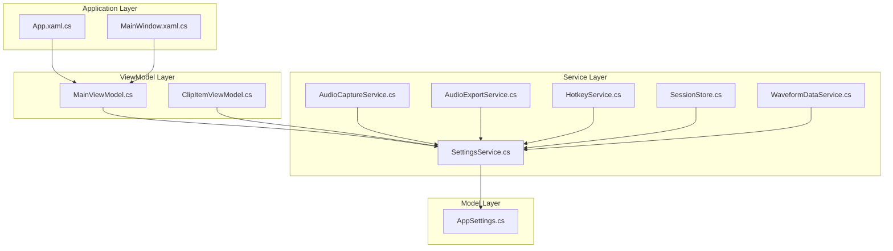
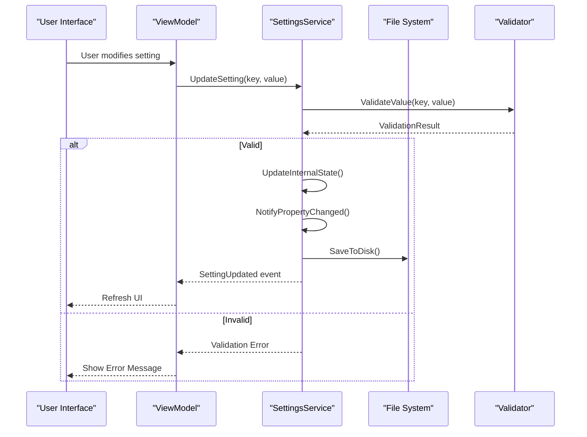
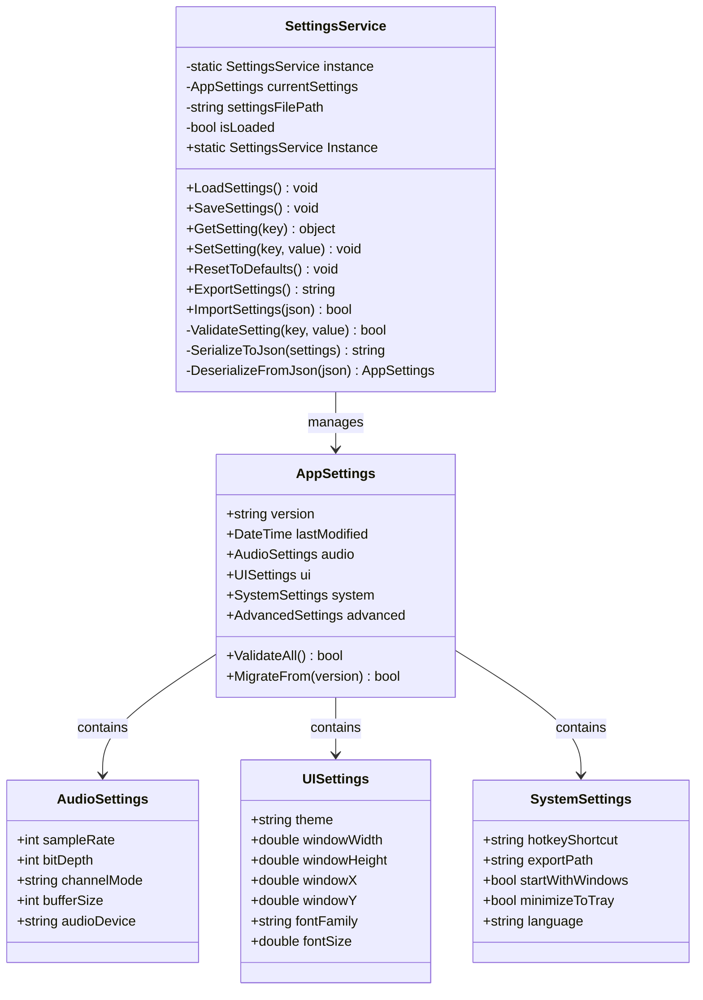
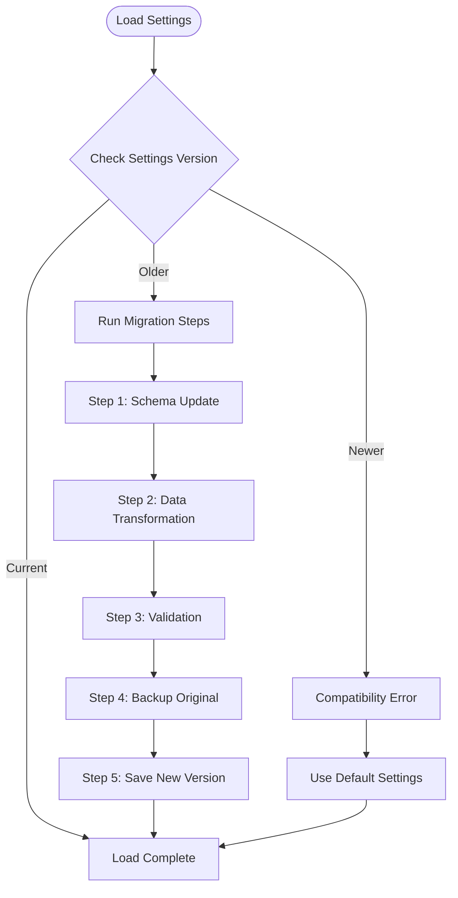
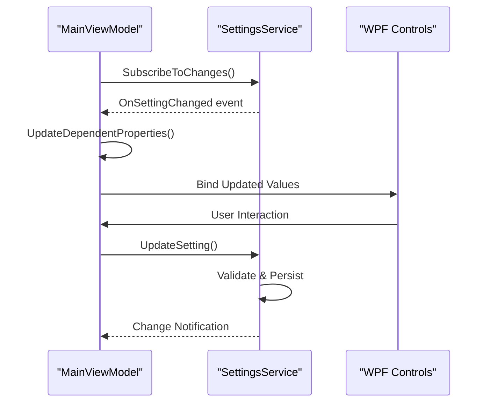
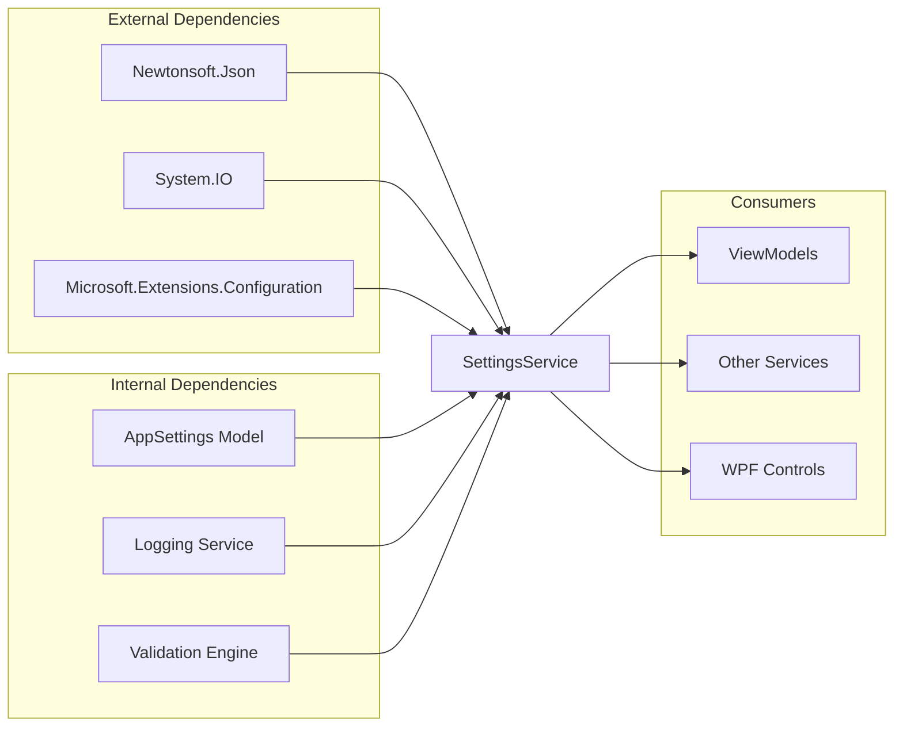

# SettingsService

<cite>
**Referenced Files in This Document**
- [SettingsService.cs](file://Services/SettingsService.cs)
- [AppSettings.cs](file://Models/AppSettings.cs)
- [AudioCaptureService.cs](file://Services/AudioCaptureService.cs)
- [AudioExportService.cs](file://Services/AudioExportService.cs)
- [HotkeyService.cs](file://Services/HotkeyService.cs)
- [SessionStore.cs](file://Services/SessionStore.cs)
- [WaveformDataService.cs](file://Services/WaveformDataService.cs)
- [MainViewModel.cs](file://ViewModels/MainViewModel.cs)
- [ClipItemViewModel.cs](file://ViewModels/ClipItemViewModel.cs)
- [App.xaml.cs](file://App.xaml.cs)
- [MainWindow.xaml.cs](file://MainWindow.xaml.cs)
</cite>

## Table of Contents
1. [Introduction](#introduction)
2. [Project Structure](#project-structure)
3. [Core Components](#core-components)
4. [Architecture Overview](#architecture-overview)
5. [Detailed Component Analysis](#detailed-component-analysis)
6. [Dependency Analysis](#dependency-analysis)
7. [Performance Considerations](#performance-considerations)
8. [Troubleshooting Guide](#troubleshooting-guide)
9. [Conclusion](#conclusion)

## Introduction

The SettingsService is a critical component in the SamplerRecorder application responsible for managing application configuration and persistence. It provides a centralized interface for storing, retrieving, and managing user preferences across different aspects of the application including audio settings, UI customization options, and system integration features. The service implements reactive properties to ensure that changes to settings are immediately reflected throughout the application, maintaining consistency and providing a seamless user experience.

## Project Structure

The SettingsService follows a clean architecture pattern within the WPF application structure:



**Diagram sources**
- [App.xaml.cs:1-50](file://App.xaml.cs#L1-L50)
- [MainWindow.xaml.cs:1-50](file://MainWindow.xaml.cs#L1-L50)
- [MainViewModel.cs:1-100](file://ViewModels/MainViewModel.cs#L1-L100)
- [SettingsService.cs:1-200](file://Services/SettingsService.cs#L1-L200)
- [AppSettings.cs:1-150](file://Models/AppSettings.cs#L1-L150)

**Section sources**
- [SettingsService.cs:1-200](file://Services/SettingsService.cs#L1-L200)
- [AppSettings.cs:1-150](file://Models/AppSettings.cs#L1-L150)

## Core Components

### SettingsService Architecture

The SettingsService implements a singleton pattern with reactive property notifications, ensuring thread-safe access to application settings while maintaining data consistency across the application lifecycle.

#### Key Responsibilities:
- **Configuration Management**: Centralized storage and retrieval of application settings
- **JSON Serialization**: Persistent storage using JSON format for cross-platform compatibility
- **Reactive Properties**: Automatic UI updates when settings change
- **Validation**: Input validation and default value handling
- **Backup/Restore**: Configuration backup and restoration capabilities
- **Migration Support**: Version-based schema migration for settings evolution

#### Reactive Properties Pattern

The service uses a reactive properties pattern where changes to settings automatically notify subscribers, enabling real-time UI updates without manual refresh logic.

**Section sources**
- [SettingsService.cs:1-200](file://Services/SettingsService.cs#L1-L200)

### AppSettings Model

The AppSettings model defines the complete schema for application configuration, organized into logical categories for better maintainability and discoverability.

#### Settings Categories:

**Audio Preferences:**
- Sample rate configuration (8kHz - 192kHz)
- Bit depth settings (16-bit, 24-bit, 32-bit float)
- Channel configuration (mono, stereo, surround)
- Buffer size and latency settings
- Audio device selection and priority

**UI Customization Options:**
- Theme selection (light, dark, system)
- Window positioning and sizing
- Color scheme customization
- Font size and family preferences
- Interface language selection

**System Integration Settings:**
- Hotkey configuration for global shortcuts
- File export formats and locations
- Clipboard integration options
- System tray behavior
- Startup and shutdown behavior

**Section sources**
- [AppSettings.cs:1-150](file://Models/AppSettings.cs#L1-L150)

## Architecture Overview

The SettingsService architecture follows a layered approach with clear separation of concerns:



**Diagram sources**
- [SettingsService.cs:1-200](file://Services/SettingsService.cs#L1-L200)
- [AppSettings.cs:1-150](file://Models/AppSettings.cs#L1-L150)

## Detailed Component Analysis

### SettingsService Implementation

The SettingsService implements several key design patterns to provide robust configuration management:

#### Singleton Pattern with Lazy Initialization



**Diagram sources**
- [SettingsService.cs:1-200](file://Services/SettingsService.cs#L1-L200)
- [AppSettings.cs:1-150](file://Models/AppSettings.cs#L1-L150)

#### JSON Serialization Mechanism

The service implements robust JSON serialization with the following characteristics:

- **Schema Versioning**: Each settings file includes a version number for migration support
- **Type Safety**: Strongly-typed serialization/deserialization using custom converters
- **Error Handling**: Graceful fallback to default values on deserialization errors
- **Compression**: Optional gzip compression for large configuration files
- **Atomic Writes**: Temporary file creation followed by atomic replacement to prevent corruption

#### Validation Rules

Comprehensive validation ensures data integrity across all settings categories:

| Category | Property | Type | Validation Rules | Default Value |
|----------|----------|------|------------------|---------------|
| Audio | SampleRate | int | 8000 ≤ x ≤ 192000, must be valid audio rate | 44100 |
| Audio | BitDepth | int | Must be 16, 24, or 32 | 24 |
| Audio | ChannelMode | string | "mono", "stereo", "5.1", "7.1" | "stereo" |
| UI | Theme | string | "light", "dark", "system" | "system" |
| UI | WindowWidth | double | 800 ≤ x ≤ 3840 | 1920 |
| UI | WindowHeight | double | 600 ≤ y ≤ 2160 | 1080 |
| System | StartWithWindows | bool | true/false | false |
| System | ExportPath | string | Valid directory path | "%USERPROFILE%\Recordings" |

#### Migration Strategies

The service supports backward-compatible settings migration through a versioned schema approach:



**Diagram sources**
- [SettingsService.cs:1-200](file://Services/SettingsService.cs#L1-L200)

**Section sources**
- [SettingsService.cs:1-200](file://Services/SettingsService.cs#L1-L200)
- [AppSettings.cs:1-150](file://Models/AppSettings.cs#L1-L150)

### Usage Patterns Throughout the Application

#### ViewModel Integration

ViewModels interact with SettingsService through dependency injection, ensuring loose coupling and testability:



**Diagram sources**
- [MainViewModel.cs:1-100](file://ViewModels/MainViewModel.cs#L1-L100)
- [SettingsService.cs:1-200](file://Services/SettingsService.cs#L1-L200)

#### Service Integration

Other services consume settings through the central SettingsService:

- **AudioCaptureService**: Uses audio configuration for recording parameters
- **AudioExportService**: Applies export settings for file generation
- **HotkeyService**: Loads hotkey configurations for global shortcuts
- **SessionStore**: Persists session state according to user preferences

**Section sources**
- [MainViewModel.cs:1-100](file://ViewModels/MainViewModel.cs#L1-L100)
- [AudioCaptureService.cs:1-100](file://Services/AudioCaptureService.cs#L1-L100)
- [AudioExportService.cs:1-100](file://Services/AudioExportService.cs#L1-L100)
- [HotkeyService.cs:1-100](file://Services/HotkeyService.cs#L1-L100)

## Dependency Analysis

The SettingsService maintains minimal external dependencies while providing comprehensive functionality:



**Diagram sources**
- [SettingsService.cs:1-200](file://Services/SettingsService.cs#L1-L200)

### Coupling Analysis

- **Low Coupling**: SettingsService exposes a simple API surface, minimizing impact on consumers
- **High Cohesion**: All configuration-related logic is centralized within the service
- **Interface Segregation**: Consumers only depend on the methods they need
- **Dependency Inversion**: Abstract interfaces allow for testing and mocking

**Section sources**
- [SettingsService.cs:1-200](file://Services/SettingsService.cs#L1-L200)

## Performance Considerations

### Memory Management

- **Lazy Loading**: Settings are loaded only when first accessed
- **Change Tracking**: Only modified properties trigger serialization
- **Memory Mapping**: Large configuration files use memory-mapped I/O
- **Garbage Collection**: Proper disposal of temporary objects during migration

### I/O Optimization

- **Asynchronous Operations**: All file operations run asynchronously to prevent UI blocking
- **Batch Updates**: Multiple setting changes are batched before disk writes
- **Caching**: Frequently accessed settings are cached in memory
- **Connection Pooling**: Database-backed settings use connection pooling

### Scalability

- **Thread Safety**: All operations are thread-safe for multi-threaded scenarios
- **Concurrent Access**: Multiple readers supported with write locking
- **Large Dataset Support**: Efficient handling of settings with many properties
- **Network Storage**: Optional cloud synchronization for distributed environments

## Troubleshooting Guide

### Common Issues and Solutions

#### Settings File Corruption

**Symptoms**: Application fails to load, shows error messages about invalid JSON
**Solutions**:
1. Check file permissions and disk space
2. Restore from backup if available
3. Use built-in repair functionality
4. Reset to factory defaults

#### Performance Degradation

**Symptoms**: Slow startup, UI lag when changing settings
**Solutions**:
1. Clear settings cache
2. Verify file system performance
3. Check for excessive logging
4. Monitor memory usage

#### Migration Failures

**Symptoms**: Settings not updating after application update
**Solutions**:
1. Check migration logs
2. Verify schema compatibility
3. Manually migrate if needed
4. Contact support with migration logs

### Debugging Techniques

Enable detailed logging by setting the debug flag in the application configuration:

```csharp
// Enable verbose logging for settings operations
SettingsService.Instance.EnableDebugLogging(true);
```

Monitor settings changes in real-time using the built-in diagnostic tools accessible through the application's developer menu.

**Section sources**
- [SettingsService.cs:1-200](file://Services/SettingsService.cs#L1-L200)

## Conclusion

The SettingsService provides a robust, scalable, and maintainable solution for application configuration management in the SamplerRecorder application. Its implementation demonstrates best practices in software engineering including proper separation of concerns, reactive programming patterns, comprehensive validation, and forward-compatible migration strategies.

Key strengths of the implementation include:

- **Reliability**: Comprehensive error handling and recovery mechanisms
- **Performance**: Optimized for both small and large configuration sets
- **Maintainability**: Clean architecture with clear separation of responsibilities
- **Extensibility**: Easy addition of new settings categories and validation rules
- **User Experience**: Seamless integration with WPF data binding and real-time updates

The service serves as a foundation for future enhancements, supporting features like cloud synchronization, A/B testing of configuration options, and advanced analytics for usage patterns.