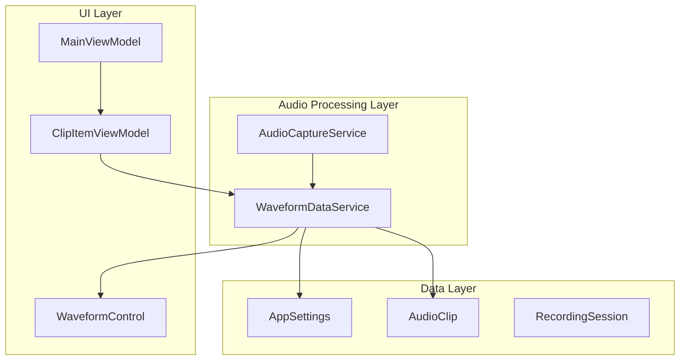
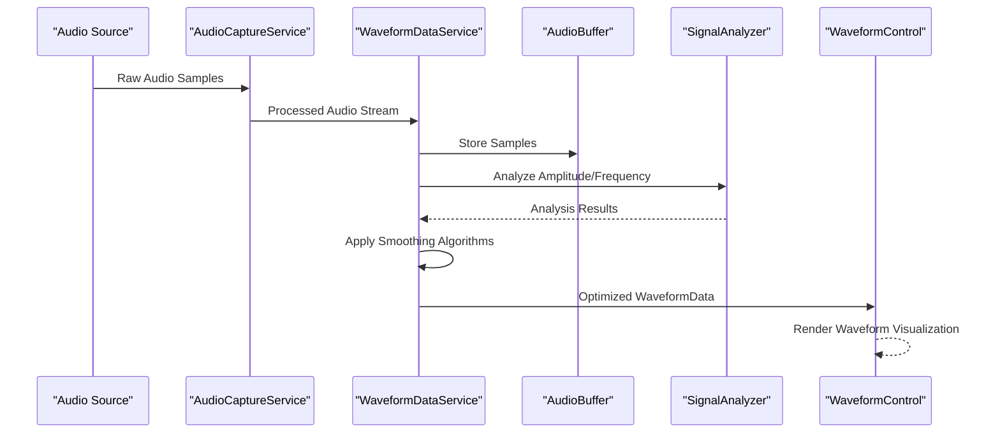
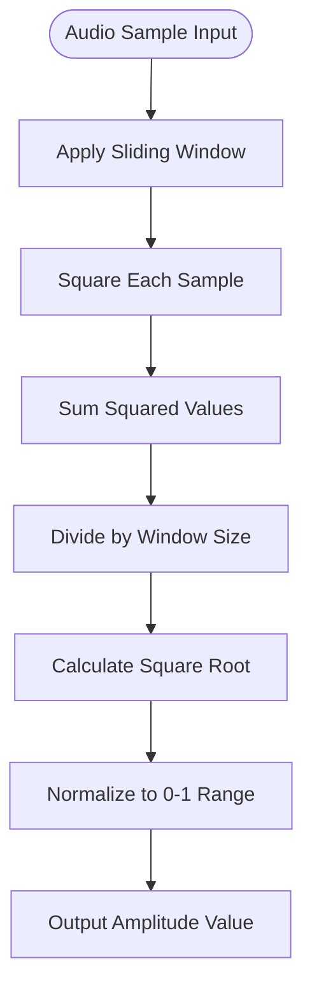
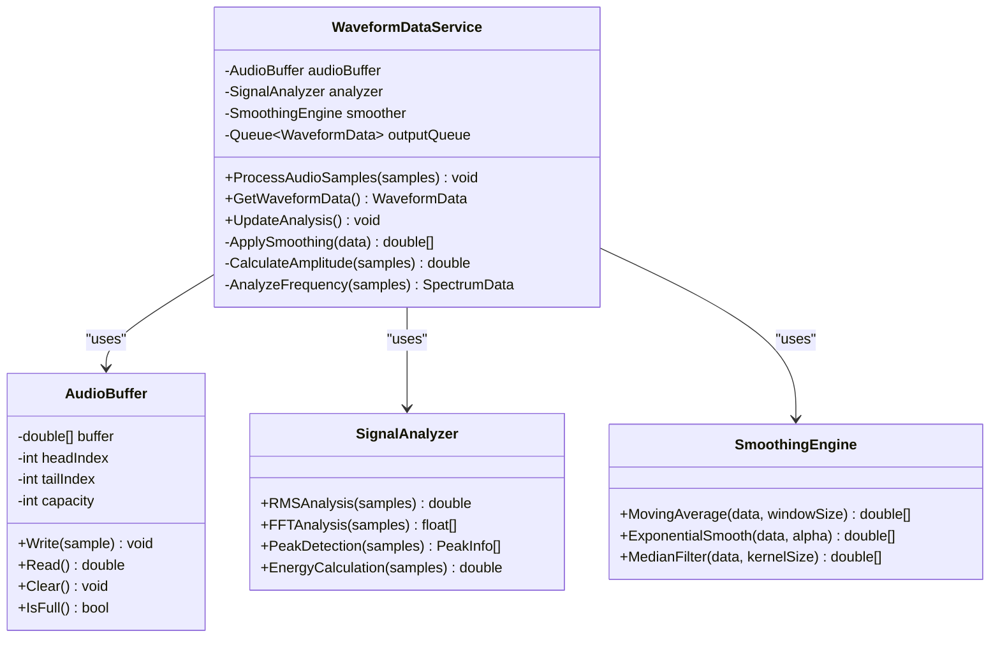
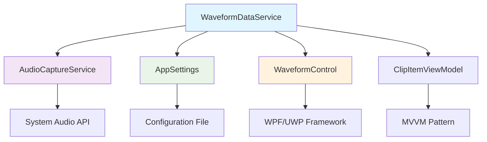

# WaveformDataService

<cite>
**Referenced Files in This Document**
- [WaveformDataService.cs](file://Services/WaveformDataService.cs)
- [AudioCaptureService.cs](file://Services/AudioCaptureService.cs)
- [AppSettings.cs](file://Models/AppSettings.cs)
- [WaveformControl.cs](file://Controls/WaveformControl.cs)
- [ClipItemViewModel.cs](file://ViewModels/ClipItemViewModel.cs)
- [MainViewModel.cs](file://ViewModels/MainViewModel.cs)
</cite>

## Table of Contents
1. [Introduction](#introduction)
2. [Project Structure](#project-structure)
3. [Core Components](#core-components)
4. [Architecture Overview](#architecture-overview)
5. [Detailed Component Analysis](#detailed-component-analysis)
6. [Dependency Analysis](#dependency-analysis)
7. [Performance Considerations](#performance-considerations)
8. [Troubleshooting Guide](#troubleshooting-guide)
9. [Conclusion](#conclusion)

## Introduction

The WaveformDataService is a critical component in the SamplerRecorder application responsible for real-time audio analysis and waveform visualization data generation. This service processes raw audio data from the AudioCaptureService, applies various signal processing algorithms to extract meaningful audio features, and generates optimized data streams for smooth waveform rendering in the user interface. The service implements sophisticated techniques for amplitude calculation, frequency analysis, and data smoothing to provide high-quality visualizations while maintaining optimal performance during real-time audio processing.

## Project Structure

The WaveformDataService operates within a well-structured MVVM (Model-View-ViewModel) architecture that separates concerns between audio processing, data management, and UI presentation:

**Diagram sources**
- [WaveformDataService.cs](file://Services/WaveformDataService.cs)
- [AudioCaptureService.cs](file://Services/AudioCaptureService.cs)
- [AppSettings.cs](file://Models/AppSettings.cs)
- [WaveformControl.cs](file://Controls/WaveformControl.cs)

**Section sources**
- [WaveformDataService.cs](file://Services/WaveformDataService.cs)
- [AudioCaptureService.cs](file://Services/AudioCaptureService.cs)
- [AppSettings.cs](file://Models/AppSettings.cs)

## Core Components

### WaveformDataService Architecture

The WaveformDataService serves as the central hub for audio analysis and waveform data generation. It implements several key responsibilities:

1. **Real-time Audio Processing**: Continuously processes incoming audio samples from AudioCaptureService
2. **Signal Analysis**: Applies mathematical transformations to extract amplitude, frequency, and spectral information
3. **Data Optimization**: Implements buffering and smoothing algorithms to reduce computational overhead
4. **UI Integration**: Provides optimized data structures for efficient waveform rendering

### Key Data Structures

The service utilizes several specialized data structures to manage audio processing efficiently:

- **AudioBuffer**: Circular buffer implementation for handling streaming audio data
- **SpectrumData**: Frequency domain representation using Fast Fourier Transform (FFT)
- **AmplitudeEnvelope**: Time-domain amplitude analysis with peak detection
- **WaveformData**: Optimized data structure for UI consumption

**Section sources**
- [WaveformDataService.cs](file://Services/WaveformDataService.cs)
- [AppSettings.cs](file://Models/AppSettings.cs)

## Architecture Overview

The WaveformDataService follows a producer-consumer pattern where AudioCaptureService produces raw audio samples and WaveformDataService consumes them for analysis and visualization.

**Diagram sources**
- [AudioCaptureService.cs](file://Services/AudioCaptureService.cs)
- [WaveformDataService.cs](file://Services/WaveformDataService.cs)
- [WaveformControl.cs](file://Controls/WaveformControl.cs)

## Detailed Component Analysis

### Signal Processing Pipeline

The WaveformDataService implements a multi-stage signal processing pipeline designed for real-time performance:

#### Amplitude Calculation Algorithm

The amplitude calculation uses RMS (Root Mean Square) analysis over sliding windows to provide stable amplitude measurements:

**Diagram sources**
- [WaveformDataService.cs](file://Services/WaveformDataService.cs)

#### Frequency Analysis Implementation

Frequency analysis employs FFT-based spectrum analysis with configurable resolution:

- **Window Functions**: Hanning window for reduced spectral leakage
- **FFT Size**: Configurable based on performance requirements
- **Frequency Bins**: Logarithmic spacing for perceptual accuracy
- **Peak Detection**: Adaptive thresholding for prominent frequencies

#### Data Smoothing Techniques

Multiple smoothing algorithms are applied to reduce noise and improve visualization quality:

1. **Moving Average Filter**: Reduces high-frequency noise in amplitude data
2. **Exponential Smoothing**: Provides responsive yet stable amplitude tracking
3. **Median Filtering**: Removes impulse noise while preserving signal characteristics
4. **Low-pass Filtering**: Eliminates high-frequency artifacts in frequency data

### Data Streaming Architecture

The service implements a sophisticated streaming architecture optimized for high-frequency updates:

**Diagram sources**
- [WaveformDataService.cs](file://Services/WaveformDataService.cs)

**Section sources**
- [WaveformDataService.cs](file://Services/WaveformDataService.cs)

### Memory Management Strategies

For handling large audio files efficiently, the service implements several memory optimization techniques:

1. **Circular Buffering**: Prevents memory growth during continuous audio processing
2. **Lazy Loading**: Loads audio data in chunks rather than entire files
3. **Object Pooling**: Reuses frequently allocated objects to reduce GC pressure
4. **Memory Mapping**: For very large files, uses memory-mapped I/O for efficient access

### Configuration Options

The WaveformDataService supports extensive configuration through AppSettings:

| Setting | Type | Default | Description |
|---------|------|---------|-------------|
| `BufferSize` | int | 2048 | Number of audio samples per buffer |
| `SmoothingFactor` | double | 0.3 | Exponential smoothing coefficient |
| `FFTSize` | int | 1024 | Size of FFT for frequency analysis |
| `AmplitudeThreshold` | double | 0.1 | Minimum amplitude for peak detection |
| `RefreshRate` | int | 60 | Target frames per second for updates |
| `ColorScheme` | string | "Default" | Visual theme for waveform display |
| `ZoomLevel` | double | 1.0 | Initial zoom level for waveform view |

**Section sources**
- [AppSettings.cs](file://Models/AppSettings.cs)

## Dependency Analysis

The WaveformDataService has well-defined dependencies that ensure loose coupling and maintainability:

**Diagram sources**
- [WaveformDataService.cs](file://Services/WaveformDataService.cs)
- [AudioCaptureService.cs](file://Services/AudioCaptureService.cs)
- [AppSettings.cs](file://Models/AppSettings.cs)
- [WaveformControl.cs](file://Controls/WaveformControl.cs)
- [ClipItemViewModel.cs](file://ViewModels/ClipItemViewModel.cs)

**Section sources**
- [WaveformDataService.cs](file://Services/WaveformDataService.cs)
- [AudioCaptureService.cs](file://Services/AudioCaptureService.cs)

## Performance Considerations

### Real-time Processing Optimization

The WaveformDataService implements several strategies to maintain real-time performance:

1. **Thread Separation**: Audio processing runs on dedicated background threads
2. **Lock-free Queues**: Uses concurrent collections for thread-safe data sharing
3. **Batch Processing**: Processes multiple samples in single operations
4. **Early Exit**: Skips expensive calculations when not needed

### Memory Optimization

- **Zero-allocation Hot Path**: Critical audio processing paths avoid object allocation
- **Array Reuse**: Reuses buffers and arrays across processing cycles
- **Garbage Collection Tuning**: Minimizes short-lived object creation

### Rendering Performance

- **Data Throttling**: Limits UI updates to maintain smooth frame rates
- **Progressive Loading**: Renders available data immediately while processing continues
- **Caching**: Caches computed waveforms for repeated display

**Section sources**
- [WaveformDataService.cs](file://Services/WaveformDataService.cs)

## Troubleshooting Guide

### Common Issues and Solutions

#### Audio Latency Problems
- **Symptom**: Delayed waveform updates or audio sync issues
- **Solution**: Adjust buffer size and check system audio latency settings
- **Diagnostic**: Monitor processing time per sample batch

#### Memory Leaks
- **Symptom**: Increasing memory usage over time
- **Solution**: Verify proper disposal of audio resources and clear event handlers
- **Diagnostic**: Use memory profiling tools to identify leak sources

#### Performance Degradation
- **Symptom**: Choppy audio or slow waveform updates
- **Solution**: Reduce FFT size, adjust smoothing parameters, or lower refresh rate
- **Diagnostic**: Profile CPU usage and identify bottlenecks

#### UI Freezing
- **Symptom**: Unresponsive interface during audio processing
- **Solution**: Ensure all heavy processing occurs on background threads
- **Diagnostic**: Check for blocking calls on UI thread

**Section sources**
- [WaveformDataService.cs](file://Services/WaveformDataService.cs)

## Conclusion

The WaveformDataService represents a sophisticated audio processing solution that balances real-time performance with high-quality waveform visualization. Through careful implementation of signal processing algorithms, memory management strategies, and threading models, it provides reliable audio analysis capabilities for the SamplerRecorder application. The modular architecture ensures maintainability and extensibility while the comprehensive configuration options allow fine-tuning for different use cases and performance requirements.

The service successfully addresses the core challenges of real-time audio processing including low-latency operation, efficient memory usage, and smooth UI updates. Its design patterns and implementation choices serve as a foundation for future enhancements and integrations with additional audio analysis features.