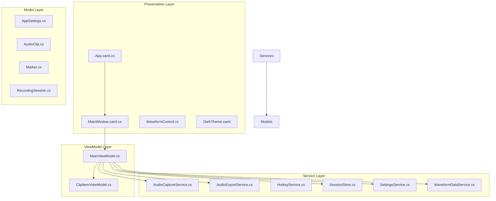
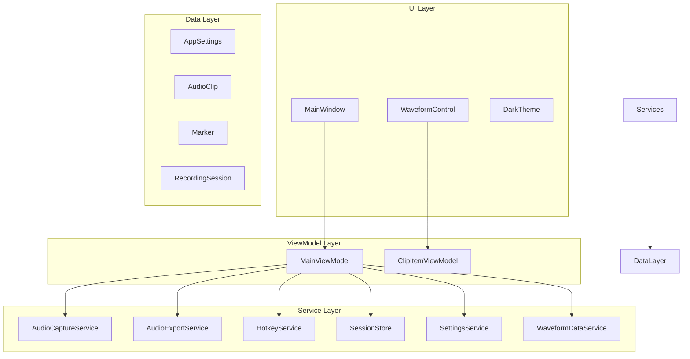
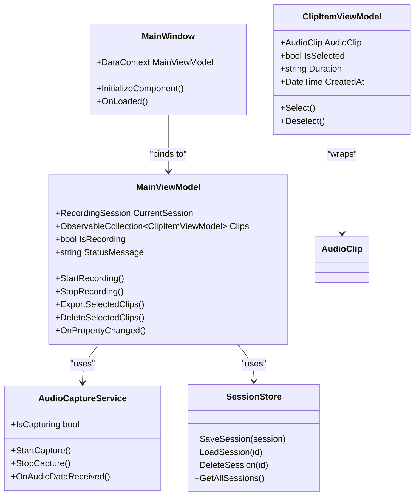
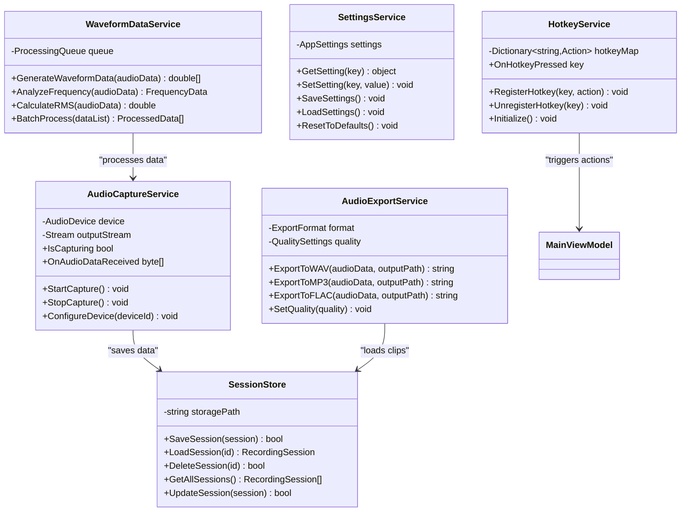
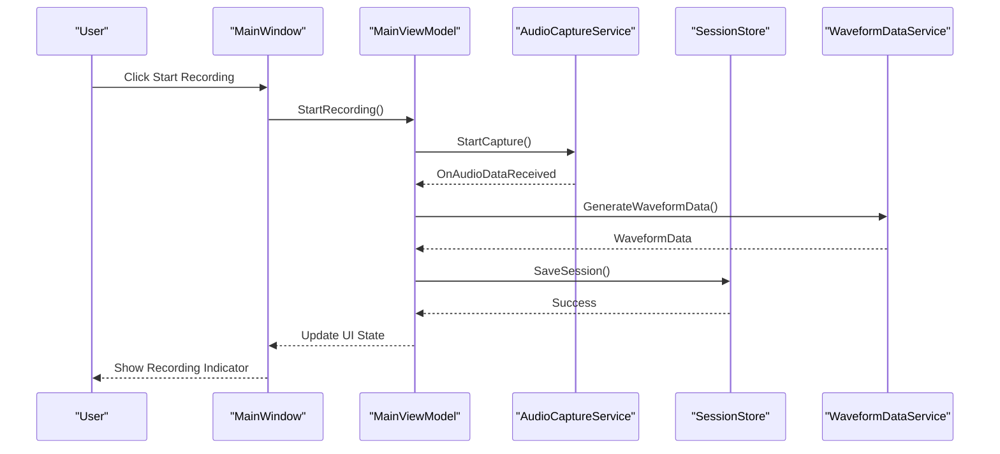
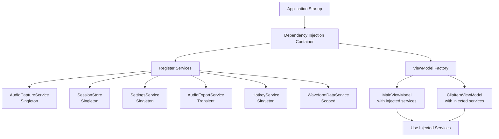
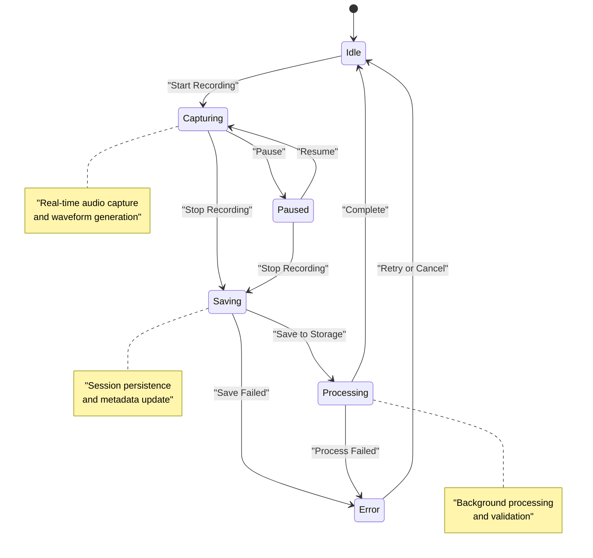
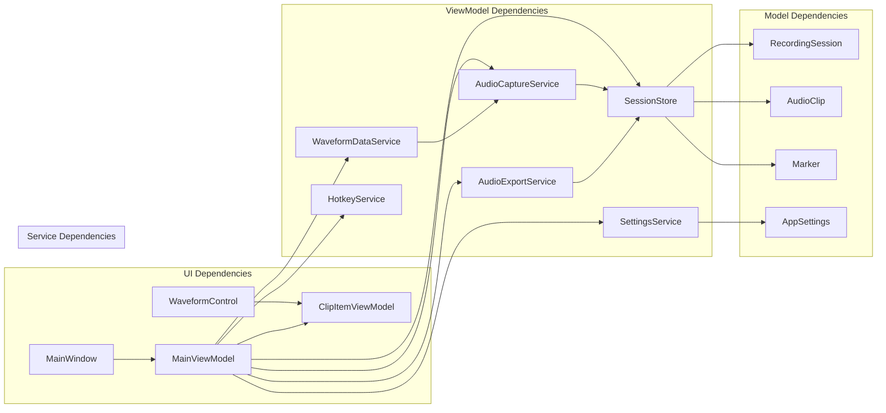

# Technical Architecture

<cite>
**Referenced Files in This Document**
- [App.xaml.cs](file://App.xaml.cs)
- [MainWindow.xaml.cs](file://MainWindow.xaml.cs)
- [MainViewModel.cs](file://ViewModels/MainViewModel.cs)
- [ClipItemViewModel.cs](file://ViewModels/ClipItemViewModel.cs)
- [AudioCaptureService.cs](file://Services/AudioCaptureService.cs)
- [AudioExportService.cs](file://Services/AudioExportService.cs)
- [HotkeyService.cs](file://Services/HotkeyService.cs)
- [SessionStore.cs](file://Services/SessionStore.cs)
- [SettingsService.cs](file://Services/SettingsService.cs)
- [WaveformDataService.cs](file://Services/WaveformDataService.cs)
- [AppSettings.cs](file://Models/AppSettings.cs)
- [AudioClip.cs](file://Models/AudioClip.cs)
- [Marker.cs](file://Models/Marker.cs)
- [RecordingSession.cs](file://Models/RecordingSession.cs)
- [WaveformControl.cs](file://Controls/WaveformControl.cs)
- [DarkTheme.xaml](file://Themes/DarkTheme.xaml)
</cite>

## Table of Contents
1. [Introduction](#introduction)
2. [Project Structure](#project-structure)
3. [Core Components](#core-components)
4. [Architecture Overview](#architecture-overview)
5. [Detailed Component Analysis](#detailed-component-analysis)
6. [Dependency Analysis](#dependency-analysis)
7. [Performance Considerations](#performance-considerations)
8. [Troubleshooting Guide](#troubleshooting-guide)
9. [Conclusion](#conclusion)

## Introduction
SamplerRecorder is a WPF-based audio recording and sampling application that implements the Model-View-ViewModel (MVVM) architectural pattern. The application provides functionality for capturing audio, managing recording sessions, visualizing waveforms, and exporting audio clips. The architecture emphasizes separation of concerns, dependency injection, event-driven communication, and maintainable code organization.

The application follows modern WPF development practices with a clear separation between UI logic (Views), business logic (ViewModels), and data access (Services and Models). This design enables testability, scalability, and ease of maintenance while providing a responsive user interface for audio processing tasks.

## Project Structure
The SamplerRecorder application follows a well-organized directory structure that reflects its architectural layers:

**Diagram sources**
- [App.xaml.cs](file://App.xaml.cs)
- [MainWindow.xaml.cs](file://MainWindow.xaml.cs)
- [MainViewModel.cs](file://ViewModels/MainViewModel.cs)
- [ClipItemViewModel.cs](file://ViewModels/ClipItemViewModel.cs)
- [AudioCaptureService.cs](file://Services/AudioCaptureService.cs)
- [AudioExportService.cs](file://Services/AudioExportService.cs)
- [HotkeyService.cs](file://Services/HotkeyService.cs)
- [SessionStore.cs](file://Services/SessionStore.cs)
- [SettingsService.cs](file://Services/SettingsService.cs)
- [WaveformDataService.cs](file://Services/WaveformDataService.cs)
- [AppSettings.cs](file://Models/AppSettings.cs)
- [AudioClip.cs](file://Models/AudioClip.cs)
- [Marker.cs](file://Models/Marker.cs)
- [RecordingSession.cs](file://Models/RecordingSession.cs)
- [WaveformControl.cs](file://Controls/WaveformControl.cs)
- [DarkTheme.xaml](file://Themes/DarkTheme.xaml)

**Section sources**
- [App.xaml.cs](file://App.xaml.cs)
- [MainWindow.xaml.cs](file://MainWindow.xaml.cs)
- [MainViewModel.cs](file://ViewModels/MainViewModel.cs)
- [ClipItemViewModel.cs](file://ViewModels/ClipItemViewModel.cs)

## Core Components
The SamplerRecorder application consists of several core components that work together to provide audio recording and management functionality:

### View Models
The view models implement the MVVM pattern by exposing properties and commands that bind to the UI while handling business logic and coordinating with services.

### Services Layer
The service layer encapsulates all external dependencies and complex business logic, providing clean interfaces for the view models to interact with audio capture, export functionality, session management, settings, and waveform data processing.

### Models
The model layer represents the domain entities and data structures used throughout the application, including audio clips, recording sessions, markers, and application settings.

### Controls
Custom controls like the waveform control provide specialized UI components for audio visualization and interaction.

**Section sources**
- [MainViewModel.cs](file://ViewModels/MainViewModel.cs)
- [ClipItemViewModel.cs](file://ViewModels/ClipItemViewModel.cs)
- [AudioCaptureService.cs](file://Services/AudioCaptureService.cs)
- [AudioExportService.cs](file://Services/AudioExportService.cs)
- [HotkeyService.cs](file://Services/HotkeyService.cs)
- [SessionStore.cs](file://Services/SessionStore.cs)
- [SettingsService.cs](file://Services/SettingsService.cs)
- [WaveformDataService.cs](file://Services/WaveformDataService.cs)
- [AppSettings.cs](file://Models/AppSettings.cs)
- [AudioClip.cs](file://Models/AudioClip.cs)
- [Marker.cs](file://Models/Marker.cs)
- [RecordingSession.cs](file://Models/RecordingSession.cs)
- [WaveformControl.cs](file://Controls/WaveformControl.cs)

## Architecture Overview
The SamplerRecorder application follows a layered architecture with clear separation of concerns:

**Diagram sources**
- [MainWindow.xaml.cs](file://MainWindow.xaml.cs)
- [MainViewModel.cs](file://ViewModels/MainViewModel.cs)
- [ClipItemViewModel.cs](file://ViewModels/ClipItemViewModel.cs)
- [AudioCaptureService.cs](file://Services/AudioCaptureService.cs)
- [AudioExportService.cs](file://Services/AudioExportService.cs)
- [HotkeyService.cs](file://Services/HotkeyService.cs)
- [SessionStore.cs](file://Services/SessionStore.cs)
- [SettingsService.cs](file://Services/SettingsService.cs)
- [WaveformDataService.cs](file://Services/WaveformDataService.cs)
- [AppSettings.cs](file://Models/AppSettings.cs)
- [AudioClip.cs](file://Models/AudioClip.cs)
- [Marker.cs](file://Models/Marker.cs)
- [RecordingSession.cs](file://Models/RecordingSession.cs)

## Detailed Component Analysis

### MVVM Implementation Pattern
The application implements the MVVM pattern with clear separation between views, view models, and data models:

**Diagram sources**
- [MainViewModel.cs](file://ViewModels/MainViewModel.cs)
- [ClipItemViewModel.cs](file://ViewModels/ClipItemViewModel.cs)
- [MainWindow.xaml.cs](file://MainWindow.xaml.cs)
- [AudioCaptureService.cs](file://Services/AudioCaptureService.cs)
- [SessionStore.cs](file://Services/SessionStore.cs)

### Service Layer Architecture
The service layer provides specialized functionality for different aspects of the application:

**Diagram sources**
- [AudioCaptureService.cs](file://Services/AudioCaptureService.cs)
- [AudioExportService.cs](file://Services/AudioExportService.cs)
- [HotkeyService.cs](file://Services/HotkeyService.cs)
- [SessionStore.cs](file://Services/SessionStore.cs)
- [SettingsService.cs](file://Services/SettingsService.cs)
- [WaveformDataService.cs](file://Services/WaveformDataService.cs)

### Data Flow and Event-Driven Communication
The application uses event-driven communication patterns to handle asynchronous operations and real-time updates:

**Diagram sources**
- [MainWindow.xaml.cs](file://MainWindow.xaml.cs)
- [MainViewModel.cs](file://ViewModels/MainViewModel.cs)
- [AudioCaptureService.cs](file://Services/AudioCaptureService.cs)
- [SessionStore.cs](file://Services/SessionStore.cs)
- [WaveformDataService.cs](file://Services/WaveformDataService.cs)

### Dependency Injection Patterns
The application implements dependency injection to manage service lifetimes and improve testability:

**Diagram sources**
- [App.xaml.cs](file://App.xaml.cs)
- [MainViewModel.cs](file://ViewModels/MainViewModel.cs)
- [ClipItemViewModel.cs](file://ViewModels/ClipItemViewModel.cs)
- [AudioCaptureService.cs](file://Services/AudioCaptureService.cs)
- [SessionStore.cs](file://Services/SessionStore.cs)
- [SettingsService.cs](file://Services/SettingsService.cs)
- [AudioExportService.cs](file://Services/AudioExportService.cs)
- [HotkeyService.cs](file://Services/HotkeyService.cs)
- [WaveformDataService.cs](file://Services/WaveformDataService.cs)

### State Management Strategies
The application manages state through multiple strategies:

**Diagram sources**
- [MainViewModel.cs](file://ViewModels/MainViewModel.cs)
- [AudioCaptureService.cs](file://Services/AudioCaptureService.cs)
- [SessionStore.cs](file://Services/SessionStore.cs)

**Section sources**
- [MainViewModel.cs](file://ViewModels/MainViewModel.cs)
- [ClipItemViewModel.cs](file://ViewModels/ClipItemViewModel.cs)
- [AudioCaptureService.cs](file://Services/AudioCaptureService.cs)
- [AudioExportService.cs](file://Services/AudioExportService.cs)
- [HotkeyService.cs](file://Services/HotkeyService.cs)
- [SessionStore.cs](file://Services/SessionStore.cs)
- [SettingsService.cs](file://Services/SettingsService.cs)
- [WaveformDataService.cs](file://Services/WaveformDataService.cs)

## Dependency Analysis
The application demonstrates clear dependency relationships between components:

**Diagram sources**
- [MainWindow.xaml.cs](file://MainWindow.xaml.cs)
- [MainViewModel.cs](file://ViewModels/MainViewModel.cs)
- [ClipItemViewModel.cs](file://ViewModels/ClipItemViewModel.cs)
- [AudioCaptureService.cs](file://Services/AudioCaptureService.cs)
- [AudioExportService.cs](file://Services/AudioExportService.cs)
- [SessionStore.cs](file://Services/SessionStore.cs)
- [SettingsService.cs](file://Services/SettingsService.cs)
- [WaveformDataService.cs](file://Services/WaveformDataService.cs)
- [RecordingSession.cs](file://Models/RecordingSession.cs)
- [AudioClip.cs](file://Models/AudioClip.cs)
- [Marker.cs](file://Models/Marker.cs)
- [AppSettings.cs](file://Models/AppSettings.cs)

**Section sources**
- [MainViewModel.cs](file://ViewModels/MainViewModel.cs)
- [ClipItemViewModel.cs](file://ViewModels/ClipItemViewModel.cs)
- [AudioCaptureService.cs](file://Services/AudioCaptureService.cs)
- [SessionStore.cs](file://Services/SessionStore.cs)

## Performance Considerations
The application implements several performance optimization strategies:

### Asynchronous Operations
- Audio capture operations run on background threads to prevent UI blocking
- Waveform data generation uses asynchronous processing
- File I/O operations are performed asynchronously

### Memory Management
- Efficient audio buffer management to prevent memory leaks
- Proper disposal of audio resources
- Garbage collection optimization for large audio datasets

### Caching Strategies
- Settings caching to reduce disk I/O
- Waveform data caching for improved responsiveness
- Session metadata caching for faster UI updates

### Threading Model
- UI thread for user interactions
- Background threads for audio processing
- Thread-safe data access patterns

## Troubleshooting Guide
Common issues and their solutions:

### Audio Capture Issues
- **Problem**: No audio input detected
  - **Solution**: Check audio device permissions and default device selection
- **Problem**: Audio capture stops unexpectedly
  - **Solution**: Verify audio device availability and check for resource conflicts

### Session Management Problems
- **Problem**: Sessions not saving properly
  - **Solution**: Check storage permissions and available disk space
- **Problem**: Corrupted session data
  - **Solution**: Implement session validation and recovery mechanisms

### Performance Issues
- **Problem**: UI lag during recording
  - **Solution**: Optimize waveform generation and consider reducing sample rate
- **Problem**: High memory usage
  - **Solution**: Implement proper cleanup and garbage collection triggers

### Configuration Issues
- **Problem**: Settings not persisting
  - **Solution**: Verify file path permissions and serialization settings
- **Problem**: Hotkeys not working
  - **Solution**: Check for conflicting global hotkeys and verify registration

**Section sources**
- [AudioCaptureService.cs](file://Services/AudioCaptureService.cs)
- [SessionStore.cs](file://Services/SessionStore.cs)
- [SettingsService.cs](file://Services/SettingsService.cs)
- [HotkeyService.cs](file://Services/HotkeyService.cs)

## Conclusion
The SamplerRecorder application demonstrates a well-architected WPF application using the MVVM pattern with clear separation of concerns. The service layer abstraction provides excellent modularity and testability, while the event-driven communication ensures responsive user interactions. The dependency injection implementation promotes loose coupling and facilitates unit testing.

Key architectural strengths include:
- Clean separation between UI, business logic, and data access
- Comprehensive service layer abstraction
- Event-driven communication patterns
- Proper dependency injection implementation
- Scalable and maintainable code structure

The application's design supports future extensibility through well-defined interfaces and modular service components. The use of standard WPF patterns ensures compatibility with existing development workflows and tooling.