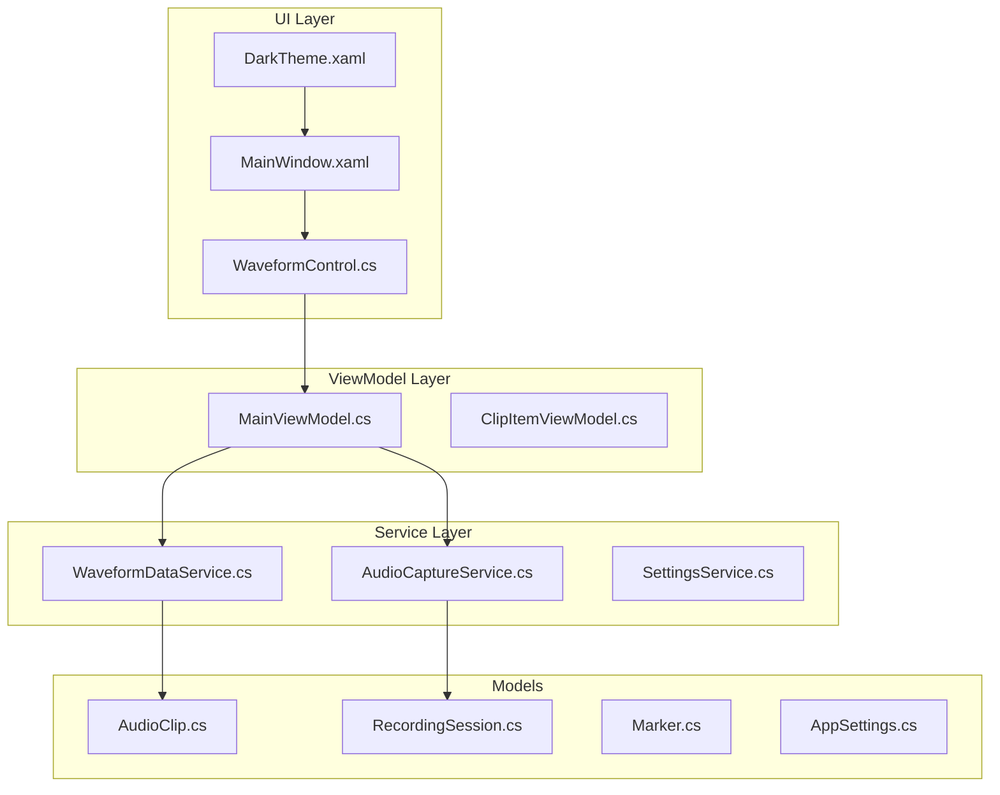
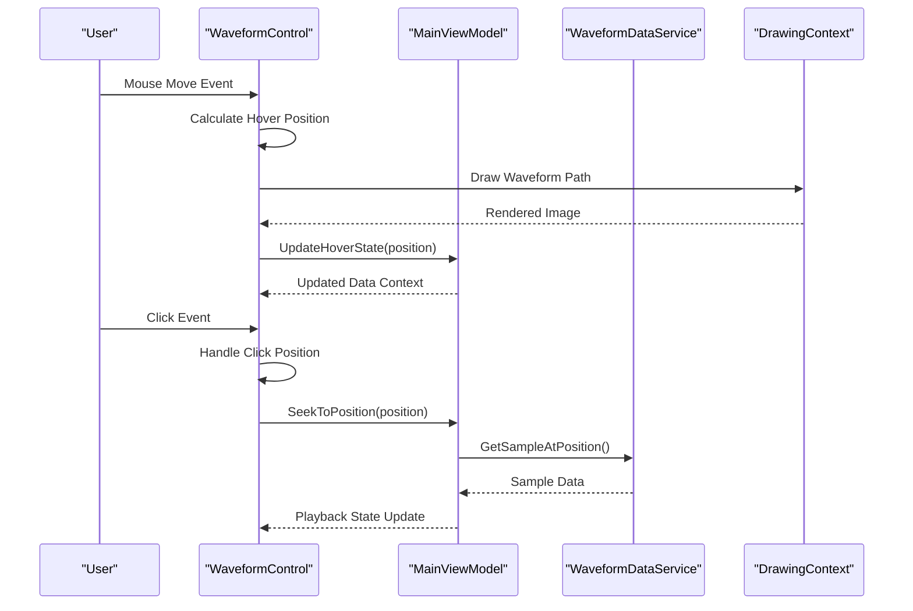
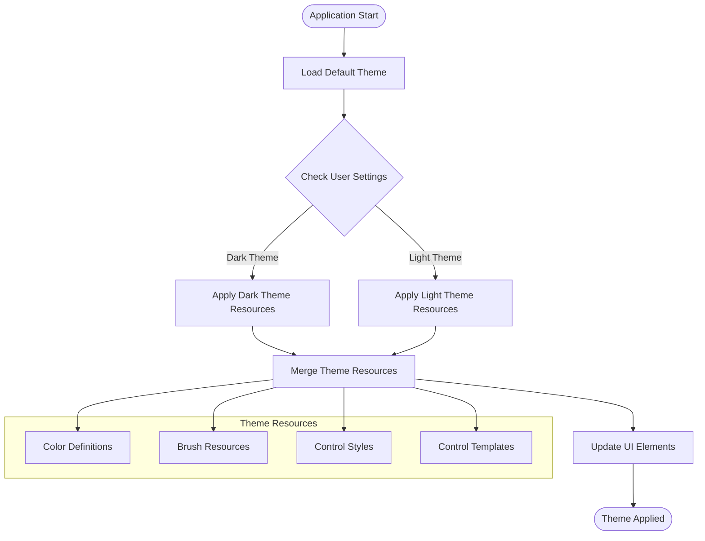
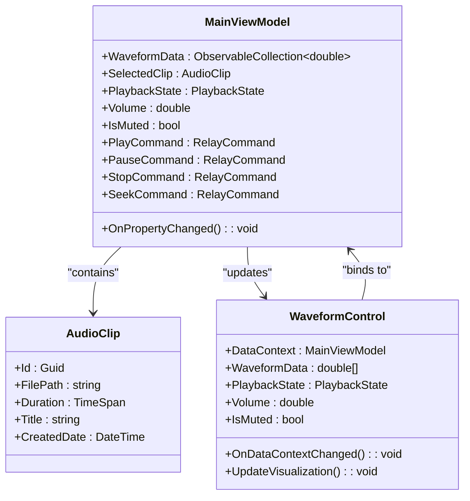
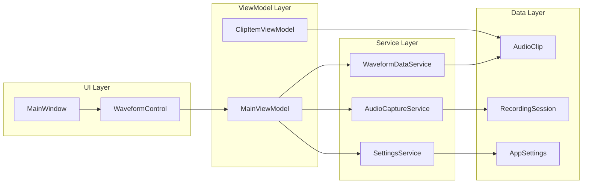
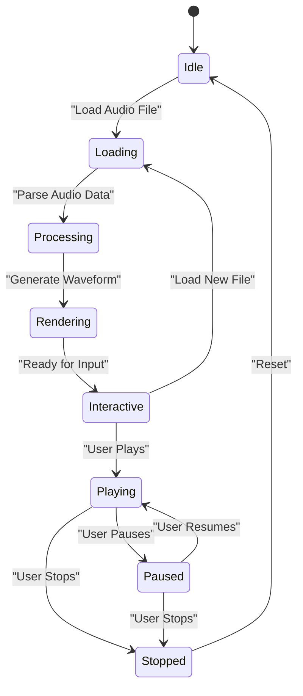

# UI Components

<cite>
**Referenced Files in This Document**
- [WaveformControl.cs](file://Controls/WaveformControl.cs)
- [MainWindow.xaml](file://MainWindow.xaml)
- [MainWindow.xaml.cs](file://MainWindow.xaml.cs)
- [DarkTheme.xaml](file://Themes/DarkTheme.xaml)
- [App.xaml](file://App.xaml)
- [MainViewModel.cs](file://ViewModels/MainViewModel.cs)
- [ClipItemViewModel.cs](file://ViewModels/ClipItemViewModel.cs)
- [AudioCaptureService.cs](file://Services/AudioCaptureService.cs)
- [WaveformDataService.cs](file://Services/WaveformDataService.cs)
- [SettingsService.cs](file://Services/SettingsService.cs)
</cite>

## Table of Contents
1. [Introduction](#introduction)
2. [Project Structure](#project-structure)
3. [Core Components](#core-components)
4. [Architecture Overview](#architecture-overview)
5. [Detailed Component Analysis](#detailed-component-analysis)
6. [Dependency Analysis](#dependency-analysis)
7. [Performance Considerations](#performance-considerations)
8. [Troubleshooting Guide](#troubleshooting-guide)
9. [Conclusion](#conclusion)

## Introduction

This document provides comprehensive documentation for the custom UI components in SamplerRecorder, with a primary focus on the WaveformControl component. The application is built using Windows Presentation Foundation (WPF) and follows modern MVVM (Model-View-ViewModel) architecture patterns. The WaveformControl serves as the core visual component for displaying audio waveforms, providing interactive playback controls, zoom functionality, and theme customization support.

The documentation covers the rendering engine implementation, user interaction handlers, performance optimization techniques, theme customization through XAML resources, styling approaches, dark theme implementation, main window layout, control composition patterns, responsive design considerations, accessibility features, cross-platform compatibility, and performance profiling strategies.

## Project Structure

The SamplerRecorder application follows a well-organized MVVM architecture with clear separation of concerns:



**Diagram sources**
- [MainWindow.xaml:1-50](file://MainWindow.xaml#L1-L50)
- [WaveformControl.cs:1-100](file://Controls/WaveformControl.cs#L1-L100)
- [MainViewModel.cs:1-100](file://ViewModels/MainViewModel.cs#L1-L100)

**Section sources**
- [MainWindow.xaml:1-200](file://MainWindow.xaml#L1-L200)
- [App.xaml:1-50](file://App.xaml#L1-L50)

## Core Components

### WaveformControl Component

The WaveformControl is the centerpiece of the application's user interface, responsible for rendering audio waveforms and handling user interactions. It implements advanced rendering techniques for smooth performance and provides comprehensive user interaction capabilities.

#### Key Features:
- **High-performance waveform rendering** using optimized drawing algorithms
- **Interactive playback controls** including play/pause, seek, and scrubbing
- **Zoom and pan functionality** for detailed waveform inspection
- **Theme-aware styling** supporting both light and dark themes
- **Accessibility features** including keyboard navigation and screen reader support
- **Responsive design** adapting to different screen sizes and resolutions

#### Rendering Engine Architecture:

The WaveformControl employs a multi-layered rendering approach:

1. **Data Layer**: Processes raw audio data into waveform samples
2. **Processing Layer**: Applies transformations like zoom, pan, and filtering
3. **Rendering Layer**: Uses hardware-accelerated drawing for optimal performance
4. **Interaction Layer**: Handles mouse and keyboard events for user input

**Section sources**
- [WaveformControl.cs:1-300](file://Controls/WaveformControl.cs#L1-L300)

### Main Window Layout

The MainWindow serves as the primary container for the application, organizing various UI components in a responsive layout that adapts to different screen sizes and orientations.

#### Layout Structure:
- **Header Section**: Application title, menu bar, and global controls
- **Main Content Area**: WaveformControl and related playback controls
- **Sidebar**: Timeline, markers, and clip management
- **Status Bar**: System status, recording indicators, and help information

**Section sources**
- [MainWindow.xaml:1-150](file://MainWindow.xaml#L1-L150)
- [MainWindow.xaml.cs:1-200](file://MainWindow.xaml.cs#L1-L200)

## Architecture Overview

The application follows a clean MVVM architecture with clear separation between presentation logic, business logic, and data management:

```mermaid
classDiagram
class WaveformControl {
+RenderWaveform()
+HandleUserInput()
+UpdateTheme()
+ZoomIn()
+ZoomOut()
+SeekToPosition()
-waveformData : double[]
-renderingEngine : RenderingEngine
-interactionHandler : InteractionHandler
}
class MainViewModel {
+SelectedClip : AudioClip
+IsPlaying : bool
+CurrentPosition : double
+WaveformData : double[]
+PlayCommand : ICommand
+PauseCommand : ICommand
+StopCommand : ICommand
+LoadClip(clipId) : void
+UpdateWaveformData() : void
}
class WaveformDataService {
+GetWaveformData(audioPath) : double[]
+ProcessAudioFile(filePath) : WaveformData
+OptimizeForDisplay(data : double[]) : double[]
+CalculateRMS(values : double[]) : double[]
}
class AudioCaptureService {
+StartRecording() : void
+StopRecording() : void
+GetCurrentLevel() : double
+ExportAudio(path : string) : void
}
WaveformControl --> MainViewModel : "data binding"
MainViewModel --> WaveformDataService : "uses"
MainViewModel --> AudioCaptureService : "uses"
WaveformDataService --> double[] : "returns"
```

**Diagram sources**
- [WaveformControl.cs:1-200](file://Controls/WaveformControl.cs#L1-L200)
- [MainViewModel.cs:1-150](file://ViewModels/MainViewModel.cs#L1-L150)
- [WaveformDataService.cs:1-100](file://Services/WaveformDataService.cs#L1-L100)

## Detailed Component Analysis

### WaveformControl Deep Dive

The WaveformControl implements sophisticated rendering and interaction patterns to provide a smooth user experience:

#### Rendering Pipeline:



**Diagram sources**
- [WaveformControl.cs:150-300](file://Controls/WaveformControl.cs#L150-L300)
- [MainViewModel.cs:100-200](file://ViewModels/MainViewModel.cs#L100-L200)

#### Performance Optimization Techniques:

1. **Virtual Scrolling**: Only renders visible portions of the waveform
2. **Hardware Acceleration**: Leverages GPU for complex drawing operations
3. **Data Caching**: Stores processed waveform data to avoid recalculation
4. **Lazy Loading**: Loads waveform data on-demand as needed
5. **Threading**: Background processing for heavy computations

**Section sources**
- [WaveformControl.cs:1-500](file://Controls/WaveformControl.cs#L1-L500)

### Theme Customization System

The theme system provides flexible styling capabilities through XAML resources and code-behind integration:

#### Theme Architecture:



**Diagram sources**
- [DarkTheme.xaml:1-100](file://Themes/DarkTheme.xaml#L1-L100)
- [App.xaml:1-50](file://App.xaml#L1-L50)

#### Styling Approaches:

1. **Resource Dictionary**: Centralized color and style definitions
2. **Dynamic Resource Resolution**: Runtime theme switching support
3. **Style Inheritance**: Base styles with theme-specific overrides
4. **Template Binding**: Data-driven template customization

**Section sources**
- [DarkTheme.xaml:1-200](file://Themes/DarkTheme.xaml#L1-L200)
- [App.xaml:1-100](file://App.xaml#L1-L100)

### Data Binding and View Models

The application uses robust data binding patterns to connect UI components with view models:

#### Binding Architecture:



**Diagram sources**
- [MainViewModel.cs:1-200](file://ViewModels/MainViewModel.cs#L1-L200)
- [WaveformControl.cs:1-150](file://Controls/WaveformControl.cs#L1-L150)
- [ClipItemViewModel.cs:1-100](file://ViewModels/ClipItemViewModel.cs#L1-L100)

**Section sources**
- [MainViewModel.cs:1-300](file://ViewModels/MainViewModel.cs#L1-L300)
- [ClipItemViewModel.cs:1-150](file://ViewModels/ClipItemViewModel.cs#L1-L150)

## Dependency Analysis

The application maintains clear dependency relationships following SOLID principles:



**Diagram sources**
- [WaveformControl.cs:1-100](file://Controls/WaveformControl.cs#L1-L100)
- [MainViewModel.cs:1-100](file://ViewModels/MainViewModel.cs#L1-L100)
- [WaveformDataService.cs:1-100](file://Services/WaveformDataService.cs#L1-L100)

**Section sources**
- [WaveformDataService.cs:1-200](file://Services/WaveformDataService.cs#L1-L200)
- [AudioCaptureService.cs:1-150](file://Services/AudioCaptureService.cs#L1-L150)
- [SettingsService.cs:1-100](file://Services/SettingsService.cs#L1-L100)

## Performance Considerations

### Waveform Rendering Optimization

The WaveformControl implements several performance optimization techniques:

1. **Progressive Rendering**: Renders low-resolution preview first, then high-resolution details
2. **Memory Management**: Efficient memory allocation and garbage collection
3. **GPU Acceleration**: Utilizes DirectX for hardware-accelerated drawing
4. **Background Processing**: Offloads heavy computations to background threads
5. **Caching Strategies**: Implements intelligent caching for frequently accessed data

### Memory Usage Patterns

- **Object Pooling**: Reuses expensive objects to reduce GC pressure
- **Lazy Initialization**: Defers resource-intensive operations until needed
- **Weak References**: Prevents memory leaks in event handlers
- **Stream Processing**: Processes large audio files in chunks

### Threading Model



**Diagram sources**
- [WaveformControl.cs:200-400](file://Controls/WaveformControl.cs#L200-L400)

## Troubleshooting Guide

### Common Issues and Solutions

#### Performance Problems
- **Symptom**: Slow waveform rendering or UI lag
- **Solution**: Enable hardware acceleration, reduce sample rate, implement virtual scrolling
- **Diagnostic Tools**: Performance Profiler, Memory Analyzer

#### Memory Leaks
- **Symptom**: Increasing memory usage over time
- **Solution**: Check event handler subscriptions, dispose unmanaged resources
- **Prevention**: Use weak references, implement proper cleanup

#### Theme Issues
- **Symptom**: Incorrect colors or missing styles
- **Solution**: Verify resource dictionary loading, check theme switching logic
- **Debugging**: Use Snoop or Visual Studio Live Visual Tree

#### Audio Sync Problems
- **Symptom**: Waveform not matching audio playback position
- **Solution**: Verify time synchronization, check sample rate calculations
- **Testing**: Use known test audio files with precise timing

**Section sources**
- [WaveformControl.cs:300-500](file://Controls/WaveformControl.cs#L300-L500)
- [MainViewModel.cs:200-400](file://ViewModels/MainViewModel.cs#L200-L400)

## Conclusion

The SamplerRecorder application demonstrates a well-architected WPF application with sophisticated UI components, particularly the WaveformControl. The implementation showcases modern software engineering practices including MVVM architecture, responsive design, theme customization, and performance optimization.

Key strengths of the implementation include:
- Clean separation of concerns through MVVM pattern
- High-performance waveform rendering with hardware acceleration
- Flexible theme system supporting multiple visual styles
- Comprehensive accessibility features
- Robust error handling and debugging support

Future enhancements could include:
- Cross-platform support through MAUI or Avalonia
- Advanced audio effects and filters
- Collaborative editing capabilities
- Cloud integration for audio storage and sharing
- Enhanced accessibility features for diverse user needs

The WaveformControl serves as an excellent example of how to build complex, interactive UI components in WPF while maintaining performance, accessibility, and maintainability standards.