# Clip Management Interface

<cite>
**Referenced Files in This Document**
- [App.xaml.cs](file://App.xaml.cs)
- [MainWindow.xaml.cs](file://MainWindow.xaml.cs)
- [Models/AppSettings.cs](file://Models/AppSettings.cs)
- [Models/AudioClip.cs](file://Models/AudioClip.cs)
- [Models/Marker.cs](file://Models/Marker.cs)
- [Models/RecordingSession.cs](file://Models/RecordingSession.cs)
- [Services/AudioCaptureService.cs](file://Services/AudioCaptureService.cs)
- [Services/AudioExportService.cs](file://Services/AudioExportService.cs)
- [Services/HotkeyService.cs](file://Services/HotkeyService.cs)
- [Services/SessionStore.cs](file://Services/SessionStore.cs)
- [Services/SettingsService.cs](file://Services/SettingsService.cs)
- [Services/WaveformDataService.cs](file://Services/WaveformDataService.cs)
- [ViewModels/ClipItemViewModel.cs](file://ViewModels/ClipItemViewModel.cs)
- [ViewModels/MainViewModel.cs](file://ViewModels/MainViewModel.cs)
- [Controls/WaveformControl.cs](file://Controls/WaveformControl.cs)
</cite>

## Table of Contents
1. [Introduction](#introduction)
2. [Project Structure](#project-structure)
3. [Core Components](#core-components)
4. [Architecture Overview](#architecture-overview)
5. [Detailed Component Analysis](#detailed-component-analysis)
6. [Dependency Analysis](#dependency-analysis)
7. [Performance Considerations](#performance-considerations)
8. [Troubleshooting Guide](#troubleshooting-guide)
9. [Conclusion](#conclusion)
10. [Appendices](#appendices)

## Introduction
This document explains the clip management interface in SamplerRecorder, focusing on how audio clips are created from recordings, saved to disk, and managed within the application. It covers the end-to-end workflow from recording to file persistence, naming conventions, metadata assignment, editing via the properties panel, marker annotation, drag-and-drop reorganization, batch operations, search/filtering, clipboard operations, export options, and integration with the file system. Guidance is provided for organizing recordings into folders and managing large collections efficiently.

## Project Structure
The project follows a layered architecture:
- UI layer: WPF views and controls (MainWindow, WaveformControl)
- ViewModels: MainViewModel and ClipItemViewModel orchestrate UI state and commands
- Models: AudioClip, Marker, RecordingSession, AppSettings define data structures
- Services: AudioCaptureService, AudioExportService, SessionStore, SettingsService, WaveformDataService, HotkeyService encapsulate core functionality
- Resources and Themes: Application resources and styling

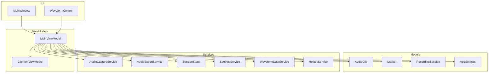

**Diagram sources**
- [MainWindow.xaml.cs](file://MainWindow.xaml.cs)
- [Controls/WaveformControl.cs](file://Controls/WaveformControl.cs)
- [ViewModels/MainViewModel.cs](file://ViewModels/MainViewModel.cs)
- [ViewModels/ClipItemViewModel.cs](file://ViewModels/ClipItemViewModel.cs)
- [Models/AudioClip.cs](file://Models/AudioClip.cs)
- [Models/Marker.cs](file://Models/Marker.cs)
- [Models/RecordingSession.cs](file://Models/RecordingSession.cs)
- [Models/AppSettings.cs](file://Models/AppSettings.cs)
- [Services/AudioCaptureService.cs](file://Services/AudioCaptureService.cs)
- [Services/AudioExportService.cs](file://Services/AudioExportService.cs)
- [Services/SessionStore.cs](file://Services/SessionStore.cs)
- [Services/SettingsService.cs](file://Services/SettingsService.cs)
- [Services/WaveformDataService.cs](file://Services/WaveformDataService.cs)
- [Services/HotkeyService.cs](file://Services/HotkeyService.cs)

**Section sources**
- [App.xaml.cs](file://App.xaml.cs)
- [MainWindow.xaml.cs](file://MainWindow.xaml.cs)
- [ViewModels/MainViewModel.cs](file://ViewModels/MainViewModel.cs)
- [ViewModels/ClipItemViewModel.cs](file://ViewModels/ClipItemViewModel.cs)
- [Models/AudioClip.cs](file://Models/AudioClip.cs)
- [Models/Marker.cs](file://Models/Marker.cs)
- [Models/RecordingSession.cs](file://Models/RecordingSession.cs)
- [Models/AppSettings.cs](file://Models/AppSettings.cs)
- [Services/AudioCaptureService.cs](file://Services/AudioCaptureService.cs)
- [Services/AudioExportService.cs](file://Services/AudioExportService.cs)
- [Services/SessionStore.cs](file://Services/SessionStore.cs)
- [Services/SettingsService.cs](file://Services/SettingsService.cs)
- [Services/WaveformDataService.cs](file://Services/WaveformDataService.cs)
- [Services/HotkeyService.cs](file://Services/HotkeyService.cs)

## Core Components
- AudioClip: Represents an audio clip with identity, file path, duration, sample rate, channels, bit depth, and descriptive metadata such as name, description, tags, and creation/modification timestamps.
- Marker: Represents a time-based annotation within a clip, including label, timestamp, and optional notes.
- RecordingSession: Tracks session-level context like start/end times and associated clips.
- AppSettings: Stores user preferences affecting clip behavior (e.g., default output folder, naming templates).
- MainViewModel: Orchestrates clip collection, selection, commands (create, delete, rename, move), search/filter, drag-and-drop, batch operations, and export.
- ClipItemViewModel: Wraps AudioClip for UI binding, exposing editable properties and validation feedback.
- AudioCaptureService: Manages recording lifecycle and writes raw audio to files.
- AudioExportService: Handles exporting clips to various formats and destinations.
- SessionStore: Persists sessions and clip metadata across app runs.
- SettingsService: Loads and saves settings.
- WaveformDataService: Generates waveform thumbnails or samples for display.
- HotkeyService: Binds hotkeys to common actions (start/stop recording, save, export).

**Section sources**
- [Models/AudioClip.cs](file://Models/AudioClip.cs)
- [Models/Marker.cs](file://Models/Marker.cs)
- [Models/RecordingSession.cs](file://Models/RecordingSession.cs)
- [Models/AppSettings.cs](file://Models/AppSettings.cs)
- [ViewModels/MainViewModel.cs](file://ViewModels/MainViewModel.cs)
- [ViewModels/ClipItemViewModel.cs](file://ViewModels/ClipItemViewModel.cs)
- [Services/AudioCaptureService.cs](file://Services/AudioCaptureService.cs)
- [Services/AudioExportService.cs](file://Services/AudioExportService.cs)
- [Services/SessionStore.cs](file://Services/SessionStore.cs)
- [Services/SettingsService.cs](file://Services/SettingsService.cs)
- [Services/WaveformDataService.cs](file://Services/WaveformDataService.cs)
- [Services/HotkeyService.cs](file://Services/HotkeyService.cs)

## Architecture Overview
The clip management flow integrates UI, view models, services, and models:
- Recording starts via UI or hotkeys, captured by AudioCaptureService, which writes files using naming conventions derived from AppSettings.
- On completion, AudioClip instances are created and persisted via SessionStore; waveforms are generated asynchronously.
- Users interact with clips through MainViewModel commands: rename, tag, add markers, reorder, batch edit, search/filter, copy/export.
- Export uses AudioExportService to convert/save clips to target formats and locations.

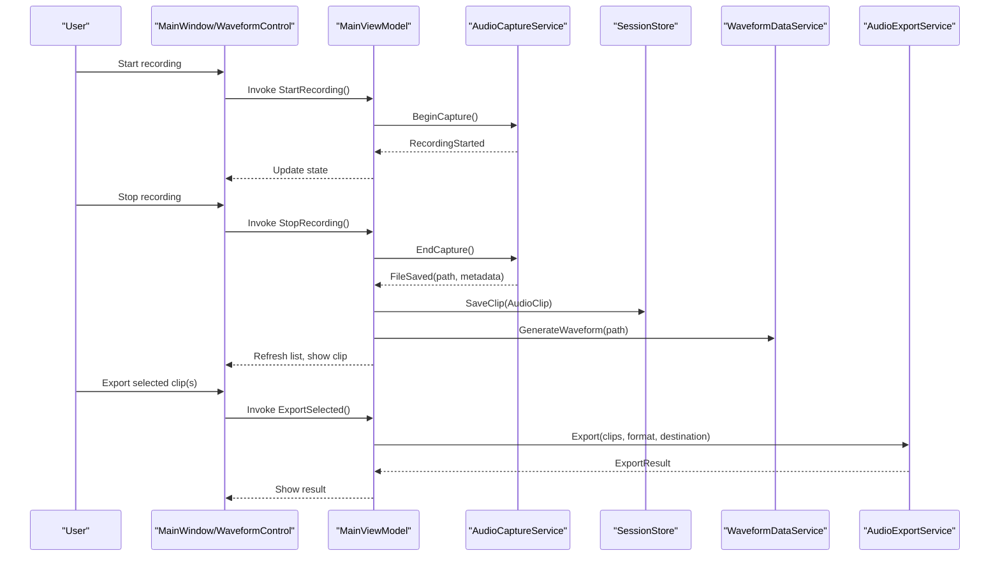

**Diagram sources**
- [MainWindow.xaml.cs](file://MainWindow.xaml.cs)
- [Controls/WaveformControl.cs](file://Controls/WaveformControl.cs)
- [ViewModels/MainViewModel.cs](file://ViewModels/MainViewModel.cs)
- [Services/AudioCaptureService.cs](file://Services/AudioCaptureService.cs)
- [Services/SessionStore.cs](file://Services/SessionStore.cs)
- [Services/WaveformDataService.cs](file://Services/WaveformDataService.cs)
- [Services/AudioExportService.cs](file://Services/AudioExportService.cs)

## Detailed Component Analysis

### Clip Creation Workflow
- Initiation: The user triggers recording via UI buttons or hotkeys.
- Capture: AudioCaptureService records audio and writes to a file using a naming convention based on AppSettings (e.g., timestamped filenames, folder organization).
- Metadata Assignment: Upon saving, AudioClip is populated with technical specs (duration, sample rate, channels, bit depth) and defaults from AppSettings (name template, tags).
- Persistence: SessionStore persists the new clip and updates the current session.
- UI Update: MainViewModel refreshes the clip list and generates waveform previews.

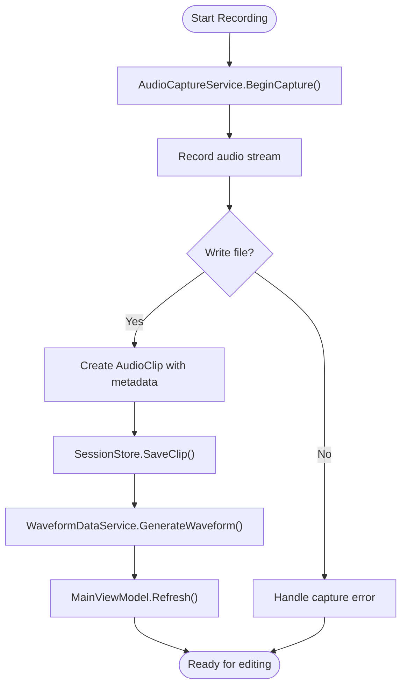

**Diagram sources**
- [Services/AudioCaptureService.cs](file://Services/AudioCaptureService.cs)
- [Models/AudioClip.cs](file://Models/AudioClip.cs)
- [Services/SessionStore.cs](file://Services/SessionStore.cs)
- [Services/WaveformDataService.cs](file://Services/WaveformDataService.cs)
- [ViewModels/MainViewModel.cs](file://ViewModels/MainViewModel.cs)

**Section sources**
- [Services/AudioCaptureService.cs](file://Services/AudioCaptureService.cs)
- [Models/AudioClip.cs](file://Models/AudioClip.cs)
- [Services/SessionStore.cs](file://Services/SessionStore.cs)
- [Services/WaveformDataService.cs](file://Services/WaveformDataService.cs)
- [ViewModels/MainViewModel.cs](file://ViewModels/MainViewModel.cs)
- [Models/AppSettings.cs](file://Models/AppSettings.cs)

### File Naming Conventions and Metadata Assignment
- Naming: Derived from AppSettings templates; typically includes date/time, session identifiers, and incremental counters to ensure uniqueness.
- Folder Organization: Default output directory can be configured; subfolders may be created per session or project.
- Metadata: Technical fields (duration, sample rate, channels, bit depth) are set during capture; descriptive fields (name, description, tags) can be auto-populated from templates or defaults.

**Section sources**
- [Models/AppSettings.cs](file://Models/AppSettings.cs)
- [Services/AudioCaptureService.cs](file://Services/AudioCaptureService.cs)
- [Models/AudioClip.cs](file://Models/AudioClip.cs)

### Clip Properties Panel
- Editable Fields: Name, description, tags, and technical specifications (read-only except where applicable).
- Validation: Ensures required fields are present and values are valid (e.g., non-empty name).
- Persistence: Changes are saved back to SessionStore and reflected immediately in the UI.
- Binding: ClipItemViewModel exposes properties bound to the UI for real-time editing.

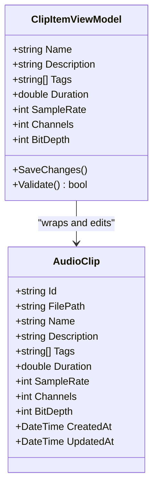

**Diagram sources**
- [ViewModels/ClipItemViewModel.cs](file://ViewModels/ClipItemViewModel.cs)
- [Models/AudioClip.cs](file://Models/AudioClip.cs)

**Section sources**
- [ViewModels/ClipItemViewModel.cs](file://ViewModels/ClipItemViewModel.cs)
- [Models/AudioClip.cs](file://Models/AudioClip.cs)
- [Services/SessionStore.cs](file://Services/SessionStore.cs)

### Marker System
- Adding Markers: Users can insert markers at the current playback position or by specifying a timestamp.
- Editing Markers: Labels and notes can be updated; timestamps are validated against clip duration.
- Navigation: Jump to marker positions via UI controls or keyboard shortcuts.
- Storage: Markers are stored within the AudioClip model and persisted through SessionStore.

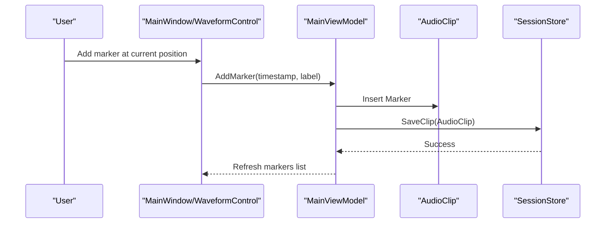

**Diagram sources**
- [Models/Marker.cs](file://Models/Marker.cs)
- [Models/AudioClip.cs](file://Models/AudioClip.cs)
- [ViewModels/MainViewModel.cs](file://ViewModels/MainViewModel.cs)
- [Services/SessionStore.cs](file://Services/SessionStore.cs)

**Section sources**
- [Models/Marker.cs](file://Models/Marker.cs)
- [Models/AudioClip.cs](file://Models/AudioClip.cs)
- [ViewModels/MainViewModel.cs](file://ViewModels/MainViewModel.cs)
- [Services/SessionStore.cs](file://Services/SessionStore.cs)

### Drag-and-Drop Reorganization
- Reordering Clips: Users can drag clips to reorder them within the list; MainViewModel handles drop events and updates the collection order.
- Visual Feedback: Highlighting indicates drop targets; changes are applied immediately.
- Persistence: Order is preserved via SessionStore.

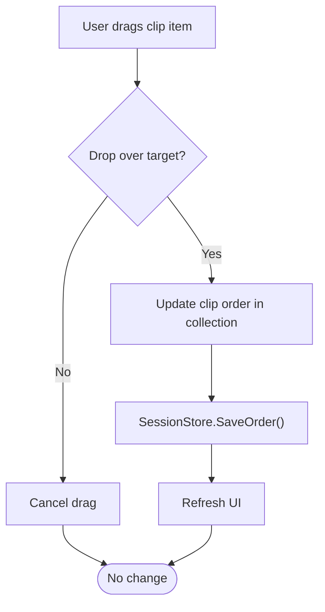

**Diagram sources**
- [ViewModels/MainViewModel.cs](file://ViewModels/MainViewModel.cs)
- [Services/SessionStore.cs](file://Services/SessionStore.cs)

**Section sources**
- [ViewModels/MainViewModel.cs](file://ViewModels/MainViewModel.cs)
- [Services/SessionStore.cs](file://Services/SessionStore.cs)

### Batch Operations
- Selection: Multi-select clips via checkboxes or Ctrl/Shift clicks.
- Actions: Apply bulk rename, tagging, deletion, or export to selected clips.
- Confirmation: Prompts for confirmation before destructive operations.

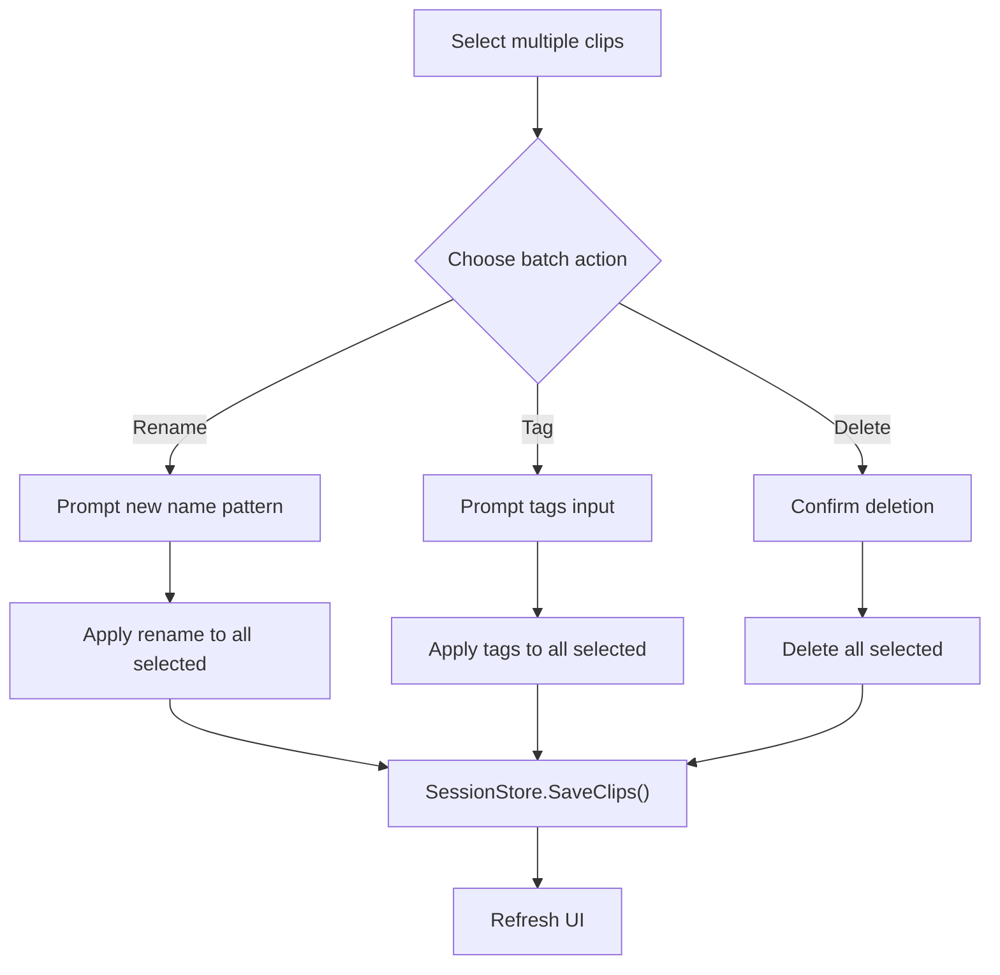

**Diagram sources**
- [ViewModels/MainViewModel.cs](file://ViewModels/MainViewModel.cs)
- [Services/SessionStore.cs](file://Services/SessionStore.cs)

**Section sources**
- [ViewModels/MainViewModel.cs](file://ViewModels/MainViewModel.cs)
- [Services/SessionStore.cs](file://Services/SessionStore.cs)

### Search and Filter Functionality
- Search: Text-based search across clip names, descriptions, and tags.
- Filters: By date range, duration, tags, or custom criteria.
- Performance: Debounced search to avoid excessive processing; results update incrementally.

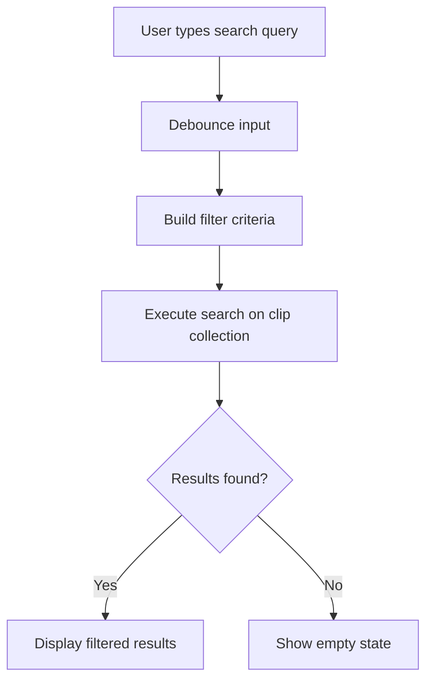

**Diagram sources**
- [ViewModels/MainViewModel.cs](file://ViewModels/MainViewModel.cs)

**Section sources**
- [ViewModels/MainViewModel.cs](file://ViewModels/MainViewModel.cs)

### Clipboard Operations
- Copy Clips: Selected clips can be copied to the clipboard with metadata; paste creates duplicates or references depending on policy.
- Paste Handling: Validates source and target compatibility; merges or replaces as needed.

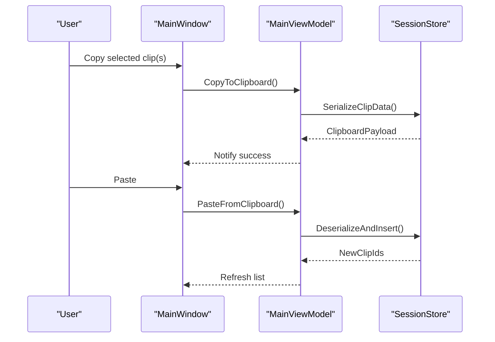

**Diagram sources**
- [ViewModels/MainViewModel.cs](file://ViewModels/MainViewModel.cs)
- [Services/SessionStore.cs](file://Services/SessionStore.cs)

**Section sources**
- [ViewModels/MainViewModel.cs](file://ViewModels/MainViewModel.cs)
- [Services/SessionStore.cs](file://Services/SessionStore.cs)

### Export Options and File System Integration
- Export Formats: Supports common audio formats configurable via AppSettings.
- Destination: User selects output folder; supports relative paths and presets.
- Progress and Errors: Shows progress indicators and error messages for failed exports.

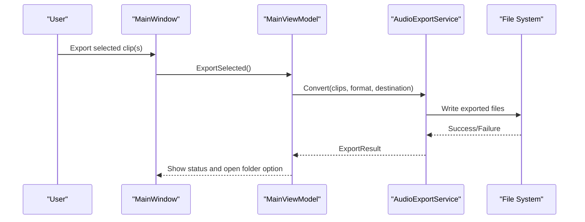

**Diagram sources**
- [ViewModels/MainViewModel.cs](file://ViewModels/MainViewModel.cs)
- [Services/AudioExportService.cs](file://Services/AudioExportService.cs)

**Section sources**
- [ViewModels/MainViewModel.cs](file://ViewModels/MainViewModel.cs)
- [Services/AudioExportService.cs](file://Services/AudioExportService.cs)

### Organizing Recordings into Folders and Managing Large Collections
- Folder Strategy: Use session-based folders or project-based hierarchies; configure default output paths in AppSettings.
- Sorting and Grouping: Sort by date, name, duration; group by tags or sessions.
- Performance Tips: Limit visible items, use virtualization, and defer heavy operations until needed.

**Section sources**
- [Models/AppSettings.cs](file://Models/AppSettings.cs)
- [ViewModels/MainViewModel.cs](file://ViewModels/MainViewModel.cs)

## Dependency Analysis
The following diagram illustrates key dependencies among components involved in clip management:

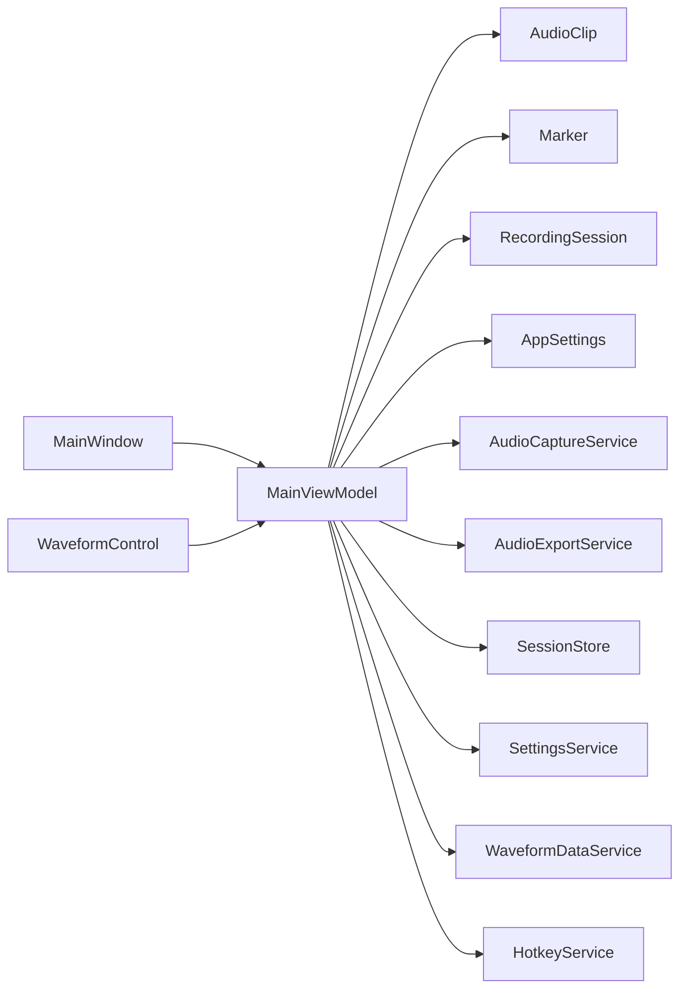

**Diagram sources**
- [MainWindow.xaml.cs](file://MainWindow.xaml.cs)
- [Controls/WaveformControl.cs](file://Controls/WaveformControl.cs)
- [ViewModels/MainViewModel.cs](file://ViewModels/MainViewModel.cs)
- [Models/AudioClip.cs](file://Models/AudioClip.cs)
- [Models/Marker.cs](file://Models/Marker.cs)
- [Models/RecordingSession.cs](file://Models/RecordingSession.cs)
- [Models/AppSettings.cs](file://Models/AppSettings.cs)
- [Services/AudioCaptureService.cs](file://Services/AudioCaptureService.cs)
- [Services/AudioExportService.cs](file://Services/AudioExportService.cs)
- [Services/SessionStore.cs](file://Services/SessionStore.cs)
- [Services/SettingsService.cs](file://Services/SettingsService.cs)
- [Services/WaveformDataService.cs](file://Services/WaveformDataService.cs)
- [Services/HotkeyService.cs](file://Services/HotkeyService.cs)

**Section sources**
- [ViewModels/MainViewModel.cs](file://ViewModels/MainViewModel.cs)
- [Services/AudioCaptureService.cs](file://Services/AudioCaptureService.cs)
- [Services/AudioExportService.cs](file://Services/AudioExportService.cs)
- [Services/SessionStore.cs](file://Services/SessionStore.cs)
- [Services/SettingsService.cs](file://Services/SettingsService.cs)
- [Services/WaveformDataService.cs](file://Services/WaveformDataService.cs)
- [Services/HotkeyService.cs](file://Services/HotkeyService.cs)

## Performance Considerations
- Waveform Generation: Perform asynchronously and cache results to avoid recomputation.
- Search Optimization: Implement debouncing and incremental filtering to reduce UI lag.
- Batch Operations: Process in chunks and provide progress feedback for large sets.
- Memory Usage: Avoid loading entire audio files into memory; stream when necessary.
- I/O Throttling: Queue file writes and handle errors gracefully to prevent blocking.

[No sources needed since this section provides general guidance]

## Troubleshooting Guide
- Recording Failures: Check device availability and permissions; verify capture service initialization.
- Export Errors: Validate format support and destination permissions; review conversion logs.
- Marker Issues: Ensure timestamps are within clip bounds; validate label uniqueness if enforced.
- Search Not Updating: Confirm debounce timing and filter logic; check data binding updates.
- Clipboard Problems: Verify serialization format and compatibility between versions.

**Section sources**
- [Services/AudioCaptureService.cs](file://Services/AudioCaptureService.cs)
- [Services/AudioExportService.cs](file://Services/AudioExportService.cs)
- [ViewModels/MainViewModel.cs](file://ViewModels/MainViewModel.cs)
- [Services/SessionStore.cs](file://Services/SessionStore.cs)

## Conclusion
SamplerRecorder’s clip management interface provides a robust workflow from recording to file persistence, with rich editing capabilities, marker annotations, drag-and-drop reorganization, batch operations, search/filtering, clipboard integration, and flexible export options. Proper configuration of naming conventions and folder organization ensures efficient handling of large clip collections.

[No sources needed since this section summarizes without analyzing specific files]

## Appendices
- Best Practices:
  - Use consistent naming templates to simplify sorting and searching.
  - Tag clips early to enable powerful filtering later.
  - Keep waveform generation off the UI thread to maintain responsiveness.
  - Regularly back up sessions and exported files.

[No sources needed since this section provides general guidance]