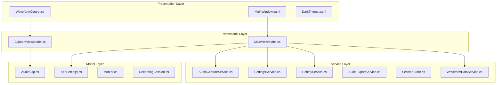
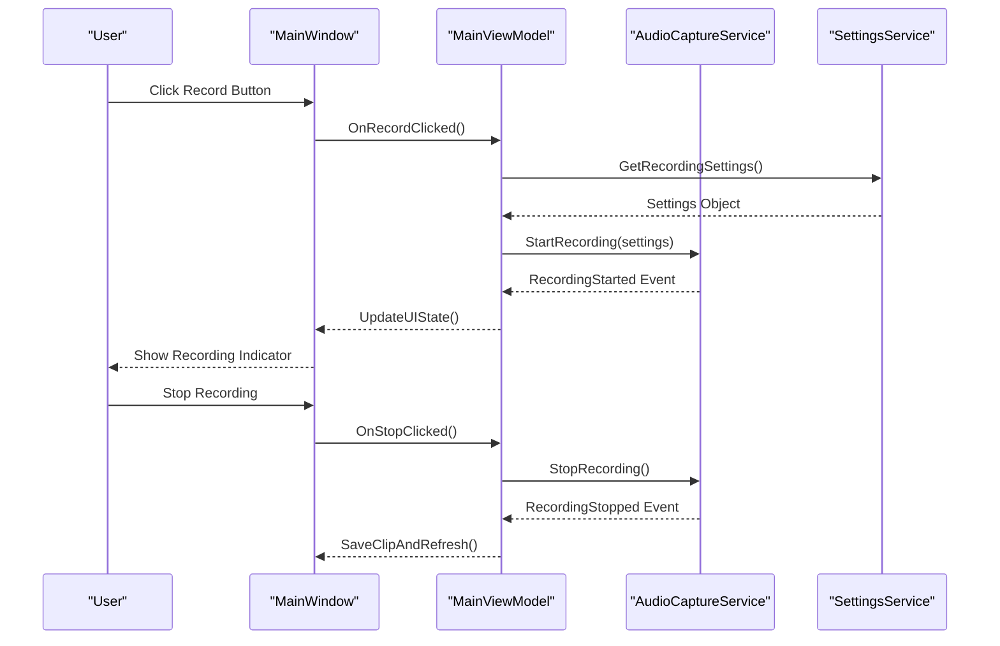
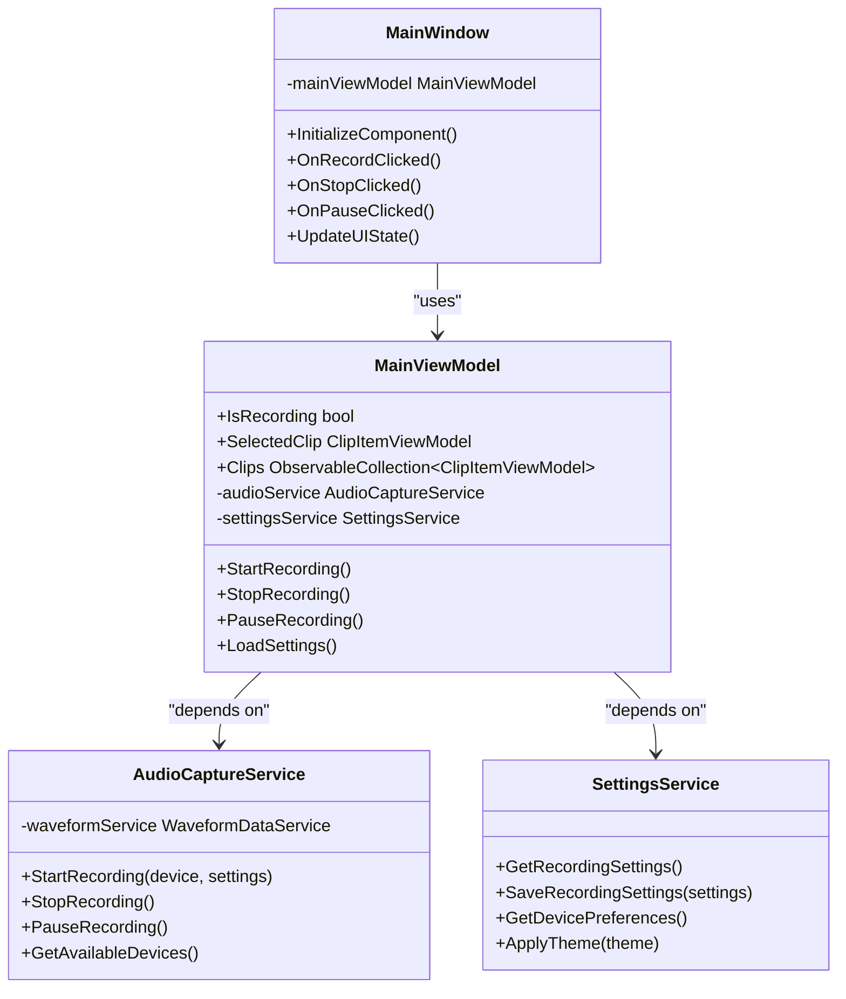

# Main Window Interface

<cite>
**Referenced Files in This Document**
- [MainWindow.xaml](file://MainWindow.xaml)
- [MainWindow.xaml.cs](file://MainWindow.xaml.cs)
- [App.xaml](file://App.xaml)
- [App.xaml.cs](file://App.xaml.cs)
- [WaveformControl.cs](file://Controls/WaveformControl.cs)
- [MainViewModel.cs](file://ViewModels/MainViewModel.cs)
- [ClipItemViewModel.cs](file://ViewModels/ClipItemViewModel.cs)
- [AudioCaptureService.cs](file://Services/AudioCaptureService.cs)
- [SettingsService.cs](file://Services/SettingsService.cs)
- [HotkeyService.cs](file://Services/HotkeyService.cs)
- [DarkTheme.xaml](file://Themes/DarkTheme.xaml)
</cite>

## Table of Contents
1. [Introduction](#introduction)
2. [Project Structure](#project-structure)
3. [Core Components](#core-components)
4. [Architecture Overview](#architecture-overview)
5. [Detailed Component Analysis](#detailed-component-analysis)
6. [Dependency Analysis](#dependency-analysis)
7. [Performance Considerations](#performance-considerations)
8. [Troubleshooting Guide](#troubleshooting-guide)
9. [Conclusion](#conclusion)

## Introduction

The SamplerRecorder main window interface is a comprehensive audio recording and management application built with Windows Presentation Foundation (WPF). The interface provides a professional audio workstation experience with intuitive controls for recording, editing, and managing audio clips. The main window serves as the central hub where users can perform all core operations including audio capture, clip organization, waveform visualization, and export functionality.

The application follows modern WPF design principles with a clean, responsive interface that adapts to different screen sizes and user preferences. It supports both light and dark themes, customizable layouts, and keyboard shortcuts for efficient workflow.

## Project Structure

The SamplerRecorder application follows a well-organized MVVM (Model-View-ViewModel) architecture pattern:

**Diagram sources**
- [MainWindow.xaml](file://MainWindow.xaml)
- [MainViewModel.cs](file://ViewModels/MainViewModel.cs)
- [AudioCaptureService.cs](file://Services/AudioCaptureService.cs)

**Section sources**
- [MainWindow.xaml](file://MainWindow.xaml)
- [App.xaml](file://App.xaml)

## Core Components

### Main Window Layout Structure

The main window implements a professional audio workstation layout with distinct functional areas:

#### Menu System
- **File Menu**: New session, open/save projects, export options
- **Edit Menu**: Undo/redo, cut/copy/paste operations
- **Record Menu**: Recording controls, device selection, quality settings
- **View Menu**: Panel visibility, theme switching, zoom controls
- **Help Menu**: Documentation, about information, keyboard shortcuts

#### Toolbar Controls
- **Recording Controls**: Start, stop, pause buttons with visual feedback
- **Device Selection**: Dropdown for input/output device configuration
- **Quality Settings**: Bitrate, sample rate, and format selectors
- **Transport Controls**: Play, rewind, fast forward for clip navigation
- **Utility Buttons**: Export, import, settings, help access

#### Status Indicators
- **Recording Status**: Visual indicator showing current recording state
- **Device Status**: Connected devices and their availability
- **Quality Indicators**: Current recording quality settings display
- **Progress Bars**: Recording duration and processing progress
- **Error Messages**: User-friendly error notifications

**Section sources**
- [MainWindow.xaml.cs](file://MainWindow.xaml.cs)
- [MainViewModel.cs](file://ViewModels/MainViewModel.cs)

## Architecture Overview

The main window interface follows a layered architecture that separates concerns between presentation, business logic, and data management:

**Diagram sources**
- [MainWindow.xaml.cs](file://MainWindow.xaml.cs)
- [MainViewModel.cs](file://ViewModels/MainViewModel.cs)
- [AudioCaptureService.cs](file://Services/AudioCaptureService.cs)

## Detailed Component Analysis

### Main Workspace Area

The main workspace area is the primary interaction zone where audio clips are displayed and managed. It consists of several key components:

#### Clip List View
- **Grid/List Toggle**: Switch between detailed grid view and compact list view
- **Sorting Options**: Sort by name, date, duration, size, or quality
- **Filtering Capabilities**: Filter by date range, quality, duration, or custom criteria
- **Search Functionality**: Real-time text search across clip metadata
- **Multi-select Support**: Select multiple clips for batch operations

#### Waveform Visualization
- **Real-time Waveform**: Live waveform display during recording
- **Zoom Controls**: Zoom in/out for detailed waveform inspection
- **Scroll Navigation**: Smooth scrolling through long recordings
- **Selection Handles**: Drag handles for selecting specific waveform regions
- **Marker Support**: Visual markers for important points in the waveform

#### Clip Management Operations
- **Drag and Drop**: Reorder clips within the workspace
- **Context Menus**: Right-click operations for each clip
- **Batch Operations**: Delete, rename, or export multiple clips
- **Preview Playback**: Quick preview without leaving the workspace

**Section sources**
- [WaveformControl.cs](file://Controls/WaveformControl.cs)
- [ClipItemViewModel.cs](file://ViewModels/ClipItemViewModel.cs)

### Recording Controls

The recording control panel provides comprehensive audio capture functionality:

#### Recording State Management
- **Start Button**: Initiates recording with selected settings
- **Stop Button**: Terminates recording and saves the clip
- **Pause Button**: Temporarily pauses recording without stopping
- **Visual Feedback**: Color-coded states (green=recording, red=stopped, yellow=paused)

#### Device Configuration
- **Input Device Dropdown**: Select microphone or audio input source
- **Output Device Dropdown**: Configure monitoring output device
- **Device Testing**: Built-in test functionality for device verification
- **Auto-detection**: Automatic discovery of connected audio devices

#### Quality Settings Panel
- **Bitrate Selector**: Choose from 128kbps to 320kbps or lossless options
- **Sample Rate Options**: 44.1kHz, 48kHz, 96kHz, or 192kHz support
- **Format Selection**: WAV, MP3, FLAC, or OGG format options
- **Channel Configuration**: Mono or stereo recording modes
- **Gain Control**: Input level adjustment with peak metering

**Section sources**
- [AudioCaptureService.cs](file://Services/AudioCaptureService.cs)
- [SettingsService.cs](file://Services/SettingsService.cs)

### Keyboard Shortcuts and Context Menus

#### Keyboard Shortcuts
- **Recording Controls**: Spacebar (play/pause), Ctrl+R (record), Ctrl+S (stop)
- **Navigation**: Arrow keys (clip selection), Home/End (jump to first/last)
- **Editing**: Ctrl+C/V/X (copy/paste/delete), Ctrl+Z/Y (undo/redo)
- **Window Management**: Alt+Tab (switch panels), F1 (help), Esc (cancel)
- **Zoom Controls**: Ctrl++/- (zoom in/out), Ctrl+0 (reset zoom)

#### Context Menu Operations
- **Clip Context Menu**: Rename, delete, duplicate, export, properties
- **Workspace Context Menu**: New clip, import, paste, select all
- **Waveform Context Menu**: Add marker, split at cursor, zoom to selection
- **Device Context Menu**: Test device, configure advanced settings

**Section sources**
- [HotkeyService.cs](file://Services/HotkeyService.cs)
- [MainWindow.xaml.cs](file://MainWindow.xaml.cs)

### Window Resizing and Docking Panels

#### Responsive Layout System
- **Dockable Panels**: Left panel (device settings), right panel (clip properties)
- **Resizable Dividers**: Drag dividers to adjust panel widths
- **Collapsible Sections**: Minimize panels to save screen space
- **Customizable Layouts**: Save and restore user-defined layouts

#### Workspace Customization
- **Theme Support**: Light, dark, and high-contrast themes
- **Font Scaling**: Adjustable text size for accessibility
- **Color Schemes**: Custom color schemes for different workflows
- **Panel Positioning**: Remember last used panel configurations

**Section sources**
- [DarkTheme.xaml](file://Themes/DarkTheme.xaml)
- [App.xaml](file://App.xaml)

## Dependency Analysis

The main window interface has well-defined dependencies that ensure loose coupling and maintainability:

**Diagram sources**
- [MainWindow.xaml.cs](file://MainWindow.xaml.cs)
- [MainViewModel.cs](file://ViewModels/MainViewModel.cs)
- [AudioCaptureService.cs](file://Services/AudioCaptureService.cs)
- [SettingsService.cs](file://Services/SettingsService.cs)

**Section sources**
- [MainViewModel.cs](file://ViewModels/MainViewModel.cs)
- [AudioCaptureService.cs](file://Services/AudioCaptureService.cs)

## Performance Considerations

The main window interface is optimized for smooth performance during audio recording and playback:

### Memory Management
- **Lazy Loading**: Clips load only when visible in the viewport
- **Waveform Caching**: Pre-computed waveforms stored in memory
- **Garbage Collection**: Proper disposal of audio resources
- **Memory Pooling**: Reuse of audio buffers for efficiency

### UI Responsiveness
- **Background Processing**: Heavy operations run on background threads
- **Progressive Loading**: UI updates incrementally during long operations
- **Virtual Scrolling**: Efficient handling of large clip collections
- **Throttled Updates**: Waveform updates limited to prevent UI lag

### Audio Processing Optimization
- **Buffer Management**: Optimized audio buffer sizes for low latency
- **Thread Safety**: Proper synchronization for concurrent audio operations
- **Resource Cleanup**: Immediate release of audio resources when not needed
- **Error Recovery**: Graceful handling of audio device disconnections

## Troubleshooting Guide

### Common Issues and Solutions

#### Audio Device Problems
- **Device Not Found**: Verify device connections and permissions
- **Audio Quality Issues**: Check device drivers and sampling rates
- **Recording Failures**: Ensure sufficient disk space and write permissions
- **Playback Issues**: Verify output device configuration and volume levels

#### Performance Issues
- **Slow UI Response**: Close unnecessary applications and check CPU usage
- **Memory Leaks**: Restart the application if memory usage grows excessively
- **Audio Glitches**: Reduce buffer size or close other audio applications
- **Waveform Loading Slow**: Increase virtual memory or add more RAM

#### Interface Problems
- **Panel Layout Issues**: Reset window layout to default settings
- **Theme Display Problems**: Switch to a different theme and back
- **Keyboard Shortcuts Not Working**: Check for conflicting hotkeys
- **Touch Screen Issues**: Calibrate touch input if applicable

### Diagnostic Information
- **Application Logs**: Located in the application's log directory
- **Device Information**: Available in the settings diagnostic panel
- **Performance Metrics**: Accessible through the developer tools
- **Error Reports**: Generated automatically for critical failures

**Section sources**
- [SettingsService.cs](file://Services/SettingsService.cs)
- [AudioCaptureService.cs](file://Services/AudioCaptureService.cs)

## Conclusion

The SamplerRecorder main window interface provides a comprehensive and professional audio recording environment. Its modular architecture ensures maintainability while delivering an intuitive user experience. The interface successfully balances powerful functionality with ease of use, making it suitable for both casual users and professional audio engineers.

Key strengths include the responsive design, comprehensive recording controls, efficient clip management, and extensive customization options. The application's adherence to MVVM patterns and service-oriented architecture ensures scalability and future extensibility.

For optimal user experience, it is recommended to familiarize oneself with the keyboard shortcuts and context menu operations, which significantly improve workflow efficiency. Regular maintenance of audio device drivers and system resources will ensure smooth operation of the recording features.