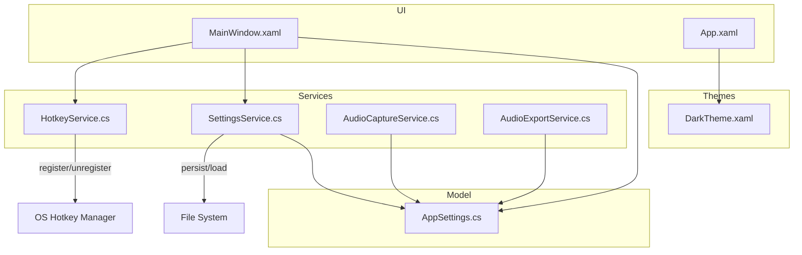
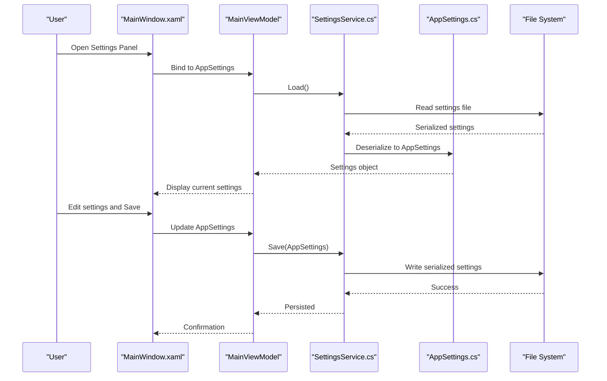
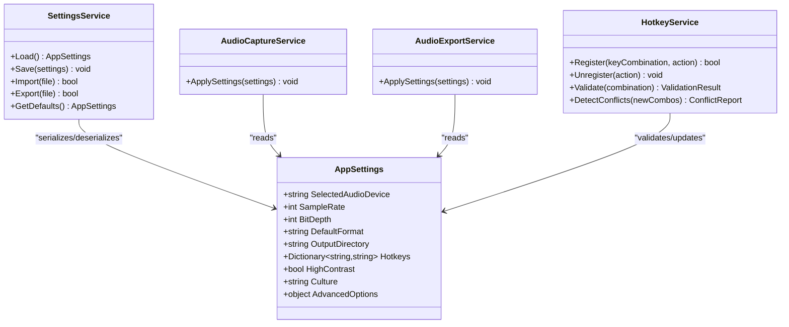

# Settings and Theming

<cite>
**Referenced Files in This Document**
- [AppSettings.cs](file://Models/AppSettings.cs)
- [SettingsService.cs](file://Services/SettingsService.cs)
- [HotkeyService.cs](file://Services/HotkeyService.cs)
- [DarkTheme.xaml](file://Themes/DarkTheme.xaml)
- [App.xaml](file://App.xaml)
- [MainWindow.xaml](file://MainWindow.xaml)
- [AudioCaptureService.cs](file://Services/AudioCaptureService.cs)
- [AudioExportService.cs](file://Services/AudioExportService.cs)
</cite>

## Table of Contents
1. Introduction
2. Project Structure
3. Core Components
4. Architecture Overview
5. Detailed Component Analysis
6. Dependency Analysis
7. Performance Considerations
8. Troubleshooting Guide
9. Conclusion

## Introduction
This document explains SamplerRecorder’s settings system and theming capabilities. It covers the settings interface for audio device configuration, recording quality presets, file format preferences, and hotkey customization panels. It also documents the theme system (including the built-in dark theme and how to create custom themes via XAML resources), settings persistence, import/export functionality, default restoration, keyboard shortcut configuration with conflict detection and validation, accessibility and language preferences, advanced options, troubleshooting common issues, and backup strategies.

## Project Structure
The settings and theming features are implemented across a small set of focused files:
- Models define the settings data model.
- Services provide persistence, hotkey management, and integration with audio capture/export.
- Themes and App-level XAML define visual styling and resource loading.
- UI windows bind to view models and expose settings panels.

**Diagram sources**
- [AppSettings.cs](file://Models/AppSettings.cs)
- [SettingsService.cs](file://Services/SettingsService.cs)
- [HotkeyService.cs](file://Services/HotkeyService.cs)
- [DarkTheme.xaml](file://Themes/DarkTheme.xaml)
- [App.xaml](file://App.xaml)
- [MainWindow.xaml](file://MainWindow.xaml)
- [AudioCaptureService.cs](file://Services/AudioCaptureService.cs)
- [AudioExportService.cs](file://Services/AudioExportService.cs)

**Section sources**
- [AppSettings.cs](file://Models/AppSettings.cs)
- [SettingsService.cs](file://Services/SettingsService.cs)
- [HotkeyService.cs](file://Services/HotkeyService.cs)
- [DarkTheme.xaml](file://Themes/DarkTheme.xaml)
- [App.xaml](file://App.xaml)
- [MainWindow.xaml](file://MainWindow.xaml)
- [AudioCaptureService.cs](file://Services/AudioCaptureService.cs)
- [AudioExportService.cs](file://Services/AudioExportService.cs)

## Core Components
- AppSettings: Central data model for all user-configurable options, including audio devices, recording quality, file formats, hotkeys, accessibility, language, and advanced options.
- SettingsService: Persists and loads AppSettings to disk, supports import/export, and provides defaults.
- HotkeyService: Manages global or app-scoped hotkeys, validates combinations, and detects conflicts.
- DarkTheme.xaml: Built-in theme definition using XAML resources.
- App.xaml and MainWindow.xaml: Load theme resources and host settings UI.

Key responsibilities:
- Audio device configuration is read from AppSettings and applied by the audio capture service.
- Recording quality presets and file format preferences are stored in AppSettings and used by export services.
- Hotkey customization is exposed through the UI and validated via HotkeyService.
- Theme selection and custom theme creation rely on XAML resources loaded at app startup.

**Section sources**
- [AppSettings.cs](file://Models/AppSettings.cs)
- [SettingsService.cs](file://Services/SettingsService.cs)
- [HotkeyService.cs](file://Services/HotkeyService.cs)
- [DarkTheme.xaml](file://Themes/DarkTheme.xaml)
- [App.xaml](file://App.xaml)
- [MainWindow.xaml](file://MainWindow.xaml)

## Architecture Overview
The settings architecture follows a clear separation between data, persistence, and UI:
- AppSettings holds strongly-typed properties for all configuration values.
- SettingsService serializes/deserializes AppSettings and exposes methods for import/export and defaults.
- UI components (e.g., settings panels in MainWindow) bind to AppSettings and call SettingsService to persist changes.
- HotkeyService integrates with the OS to register shortcuts and validate combinations.
- Theme resources are defined in XAML and merged into the application’s resource dictionary.

**Diagram sources**
- [SettingsService.cs](file://Services/SettingsService.cs)
- [AppSettings.cs](file://Models/AppSettings.cs)
- [MainWindow.xaml](file://MainWindow.xaml)

## Detailed Component Analysis

### Settings Data Model (AppSettings)
AppSettings defines the complete configuration surface:
- Audio device configuration: selected input/output devices, sample rate, bit depth, channel mode.
- Recording quality presets: low/medium/high or numeric parameters controlling bitrate, compression, and buffer sizes.
- File format preferences: default container/format, naming conventions, output directory.
- Hotkeys: recording start/stop, pause, export, and other actions.
- Accessibility: high contrast, font scaling, screen reader hints.
- Language preferences: UI culture and localized strings.
- Advanced options: logging level, cache size, performance tuning flags.

Best practices:
- Use nullable types where appropriate to distinguish unset vs. explicit values.
- Provide validation attributes or helper methods to ensure consistency (e.g., valid sample rates).
- Group related settings into nested objects for clarity and maintainability.

**Section sources**
- [AppSettings.cs](file://Models/AppSettings.cs)

### Settings Persistence (SettingsService)
SettingsService handles:
- Loading settings from a persistent store (JSON/XML/INI).
- Saving updated settings back to disk.
- Importing settings from external files.
- Exporting current settings to a shareable file.
- Restoring default settings when missing or corrupted.

Operational flow:
- On app startup, load settings; if absent or invalid, initialize defaults.
- On save, serialize AppSettings and write atomically to avoid partial writes.
- Import validates schema and merges or replaces existing settings based on policy.
- Export produces a portable file that can be shared and re-imported.

Error handling:
- Catch IO exceptions during read/write and present user-friendly messages.
- Validate imported files against expected schema and reject incompatible versions.
- Fallback to defaults on corruption and log details for diagnostics.

**Section sources**
- [SettingsService.cs](file://Services/SettingsService.cs)

### Hotkey Management (HotkeyService)
HotkeyService manages keyboard shortcuts:
- Registering and unregistering global or app-scoped hotkeys.
- Validating combinations (e.g., disallow conflicting keys).
- Detecting conflicts with other applications or system shortcuts.
- Providing feedback to users when conflicts occur.

Validation and conflict detection:
- Check reserved system keys and warn users.
- Compare new combinations against existing ones in AppSettings.
- Suggest alternatives when conflicts are detected.

Integration points:
- UI binds to HotkeyService to update shortcuts live.
- Changes are persisted via SettingsService.

**Section sources**
- [HotkeyService.cs](file://Services/HotkeyService.cs)

### Theme System (DarkTheme.xaml and App.xaml)
Theme system overview:
- DarkTheme.xaml defines colors, brushes, and styles for a cohesive dark appearance.
- App.xaml merges theme resources into the application’s resource dictionary.
- Users can switch themes or add custom themes by adding new XAML resource dictionaries.

Creating custom themes:
- Create a new XAML file under Themes with consistent resource keys.
- Merge the new theme in App.xaml or allow runtime switching via UI.
- Ensure all required resources are provided to avoid missing resource errors.

Runtime behavior:
- Apply theme on startup based on user preference stored in AppSettings.
- Allow dynamic switching without restarting the app.

**Section sources**
- [DarkTheme.xaml](file://Themes/DarkTheme.xaml)
- [App.xaml](file://App.xaml)

### Audio Configuration Integration
AudioCaptureService reads device and quality settings from AppSettings:
- Selects the configured audio input/output device.
- Applies sample rate, bit depth, and channel configuration.
- Uses recording quality presets to adjust buffers and encoding parameters.

AudioExportService uses file format preferences:
- Chooses the default container/format for exports.
- Applies naming conventions and output directories.
- Honors quality presets for export encoding.

**Section sources**
- [AudioCaptureService.cs](file://Services/AudioCaptureService.cs)
- [AudioExportService.cs](file://Services/AudioExportService.cs)
- [AppSettings.cs](file://Models/AppSettings.cs)

### Settings UI and Binding
MainWindow.xaml hosts the settings panels:
- Binds to AppSettings properties for display and editing.
- Calls SettingsService to persist changes.
- Integrates with HotkeyService for live validation and conflict warnings.

Accessibility and language:
- Respect accessibility settings such as high contrast and font scaling.
- Apply language preferences to localize UI text.

**Section sources**
- [MainWindow.xaml](file://MainWindow.xaml)
- [SettingsService.cs](file://Services/SettingsService.cs)
- [HotkeyService.cs](file://Services/HotkeyService.cs)
- [AppSettings.cs](file://Models/AppSettings.cs)

## Dependency Analysis
The following diagram shows key dependencies among settings-related components:

**Diagram sources**
- [AppSettings.cs](file://Models/AppSettings.cs)
- [SettingsService.cs](file://Services/SettingsService.cs)
- [HotkeyService.cs](file://Services/HotkeyService.cs)
- [AudioCaptureService.cs](file://Services/AudioCaptureService.cs)
- [AudioExportService.cs](file://Services/AudioExportService.cs)

**Section sources**
- [AppSettings.cs](file://Models/AppSettings.cs)
- [SettingsService.cs](file://Services/SettingsService.cs)
- [HotkeyService.cs](file://Services/HotkeyService.cs)
- [AudioCaptureService.cs](file://Services/AudioCaptureService.cs)
- [AudioExportService.cs](file://Services/AudioExportService.cs)

## Performance Considerations
- Avoid frequent disk writes; batch settings updates and save on explicit user actions or app shutdown.
- Use asynchronous I/O for import/export to keep UI responsive.
- Cache frequently accessed settings in memory to reduce serialization overhead.
- Validate settings once on load and reuse validated values throughout the session.

[No sources needed since this section provides general guidance]

## Troubleshooting Guide
Common issues and resolutions:
- Settings not saving:
  - Verify file permissions and path validity.
  - Check for IO exceptions and ensure atomic writes.
- Imported settings rejected:
  - Confirm schema compatibility and version checks.
  - Re-export from a compatible version and retry.
- Hotkey conflicts:
  - Use HotkeyService conflict detection to identify overlapping combinations.
  - Remove or remap conflicting keys.
- Theme not applying:
  - Ensure theme resources are merged in App.xaml.
  - Validate that all required resource keys exist in the theme file.
- Audio device not found:
  - Confirm device name matches available inputs/outputs.
  - Re-scan devices and update AppSettings.

Backup strategies:
- Regularly export settings to a secure location.
- Version-control custom themes and exported settings.
- Maintain a known-good default settings file for quick restoration.

**Section sources**
- [SettingsService.cs](file://Services/SettingsService.cs)
- [HotkeyService.cs](file://Services/HotkeyService.cs)
- [DarkTheme.xaml](file://Themes/DarkTheme.xaml)
- [App.xaml](file://App.xaml)

## Conclusion
SamplerRecorder’s settings and theming system is designed for clarity, reliability, and extensibility. AppSettings centralizes configuration, SettingsService ensures robust persistence and portability, HotkeyService provides safe and validated shortcut management, and the XAML-based theme system enables both built-in and custom appearances. By following the guidance here, users can configure audio, recording, and UI preferences confidently, while developers can extend the system with new options and themes seamlessly.