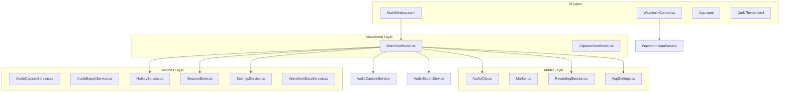
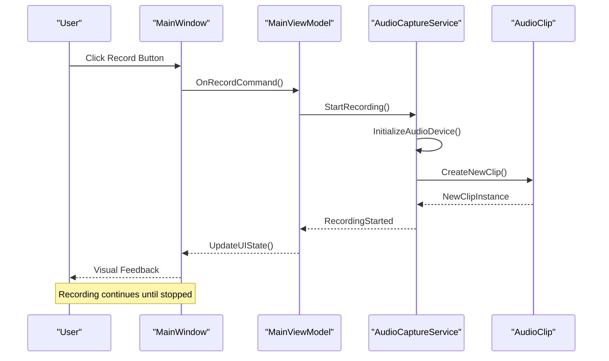
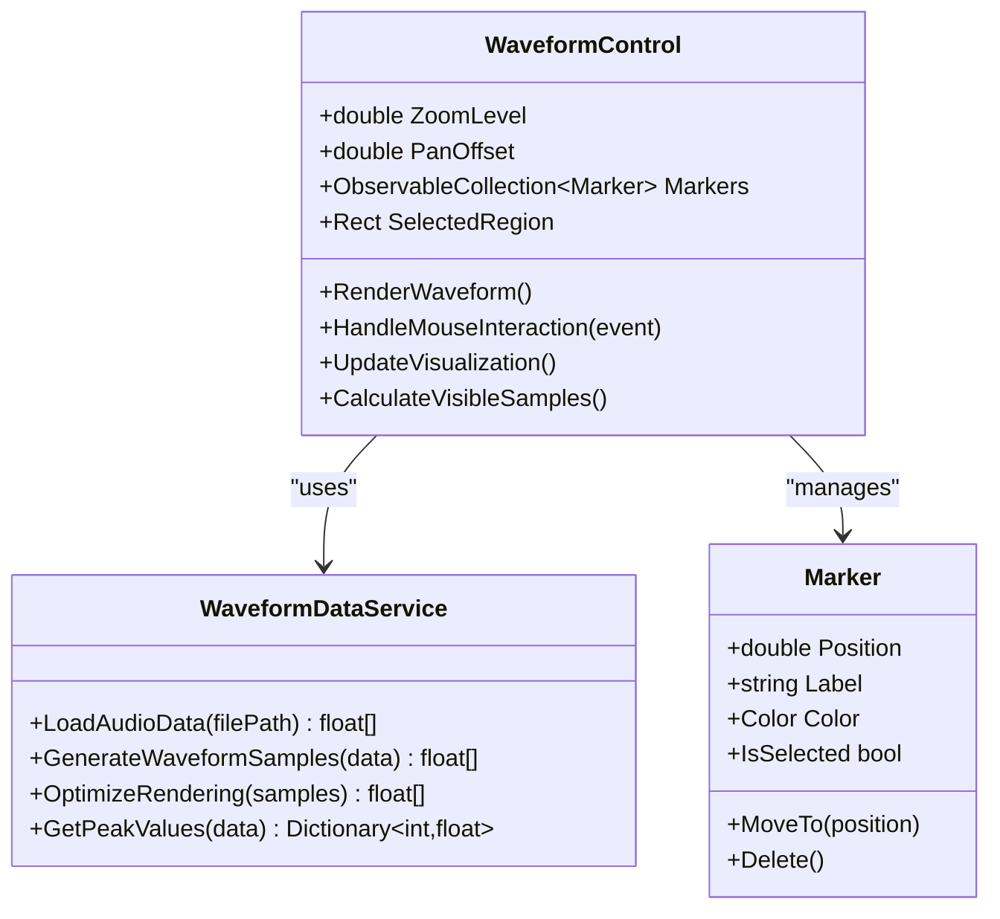
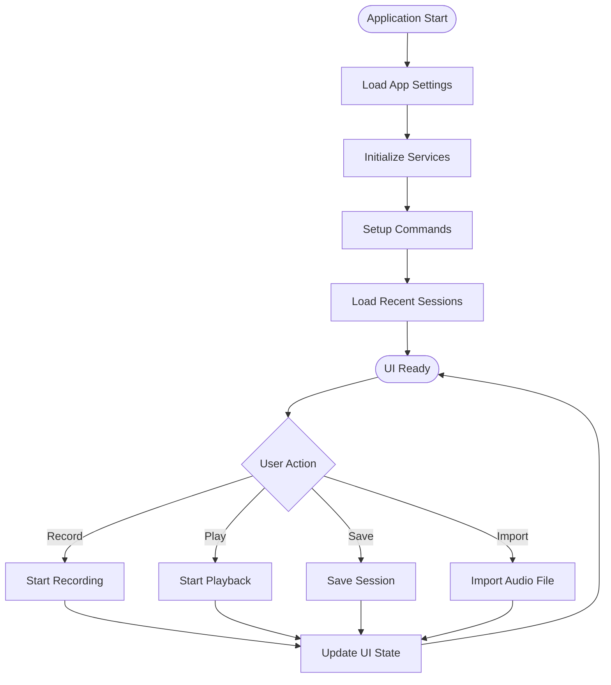
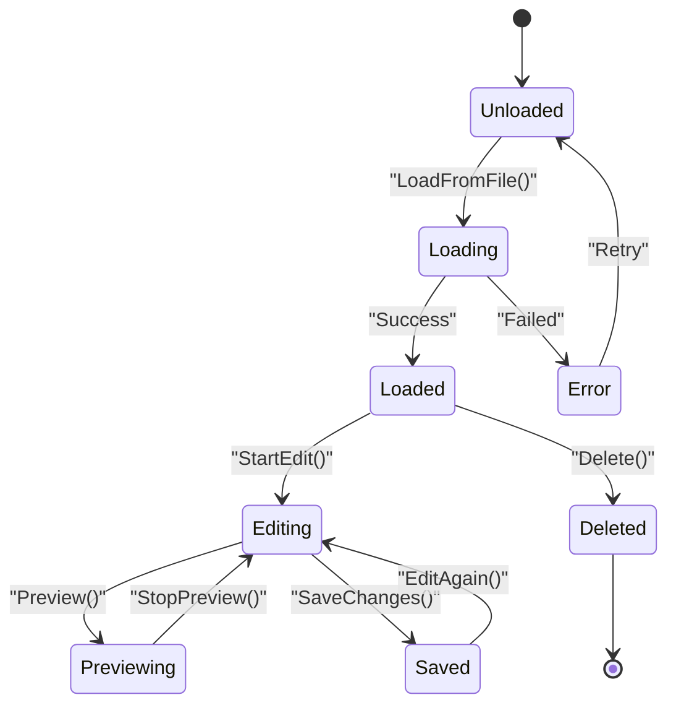
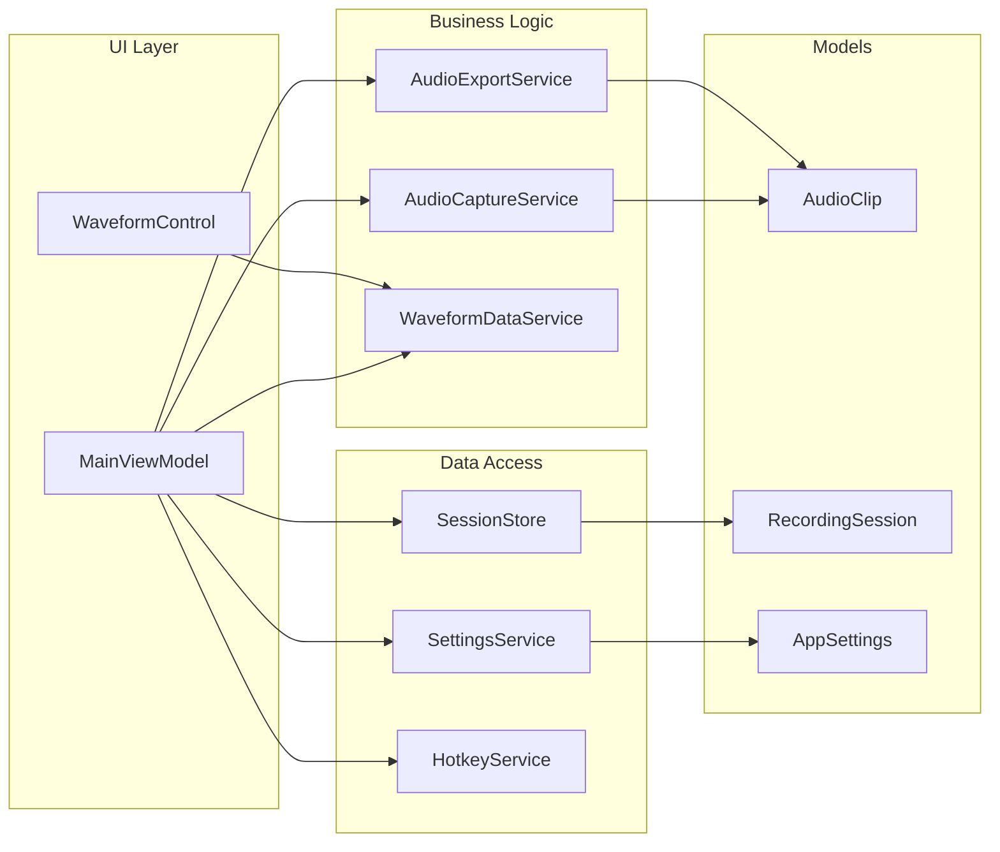

# User Interface Guide

<cite>
**Referenced Files in This Document**
- [MainWindow.xaml](file://MainWindow.xaml)
- [MainWindow.xaml.cs](file://MainWindow.xaml.cs)
- [WaveformControl.cs](file://Controls/WaveformControl.cs)
- [App.xaml](file://App.xaml)
- [DarkTheme.xaml](file://Themes/DarkTheme.xaml)
- [MainViewModel.cs](file://ViewModels/MainViewModel.cs)
- [ClipItemViewModel.cs](file://ViewModels/ClipItemViewModel.cs)
- [AppSettings.cs](file://Models/AppSettings.cs)
- [AudioClip.cs](file://Models/AudioClip.cs)
- [Marker.cs](file://Models/Marker.cs)
- [RecordingSession.cs](file://Models/RecordingSession.cs)
- [AudioCaptureService.cs](file://Services/AudioCaptureService.cs)
- [AudioExportService.cs](file://Services/AudioExportService.cs)
- [HotkeyService.cs](file://Services/HotkeyService.cs)
- [SessionStore.cs](file://Services/SessionStore.cs)
- [SettingsService.cs](file://Services/SettingsService.cs)
- [WaveformDataService.cs](file://Services/WaveformDataService.cs)
</cite>

## Table of Contents
1. [Introduction](#introduction)
2. [Project Structure](#project-structure)
3. [Core Components](#core-components)
4. [Architecture Overview](#architecture-overview)
5. [Detailed Component Analysis](#detailed-component-analysis)
6. [Dependency Analysis](#dependency-analysis)
7. [Performance Considerations](#performance-considerations)
8. [Troubleshooting Guide](#troubleshooting-guide)
9. [Conclusion](#conclusion)
10. [Appendices](#appendices)

## Introduction

SamplerRecorder is a professional audio recording and editing application built with Windows Presentation Foundation (WPF). The user interface is designed for audio professionals who need precise control over audio capture, waveform visualization, and clip management. The application follows the Model-View-ViewModel (MVVM) pattern, providing a clean separation between UI logic and business logic while maintaining an intuitive and responsive user experience.

The main window serves as the central hub for all audio operations, featuring a comprehensive layout that includes waveform visualization controls, clip management panels, recording controls, and settings configuration. The interface is designed to be both powerful and accessible, supporting keyboard shortcuts, drag-and-drop operations, and customizable themes to accommodate different user preferences and accessibility needs.

## Project Structure

The SamplerRecorder application follows a well-organized MVVM architecture with clear separation of concerns:

**Diagram sources**
- [MainWindow.xaml](file://MainWindow.xaml)
- [MainViewModel.cs](file://ViewModels/MainViewModel.cs)
- [WaveformControl.cs](file://Controls/WaveformControl.cs)

**Section sources**
- [MainWindow.xaml](file://MainWindow.xaml)
- [App.xaml](file://App.xaml)

## Core Components

### Main Window Layout

The main window provides a comprehensive workspace divided into several key areas:

#### Top Menu Bar
- **File Operations**: New session, open existing sessions, save current work
- **Edit Functions**: Undo/redo operations, clip manipulation commands
- **View Controls**: Zoom levels, theme switching, panel visibility toggles
- **Help & Support**: Documentation access, system information

#### Central Workspace
- **Waveform Display Area**: Primary visualization space for audio clips
- **Timeline Navigation**: Scrubber and time markers for precise positioning
- **Playback Controls**: Play, pause, record, stop buttons with visual feedback

#### Left Panel - Clip Management
- **Clip Library**: Hierarchical view of available audio clips
- **Search & Filter**: Quick search functionality with category filters
- **Drag & Drop Zone**: Direct clip placement onto timeline

#### Right Panel - Properties & Settings
- **Clip Properties**: Detailed information about selected clips
- **Recording Settings**: Input device selection, quality settings
- **Application Preferences**: Theme, language, and general options

#### Bottom Status Bar
- **Current Position**: Time position indicator
- **Zoom Level**: Current zoom percentage
- **System Status**: Recording state, buffer status, error messages

**Section sources**
- [MainWindow.xaml](file://MainWindow.xaml)
- [MainWindow.xaml.cs](file://MainWindow.xaml.cs)

### Waveform Control Functionality

The WaveformControl is the centerpiece of the audio visualization system, providing real-time waveform rendering and interactive editing capabilities.

#### Key Features
- **High-Resolution Rendering**: Smooth waveform display with adaptive resolution scaling
- **Interactive Selection**: Click-and-drag selection with visual feedback
- **Zoom & Pan**: Mouse wheel zoom and click-drag panning
- **Marker Support**: Visual markers for important points in the audio
- **Color Coding**: Different colors for selected regions, markers, and playback position

#### User Interactions
- **Selection Mode**: Click to select regions, double-click to select entire clip
- **Navigation Mode**: Arrow keys for frame-by-frame navigation
- **Editing Mode**: Delete selected regions, split at cursor position
- **Zoom Modes**: Scroll wheel for zoom, middle-click for pan

**Section sources**
- [WaveformControl.cs](file://Controls/WaveformControl.cs)
- [WaveformDataService.cs](file://Services/WaveformDataService.cs)

### Clip Management Interface

The clip management system provides comprehensive organization and manipulation of audio content.

#### Clip Library Features
- **Hierarchical Organization**: Folders and categories for clip organization
- **Metadata Display**: Duration, format, sample rate, and other properties
- **Preview Capability**: Quick preview without loading full audio data
- **Batch Operations**: Select multiple clips for bulk actions

#### Clip Operations
- **Import**: Drag-and-drop or file browser import
- **Export**: Multiple format support with quality settings
- **Editing**: Trim, split, merge operations
- **Organization**: Move, copy, delete, rename operations

**Section sources**
- [ClipItemViewModel.cs](file://ViewModels/ClipItemViewModel.cs)
- [AudioClip.cs](file://Models/AudioClip.cs)

### Settings Panels

The settings system provides granular control over application behavior and appearance.

#### Recording Settings
- **Input Device Selection**: Microphone, line-in, system audio
- **Quality Configuration**: Sample rate, bit depth, compression
- **Buffer Management**: Buffer size and latency settings
- **Auto-save Options**: Automatic session saving intervals

#### Application Preferences
- **Theme Customization**: Light, dark, and custom color schemes
- **Language Support**: Multi-language interface options
- **Keyboard Shortcuts**: Customizable hotkey assignments
- **Display Options**: Font sizes, DPI scaling, panel layouts

**Section sources**
- [AppSettings.cs](file://Models/AppSettings.cs)
- [SettingsService.cs](file://Services/SettingsService.cs)

## Architecture Overview

The application follows a layered MVVM architecture that ensures maintainability and testability:

**Diagram sources**
- [MainWindow.xaml.cs](file://MainWindow.xaml.cs)
- [MainViewModel.cs](file://ViewModels/MainViewModel.cs)
- [AudioCaptureService.cs](file://Services/AudioCaptureService.cs)
- [AudioClip.cs](file://Models/AudioClip.cs)

### Data Flow Patterns

The application implements several key data flow patterns:

#### Event-Driven Updates
- User interactions trigger commands in ViewModels
- ViewModels update Models through Services
- Models raise change notifications to update Views
- Real-time synchronization across all UI components

#### Command Pattern Implementation
- All user actions are encapsulated as commands
- Commands support undo/redo functionality
- Parameterized commands for flexible operation handling
- Validation and error handling within command execution

**Section sources**
- [MainViewModel.cs](file://ViewModels/MainViewModel.cs)
- [AudioCaptureService.cs](file://Services/AudioCaptureService.cs)

## Detailed Component Analysis

### Waveform Control Deep Dive

The WaveformControl implements sophisticated audio visualization with performance optimization:

**Diagram sources**
- [WaveformControl.cs](file://Controls/WaveformControl.cs)
- [WaveformDataService.cs](file://Services/WaveformDataService.cs)
- [Marker.cs](file://Models/Marker.cs)

#### Performance Optimizations
- **Lazy Loading**: Waveform data loaded on-demand for large files
- **Adaptive Resolution**: Lower resolution for distant zoom levels
- **Background Processing**: Heavy computations off the UI thread
- **Memory Management**: Efficient disposal of temporary buffers

#### Interactive Features
- **Multi-touch Support**: Pinch-to-zoom and swipe-to-pan gestures
- **Keyboard Navigation**: Arrow keys for precise positioning
- **Selection Refinement**: Shift+click for range selection
- **Context Menus**: Right-click for quick operations

**Section sources**
- [WaveformControl.cs](file://Controls/WaveformControl.cs)
- [WaveformDataService.cs](file://Services/WaveformDataService.cs)

### Main ViewModel Architecture

The MainViewModel orchestrates the entire application state and user interactions:

**Diagram sources**
- [MainViewModel.cs](file://ViewModels/MainViewModel.cs)

#### Command Structure
- **Recording Commands**: Start, stop, pause recording operations
- **Playback Commands**: Play, pause, seek, loop controls
- **File Operations**: Import, export, save, load operations
- **Editing Commands**: Cut, copy, paste, delete operations
- **Navigation Commands**: Zoom, pan, marker management

#### State Management
- **Session State**: Active recording, playback, editing modes
- **Selection State**: Currently selected clips and regions
- **History State**: Undo/redo stack management
- **Preferences State**: User settings and customization

**Section sources**
- [MainViewModel.cs](file://ViewModels/MainViewModel.cs)

### Clip Item Management

The ClipItemViewModel handles individual clip operations and metadata management:

**Diagram sources**
- [ClipItemViewModel.cs](file://ViewModels/ClipItemViewModel.cs)
- [AudioClip.cs](file://Models/AudioClip.cs)

#### Clip Lifecycle
- **Loading Phase**: File validation and metadata extraction
- **Processing Phase**: Waveform generation and optimization
- **Editing Phase**: Non-destructive editing operations
- **Saving Phase**: Format conversion and quality preservation

#### Metadata Management
- **Audio Properties**: Duration, sample rate, bit depth, channels
- **File Information**: Path, size, creation date, format type
- **Custom Tags**: User-defined labels, descriptions, categories
- **Analysis Data**: Peak levels, RMS values, frequency analysis

**Section sources**
- [ClipItemViewModel.cs](file://ViewModels/ClipItemViewModel.cs)
- [AudioClip.cs](file://Models/AudioClip.cs)

## Dependency Analysis

The application maintains clear dependency boundaries through service-oriented architecture:

**Diagram sources**
- [MainViewModel.cs](file://ViewModels/MainViewModel.cs)
- [AudioCaptureService.cs](file://Services/AudioCaptureService.cs)
- [AudioExportService.cs](file://Services/AudioExportService.cs)
- [WaveformDataService.cs](file://Services/WaveformDataService.cs)
- [SessionStore.cs](file://Services/SessionStore.cs)
- [SettingsService.cs](file://Services/SettingsService.cs)
- [HotkeyService.cs](file://Services/HotkeyService.cs)

### Service Dependencies

#### Audio Capture Service
- **Dependencies**: System audio APIs, buffer management
- **Responsibilities**: Real-time audio capture, format conversion
- **Error Handling**: Device availability, buffer overflow protection

#### Export Service
- **Dependencies**: Audio codec libraries, file system access
- **Responsibilities**: Format conversion, quality optimization
- **Progress Tracking**: Real-time progress updates for long operations

#### Waveform Data Service
- **Dependencies**: Memory management, mathematical operations
- **Responsibilities**: Waveform calculation, optimization algorithms
- **Performance**: Caching strategies, lazy loading implementation

**Section sources**
- [AudioCaptureService.cs](file://Services/AudioCaptureService.cs)
- [AudioExportService.cs](file://Services/AudioExportService.cs)
- [WaveformDataService.cs](file://Services/WaveformDataService.cs)

## Performance Considerations

### UI Responsiveness
- **Asynchronous Operations**: All heavy processing occurs on background threads
- **Virtual Scrolling**: Large waveforms rendered only for visible portions
- **Throttled Updates**: UI updates batched to prevent excessive redraws
- **Memory Pooling**: Reusable buffers for audio data processing

### Memory Management
- **Object Disposal**: Proper cleanup of unmanaged resources
- **Weak References**: Prevent memory leaks in event handlers
- **Garbage Collection Optimization**: Minimize allocations during critical operations
- **Streaming Processing**: Process large files in chunks rather than loading entirely

### Rendering Optimization
- **Hardware Acceleration**: GPU-accelerated waveform rendering where possible
- **Adaptive Quality**: Lower quality rendering for non-critical operations
- **Caching Strategies**: Frequently accessed data cached in memory
- **Lazy Initialization**: Resources loaded only when needed

## Troubleshooting Guide

### Common Issues and Solutions

#### Audio Device Problems
- **Device Not Found**: Check device permissions and availability
- **Audio Latency**: Adjust buffer size settings for optimal performance
- **Format Mismatch**: Ensure input device supports selected sample rate

#### Performance Issues
- **Slow Waveform Generation**: Reduce initial zoom level or enable progressive loading
- **Memory Usage High**: Close unused sessions and clear cache
- **UI Lag**: Disable real-time effects or reduce monitoring frequency

#### File Operation Errors
- **Import Failures**: Verify file format compatibility and permissions
- **Export Problems**: Check disk space and output path validity
- **Session Corruption**: Use backup recovery or rebuild from source files

### Debugging Tools
- **Log Viewer**: Built-in logging for troubleshooting complex issues
- **Performance Monitor**: Real-time resource usage tracking
- **Error Reports**: Automatic crash reporting with diagnostic information
- **Configuration Reset**: Safe mode startup for resolving persistent issues

**Section sources**
- [SettingsService.cs](file://Services/SettingsService.cs)
- [SessionStore.cs](file://Services/SessionStore.cs)

## Conclusion

SamplerRecorder's WPF-based user interface provides a professional-grade audio editing environment with intuitive controls and powerful features. The MVVM architecture ensures maintainability while the responsive design accommodates various screen sizes and user preferences. The comprehensive set of keyboard shortcuts, drag-and-drop operations, and customizable themes make it suitable for both casual users and professional audio engineers.

The application's modular design allows for easy extension and customization, while the robust error handling and debugging tools ensure reliable operation in demanding production environments. Future enhancements could include additional audio formats, advanced editing tools, and cloud integration for collaborative workflows.

## Appendices

### Keyboard Shortcuts Reference

#### Navigation
- **Arrow Keys**: Navigate through timeline with precision
- **Home/End**: Jump to beginning/end of current clip
- **Page Up/Down**: Zoom in/out by one level
- **Ctrl+Scroll**: Zoom centered on cursor position

#### Editing
- **Space**: Play/Pause toggle
- **R**: Toggle recording mode
- **Delete**: Remove selected regions
- **Ctrl+Z/Y**: Undo/Redo operations
- **Ctrl+A**: Select all content in current view

#### File Operations
- **Ctrl+O**: Open existing session
- **Ctrl+S**: Save current session
- **Ctrl+Shift+S**: Save session with new name
- **Ctrl+I**: Import audio files
- **Ctrl+E**: Export selected clips

### Accessibility Features
- **Screen Reader Support**: Full NVDA and JAWS compatibility
- **High Contrast Themes**: Enhanced visibility for low vision users
- **Keyboard Navigation**: Complete operation via keyboard alone
- **Text Scaling**: Adjustable font sizes up to 200%
- **Color Blindness**: Color schemes optimized for various types of color vision deficiency

### Theme Customization
- **Built-in Themes**: Light, Dark, and High Contrast modes
- **Custom Colors**: Modify accent colors and background themes
- **Layout Presets**: Save and share custom panel arrangements
- **DPI Awareness**: Automatic scaling for high-resolution displays