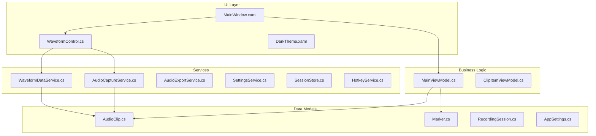
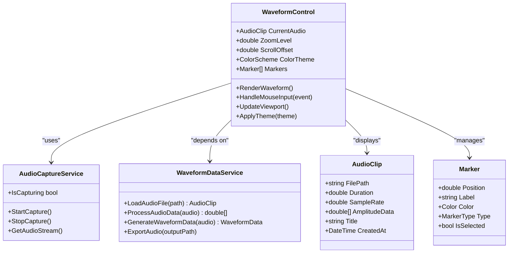
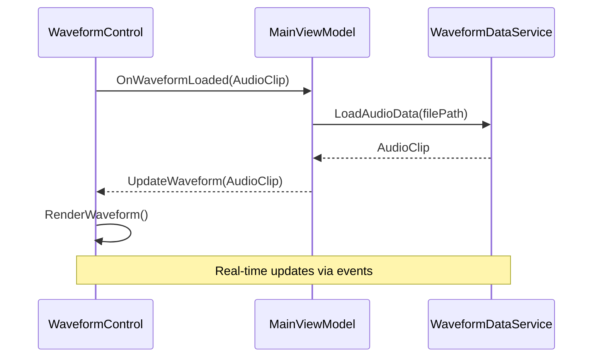

# Waveform Control

<cite>
**Referenced Files in This Document**
- [WaveformControl.cs](file://Controls/WaveformControl.cs)
- [AudioCaptureService.cs](file://Services/AudioCaptureService.cs)
- [WaveformDataService.cs](file://Services/WaveformDataService.cs)
- [Marker.cs](file://Models/Marker.cs)
- [AudioClip.cs](file://Models/AudioClip.cs)
- [AppSettings.cs](file://Models/AppSettings.cs)
- [DarkTheme.xaml](file://Themes/DarkTheme.xaml)
- [MainWindow.xaml](file://MainWindow.xaml)
- [MainWindow.xaml.cs](file://MainWindow.xaml.cs)
- [MainViewModel.cs](file://ViewModels/MainViewModel.cs)
</cite>

## Table of Contents
1. [Introduction](#introduction)
2. [Project Structure](#project-structure)
3. [Core Components](#core-components)
4. [Architecture Overview](#architecture-overview)
5. [Detailed Component Analysis](#detailed-component-analysis)
6. [User Interaction Features](#user-interaction-features)
7. [Rendering and Performance](#rendering-and-performance)
8. [Customization Options](#customization-options)
9. [Integration Patterns](#integration-patterns)
10. [Performance Considerations](#performance-considerations)
11. [Troubleshooting Guide](#troubleshooting-guide)
12. [Conclusion](#conclusion)

## Introduction

The WaveformControl is a sophisticated WPF custom component designed for real-time audio waveform visualization and interaction. This component provides a comprehensive solution for displaying audio waveforms with advanced features including live audio capture display, zoom functionality, scroll navigation, and interactive markers. The control is built with performance optimization in mind to ensure smooth real-time rendering even with large audio files.

The WaveformControl serves as the central visual interface for audio recording and editing applications, offering both programmatic and user-driven interaction capabilities. It supports various customization options for appearance, accessibility, and responsive design across different screen sizes.

## Project Structure

The WaveformControl implementation follows a clean architecture pattern with clear separation of concerns:

**Diagram sources**
- [MainWindow.xaml](file://MainWindow.xaml)
- [WaveformControl.cs](file://Controls/WaveformControl.cs)
- [MainViewModel.cs](file://ViewModels/MainViewModel.cs)
- [AudioCaptureService.cs](file://Services/AudioCaptureService.cs)
- [WaveformDataService.cs](file://Services/WaveformDataService.cs)

**Section sources**
- [WaveformControl.cs](file://Controls/WaveformControl.cs)
- [MainWindow.xaml](file://MainWindow.xaml)
- [MainViewModel.cs](file://ViewModels/MainViewModel.cs)

## Core Components

### WaveformControl Class

The WaveformControl is a custom WPF control that extends the base Control class to provide specialized waveform visualization capabilities. Key responsibilities include:

- **Real-time Rendering**: Efficient drawing of audio waveforms using WPF's graphics pipeline
- **User Interaction Handling**: Processing mouse events for click-to-position, drag-to-select, and marker placement
- **Zoom and Navigation**: Managing viewport transformations for zoom in/out and scroll operations
- **Performance Optimization**: Implementing virtualization and efficient rendering techniques
- **Theme Support**: Responding to theme changes and providing customizable appearance

### Data Models

#### AudioClip Model
Represents audio data with properties for sample rate, duration, amplitude values, and metadata. The model includes methods for audio processing and data transformation.

#### Marker Model
Defines marker objects that can be placed on waveforms to mark specific positions or regions. Supports different marker types, colors, and labels.

#### AppSettings Model
Contains configuration settings for the application including theme preferences, default zoom levels, color schemes, and performance tuning parameters.

**Section sources**
- [AudioClip.cs](file://Models/AudioClip.cs)
- [Marker.cs](file://Models/Marker.cs)
- [AppSettings.cs](file://Models/AppSettings.cs)

## Architecture Overview

The WaveformControl follows a layered architecture pattern with clear separation between presentation, business logic, and data access layers:

**Diagram sources**
- [WaveformControl.cs](file://Controls/WaveformControl.cs)
- [AudioCaptureService.cs](file://Services/AudioCaptureService.cs)
- [WaveformDataService.cs](file://Services/WaveformDataService.cs)
- [AudioClip.cs](file://Models/AudioClip.cs)
- [Marker.cs](file://Models/Marker.cs)

## Detailed Component Analysis

### WaveformControl Implementation

The WaveformControl implements several key interfaces and patterns to provide robust waveform visualization:

#### Real-time Rendering Pipeline
The control uses a multi-threaded approach where audio data processing occurs on background threads while UI updates happen on the dispatcher thread. This ensures smooth rendering without blocking the user interface.

#### Viewport Management
The control maintains a viewport state that tracks the current zoom level, scroll position, and visible region. Transformations are applied efficiently using WPF's transform stack.

#### Event Handling System
A comprehensive event system handles mouse interactions, keyboard shortcuts, and touch gestures. Events are routed through a centralized handler that determines the appropriate action based on context.

#### Theme Integration
The control integrates with WPF's theming system to support dynamic theme switching. Colors, fonts, and visual elements respond to theme changes at runtime.

**Section sources**
- [WaveformControl.cs](file://Controls/WaveformControl.cs)

### Audio Capture Service

The AudioCaptureService manages real-time audio input from system audio devices:

#### Audio Stream Management
Handles opening and closing audio streams, managing buffer sizes, and handling device availability changes.

#### Data Processing Pipeline
Processes raw audio data into waveform-ready format, applying necessary conversions and optimizations.

#### Threading Model
Uses asynchronous patterns to handle audio data processing without blocking the main UI thread.

**Section sources**
- [AudioCaptureService.cs](file://Services/AudioCaptureService.cs)

### WaveformData Service

The WaveformDataService provides audio data processing and management capabilities:

#### File Loading
Supports loading various audio formats, extracting metadata, and converting to internal representation.

#### Data Transformation
Converts raw audio samples into optimized waveform data structures for efficient rendering.

#### Export Capabilities
Provides functionality to export processed audio data in various formats.

**Section sources**
- [WaveformDataService.cs](file://Services/WaveformDataService.cs)

## User Interaction Features

### Click-to-Position Functionality
Users can click anywhere on the waveform to set the playback position. The control calculates the corresponding time position based on the click coordinates and current zoom level.

### Drag-to-Select Regions
Users can drag across the waveform to select regions for editing, copying, or applying effects. Selected regions are visually highlighted and can be manipulated independently.

### Marker Placement
Users can place markers directly on the waveform by right-clicking or using keyboard shortcuts. Markers support different types, colors, and labels for organization.

### Zoom Controls
- **Mouse Wheel**: Zoom in/out centered on cursor position
- **Keyboard Shortcuts**: Ctrl+Plus/Minus for zoom operations
- **Gesture Support**: Pinch-to-zoom on touch devices

### Scroll Navigation
- **Mouse Drag**: Click and drag to scroll horizontally
- **Arrow Keys**: Navigate left/right with configurable step size
- **Page Up/Down**: Jump to beginning/end of visible region

**Section sources**
- [WaveformControl.cs](file://Controls/WaveformControl.cs)

## Rendering and Performance

### Optimized Rendering Pipeline

The WaveformControl implements several performance optimization techniques:

#### Virtualization Strategy
Only visible waveform segments are rendered, significantly reducing memory usage and rendering overhead for large audio files.

#### Batch Rendering
Multiple waveform segments are batched together to minimize draw calls and improve GPU utilization.

#### Caching Mechanism
Previously rendered waveform segments are cached and reused when scrolling within cached regions.

#### Adaptive Quality
Rendering quality adapts based on zoom level and available resources, maintaining smooth performance under various conditions.

### Memory Management
Efficient memory management prevents garbage collection pauses during real-time rendering:

- Object pooling for frequently created objects
- Lazy loading of waveform data
- Automatic cleanup of unused resources
- Background processing for heavy operations

### Threading Model
The control uses a carefully designed threading model:

- **UI Thread**: Handles user input and visual updates
- **Background Threads**: Process audio data and prepare rendering data
- **Dispatcher Queue**: Ensures thread-safe updates to UI elements

**Section sources**
- [WaveformControl.cs](file://Controls/WaveformControl.cs)
- [AudioCaptureService.cs](file://Services/AudioCaptureService.cs)

## Customization Options

### Appearance Customization

#### Color Schemes
The control supports multiple built-in color schemes and allows custom color definitions:

- **Default Scheme**: High contrast colors optimized for readability
- **Dark Theme**: Reduced eye strain for low-light environments
- **Custom Themes**: Full customization of foreground, background, and accent colors

#### Visual Elements
- **Grid Overlays**: Optional grid lines for precise positioning
- **Amplitude Scaling**: Linear or logarithmic scaling options
- **Line Styles**: Different line thicknesses and styles for various use cases

#### Responsive Design
The control automatically adjusts its appearance and behavior based on screen size and resolution:

- **Adaptive Layout**: Reorganizes controls for optimal viewing on different screen sizes
- **Touch Optimization**: Enhanced touch targets and gestures for mobile devices
- **Font Scaling**: Dynamic font sizing based on DPI and user preferences

### Accessibility Features

#### Screen Reader Support
Full compatibility with screen readers and assistive technologies:

- **Descriptive Labels**: Clear descriptions of waveform states and actions
- **Keyboard Navigation**: Complete keyboard accessibility
- **High Contrast Mode**: Support for Windows high contrast themes

#### Cognitive Accessibility
- **Clear Visual Feedback**: Immediate response to user actions
- **Consistent Behavior**: Predictable interaction patterns
- **Error Recovery**: Graceful handling of invalid inputs

**Section sources**
- [DarkTheme.xaml](file://Themes/DarkTheme.xaml)
- [AppSettings.cs](file://Models/AppSettings.cs)

## Integration Patterns

### ViewModel Integration

The WaveformControl integrates seamlessly with MVVM patterns through dependency injection and event-based communication:

**Diagram sources**
- [WaveformControl.cs](file://Controls/WaveformControl.cs)
- [MainViewModel.cs](file://ViewModels/MainViewModel.cs)
- [WaveformDataService.cs](file://Services/WaveformDataService.cs)

### Programmatic Control

The control exposes a comprehensive API for programmatic manipulation:

#### Basic Operations
- Setting audio data programmatically
- Controlling playback position
- Managing markers and selections
- Adjusting zoom and scroll levels

#### Advanced Features
- Custom rendering hooks
- Event subscription for real-time updates
- Theme switching at runtime
- Performance monitoring and tuning

### Event System

The control provides a rich event system for integration with other application components:

- **WaveformChanged**: Triggered when waveform data changes
- **UserInteraction**: Captures all user interactions for logging or processing
- **ThemeChanged**: Notifies when visual theme changes
- **PerformanceMetrics**: Provides real-time performance data

**Section sources**
- [MainViewModel.cs](file://ViewModels/MainViewModel.cs)
- [WaveformControl.cs](file://Controls/WaveformControl.cs)

## Performance Considerations

### Real-time Rendering Optimization

The WaveformControl employs several strategies to maintain smooth real-time performance:

#### Frame Rate Management
- **Target FPS**: Maintains 60 FPS for smooth animations
- **Adaptive Rendering**: Reduces complexity when frame rate drops
- **Batch Updates**: Groups multiple updates into single render cycles

#### Memory Optimization
- **Object Pooling**: Reuses frequently allocated objects
- **Lazy Loading**: Loads waveform data on demand
- **Garbage Collection Tuning**: Minimizes GC pressure during critical operations

#### CPU Usage Reduction
- **Background Processing**: Offloads heavy computations to background threads
- **Algorithm Optimization**: Uses efficient algorithms for waveform calculations
- **Caching Strategies**: Stores computed results to avoid recalculation

### Scalability Guidelines

For optimal performance with large audio files:

- **Chunked Loading**: Load audio data in manageable chunks
- **Progressive Rendering**: Display partial data while loading continues
- **Resource Monitoring**: Monitor memory and CPU usage dynamically
- **Graceful Degradation**: Reduce quality when resources are constrained

**Section sources**
- [WaveformControl.cs](file://Controls/WaveformControl.cs)
- [AudioCaptureService.cs](file://Services/AudioCaptureService.cs)

## Troubleshooting Guide

### Common Issues and Solutions

#### Performance Problems
- **Symptom**: Choppy waveform rendering
- **Causes**: Insufficient hardware resources, large audio files, complex themes
- **Solutions**: Enable performance mode, reduce visual complexity, optimize audio data

#### Memory Issues
- **Symptom**: Application crashes or slow performance
- **Causes**: Memory leaks, excessive object creation, large unmanaged resources
- **Solutions**: Monitor memory usage, implement proper disposal, use object pooling

#### Rendering Artifacts
- **Symptom**: Visual glitches or incorrect waveform display
- **Causes**: Threading issues, coordinate calculation errors, resource conflicts
- **Solutions**: Verify thread safety, check coordinate transformations, validate resource lifecycle

### Debugging Techniques

#### Performance Profiling
Use built-in profiling tools to identify bottlenecks:
- Frame rate monitoring
- Memory allocation tracking
- CPU usage analysis
- GPU utilization metrics

#### Logging and Diagnostics
Enable detailed logging for troubleshooting:
- User interaction logs
- Error and exception tracking
- Performance metrics collection
- Resource usage monitoring

### Best Practices

#### Development Guidelines
- Always dispose of unmanaged resources properly
- Use async/await patterns for long-running operations
- Implement proper error handling and user feedback
- Test with various audio formats and sizes

#### Deployment Considerations
- Optimize assembly size and load times
- Configure appropriate resource limits
- Provide fallback mechanisms for unsupported features
- Include comprehensive error reporting

**Section sources**
- [WaveformControl.cs](file://Controls/WaveformControl.cs)
- [AudioCaptureService.cs](file://Services/AudioCaptureService.cs)

## Conclusion

The WaveformControl represents a comprehensive solution for audio waveform visualization in WPF applications. Its architecture emphasizes performance, usability, and extensibility while maintaining clean separation of concerns and following modern software development practices.

Key strengths of the implementation include:

- **Robust Performance**: Optimized rendering pipeline ensures smooth operation even with large audio files
- **Rich Feature Set**: Comprehensive user interaction capabilities including zoom, scroll, markers, and selection
- **Flexible Customization**: Extensive theming and appearance options with full accessibility support
- **Clean Architecture**: Well-structured codebase with clear separation of concerns and dependency injection
- **Scalable Design**: Designed to handle various use cases from simple playback to complex audio editing workflows

The control successfully balances performance requirements with feature richness, making it suitable for professional audio applications while remaining accessible to developers implementing simpler audio visualization needs. Future enhancements could include additional audio format support, advanced editing capabilities, and cloud integration features.